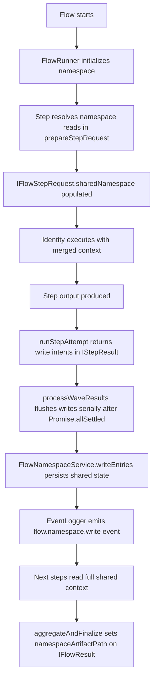

> [!TIP]
> This document is a specialized extension of the [root .copilot/ guidelines](../README.md).

## Status & Context

**Status**: 🚧 Planning
**Phase Dependencies**: Phase 63
**Risk Level**: M — touches core flow orchestration and shared state persistence, but is additive and can remain optional per flow.

## Executive Summary

- **The Problem**: Flow coordination currently relies too heavily on point-to-point transforms between steps. This creates brittle coupling, makes multi-identity collaboration harder to inspect, and forces upstream findings to be threaded manually through intermediate steps.
- **The Solution**: Add a per-flow namespace file and runtime service that supports structured reads/writes from any step in the flow, while preserving existing transforms and audit logging.
- **The Goal**: Establish a shared blackboard coordination primitive that improves collaboration, inspectability, and later support for richer orchestration patterns.

## Current State Analysis

### Key Files

| File | Current Role | Gap |
| ---------------------------------------------- | ------------------------------------------- | ------------------------------------------------------ |
| `src/flows/flow_runner.ts` | Executes flow steps and dependency ordering | No shared, flow-scoped read/write coordination surface |
| `src/shared/schemas/flow.ts` | Validates flow definitions | No namespace config or namespace bindings |
| `src/services/event_logger.ts` | Emits execution events | No namespace-specific journal events |
| `src/services/flow/flow_reporter.ts` | Produces flow execution reports | No namespace artifact metadata in report frontmatter |
| `src/services/flow/flow_checkpoint_service.ts` | Checkpoints completed steps per trace | Architectural template for namespace service pattern |
| `src/services/flow/mod.ts` | Barrel exports for flow services | Missing `flow_namespace_service.ts` re-export |

### Constraints

- Existing transform behavior must remain valid and unchanged by default.
- Namespace storage must be human-readable and repository-local in spirit, consistent with ExaIx’s files-as-API model.- Storage paths must be derived from `Config` (same as `FlowCheckpointService`), not from user-supplied template strings.- Shared state must be journaled to avoid hidden coordination logic.

### Interfaces Affected

- `src/flows/flow_runner.ts:FlowRunner` — constructor (namespace service init), `prepareStepRequest()` (read hydration), `runStepAttempt()` (write commit), `aggregateAndFinalize()` (artifact path)
- `src/flows/flow_runner.ts:IFlowStepRequest` — add `sharedNamespace?: Record<string, string>`
- `src/flows/flow_runner.ts:IFlowResult` — add `namespaceArtifactPath?: string`
- `src/shared/schemas/flow.ts` — new namespace schemas, `FlowStepSchema.namespace`, `FlowSchema.namespace`
- `src/services/flow/flow_reporter.ts:FlowReporter` — include namespace artifact path in report frontmatter and summary section

## Technical Architecture & Detailed Design

### Schemas

```ts
// Flow-level namespace configuration (added as optional FlowSchema.namespace).
// pathTemplate is intentionally absent; the service derives the path from Config internally.
export const ZFlowNamespaceConfig = z.object({
  enabled: z.boolean().default(false),
  format: z.enum(["markdown", "yaml"]).default("markdown"),
  maxBytes: z.number().int().positive().default(65536),
});

// Read binding — declares a key the step wants injected from the namespace.
// `from` and `mode` are omitted because placement in the `reads` array already implies read intent.
export const ZFlowNamespaceRead = z.object({
  key: z.string().min(1).describe("Namespace key to inject into sharedNamespace context"),
  required: z.boolean().default(false).describe("If true, step fails when key is absent"),
});

// Write binding — declares a key the step will write to the namespace after completion.
// `from` is a dot-path into the step output (omit to use the full output string).
export const ZFlowNamespaceWrite = z.object({
  key: z.string().min(1).describe("Namespace key to set after step completion"),
  from: z.string().min(1).optional().describe("Dot-path into step output to extract value; omit to use full output"),
  mode: z.enum(["write", "append"]).default("write"),
});

// Per-step namespace declaration (added as optional field to FlowStepSchema).
export const ZFlowStepNamespace = z.object({
  reads: z.array(ZFlowNamespaceRead).default([]),
  writes: z.array(ZFlowNamespaceWrite).default([]),
});

// Individual entry in the persisted namespace snapshot.
// v1: value is string-only to guarantee JSONValue compatibility for journal events.
export const ZFlowNamespaceEntry = z.object({
  key: z.string(),
  value: z.string().describe("String value; structured data should be JSON-serialized by the writer"),
  authorStepId: z.string(),
  updatedAt: z.string().datetime(),
});
```

> **v1 Design Decision — `value: z.string()`**: namespace values are strings in v1. Steps that need to share structured data
> must JSON-serialize on write and deserialize on read. This avoids `z.unknown()` serialization ambiguity in journal event
> payloads and keeps the persisted markdown format deterministic. Structured value support can be added in a later phase.

### Interface Changes

```ts
// src/flows/flow_runner.ts — IFlowStepRequest (extend existing interface, add optional field)
/** Resolved namespace reads for this step, keyed by binding key (Phase 64) */
sharedNamespace?: Record<string, string>;

// src/flows/flow_runner.ts — IFlowResult (extend existing interface, add optional field)
/** Absolute path to the persisted namespace artifact; undefined when namespace is disabled (Phase 64) */
namespaceArtifactPath?: string;

// src/shared/schemas/flow.ts — inferred types (added alongside IFlowStep, IFlowCheckpoint, etc.)
// Do NOT create src/shared/types/flow_namespace.ts — all inferred types live in flow.ts.
export type IFlowNamespaceConfig = z.infer<typeof ZFlowNamespaceConfig>;
export type IFlowNamespaceRead = z.infer<typeof ZFlowNamespaceRead>;
export type IFlowNamespaceWrite = z.infer<typeof ZFlowNamespaceWrite>;
export type IFlowStepNamespace = z.infer<typeof ZFlowStepNamespace>;
export type IFlowNamespaceEntry = z.infer<typeof ZFlowNamespaceEntry>;
```

> **`IFlowRunnerConfig` unchanged**: `FlowNamespaceService` is auto-instantiated in the `FlowRunner` constructor when
> `config` is present, exactly as `FlowCheckpointService`. No new injection point is required.

### Service Interface

```ts
// src/services/flow/flow_namespace_service.ts

export class NamespaceQuotaExceededError extends Error {
  constructor(traceId: string, byteSize: number, maxBytes: number) {
    super(`Namespace quota exceeded for ${traceId}: ${byteSize} bytes > ${maxBytes} limit`);
    this.name = "NamespaceQuotaExceededError";
  }
}

export interface IFlowNamespaceSnapshot {
  traceId: string; // same key as FlowCheckpointService — request.traceId ?? flowRunId
  path: string;
  entries: Record<string, string>;
  updatedAt: string;
}

export interface IFlowNamespaceService {
  /** Derive the absolute path for the namespace file for the given traceId. */
  getNamespacePath(traceId: string): string;
  /** Load namespace if file exists, or return empty snapshot. Never throws on missing file. */
  initialize(traceId: string): Promise<IFlowNamespaceSnapshot>;
  /** Load a previously persisted namespace snapshot, or return an empty snapshot (no throw). */
  load(traceId: string): Promise<IFlowNamespaceSnapshot>;
  /** Return only the specified keys from the current snapshot. Missing keys yield undefined. */
  readKeys(traceId: string, keys: string[]): Promise<Record<string, string | undefined>>;
  /** Persist writes from a completed step. Enforces maxBytes before writing. */
  writeEntries(
    traceId: string,
    stepId: string,
    writes: IFlowNamespaceWrite[],
    stepOutput: string,
  ): Promise<IFlowNamespaceSnapshot>;
  /** Remove the namespace file after flow completion or on cleanup. */
  delete(traceId: string): Promise<void>;
}
```

> **Storage path**: keyed on `traceId` (= `request.traceId ?? flowRunId`, same key as
> `FlowCheckpointService.checkpoint.json`), using the same defensive `executionRoot` join as
> `FlowCheckpointService.getCheckpointPath`:
>
> ```ts
> const executionRoot = config.paths.memoryExecution.includes("/")
>   ? config.paths.memoryExecution
>   : join(config.paths.memory, config.paths.memoryExecution);
> return join(config.system.root, executionRoot, traceId, "namespace.md");
> ```
>
> No user-configurable path template.

### Logic Flow



### Design Decisions

- **Additive, not replacing transforms**: namespace support complements existing transforms rather than removing them.
- **Service abstraction**: a dedicated `IFlowNamespaceService` avoids leaking file format concerns into `FlowRunner`.
- **Config-driven storage path**: path is always derived from `Config` (no user template), consistent with `FlowCheckpointService`.
- **Human-readable artifact**: default markdown format preserves inspectability during approval and debugging.
- **Journal-first visibility**: all writes emit explicit namespace events.
- **Constructor auto-init**: `FlowNamespaceService` is instantiated in `FlowRunner` constructor when `config` is present, exactly as `FlowCheckpointService`.
- **`IFlowRunnerConfig` unchanged**: no injection point needed; namespace service is always co-located with checkpoint service.
- **Namespace on checkpoint resume**: the namespace file is keyed on `request.traceId ?? flowRunId` — identical to the checkpoint key — so the same identifier locates both artefacts. `initializeNamespace` calls `FlowNamespaceService.initialize()`, which calls `load()` internally and returns the persisted snapshot when the file exists, or an empty snapshot when it does not. Prior step writes are therefore visible to all subsequent steps on resume without any special detection logic.
- **Post-wave serial flush**: namespace write intents are buffered on `IStepResult` (as `namespaceWrites?: { writes: IFlowNamespaceWrite[]; stepOutput: string }`) and committed serially inside `processWaveResults()` after `Promise.allSettled` returns, in deterministic step order. This matches the existing `saveCheckpointIfEnabled` pattern and eliminates intra-wave lost-update races.
- **Failed steps do not commit writes**: only successful step results carry write intents; `processWaveResults()` skips the flush for any step where `result.success === false` or the promise was rejected.
- **Separate read/write binding types**: `ZFlowNamespaceRead` and `ZFlowNamespaceWrite` are distinct schemas — `mode: "read"` as a discriminant inside a `reads:[]` array would be redundant and misleading.

## Implementation Plan (Step-by-Step)

### Step 64.1: Schema & Runtime Contracts ✅ COMPLETE

Implemented 2026-04-08.
Validated with:

- `deno test --allow-all tests/schemas/flow_namespace_schema_test.ts tests/services/flow/flow_namespace_service_contract_test.ts`
- `deno check tests/schemas/flow_namespace_schema_test.ts tests/services/flow/flow_namespace_service_contract_test.ts`
- `deno fmt --check src/shared/constants.ts src/shared/schemas/flow.ts src/services/flow/flow_namespace_service.ts src/services/flow/mod.ts tests/schemas/flow_namespace_schema_test.ts tests/services/flow/flow_namespace_service_contract_test.ts`

#### Actions

- Modify `src/shared/schemas/flow.ts` to add:
  - `ZFlowNamespaceConfig`, `ZFlowNamespaceRead`, `ZFlowNamespaceWrite`, `ZFlowStepNamespace`, `ZFlowNamespaceEntry`
  - Optional `namespace?: ZFlowNamespaceConfig` to `FlowSchema`
  - Optional `namespace?: ZFlowStepNamespace` to `FlowStepSchema`
  - Export inferred types (`IFlowNamespaceConfig`, `IFlowNamespaceRead`, `IFlowNamespaceWrite`,
    `IFlowStepNamespace`, `IFlowNamespaceEntry`) from `flow.ts` alongside existing `IFlowStep`,
    `IFlowCheckpoint`, etc. **Do not create** `src/shared/types/flow_namespace.ts`.
- Create stub `src/services/flow/flow_namespace_service.ts` with `NamespaceQuotaExceededError`,
  `IFlowNamespaceService`, and `IFlowNamespaceSnapshot` (implementation deferred to Step 64.2).
- Add `export * from "./flow_namespace_service.ts";` to `src/services/flow/mod.ts`.

#### Architecture Notes

- Keep all new schema fields optional with `.optional()` so existing flows parse unchanged.
- `ZFlowNamespaceRead` and `ZFlowNamespaceWrite` are separate types — do not merge them into a single binding type with a redundant `mode: "read"` discriminant.
- `ZFlowNamespaceEntry.value` must be `z.string()` for `JSONValue` compatibility (see schema note above).
- All inferred types exported from `src/shared/schemas/flow.ts` directly — no separate types file. Follows the `IFlowStep` / `IFlowCheckpoint` precedent; prevents dual-import paths in consumer files.

#### Planned Tests

- `tests/schemas/flow_namespace_schema_test.ts` — validates parse/reject for all new schemas
- `tests/services/flow/flow_namespace_service_contract_test.ts` — compiles and type-checks the interface

#### Success Criteria

- Flow files without namespace config still parse without modification.
- Namespace-enabled flow files validate read/write declarations.
- `ZFlowNamespaceEntry.value` is typed as `string`, not `unknown`.
- Service interface and types compile without `any`.
- `src/services/flow/mod.ts` re-exports `flow_namespace_service.ts`.
- All inferred namespace types importable from `src/shared/schemas/flow.ts`; no `src/shared/types/flow_namespace.ts` file created.

### Step 64.2: Namespace Persistence & Formatting

#### Actions

- Declare `NamespaceQuotaExceededError extends Error` inline in `src/services/flow/flow_namespace_service.ts`
  (before the class body). No separate `src/errors/flow_errors.ts`.
- Implement `FlowNamespaceService` in `src/services/flow/flow_namespace_service.ts`:
  - `getNamespacePath(traceId)` → uses defensive `executionRoot` logic (see Architecture Notes);
    resolves to `join(root, executionRoot, traceId, "namespace.md")`
  - `initialize(traceId)` → calls `load(traceId)` internally; returns existing snapshot if file present,
    **empty snapshot otherwise; never throws** when the file is absent
  - `load(traceId)` → reads and parses file if present; returns **empty snapshot** (not an error) when
    the file does not exist
  - `readKeys(traceId, keys)` → calls `load(traceId)`, returns only the requested keys; missing keys
    yield `undefined`
  - `writeEntries(traceId, stepId, writes, stepOutput)` → loads snapshot, validates/sanitizes each
    write key and extracted value (see Architecture Notes), enforces `maxBytes`, persists, returns
    updated snapshot; throws `NamespaceQuotaExceededError` **before** any write if limit exceeded
  - `delete(traceId)` → removes namespace file if it exists
- Deterministic markdown rendering: sorted key order, YAML-comment metadata (stepId, updatedAt) per entry.

#### Architecture Notes

- Use the same `ensureDir` + `Deno.writeTextFile` atomic-write pattern as `FlowCheckpointService`.
- `maxBytes` is enforced in `writeEntries` before persisting: if the serialized snapshot would exceed the limit, throw `NamespaceQuotaExceededError` (truncation is unsafe for v1).
- Parse the loaded file back through `z.array(ZFlowNamespaceEntry).parse(...)` to validate structure on load, mirroring `ZFlowCheckpoint.parse` in `FlowCheckpointService`.
- **Defensive `executionRoot` join (G8)**: replicate `FlowCheckpointService.getCheckpointPath` exactly —
  `const executionRoot = config.paths.memoryExecution.includes("/") ? config.paths.memoryExecution : join(config.paths.memory, config.paths.memoryExecution)`. Prevents double-prefixing when `memoryExecution` is already a compound path (e.g., `"Memory/Execution"`).
- **`from` dot-path sanitization (G3)**: (a) namespace key strings (YAML `key` field) must match
  `/^[a-zA-Z0-9._-]+$/`; keys failing validation are rejected with a logged warning — never written as
  raw YAML metadata; (b) if `from` is specified and `stepOutput` is not valid JSON, log a warning via
  `eventLogger` and fall back to the full `stepOutput` string; (c) individual extracted values are
  capped at `min(maxBytes, 8192)` bytes before the aggregate `maxBytes` check runs.

#### Planned Tests

- `tests/integration/services/flow_namespace_persistence_test.ts` — full write/read/delete cycle with
  temp dir, keyed on `traceId`; `load()` for non-existent file returns empty snapshot
- `tests/unit/services/flow_namespace_markdown_render_test.ts` — deterministic output for identical inputs
- `tests/unit/services/flow_namespace_quota_test.ts` — `maxBytes` enforcement throws when exceeded
- `tests/unit/services/flow_namespace_dotpath_safety_test.ts` — invalid key rejected with warning;
  non-JSON `stepOutput` with `from` set falls back to full string; oversized extracted value capped
  before aggregate check

#### Success Criteria

- Namespace file is created on first write under `Memory/Execution/{traceId}/namespace.md` (same
  directory as `checkpoint.json`).
- `load()` called for a non-existent namespace file returns an **empty snapshot**; it does not throw.
- `initialize()` always succeeds: existing file → returns persisted snapshot; no file → returns empty
  snapshot.
- Writes preserve previous entries unless `mode: "write"` overwrites a key.
- `mode: "append"` concatenates new value with a newline separator.
- Markdown output is deterministic across identical inputs.
- `maxBytes` exceeded → `NamespaceQuotaExceededError` is thrown before any write occurs.
- Namespace key strings not matching `/^[a-zA-Z0-9._-]+$/` are rejected with a logged warning, not
  silently written.

### Step 64.3: FlowRunner Integration

#### Actions

1. **Constructor** — add `private namespaceService?: IFlowNamespaceService` field. After the `checkpointService` line in the constructor body:

   ```ts
   if (this.config) {
     this.checkpointService = new FlowCheckpointService(this.config);
     this.namespaceService = new FlowNamespaceService(this.config);
   }
   ```

1. **`execute()`** — after `loadCheckpointIfAvailable`, call
   `await this.initializeNamespace(request.traceId ?? flowRunId, flow)`.

1. **`initializeNamespace(namespaceId, flow)` (new private helper)** — add to `FlowRunner`:

   ```ts
   private async initializeNamespace(namespaceId: string, flow: IFlow): Promise<void> {
     if (!this.namespaceService || !flow.namespace?.enabled) return;
     await this.namespaceService.initialize(namespaceId);
     await this.eventLogger.log("flow.namespace.initialized", { namespaceId, flowId: flow.id });
   }
   ```

   `FlowNamespaceService.initialize()` calls `load()` internally — an existing namespace file from
   a prior run with the same `traceId` is automatically restored; a missing file yields a clean
   empty snapshot without throwing.

1. **`prepareStepRequest()`** — after building the base `IFlowStepRequest`, resolve
   `step.namespace?.reads` by calling
   `namespaceService.readKeys(originalRequest.traceId ?? flowRunId, readKeys)`, emit
   `flow.namespace.read` event, and set `sharedNamespace` on the returned request object.

1. **`runStepAttempt()`** — after `executeStepLogic()` returns successfully, attach write intents to the step result rather than persisting immediately:

   ```ts
   // IStepResult gains an optional internal field (not part of the public contract):
   namespaceWrites?: { writes: IFlowNamespaceWrite[]; stepOutput: string };
   ```

   Set `namespaceWrites = { writes: step.namespace?.writes ?? [], stepOutput: result.content }` on the returned result. Do **not** call `writeEntries` here.

1. **`processWaveResults()`** — after `Promise.allSettled` returns and each successful step result is stored in `stepResults`, flush namespace writes serially in the same loop that calls `saveCheckpointIfEnabled`:

   ```ts
   const namespaceId = request.traceId ?? flowRunId;
   if (result.success && result.namespaceWrites && this.namespaceService && flow.namespace?.enabled) {
     await this.namespaceService.writeEntries(
       namespaceId, stepId,
       result.namespaceWrites.writes,
       result.namespaceWrites.stepOutput,
     );
     await this.eventLogger.log("flow.namespace.write", { namespaceId, stepId, ... });
   }
   ```

1. **`aggregateAndFinalize()`** — set `namespaceArtifactPath: this.namespaceService?.getNamespacePath(request.traceId ?? flowRunId)` on the returned `IFlowResult` when namespace is enabled for the flow.

1. Emit events: `flow.namespace.initialized`, `flow.namespace.read`, `flow.namespace.write`.

#### Architecture Notes

- Namespace reads are injected in `prepareStepRequest()` — the single point where `IFlowStepRequest` is assembled, keeping all step context preparation co-located.
- Namespace writes are **not** committed inside the parallel wave promises. Each step returns write intents on its result; `processWaveResults()` flushes them serially after `Promise.allSettled` in deterministic step order. This mirrors `saveCheckpointIfEnabled` and prevents intra-wave lost-update races (concurrent `Promise.allSettled` steps would otherwise interleave their load→modify→write cycles).
- Failed step results carry no write intents (`namespaceWrites` is unset), so `processWaveResults()` naturally skips the flush for failed steps without a separate guard.
- All namespace code-paths must be guarded with `if (this.namespaceService && flow.namespace?.enabled)` to preserve zero-overhead behavior for config-less runners.
- **Namespace key**: all namespace calls use `request.traceId ?? flowRunId` as the storage key. This ensures the namespace file lives alongside `checkpoint.json` under `Memory/Execution/{traceId}/` on executions that carry a `traceId`; flows without a `traceId` still receive a namespace file keyed on `flowRunId`.

#### Planned Tests

- `tests/flows/flow_runner_namespace_integration_test.ts` — two-step flow where step 2 reads step 1's namespace write without a transform
- `tests/integration/64_flow_namespace_end_to_end_test.ts` — full execution including file artifact inspection; namespace file located at `Memory/Execution/{traceId}/namespace.md`
- `tests/flows/flow_runner_namespace_no_regression_test.ts` — all existing flow fixtures execute unchanged when namespace is not configured
- `tests/integration/64_flow_namespace_checkpoint_resume_test.ts` — step 1 writes a namespace key; flow fails at step 2; flow resumed with the same `traceId`; step 2 reads step 1's key from the persisted namespace file

#### Success Criteria

- Downstream step reads an upstream finding via `sharedNamespace` without transform-threading.
- Namespace events (`flow.namespace.initialized`, `flow.namespace.read`, `flow.namespace.write`) appear in the journal.
- `IFlowResult.namespaceArtifactPath` is populated when namespace is enabled.
- Flows without namespace config behave exactly as before (zero behavioral change).
- Failed step does not modify the namespace.
- Checkpoint-resumed flow loads the existing namespace file instead of creating a blank one.
- Steps executing concurrently in the same wave produce no lost updates: writes are serialized in `processWaveResults()` after all wave promises settle.

### Step 64.4: Reporting Surface

#### Actions

- Modify `src/services/flow/flow_reporter.ts:FlowReporter.buildFrontmatter()` to include
  `namespace_artifact_path` when `flowResult.namespaceArtifactPath` is set.
- Modify `src/services/flow/flow_reporter.ts:FlowReporter.buildReport()` to add an optional
  `## Shared Namespace` section when `namespaceArtifactPath` is present, showing the
  **file path only**. **Do not** add key count, and do **not** change the `generate()` signature.

#### Architecture Notes

- `FlowReporter` already receives `IFlowResult` and reads fields like `tokenSummary`;
  `namespaceArtifactPath` integrates naturally into the same pattern. **`generate()` signature is
  unchanged** — no new parameters added.
- The `## Shared Namespace` section shows only the `namespaceArtifactPath` value — no key count, no
  file I/O inside the reporter, no new dependencies. Key count would couple the reporter to the
  namespace file format; path-only output is sufficient for traceability.
- `src/services/artifact/mission_reporter.ts` (single-agent mission reports) is a separate concern and is **not modified**.

#### Planned Tests

- `tests/unit/services/flow_reporter_namespace_summary_test.ts` — report includes `namespace_artifact_path` in frontmatter when set; section omitted when `namespaceArtifactPath` is undefined

#### Success Criteria

- Completed flow reports include `namespace_artifact_path` in YAML frontmatter when namespace is enabled.
- Report includes `## Shared Namespace` section with the namespace file path; key count is omitted
  (no file I/O in the reporter).
- Reports for non-namespace flows are byte-for-byte unchanged.

### Step 64.5: Documentation Updates

#### Actions

- **`ARCHITECTURE.md`** — in the component reference table (near `Gate Evaluator`, `Feedback Loop`), add the three new/newly-documented flow services:

| Component | Role | Path |
| --------------------------- | -------------------------------------------------- | ---------------------------------------------- |
| **Flow Checkpoint Service** | Step resume checkpoint persistence per trace | `src/services/flow/flow_checkpoint_service.ts` |
| **Flow Namespace Service** | Per-flow shared blackboard coordination (Phase 64) | `src/services/flow/flow_namespace_service.ts` |
| **Flow Reporter** | Markdown execution report generation per flow run | `src/services/flow/flow_reporter.ts` |

  Also add a `## Flow Namespace & Shared Blackboard` subsection under the Agent Orchestration Architecture section describing: the blackboard pattern, `IFlowNamespaceService`, read/write binding YAML syntax, storage path (`Memory/Execution/{traceId}/namespace.md`), and post-wave serial flush semantics.

- **`.copilot/cross-reference.md`** — add to the Task → Doc table and Search by Topic:
  - Task row: `Implement / debug flow namespace / blackboard` → primary `planning/phase-64-flow-namespace-blackboard.md`, secondary `source/exaix.md`
  - Topics: `namespace`, `blackboard`, `shared-state`, `flow-coordination` → same doc

- **`docs/dev/`** — create `docs/dev/flow_namespace.md` documenting the feature for developers: YAML syntax for enabling the namespace, read/write binding fields, storage location, size limit, and `sharedNamespace` context injection.

#### Architecture Notes

- `ARCHITECTURE.md` already documents flow components by component name and file path; the new rows follow the same format.
- The `docs/dev/flow_namespace.md` file does not need a mirror in `tests/`; it is documentation only.
- Run `deno task docs-agent-validate` after updating `cross-reference.md` to verify internal link integrity.

#### Planned Tests

- None — documentation steps do not require code tests.
- `deno task docs-agent-validate` and `deno task check:docs` must pass.

#### Success Criteria

- `ARCHITECTURE.md` component table includes `Flow Namespace Service` with correct path and role.
- `ARCHITECTURE.md` includes a `## Flow Namespace & Shared Blackboard` subsection in the Agent Orchestration Architecture section.
- `.copilot/cross-reference.md` routes `namespace`, `blackboard`, and `flow-coordination` topics to `phase-64-flow-namespace-blackboard.md`.
- `docs/dev/flow_namespace.md` exists and documents YAML syntax, storage path, and `sharedNamespace` injection.
- `deno task docs-agent-validate` passes with no broken links.

| Risk | Impact | Likelihood | Mitigation Strategy |
| ------------------------------------------ | ------ | ---------: | -------------------------------------------------------------------------------------------------------------------------------------------------- |
| R1: Namespace becomes an unstructured dump | High | Medium | Restrict v1 to key-based reads/writes with explicit bindings |
| R2: Hidden coupling between steps | Medium | Medium | Require declared namespace reads/writes in YAML |
| R3: File corruption on concurrent writes | Medium | Low | Write intents buffered on `IStepResult`; flushed serially in `processWaveResults()` after wave settles, matching `saveCheckpointIfEnabled` pattern |
| R4: Duplicate data with transforms | Low | Medium | Keep transforms for direct payload routing; namespace for shared context only |
| R5: maxBytes exceeded at runtime | Medium | Low | Throw `NamespaceQuotaExceededError` before write; handled in step failure path |

## Success Metrics (Quantitative)

- At least 80% reduction in transform-only threading for multi-identity flow fixtures.
- Namespace-enabled flow produces a deterministic shared artifact under 64 KB in standard review scenarios.
- 100% of namespace writes emit corresponding journal events.
- Zero regressions in existing non-namespace flow fixtures.

## Backward Compatibility

- Namespace configuration is optional and disabled by default.
- Existing flows continue to parse and execute unchanged.
- Existing transform semantics remain the primary direct input/output mechanism.
- The namespace file format is additive and can evolve independently through service versioning.
- `IFlowStepRequest.sharedNamespace` is optional; existing callers of `IAgentExecutor.run()` are unaffected.
- `IFlowResult.namespaceArtifactPath` is optional; existing consumers of `FlowRunner.execute()` are unaffected.
- `FlowReporter.generate()` signature is unchanged — no new parameters added; all existing call sites
  continue to work without modification.

---

## Pre-Gap Analysis — 2026-04-08

### Assessment: 8 gaps must be resolved before coding (2 blocking, 2 security, 2 testing, 2 feasibility/conceptual)

> This section was added by pre-gap analysis on 2026-04-08. All gaps must be
> resolved and the plan updated before implementation of any affected step.

---

#### G1: `NamespaceQuotaExceededError` never declared — no module, no import path 🔴

- **Location in plan:** Step 64.2 — "throw `NamespaceQuotaExceededError` (truncation is unsafe for v1)" and Risk R5
- **Problem:** The error class is referenced in Actions and the risk table but is never given a definition,
  a file location, or an import path. `src/errors/` contains only `safe_error.ts` and `context_error.ts`.
  No existing error catalog file exists for flow-level errors.
- **Impact:** Step 64.2 will not compile until the class is declared and importable. Every test that
  exercises the quota path will also fail at import time.
- **To fix:** Add a `NamespaceQuotaExceededError extends Error` class to Step 64.2's Actions list (either
  in a new `src/errors/flow_errors.ts` or inline in `flow_namespace_service.ts` — pick one location and
  state it explicitly). Update the import in `flow_namespace_service.ts`.

---

#### G2: `initializeNamespace` helper signature and resume-detection logic unspecified 🔴

- **Location in plan:** Step 64.3 — "`execute()` — after `loadCheckpointIfAvailable`, call
  `initializeNamespace(flowRunId, flow)`"
- **Problem:** `initializeNamespace` is a private helper that must decide between calling
  `FlowNamespaceService.initialize()` (fresh run) and `FlowNamespaceService.load()` (resume). The plan
  does not define: (a) the method's full signature, (b) how it detects "resume vs. fresh" — calling
  `load()` first for every run would be the simplest approach, but the plan says `initialize()` fires for
  fresh runs. If `load()` returns an empty snapshot when no file exists, the distinction collapses; if it
  throws, callers must catch. Neither behaviour is specified for `FlowNamespaceService.load()` when no
  file exists.
- **Impact:** Implementor has two possible behaviours (silent empty vs. throw) and the plan's design
  decision says both. The `initializeNamespace` helper will differ between implementations, breaking the
  checkpoint-resume test (G7).
- **To fix:** Add to Step 64.2 success criteria: "`load()` returns an empty snapshot (not an error) when
  the namespace file does not exist." Then add to Step 64.3 Actions a one-line pseudocode for
  `initializeNamespace`:

  ```ts
  private async initializeNamespace(flowRunId: string, flow: IFlow): Promise<void> {
    if (!this.namespaceService || !flow.namespace?.enabled) return;
    await this.namespaceService.initialize(flowRunId); // initialize() calls load() if file exists
  }
  ```

  Document that `initialize()` always succeeds (file or no file) and returns the current snapshot.

---

#### G3: LLM-generated `from` dot-path used without input sanitization 🔒

- **Location in plan:** Step 64.2 — "extract via `from` dot-path or use full stepOutput"
- **Problem:** `stepOutput` is LLM-produced text. When a write binding specifies `from: "some.path"`, the
  service will attempt JSON-parsing LLM output and extracting a nested key. The plan does not specify:
  (a) what happens when `stepOutput` is not valid JSON (parse error propagation vs. fallback to full
  string); (b) whether the extracted value is size-capped before `maxBytes` check; (c) whether the
  namespace key string (from YAML binding) is validated against an allowlist of safe characters before
  being written into the Markdown artifact as a heading or YAML comment — a malicious or erroneous YAML
  key containing `---` or `\n` would corrupt the namespace file. This is an OWASP A8 (Software and Data
  Integrity Failures) gap.
- **Impact:** Corrupted namespace file, silent data loss on JSON-parse failure, or denial-of-service via
  oversized single-key write before `maxBytes` check runs.
- **To fix:** Add to Step 64.2 Architecture Notes: (a) if `from` is set and `stepOutput` is not valid
  JSON, log a warning via `eventLogger` and use the full `stepOutput` string as fallback; (b) namespace
  key strings must be validated against `/^[a-zA-Z0-9._-]+$/` before use; (c) individual extracted
  values are truncated to `min(maxBytes, 8192)` bytes before the aggregate size check. Add a
  `tests/unit/services/flow_namespace_dotpath_safety_test.ts` test to Step 64.2 planned tests.

---

#### G4: `FlowReporter.generate()` signature change breaks existing callers 🔒

- **Location in plan:** Step 64.4 — "pass an optional `IFlowNamespaceSnapshot` to `generate()` if key
  count is needed"
- **Problem:** `FlowReporter.generate()` is a public method. Adding an optional fourth parameter
  `snapshot?: IFlowNamespaceSnapshot` changes the public API. The Backward Compatibility section states
  `IFlowResult.namespaceArtifactPath` is optional, but does not call out the `generate()` signature
  change. Existing call sites (e.g., the request processor, integration tests) pass `(flow, flowResult,
  requestId)` and will silently receive `undefined` for the new parameter — so they won't break at
  compile time. But the Step 64.4 test (`flow_reporter_namespace_summary_test.ts`) must verify key count
  appears in the report, which is only possible with the snapshot parameter. The plan's implementation
  note ("pass an optional `IFlowNamespaceSnapshot` to `generate()`") may be misread as a required change
  to `generate()` rather than an optional one; and if optional, the key-count section in the report must
  work without the snapshot (showing "N keys" requires loading the file from `namespaceArtifactPath`
  inside `buildReport`).
- **Impact:** The Backward Compatibility guarantee is silent about this API change. Implementors will
  diverge: some add the parameter, some load the snapshot internally. This produces two incompatible
  implementations.
- **To fix:** Resolve the design decision in Step 64.4 Architecture Notes: either (a) `FlowReporter`
  loads `IFlowNamespaceSnapshot` internally from `namespaceArtifactPath` (no signature change, but now
  `FlowReporter` does file I/O), or (b) the `## Shared Namespace` section shows only the path and omits
  key count (zero new dependencies). Pick one and state it explicitly. Add the chosen approach to the
  Backward Compatibility section.

---

#### G5: Checkpoint-resume + namespace-load path has no dedicated test 🟠

- **Location in plan:** Step 64.3 — "Checkpoint-resumed flow loads the existing namespace file instead
  of creating a blank one" (Success Criteria)
- **Problem:** The three planned tests cover: fresh two-step integration, end-to-end file inspection, and
  no-regression for unconfigured flows. None of them create a checkpoint, resume from it, and verify that
  the namespace file's prior content is still readable by subsequent steps. This is the most complex and
  failure-prone code path (interplay between `loadCheckpointIfAvailable`, `initializeNamespace`, and the
  `load()` vs. `initialize()` decision from G2).
- **Impact:** The checkpoint-resume + namespace success criterion has no automated verification. A
  regression in this path will not be caught by the test suite.
- **To fix:** Add to Step 64.3 Planned Tests: `tests/integration/64_flow_namespace_checkpoint_resume_test.ts`
  — run a two-step flow where step 1 writes a namespace key, fail the flow at step 2, restore the
  checkpoint, resume, and verify step 2 can read step 1's namespace key from the persisted file.

---

#### G6: `IFlowStepNamespace` types split from schemas introduces dual-import pattern 🟠

- **Location in plan:** Step 64.1 — "Create `src/shared/types/flow_namespace.ts` with inferred types"
- **Problem:** All existing inferred types from `src/shared/schemas/flow.ts` (`IFlowStep`, `IFlow`,
  `IFlowCheckpoint`, `IFlowStepResultSnapshot`, etc.) are declared and exported from `flow.ts` itself.
  Splitting Phase 64 inferred types into a separate `flow_namespace.ts` types file forces consumer files
  to import from two paths for related types:

  ```ts
  import type { IFlowStep } from "../shared/schemas/flow.ts";
  import type { IFlowStepNamespace } from "../shared/types/flow_namespace.ts";
  ```

  This inconsistency will be a style violation in code review and will likely be rejected by the
  `check:style` task.
- **Impact:** CI style check failure; inconsistency with the pattern established in `flow.ts`.
- **To fix:** Export all inferred namespace types (`IFlowNamespaceConfig`, `IFlowNamespaceRead`,
  `IFlowNamespaceWrite`, `IFlowStepNamespace`, `IFlowNamespaceEntry`) directly from
  `src/shared/schemas/flow.ts`, following the existing `IFlowCheckpoint` / `IFlowStep` precedent.
  Remove the separate `src/shared/types/flow_namespace.ts` file from the plan. The interface types
  (`IFlowNamespaceService`, `IFlowNamespaceSnapshot`) remain in `flow_namespace_service.ts` (same as
  `IFlowCheckpointService` in `flow_checkpoint_service.ts`).

---

#### G7: `getNamespacePath` uses `flowRunId` but checkpoint uses `traceId` — key mismatch 🟡

- **Location in plan:** Step 64.2 — "`getNamespacePath(flowRunId)` → `join(root, memory,
  memoryExecution, flowRunId, 'namespace.md')`" and Design Decision "Storage path computed as
  `join(config.system.root, config.paths.memory, config.paths.memoryExecution, flowRunId, 'namespace.md')`"
- **Problem:** `FlowCheckpointService.getCheckpointPath` keys on `traceId` (the request-scoped
  identifier). `FlowNamespaceService.getNamespacePath` keys on `flowRunId` (a `crypto.randomUUID()` per
  `execute()` call). These are different keys stored in the same `Memory/Execution/` directory. That
  means: (a) on checkpoint resume, the new `execute()` call generates a fresh `flowRunId` — the old
  namespace file (written under the prior `flowRunId`) is **never found**. The plan's design decision
  "namespace is loaded from the persisted file in the same initialization pass" is therefore unreachable
  with the current key. This makes the checkpoint-resume + namespace path (G5) silently broken at design
  level, not just untested.
- **Impact:** The entire checkpoint-resume × namespace feature is silently broken: resumed executions
  always start with a blank namespace, losing all prior step writes. This is a design-level gap, not an
  implementation oversight.
- **To fix:** Align `getNamespacePath` to use `traceId` (same key as the checkpoint), not `flowRunId`.
  Update Step 64.2 Actions and the storage-path design decision. Update Step 64.3 Actions
  (`initializeNamespace`, `readKeys`, `writeEntries`, `getNamespacePath`) to thread `traceId` instead of
  `flowRunId`. Guard: fall back to `flowRunId` only when no `traceId` is present (same fallback pattern
  as `saveCheckpointIfEnabled`). Update all planned tests to pass `traceId`.

---

#### G8: `memoryExecution` path join omits `memory` prefix in some configurations 🟡

- **Location in plan:** Step 64.2 — "Storage path: `join(config.system.root, config.paths.memory,
  config.paths.memoryExecution, flowRunId, 'namespace.md')`"
- **Problem:** `FlowCheckpointService.getCheckpointPath()` has a defensive branch:

  ```ts
  const executionRoot = this.config.paths.memoryExecution.includes("/")
    ? this.config.paths.memoryExecution
    : join(this.config.paths.memory, this.config.paths.memoryExecution);
  ```

  This handles the case where `memoryExecution` is already an absolute or compound path (e.g.,
  `"Memory/Execution"` — which includes `/`). The plan's proposed namespace path formula
  `join(root, memory, memoryExecution, ...)` would produce `Memory/Execution/Execution/...` when
  `memoryExecution = "Memory/Execution"`. The plan must replicate the same defensive join as
  `FlowCheckpointService`.
- **Impact:** Namespace file written to wrong directory; namespace and checkpoint stored in different
  locations; `getNamespacePath` and `getCheckpointPath` point to different directory trees for the same
  run.
- **To fix:** Copy the exact `executionRoot` defensive logic from `FlowCheckpointService.getCheckpointPath`
  into `FlowNamespaceService.getNamespacePath`. Add this to Step 64.2 Architecture Notes. The path
  formula in the design-decisions section must be updated to reflect the conditional join.

---

### Gap Summary Table

| ID | Gap (short) | Severity | Plan Section | Blocks Coding? |
| --- | ------------------------------------------------------- | -------------- | ------------ | -------------- |
| G1 | `NamespaceQuotaExceededError` undeclared — no location | 🔴 Critical | Step 64.2 | ✅ Yes |
| G2 | `initializeNamespace` helper signature unspecified | 🔴 Critical | Step 64.3 | ✅ Yes |
| G3 | LLM `from` dot-path used without sanitization | 🔒 Security | Step 64.2 | ⚠️ Conditional |
| G4 | `FlowReporter.generate()` API change undocumented | 🔒 Security | Step 64.4 | ⚠️ Conditional |
| G5 | Checkpoint-resume + namespace path untested | 🟠 Testing | Step 64.3 | ❌ No |
| G6 | Inferred types split from `flow.ts` — dual-import | 🟠 Testing | Step 64.1 | ❌ No |
| G7 | `flowRunId` key breaks checkpoint-resume namespace load | 🟡 Feasibility | Steps 64.2-3 | ✅ Yes |
| G8 | `memoryExecution` path join replicates no guard logic | 🟡 Feasibility | Step 64.2 | ⚠️ Conditional |

---

## Pre-Implementation Actions

Resolve in order before writing any implementation code:

1. **(G7 — Design, affects 64.2 & 64.3)** Change `getNamespacePath` to key on `traceId`, not `flowRunId`,
   matching `FlowCheckpointService`. Update all Steps 64.2–64.3 references and planned tests.

1. **(G1 — Compile blocker, 64.2)** Declare `NamespaceQuotaExceededError` class. Choose one of: inline
   in `flow_namespace_service.ts` or new `src/errors/flow_errors.ts`. State the location explicitly in
   Step 64.2 Actions.

1. **(G2 — Compile blocker, 64.3)** Add `initializeNamespace` pseudocode to Step 64.3. Clarify that
   `FlowNamespaceService.load()` returns an empty snapshot (not an error) when no file exists, and
   document this in Step 64.2 success criteria.

1. **(G8 — Path logic, 64.2)** Replicate `FlowCheckpointService`'s `executionRoot` defensive join in
   `getNamespacePath`. Update Step 64.2 Architecture Notes with the conditional join logic.

1. **(G6 — Style, 64.1)** Remove the separate `src/shared/types/flow_namespace.ts` file. Export all
   inferred namespace types from `src/shared/schemas/flow.ts` directly. Update Step 64.1 Actions.

1. **(G3 — Security, 64.2)** Add sanitization rules for `from` dot-path extraction and namespace key
   validation to Step 64.2 Architecture Notes. Add
   `tests/unit/services/flow_namespace_dotpath_safety_test.ts` to Step 64.2 Planned Tests.

1. **(G5 — Testing, 64.3)** Add `tests/integration/64_flow_namespace_checkpoint_resume_test.ts` to
   Step 64.3 Planned Tests covering the full resume-with-prior-namespace-state path.

1. **(G4 — API clarity, 64.4)** Resolve the `FlowReporter.generate()` design ambiguity in Step 64.4
   Architecture Notes. Recommend: omit key count from the section (no new file I/O, no signature change)
   unless the snapshot parameter approach is explicitly chosen and documented.

---

## Phase 3c Review — Traceability & Configurability

> **Performed by:** GitHub Copilot
> **Workflow:** `#pre-gap-analysis` Phase 3c
> **Scope:** Event naming constants, payload typing, config-driven values

### Phase 3c Gap Summary

| ID | Gap (short) | Severity | Checklist Item | In Tests? |
| --- | ------------------------------------------------------------------------------------------------------------------------------ | ------------------- | --------------------------- | --------- |
| G9 | `ZFlowNamespaceConfig.maxBytes` default `65536` is an inline literal — no `DEFAULT_NAMESPACE_MAX_BYTES` constant | 🟡 Configurability | Config-driven vs. hardcoded | ❌ |
| G10 | All 3 namespace event name strings are inline literals in Step 64.3 — no `FLOW_EVENT_NAMESPACE_*` constants in `constants.ts` | 🟡 Traceability | Event naming constants | ❌ |
| G11 | No test asserting namespace event payload fields for `flow.namespace.initialized` or `flow.namespace.write` | 🟠 Traceability | Event assertions in tests | ❌ |

### Phase 3c Detailed Gap Entries

#### G9 — 🟡 Configurability: `ZFlowNamespaceConfig.maxBytes` inline default

- **Checklist item:** Config-driven vs. hardcoded
- **Location in plan:** Step 64.1 — "`maxBytes: z.number().int().positive().default(65536)`"
- **Problem:** The default byte quota `65536` is an inline magic number in the Zod schema. No named constant exists in `src/shared/constants.ts`. Test fixtures asserting `NamespaceQuotaExceededError` must hard-code the same value.
- **Impact:** A quota change requires hunting all copy-sites. Tests asserting quota behaviour need manual updates.
- **To fix:** Add `export const DEFAULT_NAMESPACE_MAX_BYTES = 65536;` to `src/shared/constants.ts` and use it in `ZFlowNamespaceConfig.maxBytes.default(DEFAULT_NAMESPACE_MAX_BYTES)`.

---

#### G10 — 🟡 Traceability: Namespace event names are inline literals

- **Checklist item:** Event naming constants
- **Location in plan:** Step 64.3 — `"flow.namespace.initialized"`, `"flow.namespace.read"`, `"flow.namespace.write"` appear as quoted strings in the Actions pseudocode
- **Problem:** Three event names are inline string literals. No `FLOW_EVENT_NAMESPACE_INITIALIZED`, `FLOW_EVENT_NAMESPACE_READ`, or `FLOW_EVENT_NAMESPACE_WRITE` constants exist in `src/shared/constants.ts`. Phase 63 Step 63.15 establishes the `FLOW_EVENT_*` pattern but does not cover these Phase 64 events.
- **Impact:** A rename refactor on any namespace event silently breaks tests asserting string equality.
- **To fix:** Add three constants to `src/shared/constants.ts` (see Step 64.6 below) and replace inline literals in Step 64.3 pseudocode and implementation.

---

#### G11 — 🟠 Traceability: No test asserting namespace event payload fields

- **Checklist item:** Event assertions in tests
- **Location in plan:** Step 64.3 Planned Tests — `tests/flows/flow_runner_namespace_test.ts`, `tests/integration/64_namespace_integration_test.ts`
- **Problem:** Neither planned test explicitly asserts the payload of `flow.namespace.initialized` (expected fields: `namespaceId`, `flowId`) or `flow.namespace.write` (expected fields: `namespaceId`, `stepId`). Test descriptions focus on data hydration, not event emission.
- **Impact:** A payload field rename (e.g. `namespaceId` → `traceId`) produces no test failure. The namespace audit trail is unverified at the payload level.
- **To fix:** Extend `tests/flows/flow_runner_namespace_test.ts` to capture events via `MockEventLogger` and assert key payload fields (see Step 64.7 below).

---

### Phase 3c Gap Remediation

#### Step 64.6 (G9, G10): Extract Namespace Constants

#### Actions

- [ ] `src/shared/constants.ts`: Add below the `// Flow event names` block (Phase 63 Step 63.15):

  ```typescript
  // Namespace event names (Phase 64)
  export const FLOW_EVENT_NAMESPACE_INITIALIZED = "flow.namespace.initialized";
  export const FLOW_EVENT_NAMESPACE_READ = "flow.namespace.read";
  export const FLOW_EVENT_NAMESPACE_WRITE = "flow.namespace.write";
  // Namespace config defaults (Phase 64)
  export const DEFAULT_NAMESPACE_MAX_BYTES = 65536;
  ```

- [ ] `src/services/flow/flow_namespace_service.ts` (Step 64.2): Import and use the three `FLOW_EVENT_NAMESPACE_*` constants instead of inline string literals.
- [x] `src/shared/schemas/flow.ts` (Step 64.1): Change `.default(65536)` to `.default(DEFAULT_NAMESPACE_MAX_BYTES)` in `ZFlowNamespaceConfig`.
- [ ] Step 64.3 pseudocode (this plan): Replace all three quoted event strings with the constant names.

#### Architecture Notes

Follows the `FLOW_EVENT_*` / `DEFAULT_*` patterns established by Phase 63 Steps 63.15–63.16. Constants must be importable from `src/shared/constants.ts` so test files and `FlowNamespaceService` can reference them without importing `FlowRunner`.

#### Planned Tests

- [ ] `tests/shared/constants_test.ts`: `"FLOW_EVENT_NAMESPACE_* and DEFAULT_NAMESPACE_MAX_BYTES exported with correct values"` — imports and asserts all four new symbols.

#### Success Criteria

- [ ] `src/shared/constants.ts` exports `FLOW_EVENT_NAMESPACE_INITIALIZED`, `FLOW_EVENT_NAMESPACE_READ`, `FLOW_EVENT_NAMESPACE_WRITE`, and `DEFAULT_NAMESPACE_MAX_BYTES`.
- [ ] No inline `"flow.namespace.*"` string literals remain in implementation files.
- [ ] `ZFlowNamespaceConfig.maxBytes.default(DEFAULT_NAMESPACE_MAX_BYTES)` compiles without error.

---

#### Step 64.7 (G11): Assert Namespace Event Payload Fields

#### Actions

- [ ] `tests/flows/flow_runner_namespace_test.ts`: Add two test cases using `MockEventLogger`:
  - Assert `flow.namespace.initialized` payload carries `namespaceId` (non-empty string) and `flowId`.
  - Assert `flow.namespace.write` payload carries `namespaceId` and `stepId`.

#### Architecture Notes

Reuse the `MockEventLogger` pattern from `tests/flows/flow_runner_test.ts`. Assert field presence and string type — do **not** assert ISO date values (fragile). The test serves as a regression guard: a `namespaceId` → `traceId` rename in `FlowNamespaceService` must fail these assertions.

#### Planned Tests

- [ ] `tests/flows/flow_runner_namespace_test.ts`: `"flow.namespace.initialized event carries namespaceId and flowId"` — payload assertion
- [ ] `tests/flows/flow_runner_namespace_test.ts`: `"flow.namespace.write event carries namespaceId and stepId"` — payload assertion

#### Success Criteria

- [ ] Both tests pass with `deno test --allow-all`.
- [ ] Renaming `namespaceId` in the service without updating the constant causes a test failure.
