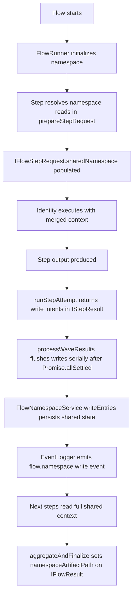

> [!TIP]
> This document is a specialized extension of the [root .copilot/ guidelines](../README.md).

## Status & Context

**Status**: 🚧 Planning
**Phase Dependencies**: Phase 63
**Risk Level**: M — touches core flow orchestration and shared state persistence, but is additive and can remain optional per flow.

## Executive Summary

- **The Problem**: Flow coordination currently relies too heavily on point-to-point transforms between steps. This creates brittle coupling, makes multi-identity collaboration harder to inspect, and forces upstream findings to be threaded manually through intermediate steps.
- **The Solution**: Add a per-flow namespace file and runtime service that supports structured reads/writes from any step in the flow, while preserving existing transforms and audit logging.
- **The Goal**: Establish a shared blackboard coordination primitive that improves collaboration, inspectability, and later support for richer orchestration patterns.

## Current State Analysis

### Key Files

| File                                           | Current Role                                | Gap                                                    |
| ---------------------------------------------- | ------------------------------------------- | ------------------------------------------------------ |
| `src/flows/flow_runner.ts`                     | Executes flow steps and dependency ordering | No shared, flow-scoped read/write coordination surface |
| `src/shared/schemas/flow.ts`                   | Validates flow definitions                  | No namespace config or namespace bindings              |
| `src/services/event_logger.ts`                 | Emits execution events                      | No namespace-specific journal events                   |
| `src/services/flow/flow_reporter.ts`           | Produces flow execution reports             | No namespace artifact metadata in report frontmatter   |
| `src/services/flow/flow_checkpoint_service.ts` | Checkpoints completed steps per trace       | Architectural template for namespace service pattern   |
| `src/services/flow/mod.ts`                     | Barrel exports for flow services            | Missing `flow_namespace_service.ts` re-export          |

### Constraints

- Existing transform behavior must remain valid and unchanged by default.
- Namespace storage must be human-readable and repository-local in spirit, consistent with ExaIx’s files-as-API model.- Storage paths must be derived from `Config` (same as `FlowCheckpointService`), not from user-supplied template strings.- Shared state must be journaled to avoid hidden coordination logic.

### Interfaces Affected

- `src/flows/flow_runner.ts:FlowRunner` — constructor (namespace service init), `prepareStepRequest()` (read hydration), `runStepAttempt()` (write commit), `aggregateAndFinalize()` (artifact path)
- `src/flows/flow_runner.ts:IFlowStepRequest` — add `sharedNamespace?: Record<string, string>`
- `src/flows/flow_runner.ts:IFlowResult` — add `namespaceArtifactPath?: string`
- `src/shared/schemas/flow.ts` — new namespace schemas, `FlowStepSchema.namespace`, `FlowSchema.namespace`
- `src/services/flow/flow_reporter.ts:FlowReporter` — include namespace artifact path in report frontmatter and summary section

## Technical Architecture & Detailed Design

### Schemas

```ts
// Flow-level namespace configuration (added as optional FlowSchema.namespace).
// pathTemplate is intentionally absent; the service derives the path from Config internally.
export const ZFlowNamespaceConfig = z.object({
  enabled: z.boolean().default(false),
  format: z.enum(["markdown", "yaml"]).default("markdown"),
  maxBytes: z.number().int().positive().default(65536),
});

// Read binding — declares a key the step wants injected from the namespace.
// `from` and `mode` are omitted because placement in the `reads` array already implies read intent.
export const ZFlowNamespaceRead = z.object({
  key: z.string().min(1).describe("Namespace key to inject into sharedNamespace context"),
  required: z.boolean().default(false).describe("If true, step fails when key is absent"),
});

// Write binding — declares a key the step will write to the namespace after completion.
// `from` is a dot-path into the step output (omit to use the full output string).
export const ZFlowNamespaceWrite = z.object({
  key: z.string().min(1).describe("Namespace key to set after step completion"),
  from: z.string().min(1).optional().describe("Dot-path into step output to extract value; omit to use full output"),
  mode: z.enum(["write", "append"]).default("write"),
});

// Per-step namespace declaration (added as optional field to FlowStepSchema).
export const ZFlowStepNamespace = z.object({
  reads: z.array(ZFlowNamespaceRead).default([]),
  writes: z.array(ZFlowNamespaceWrite).default([]),
});

// Individual entry in the persisted namespace snapshot.
// v1: value is string-only to guarantee JSONValue compatibility for journal events.
export const ZFlowNamespaceEntry = z.object({
  key: z.string(),
  value: z.string().describe("String value; structured data should be JSON-serialized by the writer"),
  authorStepId: z.string(),
  updatedAt: z.string().datetime(),
});
```

> **v1 Design Decision — `value: z.string()`**: namespace values are strings in v1. Steps that need to share structured data
> must JSON-serialize on write and deserialize on read. This avoids `z.unknown()` serialization ambiguity in journal event
> payloads and keeps the persisted markdown format deterministic. Structured value support can be added in a later phase.

### Interface Changes

```ts
// src/flows/flow_runner.ts — IFlowStepRequest (extend existing interface, add optional field)
/** Resolved namespace reads for this step, keyed by binding key (Phase 64) */
sharedNamespace?: Record<string, string>;

// src/flows/flow_runner.ts — IFlowResult (extend existing interface, add optional field)
/** Absolute path to the persisted namespace artifact; undefined when namespace is disabled (Phase 64) */
namespaceArtifactPath?: string;

// src/shared/types/flow_namespace.ts — new types file
export type IFlowNamespaceConfig = z.infer<typeof ZFlowNamespaceConfig>;
export type IFlowNamespaceRead = z.infer<typeof ZFlowNamespaceRead>;
export type IFlowNamespaceWrite = z.infer<typeof ZFlowNamespaceWrite>;
export type IFlowStepNamespace = z.infer<typeof ZFlowStepNamespace>;
export type IFlowNamespaceEntry = z.infer<typeof ZFlowNamespaceEntry>;
```

> **`IFlowRunnerConfig` unchanged**: `FlowNamespaceService` is auto-instantiated in the `FlowRunner` constructor when
> `config` is present, exactly as `FlowCheckpointService`. No new injection point is required.

### Service Interface

```ts
// src/services/flow/flow_namespace_service.ts

export interface IFlowNamespaceSnapshot {
  flowRunId: string;
  path: string;
  entries: Record<string, string>;
  updatedAt: string;
}

export interface IFlowNamespaceService {
  /** Derive the absolute path for the namespace file for the given flowRunId. */
  getNamespacePath(flowRunId: string): string;
  /** Create or load the namespace file for a new flow run. Returns the current snapshot. */
  initialize(flowRunId: string): Promise<IFlowNamespaceSnapshot>;
  /** Load a previously persisted namespace snapshot, or return an empty one. */
  load(flowRunId: string): Promise<IFlowNamespaceSnapshot>;
  /** Return only the specified keys from the current snapshot. Missing keys yield undefined. */
  readKeys(flowRunId: string, keys: string[]): Promise<Record<string, string | undefined>>;
  /** Persist writes from a completed step. Enforces maxBytes before writing. */
  writeEntries(
    flowRunId: string,
    stepId: string,
    writes: IFlowNamespaceWrite[],
    stepOutput: string,
  ): Promise<IFlowNamespaceSnapshot>;
  /** Remove the namespace file after flow completion or on cleanup. */
  delete(flowRunId: string): Promise<void>;
}
```

> **Storage path**: computed internally as
> `join(config.system.root, config.paths.memory, config.paths.memoryExecution, flowRunId, "namespace.md")` —
> the same structural pattern used by `FlowCheckpointService`. No user-configurable path template.

### Logic Flow



### Design Decisions

- **Additive, not replacing transforms**: namespace support complements existing transforms rather than removing them.
- **Service abstraction**: a dedicated `IFlowNamespaceService` avoids leaking file format concerns into `FlowRunner`.
- **Config-driven storage path**: path is always derived from `Config` (no user template), consistent with `FlowCheckpointService`.
- **Human-readable artifact**: default markdown format preserves inspectability during approval and debugging.
- **Journal-first visibility**: all writes emit explicit namespace events.
- **Constructor auto-init**: `FlowNamespaceService` is instantiated in `FlowRunner` constructor when `config` is present, exactly as `FlowCheckpointService`.
- **`IFlowRunnerConfig` unchanged**: no injection point needed; namespace service is always co-located with checkpoint service.
- **Namespace on checkpoint resume**: when `loadCheckpointIfAvailable` restores step results, the namespace is loaded from the persisted file in the same initialization pass, ensuring subsequently-executing steps see prior writes.
- **Post-wave serial flush**: namespace write intents are buffered on `IStepResult` (as `namespaceWrites?: { writes: IFlowNamespaceWrite[]; stepOutput: string }`) and committed serially inside `processWaveResults()` after `Promise.allSettled` returns, in deterministic step order. This matches the existing `saveCheckpointIfEnabled` pattern and eliminates intra-wave lost-update races.
- **Failed steps do not commit writes**: only successful step results carry write intents; `processWaveResults()` skips the flush for any step where `result.success === false` or the promise was rejected.
- **Separate read/write binding types**: `ZFlowNamespaceRead` and `ZFlowNamespaceWrite` are distinct schemas — `mode: "read"` as a discriminant inside a `reads:[]` array would be redundant and misleading.

## Implementation Plan (Step-by-Step)

### Step 64.1: Schema & Runtime Contracts

#### Actions

- Modify `src/shared/schemas/flow.ts` to add:
  - `ZFlowNamespaceConfig`, `ZFlowNamespaceRead`, `ZFlowNamespaceWrite`, `ZFlowStepNamespace`, `ZFlowNamespaceEntry`
  - Optional `namespace?: ZFlowNamespaceConfig` to `FlowSchema`
  - Optional `namespace?: ZFlowStepNamespace` to `FlowStepSchema`
- Create `src/shared/types/flow_namespace.ts` with inferred types.
- Create stub `src/services/flow/flow_namespace_service.ts` with `IFlowNamespaceService` and `IFlowNamespaceSnapshot` interfaces (implementation deferred to Step 64.2).
- Add `export * from "./flow_namespace_service.ts";` to `src/services/flow/mod.ts`.

#### Architecture Notes

- Keep all new schema fields optional with `.optional()` so existing flows parse unchanged.
- `ZFlowNamespaceRead` and `ZFlowNamespaceWrite` are separate types — do not merge them into a single binding type with a redundant `mode: "read"` discriminant.
- `ZFlowNamespaceEntry.value` must be `z.string()` for `JSONValue` compatibility (see schema note above).

#### Planned Tests

- `tests/flows/flow_namespace_schema_test.ts` — validates parse/reject for all new schemas
- `tests/unit/services/flow_namespace_service_contract_test.ts` — compiles and type-checks the interface

#### Success Criteria

- Flow files without namespace config still parse without modification.
- Namespace-enabled flow files validate read/write declarations.
- `ZFlowNamespaceEntry.value` is typed as `string`, not `unknown`.
- Service interface and types compile without `any`.
- `src/services/flow/mod.ts` re-exports `flow_namespace_service.ts`.

### Step 64.2: Namespace Persistence & Formatting

#### Actions

- Implement `FlowNamespaceService` in `src/services/flow/flow_namespace_service.ts`:
  - `getNamespacePath(flowRunId)` → `join(root, memory, memoryExecution, flowRunId, "namespace.md")`
  - `initialize(flowRunId)` → `ensureDir`, load existing file if present, or create empty snapshot
  - `load(flowRunId)` → read and parse file if present, return empty snapshot otherwise
  - `readKeys(flowRunId, keys)` → load snapshot, pick requested keys
  - `writeEntries(flowRunId, stepId, writes, stepOutput)` → load snapshot, apply writes (extract via `from` dot-path or use full stepOutput), enforce `maxBytes`, persist, return updated snapshot
  - `delete(flowRunId)` → remove namespace file if it exists
- Deterministic markdown rendering: sorted key order, YAML-comment metadata (stepId, updatedAt) per entry.

#### Architecture Notes

- Use the same `ensureDir` + `Deno.writeTextFile` atomic-write pattern as `FlowCheckpointService`.
- `maxBytes` is enforced in `writeEntries` before persisting: if the serialized snapshot would exceed the limit, throw `NamespaceQuotaExceededError` (truncation is unsafe for v1).
- Parse the loaded file back through `z.array(ZFlowNamespaceEntry).parse(...)` to validate structure on load, mirroring `ZFlowCheckpoint.parse` in `FlowCheckpointService`.

#### Planned Tests

- `tests/integration/services/flow_namespace_persistence_test.ts` — full write/read/delete cycle with temp dir
- `tests/unit/services/flow_namespace_markdown_render_test.ts` — deterministic output for identical inputs
- `tests/unit/services/flow_namespace_quota_test.ts` — `maxBytes` enforcement throws when exceeded

#### Success Criteria

- Namespace file is created on flow start under `Memory/Execution/{flowRunId}/namespace.md`.
- Writes preserve previous entries unless `mode: "write"` overwrites a key.
- `mode: "append"` concatenates new value with a newline separator.
- Markdown output is deterministic across identical inputs.
- `maxBytes` exceeded → `NamespaceQuotaExceededError` is thrown before any write occurs.

### Step 64.3: FlowRunner Integration

#### Actions

1. **Constructor** — add `private namespaceService?: IFlowNamespaceService` field. After the `checkpointService` line in the constructor body:

   ```ts
   if (this.config) {
     this.checkpointService = new FlowCheckpointService(this.config);
     this.namespaceService = new FlowNamespaceService(this.config);
   }
   ```

1. **`execute()`** — after `loadCheckpointIfAvailable`, call `initializeNamespace(flowRunId, flow)`. When resuming from checkpoint and a namespace file already exists, `initializeNamespace` calls `load()` instead of `initialize()`.

1. **`prepareStepRequest()`** — after building the base `IFlowStepRequest`, resolve `step.namespace?.reads` by calling `namespaceService.readKeys(flowRunId, readKeys)`, emit `flow.namespace.read` event, and set `sharedNamespace` on the returned request object.

1. **`runStepAttempt()`** — after `executeStepLogic()` returns successfully, attach write intents to the step result rather than persisting immediately:

   ```ts
   // IStepResult gains an optional internal field (not part of the public contract):
   namespaceWrites?: { writes: IFlowNamespaceWrite[]; stepOutput: string };
   ```

   Set `namespaceWrites = { writes: step.namespace?.writes ?? [], stepOutput: result.content }` on the returned result. Do **not** call `writeEntries` here.

1. **`processWaveResults()`** — after `Promise.allSettled` returns and each successful step result is stored in `stepResults`, flush namespace writes serially in the same loop that calls `saveCheckpointIfEnabled`:

   ```ts
   if (result.success && result.namespaceWrites && this.namespaceService && flow.namespace?.enabled) {
     await this.namespaceService.writeEntries(
       flowRunId, stepId,
       result.namespaceWrites.writes,
       result.namespaceWrites.stepOutput,
     );
     await this.eventLogger.log("flow.namespace.write", { flowRunId, stepId, ... });
   }
   ```

1. **`aggregateAndFinalize()`** — set `namespaceArtifactPath: this.namespaceService?.getNamespacePath(flowRunId)` on the returned `IFlowResult` when namespace is enabled for the flow.

1. Emit events: `flow.namespace.initialized`, `flow.namespace.read`, `flow.namespace.write`.

#### Architecture Notes

- Namespace reads are injected in `prepareStepRequest()` — the single point where `IFlowStepRequest` is assembled, keeping all step context preparation co-located.
- Namespace writes are **not** committed inside the parallel wave promises. Each step returns write intents on its result; `processWaveResults()` flushes them serially after `Promise.allSettled` in deterministic step order. This mirrors `saveCheckpointIfEnabled` and prevents intra-wave lost-update races (concurrent `Promise.allSettled` steps would otherwise interleave their load→modify→write cycles).
- Failed step results carry no write intents (`namespaceWrites` is unset), so `processWaveResults()` naturally skips the flush for failed steps without a separate guard.
- All namespace code-paths must be guarded with `if (this.namespaceService && flow.namespace?.enabled)` to preserve zero-overhead behavior for config-less runners.

#### Planned Tests

- `tests/flows/flow_runner_namespace_integration_test.ts` — two-step flow where step 2 reads step 1's namespace write without a transform
- `tests/integration/64_flow_namespace_end_to_end_test.ts` — full execution including file artifact inspection
- `tests/flows/flow_runner_namespace_no_regression_test.ts` — all existing flow fixtures execute unchanged when namespace is not configured

#### Success Criteria

- Downstream step reads an upstream finding via `sharedNamespace` without transform-threading.
- Namespace events (`flow.namespace.initialized`, `flow.namespace.read`, `flow.namespace.write`) appear in the journal.
- `IFlowResult.namespaceArtifactPath` is populated when namespace is enabled.
- Flows without namespace config behave exactly as before (zero behavioral change).
- Failed step does not modify the namespace.
- Checkpoint-resumed flow loads the existing namespace file instead of creating a blank one.
- Steps executing concurrently in the same wave produce no lost updates: writes are serialized in `processWaveResults()` after all wave promises settle.

### Step 64.4: Reporting Surface

#### Actions

- Modify `src/services/flow/flow_reporter.ts:FlowReporter.buildFrontmatter()` to include `namespace_artifact_path` when `flowResult.namespaceArtifactPath` is set.
- Modify `src/services/flow/flow_reporter.ts:FlowReporter.buildReport()` to add an optional `## Shared Namespace` section when `namespaceArtifactPath` is present, listing key count and path only (no value dump to avoid noisy duplication).

#### Architecture Notes

- `FlowReporter` already receives `IFlowResult` and reads fields like `tokenSummary`; `namespaceArtifactPath` integrates naturally into the same pattern.
- Do not embed namespace file contents in the report — report only path and key count (pass an optional `IFlowNamespaceSnapshot` to `generate()` if key count is needed).
- `src/services/artifact/mission_reporter.ts` (single-agent mission reports) is a separate concern and is **not modified**.

#### Planned Tests

- `tests/unit/services/flow_reporter_namespace_summary_test.ts` — report includes `namespace_artifact_path` in frontmatter when set; section omitted when `namespaceArtifactPath` is undefined

#### Success Criteria

- Completed flow reports include `namespace_artifact_path` in YAML frontmatter when namespace is enabled.
- Report includes `## Shared Namespace` section with key count and file path.
- Reports for non-namespace flows are byte-for-byte unchanged.

### Step 64.5: Documentation Updates

#### Actions

- **`ARCHITECTURE.md`** — in the component reference table (near `Gate Evaluator`, `Feedback Loop`), add the three new/newly-documented flow services:

  | Component                   | Role                                                      | Path                                                  |
  | --------------------------- | --------------------------------------------------------- | ----------------------------------------------------- |
  | **Flow Checkpoint Service** | Step resume checkpoint persistence per trace              | `src/services/flow/flow_checkpoint_service.ts`        |
  | **Flow Namespace Service**  | Per-flow shared blackboard coordination (Phase 64)        | `src/services/flow/flow_namespace_service.ts`         |
  | **Flow Reporter**           | Markdown execution report generation per flow run         | `src/services/flow/flow_reporter.ts`                  |

  Also add a `## Flow Namespace & Shared Blackboard` subsection under the Agent Orchestration Architecture section describing: the blackboard pattern, `IFlowNamespaceService`, read/write binding YAML syntax, storage path (`Memory/Execution/{flowRunId}/namespace.md`), and post-wave serial flush semantics.

- **`.copilot/cross-reference.md`** — add to the Task → Doc table and Search by Topic:
  - Task row: `Implement / debug flow namespace / blackboard` → primary `planning/phase-64-flow-namespace-blackboard.md`, secondary `source/exaix.md`
  - Topics: `namespace`, `blackboard`, `shared-state`, `flow-coordination` → same doc

- **`docs/dev/`** — create `docs/dev/flow_namespace.md` documenting the feature for developers: YAML syntax for enabling the namespace, read/write binding fields, storage location, size limit, and `sharedNamespace` context injection.

#### Architecture Notes

- `ARCHITECTURE.md` already documents flow components by component name and file path; the new rows follow the same format.
- The `docs/dev/flow_namespace.md` file does not need a mirror in `tests/`; it is documentation only.
- Run `deno task docs-agent-validate` after updating `cross-reference.md` to verify internal link integrity.

#### Planned Tests

- None — documentation steps do not require code tests.
- `deno task docs-agent-validate` and `deno task check:docs` must pass.

#### Success Criteria

- `ARCHITECTURE.md` component table includes `Flow Namespace Service` with correct path and role.
- `ARCHITECTURE.md` includes a `## Flow Namespace & Shared Blackboard` subsection in the Agent Orchestration Architecture section.
- `.copilot/cross-reference.md` routes `namespace`, `blackboard`, and `flow-coordination` topics to `phase-64-flow-namespace-blackboard.md`.
- `docs/dev/flow_namespace.md` exists and documents YAML syntax, storage path, and `sharedNamespace` injection.
- `deno task docs-agent-validate` passes with no broken links.

| Risk                                       | Impact | Likelihood | Mitigation Strategy                                                                                                                                |
| ------------------------------------------ | ------ | ---------: | -------------------------------------------------------------------------------------------------------------------------------------------------- |
| R1: Namespace becomes an unstructured dump | High   |     Medium | Restrict v1 to key-based reads/writes with explicit bindings                                                                                       |
| R2: Hidden coupling between steps          | Medium |     Medium | Require declared namespace reads/writes in YAML                                                                                                    |
| R3: File corruption on concurrent writes   | Medium |        Low | Write intents buffered on `IStepResult`; flushed serially in `processWaveResults()` after wave settles, matching `saveCheckpointIfEnabled` pattern |
| R4: Duplicate data with transforms         | Low    |     Medium | Keep transforms for direct payload routing; namespace for shared context only                                                                      |
| R5: maxBytes exceeded at runtime           | Medium |        Low | Throw `NamespaceQuotaExceededError` before write; handled in step failure path                                                                     |

## Success Metrics (Quantitative)

- At least 80% reduction in transform-only threading for multi-identity flow fixtures.
- Namespace-enabled flow produces a deterministic shared artifact under 64 KB in standard review scenarios.
- 100% of namespace writes emit corresponding journal events.
- Zero regressions in existing non-namespace flow fixtures.

## Backward Compatibility

- Namespace configuration is optional and disabled by default.
- Existing flows continue to parse and execute unchanged.
- Existing transform semantics remain the primary direct input/output mechanism.
- The namespace file format is additive and can evolve independently through service versioning.
- `IFlowStepRequest.sharedNamespace` is optional; existing callers of `IAgentExecutor.run()` are unaffected.
- `IFlowResult.namespaceArtifactPath` is optional; existing consumers of `FlowRunner.execute()` are unaffected.
