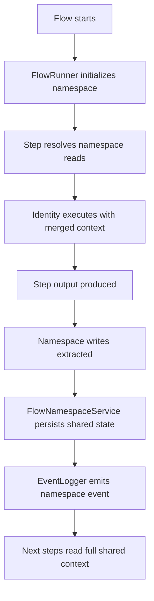

> [!TIP]
> This document is a specialized extension of the [root .copilot/ guidelines](../README.md).

## Status & Context

**Status**: 🚧 Planning
**Phase Dependencies**: Phase 63
**Risk Level**: M — touches core flow orchestration and shared state persistence, but is additive and can remain optional per flow.

## Executive Summary

- **The Problem**: Flow coordination currently relies too heavily on point-to-point transforms between steps. This creates brittle coupling, makes multi-identity collaboration harder to inspect, and forces upstream findings to be threaded manually through intermediate steps.
- **The Solution**: Add a per-flow namespace file and runtime service that supports structured reads/writes from any step in the flow, while preserving existing transforms and audit logging.
- **The Goal**: Establish a shared blackboard coordination primitive that improves collaboration, inspectability, and later support for richer orchestration patterns.

## Current State Analysis

### Key Files

| File                               | Current Role                                | Gap                                                      |
| ---------------------------------- | ------------------------------------------- | -------------------------------------------------------- |
| `src/flows/flow_runner.ts`         | Executes flow steps and dependency ordering | No shared, flow-scoped read/write coordination surface   |
| `src/shared/schemas/flow.ts`       | Validates flow definitions                  | No namespace config or namespace bindings                |
| `src/services/event_logger.ts`     | Emits execution events                      | No namespace-specific journal events                     |
| `src/services/mission_reporter.ts` | Produces execution summaries                | No first-class representation of shared flow state       |
| `src/services/session_memory.ts`   | Request/session memory enhancement          | Not flow-scoped, not suited for multi-step collaboration |

### Constraints

- Existing transform behavior must remain valid and unchanged by default.
- Namespace storage must be human-readable and repository-local in spirit, consistent with ExaIx’s files-as-API model.
- Shared state must be journaled to avoid hidden coordination logic.

### Interfaces Affected

- `src/flows/flow_runner.ts:FlowRunner`
- `src/shared/schemas/flow.ts`
- `src/services/event_logger.ts:EventLogger`

## Technical Architecture & Detailed Design

### Schemas

```ts
export const ZFlowNamespaceConfig = z.object({
  enabled: z.boolean().default(false),
  pathTemplate: z.string().min(1).describe("Namespace path template, e.g. .exaix/flows/{{flow_id}}/shared.md"),
  format: z.enum(["markdown", "yaml"]).default("markdown"),
  maxBytes: z.number().int().positive().default(65536),
});

export const ZFlowNamespaceBinding = z.object({
  key: z.string().min(1),
  from: z.string().min(1).optional().describe("Source path from step output"),
  mode: z.enum(["read", "write", "append"]).default("read"),
  required: z.boolean().default(false),
});

export const ZFlowStepNamespace = z.object({
  reads: z.array(ZFlowNamespaceBinding).default([]),
  writes: z.array(ZFlowNamespaceBinding).default([]),
});

export const ZFlowNamespaceEntry = z.object({
  key: z.string(),
  value: z.unknown(),
  authorStepId: z.string(),
  updatedAt: z.string().datetime(),
});
```

### Interfaces

```ts
export interface IFlowNamespaceSnapshot {
  flowId: string;
  path: string;
  entries: Record<string, unknown>;
  updatedAt: string;
}

export interface IFlowNamespaceService {
  initialize(flowId: string, config: IFlowNamespaceConfig): Promise<IFlowNamespaceSnapshot>;
  load(flowId: string): Promise<IFlowNamespaceSnapshot>;
  readKeys(flowId: string, keys: string[]): Promise<Record<string, unknown>>;
  writeEntries(
    flowId: string,
    stepId: string,
    writes: Array<{ key: string; value: unknown; mode: "write" | "append" }>,
  ): Promise<IFlowNamespaceSnapshot>;
}
```

### Logic Flow



### Design Decisions

- **Additive, not replacing transforms**: namespace support complements existing transforms rather than removing them.
- **Service abstraction**: a dedicated `IFlowNamespaceService` avoids leaking file format concerns into `FlowRunner`.
- **Human-readable artifact**: default markdown format preserves inspectability during approval and debugging.
- **Journal-first visibility**: all writes emit explicit namespace events.

## Implementation Plan (Step-by-Step)

### Step 64.1: Schema & Runtime Contracts

1. **Actions**

- Modify `src/shared/schemas/flow.ts` to add flow-level `namespace` config and per-step `namespace` read/write declarations.
- Create `src/services/flow/flow_namespace_service.ts`.
- Add shared types in `src/shared/types/flow_namespace.ts`.

1. **Architecture Notes**

- Keep all new schema fields optional.
- Bindings should support stable keys, not free-form document patching in v1.

1. **Planned Tests**

- `tests/flows/flow_namespace_schema_test.ts`
- `tests/unit/services/flow_namespace_service_contract_test.ts`

1. **Success Criteria**

- Flow files without namespace config still parse.
- Namespace-enabled flow files validate read/write declarations.
- Service contracts compile without `any`.

### Step 64.2: Namespace Persistence & Formatting

1. **Actions**

- Implement initialize/load/write logic in `src/services/flow/flow_namespace_service.ts`.
- Persist namespace under `.exaix/flows/{flowId}/shared.md`.
- Add deterministic markdown rendering for keys and provenance metadata.

1. **Architecture Notes**

- Use atomic write pattern to avoid partial namespace corruption.
- Keep a normalized in-memory shape even when file output is markdown.

1. **Planned Tests**

- `tests/integration/services/flow_namespace_persistence_test.ts`
- `tests/unit/services/flow_namespace_markdown_render_test.ts`

1. **Success Criteria**

- Namespace file is created on flow start.
- Writes preserve previous entries unless explicitly overwritten.
- Markdown output is deterministic across identical inputs.

### Step 64.3: FlowRunner Integration

1. **Actions**

- Update `src/flows/flow_runner.ts` to initialize namespace, hydrate step inputs from `namespace.reads`, and persist `namespace.writes` after step completion.
- Emit `flow.namespace.initialized`, `flow.namespace.read`, and `flow.namespace.write` events.

1. **Architecture Notes**

- Read values should be injected into step context in a dedicated `sharedNamespace` field.
- Failed steps must not commit namespace writes unless configured in a future recovery mode.

1. **Planned Tests**

- `tests/flows/flow_runner_namespace_integration_test.ts`
- `tests/integration/64_flow_namespace_end_to_end_test.ts`

1. **Success Criteria**

- Downstream step can read an upstream finding without transform-threading.
- Namespace events appear in the journal.
- Flows without namespace config behave exactly as before.

### Step 64.4: Approval & Reporting Surface

1. **Actions**

- Surface namespace path and summary in `src/services/mission_reporter.ts`.
- Include namespace artifact path in flow completion summaries.

1. **Architecture Notes**

- Report only key counts and changed keys in summaries to avoid noisy duplication.

1. **Planned Tests**

- `tests/unit/services/mission_reporter_namespace_summary_test.ts`

1. **Success Criteria**

- Completed flow summaries include namespace artifact metadata.
- Human reviewers can inspect shared state from a stable path.

## Risks & Mitigations

| Risk                                       | Impact | Likelihood | Mitigation Strategy                                                           |
| ------------------------------------------ | ------ | ---------: | ----------------------------------------------------------------------------- |
| R1: Namespace becomes an unstructured dump | High   |     Medium | Restrict v1 to key-based reads/writes with explicit bindings                  |
| R2: Hidden coupling between steps          | Medium |     Medium | Require declared namespace reads/writes in YAML                               |
| R3: File corruption on concurrent writes   | Medium |        Low | Atomic file writes and FlowRunner-controlled serialization                    |
| R4: Duplicate data with transforms         | Low    |     Medium | Keep transforms for direct payload routing; namespace for shared context only |

## Success Metrics (Quantitative)

- At least 80% reduction in transform-only threading for multi-identity flow fixtures.
- Namespace-enabled flow produces a deterministic shared artifact under 64 KB in standard review scenarios.
- 100% of namespace writes emit corresponding journal events.
- Zero regressions in existing non-namespace flow fixtures.

## Backward Compatibility

- Namespace configuration is optional and disabled by default.
- Existing flows continue to parse and execute unchanged.
- Existing transform semantics remain the primary direct input/output mechanism.
- The namespace file format is additive and can evolve independently through service versioning.
