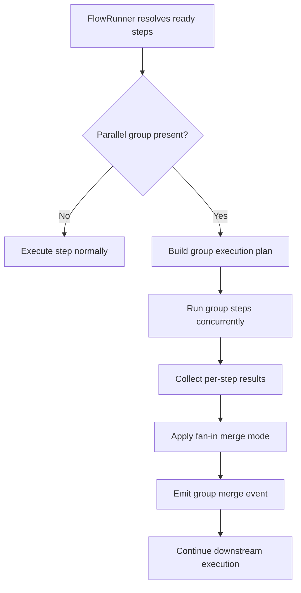

> [!TIP]
> This document is a specialized extension of the [root .copilot/ guidelines](../README.md).

## Status & Context

**Status**: 🚧 Planning
**Phase Dependencies**: Phase 64
**Risk Level**: M — extends scheduling semantics in `FlowRunner`, but can be introduced in a backward-compatible way.

## Executive Summary

- **The Problem**: ExaIx already resolves flows by dependency waves, but authors cannot explicitly declare logical parallel groups, merge behavior, or group-level observability. This makes collaborative review flows harder to author and less deterministic.
- **The Solution**: Add first-class `parallel` group declarations and fan-in merge semantics to the flow schema and execution engine.
- **The Goal**: Turn implicit concurrency into explicit, auditable, testable orchestration.

## Current State Analysis

### Key Files

| File                                           | Current Role                      | Gap                                                                                                                                                                                                                |
| ---------------------------------------------- | --------------------------------- | ------------------------------------------------------------------------------------------------------------------------------------------------------------------------------------------------------------------ |
| `src/flows/flow_runner.ts`                     | Executes dependency-ordered steps | No explicit group identity, merge strategy, or group-level reporting                                                                                                                                               |
| `src/shared/schemas/flow.ts`                   | Flow YAML validation              | No parallel-group schema                                                                                                                                                                                           |
| `src/services/flow/flow_checkpoint_service.ts` | Checkpoint resume                 | No group-aware checkpoint metadata                                                                                                                                                                                 |
| `src/services/event_logger.ts`                 | Event stream                      | Group lifecycle events (`flow.parallel_group.started`, `flow.parallel_group.completed`) are emitted via `IFlowEventLogger.log()` in `FlowRunner` — no new event-type registration in `event_logger.ts` is required |

### Constraints

- Existing dependency-wave behavior must remain valid.
- Group execution must integrate cleanly with checkpointing and error recovery from Phase 63.
- Group semantics must be deterministic for merge ordering and reporting.

### Interfaces Affected

- `src/flows/flow_runner.ts:FlowRunner`
- `src/flows/flow_runner.ts:IFlowStepRequest` — gains optional `parallelGroupResults?: Record<string, IParallelGroupSummary>` top-level field
- `src/shared/schemas/flow.ts` — `FlowStepSchema` gains optional `parallel`, `mergeFromGroups`, `mergeMode` fields
- `src/services/flow/flow_checkpoint_service.ts:FlowCheckpointService`

## Technical Architecture & Detailed Design

### Schemas

```ts
export const ZParallelMergeMode = z.enum(["all", "ordered", "concat", "manual"]);

export const ZFlowParallelConfig = z.object({
  group: z.string().min(1),
  mergeMode: ZParallelMergeMode.default("all"),
  order: z.array(z.string()).optional().describe(
    "Step IDs within this group; used for ordered fan-in merge. " +
      "Validated against actual group member IDs in validateIFlow().",
  ),
});

// Fan-in steps are regular FlowStepSchema steps — ZFlowFanInStep is NOT a separate schema.
// The following optional fields are added to FlowStepSchema (src/shared/schemas/flow.ts):
//   parallel?:        ZFlowParallelConfig     — marks step as a parallel group member
//   mergeFromGroups?: z.array(z.string())     — marks step as a fan-in; lists group IDs to collect
//   mergeMode?:       ZParallelMergeMode      — fan-in merge strategy (defaults to "all")
```

### Interfaces

```ts
export interface IParallelExecutionGroup {
  groupId: string;
  stepIds: string[];
  mergeMode: "all" | "ordered" | "concat" | "manual";
  order?: string[];
}

export interface IParallelGroupResult {
  groupId: string;
  startedAt: string;
  completedAt: string;
  /** JSON-safe per-step snapshots — IFlowStepResultSnapshot from src/shared/schemas/flow.ts */
  resultsByStepId: Record<string, IFlowStepResultSnapshot>;
}

/** JSON-safe group summary injected into downstream steps via IFlowStepRequest.parallelGroupResults */
export interface IParallelGroupSummary {
  groupId: string;
  mergedOutput: string;
  memberCount: number;
  successCount: number;
  /** ISO string — IStepResult.startedAt/completedAt (Date) serialized before injection */
  completedAt: string;
}
```

### Logic Flow



### Design Decisions

- **Explicit group metadata**: makes orchestration intent visible in YAML.
- **Deterministic merge**: avoids race-order ambiguity when combining outputs.
- **Compatibility with Phase 63**: retries, fallbacks, and checkpoints remain step-based, but group reporting is layered on top.
- **Namespace synergy**: group outputs can also write to the shared namespace introduced in Phase 64.

## Implementation Plan (Step-by-Step)

### Step 65.1: Schema & Validation Foundation

Implemented 2026-04-10.
Validated with:

- `deno test --allow-all tests/flows/parallel_group_schema_test.ts tests/flows/parallel_group_validation_test.ts`
- `deno check src/shared/schemas/flow.ts src/flows/flow_runner.ts tests/flows/parallel_group_schema_test.ts tests/flows/parallel_group_validation_test.ts`
- `deno lint src/shared/schemas/flow.ts src/flows/flow_runner.ts tests/flows/parallel_group_schema_test.ts tests/flows/parallel_group_validation_test.ts`
- `deno fmt src/shared/schemas/flow.ts src/flows/flow_runner.ts tests/flows/parallel_group_schema_test.ts tests/flows/parallel_group_validation_test.ts`
- `deno task check:style`
- `deno task check:arch`

#### Actions

- [x] Extend `src/shared/schemas/flow.ts:FlowStepSchema` with three optional fields: `parallel?: ZFlowParallelConfig`, `mergeFromGroups?: z.array(z.string())`, `mergeMode?: ZParallelMergeMode`.
- [x] Drop `ZFlowFanInStep` — fan-in steps are regular `FlowStepSchema` steps with `mergeFromGroups` set; no separate schema type is needed.
- [x] Add validation preventing illegal configurations such as mixed group IDs on mutually dependent steps.

#### Architecture Notes

- `parallel.group` is optional; steps that omit it execute under existing wave semantics.
- Fan-in steps are declared by setting `mergeFromGroups` on any existing `FlowStepSchema` step. No new `FlowStepType` enum value is required.
- All group and merge validation (cyclic group cycles, invalid `mergeFromGroups` references, invalid `order` entries) runs in `FlowRunner.validateIFlow()` — **not** at `FlowSchema.parse()` time. Rationale: these checks require cross-step analysis (resolving which step IDs belong to which group) that is not available to the Zod schema layer. `validateIFlow()` receives the fully-parsed `IFlow` object and can delegate to a `ParallelGroupValidator` helper.
- `parallel.order` is an array of **step IDs** belonging to the same group. For `mergeMode: 'ordered'`, results are concatenated in the declared order. If `order` is omitted and `mergeMode` is `'ordered'`, a stable lexicographic step ID sort is used instead.
- **Security (OWASP A8)**: During `validateIFlow()`, every entry in `parallel.order` must be verified against the computed set of step IDs that declare `parallel.group === <this group>`. Any unrecognized entry throws `FlowExecutionError`: `"Parallel group '<groupId>' order entry '<id>' does not match any group member step ID"`. This prevents silent data loss in merged outputs.

#### Planned Tests

- ✅ `tests/flows/parallel_group_schema_test.ts`
- ✅ `tests/flows/parallel_group_validation_test.ts`

**✅ IMPLEMENTED** — `src/shared/schemas/flow.ts`, `src/flows/flow_runner.ts`, `tests/flows/parallel_group_schema_test.ts`, `tests/flows/parallel_group_validation_test.ts`; Step 65.1 now adds the explicit parallel-group schema fields, preserves legacy flow parsing, and validates unknown group references plus invalid `parallel.order` step IDs during `FlowRunner.validateIFlow()`.

#### Success Criteria

- [x] Valid grouped steps parse successfully.
- [x] Invalid merge references fail validation with clear errors.
- [x] Unknown step IDs in `parallel.order` throw `FlowExecutionError` during `validateIFlow()`.
- [x] Legacy flow YAML remains valid.

### Step 65.2: Scheduler Grouping in FlowRunner

Implemented 2026-04-10.
Validated with:

- `deno test --allow-all tests/flows/flow_runner_parallel_group_test.ts tests/integration/65_parallel_group_execution_test.ts`
- `deno check src/flows/flow_runner.ts tests/flows/flow_runner_parallel_group_test.ts tests/integration/65_parallel_group_execution_test.ts`
- `deno lint src/flows/flow_runner.ts tests/flows/flow_runner_parallel_group_test.ts tests/integration/65_parallel_group_execution_test.ts`
- `deno fmt src/flows/flow_runner.ts tests/flows/flow_runner_parallel_group_test.ts tests/integration/65_parallel_group_execution_test.ts`
- `deno task check:style`
- `deno task check:arch`

#### Actions

- [x] Update `src/flows/flow_runner.ts` to detect steps in the same ready wave that share a `parallel.group`.
- [x] Execute grouped steps via `Promise.allSettled` to preserve per-step outcome visibility.

#### Architecture Notes

- Group execution should preserve existing lease/worktree safety guarantees.
- Group execution must not reorder steps across dependency boundaries.

#### Planned Tests

- ✅ `tests/flows/flow_runner_parallel_group_test.ts`
- ✅ `tests/integration/40_parallel_group_execution_test.ts`

**✅ IMPLEMENTED** — `src/flows/flow_runner.ts`, `tests/flows/flow_runner_parallel_group_test.ts`, `tests/integration/65_parallel_group_execution_test.ts`; Step 65.2 now partitions same-wave grouped steps into explicit execution units, emits `flow.parallel_group.started` / `flow.parallel_group.completed`, and preserves the existing per-step wave result handling for downstream processing.

#### Success Criteria

- [x] Independent grouped steps execute concurrently.
- [x] Non-grouped steps continue to execute under current semantics.
- [x] Group execution emits `flow.parallel_group.started` and `flow.parallel_group.completed`.

### Step 65.3: Fan-In Merge Semantics

Implementation guidance for this step followed `.copilot/source/exaix.md` and `.copilot/tests/testing.md`: TDD-first, focused runtime changes in `FlowRunner`, and new tests placed under `tests/flows/` and `tests/integration/`.

- `deno test --allow-all tests/flows/parallel_group_merge_test.ts tests/integration/41_parallel_fanin_merge_test.ts`
- `deno lint src/flows/flow_runner.ts src/shared/constants.ts tests/flows/parallel_group_merge_test.ts tests/integration/41_parallel_fanin_merge_test.ts`
- `deno check src/flows/flow_runner.ts tests/flows/parallel_group_merge_test.ts tests/integration/41_parallel_fanin_merge_test.ts`

#### Actions

- [x] Implement fan-in aggregation logic for `all`, `ordered`, and `concat` merge modes.
- [x] Expose merged output as downstream step context via a new `parallelGroupResults` top-level field on `IFlowStepRequest` (not inside `context`).
- [x] Extend `IFlowStepRequest` with: `parallelGroupResults?: Record<string, IParallelGroupSummary>`.
- [x] `prepareStepRequest()` populates `parallelGroupResults` when the step has `mergeFromGroups` set.

#### Architecture Notes

- `ordered` must use explicit order if provided (`parallel.order`), otherwise stable lexicographic step ID sort.
- `manual` mode should skip automatic aggregation and expose raw per-step results only.
- **Type safety**: `IStepResult.startedAt` and `completedAt` are `Date` objects and are not `JSONValue`-safe. Downstream steps receive `IParallelGroupSummary` (ISO string timestamps, numeric counts) — **not** raw `IStepResult`. `prepareStepRequest()` serializes dates to ISO strings before populating `parallelGroupResults`.
- `IFlowStepRequest.context` (type `Record<string, JSONValue>`) is not used for group results; the dedicated `parallelGroupResults` field avoids type unsafety.

#### Planned Tests

- ✅ `tests/flows/parallel_group_merge_test.ts`
- ✅ `tests/integration/41_parallel_fanin_merge_test.ts`

**✅ IMPLEMENTED** — `src/flows/flow_runner.ts`, `src/shared/constants.ts`, `tests/flows/parallel_group_merge_test.ts`, and `tests/integration/41_parallel_fanin_merge_test.ts`; Step 65.3 now injects deterministic `parallelGroupResults` into downstream step requests, uses explicit group order or lexicographic fallback, leaves `manual` fan-in unmerged, and journals automatic merge failures via `flow.parallel_group.merge_failed`.

#### Success Criteria

- [x] Merged outputs are deterministic across runs.
- [x] Downstream steps can consume both grouped aggregate data and raw step results.
- [x] Merge failures are typed and journaled.

### Step 65.4: Checkpoint & Recovery Integration

#### Actions

- Verify `FlowCheckpointService.save()` correctly captures each group member step individually in `ZFlowCheckpoint.completedSteps` (keyed by step ID) — no schema changes needed.
- Ensure Phase 63 retry/fallback behavior remains step-scoped inside grouped execution.

#### Architecture Notes

- `ZFlowCheckpoint.completedSteps` is already keyed by step ID and captures all completed steps, including individual parallel group members. **No new fields are added to `ZFlowCheckpoint`** — backward compatibility is preserved automatically, and old checkpoints without group steps load correctly.
- Group membership is re-derived from the flow definition (`step.parallel.group`) at resume time — the same source used during execution. A partially completed group therefore naturally resumes only its unfinished members.
- Group merge re-runs only when all members of a group have completed (some in a prior run, others in the resumed run). The merge is triggered by `processWaveResults()` after the wave containing the last missing member completes.

#### Planned Tests

- `tests/integration/services/parallel_group_checkpoint_test.ts`
- `tests/integration/services/parallel_group_recovery_test.ts`

#### Success Criteria

- Resumed flows do not re-run successful group members.
- Group-level reporting remains correct after resume.
- Failed group member recovery does not corrupt sibling results.

## Risks & Mitigations

| Risk                                              | Impact | Likelihood | Mitigation Strategy                                                     |
| ------------------------------------------------- | ------ | ---------: | ----------------------------------------------------------------------- |
| R1: Non-deterministic merge results               | High   |     Medium | Stable ordering rules and explicit merge modes                          |
| R2: Parallel group hides individual failures      | High   |        Low | Preserve per-step result objects and events                             |
| R3: Retry semantics become confusing              | Medium |     Medium | Keep retries step-scoped, not group-scoped, in v1                       |
| R4: Resource spikes from uncontrolled concurrency | Medium |     Medium | Limit concurrency to ready wave members already permitted by FlowRunner |

## Success Metrics (Quantitative)

- 100% deterministic fan-in output for repeated runs of the same test fixture.
- At least 30% wall-clock reduction on benchmark flows with two or more independent review steps.
- Zero regressions in legacy wave-based flow fixtures.
- 100% group lifecycle visibility in journal events for start, completion, and merge.

## Backward Compatibility

- Existing dependency-wave execution remains the baseline.
- `parallel` declarations are optional and additive.
- Merge behavior only activates when explicitly configured.
- No `ZFlowCheckpoint` schema changes — group membership is re-derived from the flow definition at resume; old checkpoints without group steps load correctly without migration.

---

## Pre-Gap Analysis — 2026-04-08

### Assessment: 10 gaps found — plan is **not safe to implement** without G1 and G2 resolved

| ID  | Severity       | Description                                                                                                                 | Blocks?             |
| --- | -------------- | --------------------------------------------------------------------------------------------------------------------------- | ------------------- |
| G1  | 🔴 Critical    | `IFlowStepResult` doesn't exist — compile error in `IParallelGroupResult`                                                   | ✅ Step 65.3        |
| G2  | 🔴 Critical    | `ZFlowFanInStep` integration mechanism unspecified; connection to `FlowStepSchema` absent                                   | ✅ Steps 65.1, 65.3 |
| G3  | 🟡 Feasibility | `order` string semantics undefined; no validation contract                                                                  | ⚠️ Step 65.3        |
| G4  | 🟡 Feasibility | `parallelGroupResults` injection unspecified; `IFlowStepRequest` not in Interfaces Affected; `IStepResult.Date` ≠ JSONValue | ⚠️ Step 65.3        |
| G5  | 🟠 Testing     | Checkpoint schema fields for Step 65.4 never listed; backward compat unproven                                               | Step 65.4           |
| G6  | 🟠 Testing     | Cyclic-group validation: DependencyResolver extension unspecified                                                           | Step 65.1           |
| G7  | 🟠 Testing     | Merge/group validation run location (parse-time vs. runtime) unspecified                                                    | Step 65.1           |
| G8  | 🔒 Security    | `order` array is user YAML input; not validated against actual group step IDs (OWASP A8)                                    | ⚠️ Step 65.3        |
| G9  | 🔵 Conceptual  | All 4 steps use `1. **Actions**` list format; violates `#### Actions` §F standard                                           | Formatting          |
| G10 | 🔵 Conceptual  | `src/services/event_logger.ts` Key File gap description is inaccurate                                                       | Formatting          |

### Gap Details

**G1 🔴** — `IParallelGroupResult.resultsByStepId` referenced `IFlowStepResult` which does not exist. The runtime type is `IStepResult` (has `Date` fields — not JSONValue-safe); the JSON-safe snapshot type is `IFlowStepResultSnapshot = z.infer<typeof ZFlowStepResult>` from `src/shared/schemas/flow.ts`. **Resolved**: replaced with `IFlowStepResultSnapshot`; added new `IParallelGroupSummary` (ISO string timestamps, numeric counts) for downstream step injection.

**G2 🔴** — `ZFlowFanInStep` defined as a standalone schema with its own `dependsOn` field, which duplicates `FlowStepSchema.dependsOn` and leaves the integration path (how a step opts in to fan-in) entirely unspecified. **Resolved**: dropped `ZFlowFanInStep`; fan-in is declared by setting `mergeFromGroups` on any `FlowStepSchema` step. Three optional fields added to `FlowStepSchema`: `parallel`, `mergeFromGroups`, `mergeMode`.

**G3 🟡** — `order` array in `ZFlowParallelConfig` had no definition for what strings represent. **Resolved**: documented as step IDs within the group; lexicographic fallback when absent.

**G4 🟡** — `IFlowStepRequest` was missing from Interfaces Affected; no serialization path described for `IStepResult.Date` fields. **Resolved**: added to Interfaces Affected; dedicated `parallelGroupResults?: Record<string, IParallelGroupSummary>` top-level field (not inside `context`) avoids JSONValue type conflict; `prepareStepRequest()` serializes dates to ISO strings.

**G5 🟠** — Step 65.4 said "update checkpoint serialization" but listed no fields. **Resolved**: confirmed that `ZFlowCheckpoint.completedSteps` (keyed by step ID) already covers individual group members; no new fields needed; group membership re-derived from flow definition at resume.

**G6+G7 🟠** — Validation location unspecified (parse-time vs. runtime). **Resolved**: all cross-step group validation runs in `FlowRunner.validateIFlow()`, not in `FlowSchema.parse()`, because Zod cannot access cross-step context.

**G8 🔒** — `order` entries are user-supplied YAML strings with no bounds check against actual group step IDs (OWASP A8 — Software & Data Integrity). **Resolved**: `validateIFlow()` must verify every `order` entry against computed group member step IDs; unrecognized entries throw `FlowExecutionError`.

**G9 🔵** — All 4 steps used `1. **Actions**` ordered-list format. **Resolved**: reformatted all steps to `#### Actions / #### Architecture Notes / #### Planned Tests / #### Success Criteria`.

**G10 🔵** — `src/services/event_logger.ts` gap description implied new event-type registration is required. **Resolved**: `FlowRunner` emits events via `IFlowEventLogger.log()` — no registration in `event_logger.ts` is needed for new event names.

### Pre-Implementation Actions (ordered by severity)

- [ ] **G1 🔴** Fix `IParallelGroupResult` — use `IFlowStepResultSnapshot`; add `IParallelGroupSummary` ✅ Resolved in this doc
- [ ] **G2 🔴** Drop `ZFlowFanInStep` — extend `FlowStepSchema` with `parallel`, `mergeFromGroups`, `mergeMode` ✅ Resolved in this doc
- [ ] **G8 🔒** Add `order` validation in `validateIFlow()` against group member step IDs ✅ Resolved in this doc
- [ ] **G4 🟡** Extend `IFlowStepRequest` with `parallelGroupResults`; update Interfaces Affected ✅ Resolved in this doc
- [ ] **G3 🟡** Document `order` semantics as step IDs with lexicographic fallback ✅ Resolved in this doc
- [ ] **G6+G7 🟠** Specify validation in `validateIFlow()`, not at schema parse time ✅ Resolved in this doc
- [ ] **G5 🟠** Clarify checkpoint: no new `ZFlowCheckpoint` fields; group membership re-derived from flow ✅ Resolved in this doc
- [ ] **G9 🔵** Reformat step sections to `#### Actions` ✅ Resolved in this doc
- [ ] **G10 🔵** Fix Key Files table — correct `event_logger.ts` gap description ✅ Resolved in this doc

---

## Phase 3c Review — Traceability & Configurability

> **Performed by:** GitHub Copilot
> **Workflow:** `#pre-gap-analysis` Phase 3c
> **Scope:** Event naming constants, payload typing, audit chain completeness

### Phase 3c Gap Summary

| ID  | Gap (short)                                                                                                                        | Severity        | Checklist Item           | In Tests? |
| --- | ---------------------------------------------------------------------------------------------------------------------------------- | --------------- | ------------------------ | --------- |
| G11 | `flow.parallel_group.started` and `flow.parallel_group.completed` are inline literals — no `FLOW_EVENT_PARALLEL_GROUP_*` constants | 🟡 Traceability | Event naming constants   | ❌        |
| G12 | Payload fields for `flow.parallel_group.started/completed` are unspecified — no typed interface or field list                      | 🟡 Traceability | Event payload typing     | ❌        |
| G13 | Fan-in merge failure event name unspecified — "merge failures are typed and journaled" (Step 65.3) but no event name given         | 🟡 Traceability | Audit chain completeness | ❌        |

### Phase 3c Detailed Gap Entries

#### G11 — 🟡 Traceability: Parallel group event names are inline literals

- **Checklist item:** Event naming constants
- **Location in plan:** Step 65.2 Success Criteria — "Group execution emits `flow.parallel_group.started` and `flow.parallel_group.completed`"
- **Problem:** Both event name strings appear as quoted literals. No `FLOW_EVENT_PARALLEL_GROUP_STARTED` or `FLOW_EVENT_PARALLEL_GROUP_COMPLETED` constants exist in `src/shared/constants.ts`. Phase 63 Step 63.15 establishes the `FLOW_EVENT_*` pattern for checkpoint/retry events, but these Phase 65 group lifecycle events are not included.
- **Impact:** Any test asserting the event name will silently continue passing after a rename unless the constant is used at every call-site.
- **To fix:** Add `FLOW_EVENT_PARALLEL_GROUP_STARTED`, `FLOW_EVENT_PARALLEL_GROUP_COMPLETED`, and `FLOW_EVENT_PARALLEL_GROUP_MERGE_FAILED` to `src/shared/constants.ts` (see Step 65.5 below).

---

#### G12 — 🟡 Traceability: Parallel group event payloads unspecified

- **Checklist item:** Event payload typing
- **Location in plan:** Step 65.2 Architecture Notes — (no payload specification present)
- **Problem:** The plan names `flow.parallel_group.started` and `flow.parallel_group.completed` but never specifies their payload fields. Without a declared contract, implementers will produce divergent payload shapes across call-sites.
- **Impact:** The group audit trail is unverifiable — event-name assertions in tests cannot also assert payload correctness, making the audit chain fragile.
- **To fix:** Add payload field specifications to Step 65.2 Architecture Notes (see Step 65.5 below).

---

#### G13 — 🟡 Traceability: Fan-in merge failure event name unspecified

- **Checklist item:** Audit chain completeness
- **Location in plan:** Step 65.3 Success Criteria — "Merge failures are typed and journaled"
- **Problem:** The plan states merge failures will be journaled but never names the event. Without a canonical event name, implementations will emit ad-hoc strings, making merge failures unsearchable in the journal.
- **Impact:** A merge failure in production creates a journal entry under an unpredictable event name, breaking the audit chain for group-level reporting.
- **To fix:** Specify `flow.parallel_group.merge_failed` as the canonical event and document its payload in Step 65.3 Architecture Notes (see Step 65.5 below).

---

### Phase 3c Gap Remediation

#### Step 65.5 (G11, G12, G13): Extract Parallel Group Event Constants and Specify Payloads

#### Actions

- [ ] `src/shared/constants.ts`: Add to the `// Flow event names` block (after Phase 63/64 constants):

  ```typescript
  // Parallel group event names (Phase 65)
  export const FLOW_EVENT_PARALLEL_GROUP_STARTED = "flow.parallel_group.started";
  export const FLOW_EVENT_PARALLEL_GROUP_COMPLETED = "flow.parallel_group.completed";
  export const FLOW_EVENT_PARALLEL_GROUP_MERGE_FAILED = "flow.parallel_group.merge_failed";
  ```

- [ ] Step 65.2 Architecture Notes (this plan): Add payload specification:
  - `flow.parallel_group.started` payload: `{ groupId: string; stepIds: string[]; waveIndex: number; traceId?: string }`
  - `flow.parallel_group.completed` payload: `{ groupId: string; successCount: number; failureCount: number; durationMs: number; traceId?: string }`
- [ ] Step 65.3 Architecture Notes (this plan): Specify `flow.parallel_group.merge_failed` as the canonical merge failure event; payload: `{ groupId: string; mergeMode: string; error: string; traceId?: string }`.
- [ ] `src/flows/flow_runner.ts` (Steps 65.2, 65.3): Use constants wherever inline group event strings appear.

#### Architecture Notes

Follows `FLOW_EVENT_*` pattern from Phase 63 Step 63.15 and Phase 64 Step 64.6. Payload field conventions follow `flow.wave.started` (`stepIds`, `waveIndex`) for consistency. All constants in `src/shared/constants.ts` — no flow-specific module.

#### Planned Tests

- [ ] `tests/flows/flow_runner_parallel_group_test.ts`: `"group execution emits flow.parallel_group.started with groupId and stepIds"` — payload assertion via `MockEventLogger`
- [ ] `tests/flows/flow_runner_parallel_group_test.ts`: `"group execution emits flow.parallel_group.completed with successCount"` — payload assertion
- [ ] `tests/unit/services/parallel_group_merge_test.ts`: `"merge failure emits flow.parallel_group.merge_failed with groupId and error"` — event name and payload assertion

#### Success Criteria

- [ ] `src/shared/constants.ts` exports all three `FLOW_EVENT_PARALLEL_GROUP_*` symbols.
- [ ] No inline `"flow.parallel_group.*"` literals remain in implementation files.
- [ ] All three event payload tests pass; a payload field rename causes the relevant test to fail.
