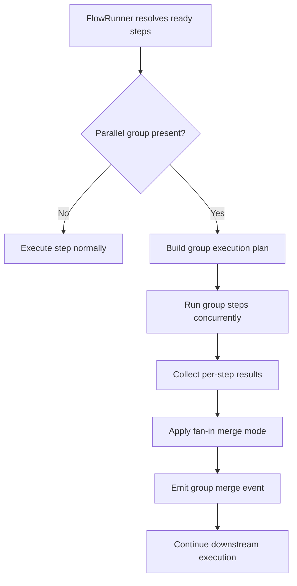

> [!TIP]
> This document is a specialized extension of the [root .copilot/ guidelines](../README.md).

## Status & Context

**Status**: 🚧 Planning
**Phase Dependencies**: Phase 64
**Risk Level**: M — extends scheduling semantics in `FlowRunner`, but can be introduced in a backward-compatible way.

## Executive Summary

- **The Problem**: ExaIx already resolves flows by dependency waves, but authors cannot explicitly declare logical parallel groups, merge behavior, or group-level observability. This makes collaborative review flows harder to author and less deterministic.
- **The Solution**: Add first-class `parallel` group declarations and fan-in merge semantics to the flow schema and execution engine.
- **The Goal**: Turn implicit concurrency into explicit, auditable, testable orchestration.

## Current State Analysis

### Key Files

| File                                           | Current Role                      | Gap                                                                  |
| ---------------------------------------------- | --------------------------------- | -------------------------------------------------------------------- |
| `src/flows/flow_runner.ts`                     | Executes dependency-ordered steps | No explicit group identity, merge strategy, or group-level reporting |
| `src/shared/schemas/flow.ts`                   | Flow YAML validation              | No parallel-group schema                                             |
| `src/services/flow/flow_checkpoint_service.ts` | Checkpoint resume                 | No group-aware checkpoint metadata                                   |
| `src/services/event_logger.ts`                 | Event stream                      | No group start/join/merge events                                     |

### Constraints

- Existing dependency-wave behavior must remain valid.
- Group execution must integrate cleanly with checkpointing and error recovery from Phase 63.
- Group semantics must be deterministic for merge ordering and reporting.

### Interfaces Affected

- `src/flows/flow_runner.ts:FlowRunner`
- `src/shared/schemas/flow.ts`
- `src/services/flow/flow_checkpoint_service.ts:FlowCheckpointService`

## Technical Architecture & Detailed Design

### Schemas

```ts
export const ZParallelMergeMode = z.enum(["all", "ordered", "concat", "manual"]);

export const ZFlowParallelConfig = z.object({
  group: z.string().min(1),
  mergeMode: ZParallelMergeMode.default("all"),
  order: z.array(z.string()).optional().describe("Optional explicit merge order for ordered fan-in"),
});

export const ZFlowFanInStep = z.object({
  dependsOn: z.array(z.string()).min(1),
  mergeFromGroups: z.array(z.string()).default([]),
  mergeMode: ZParallelMergeMode.default("all"),
});
```

### Interfaces

```ts
export interface IParallelExecutionGroup {
  groupId: string;
  stepIds: string[];
  mergeMode: "all" | "ordered" | "concat" | "manual";
  order?: string[];
}

export interface IParallelGroupResult {
  groupId: string;
  startedAt: string;
  completedAt: string;
  resultsByStepId: Record<string, IFlowStepResult>;
}
```

### Logic Flow



### Design Decisions

- **Explicit group metadata**: makes orchestration intent visible in YAML.
- **Deterministic merge**: avoids race-order ambiguity when combining outputs.
- **Compatibility with Phase 63**: retries, fallbacks, and checkpoints remain step-based, but group reporting is layered on top.
- **Namespace synergy**: group outputs can also write to the shared namespace introduced in Phase 64.

## Implementation Plan (Step-by-Step)

### Step 65.1: Schema & Validation Foundation

1. **Actions**

- Extend `src/shared/schemas/flow.ts` with `parallel` config and fan-in merge options.
- Add validation preventing illegal configurations such as mixed group IDs on mutually dependent steps.

1. **Architecture Notes**

- `parallel.group` should be optional.
- Validation should reject cyclic group merge definitions early.

1. **Planned Tests**

- `tests/flows/parallel_group_schema_test.ts`
- `tests/flows/parallel_group_validation_test.ts`

1. **Success Criteria**

- Valid grouped steps parse successfully.
- Invalid merge references fail validation with clear errors.
- Legacy flow YAML remains valid.

### Step 65.2: Scheduler Grouping in FlowRunner

1. **Actions**

- Update `src/flows/flow_runner.ts` to detect steps in the same ready wave that share a `parallel.group`.
- Execute grouped steps via `Promise.allSettled` to preserve per-step outcome visibility.

1. **Architecture Notes**

- Group execution should preserve existing lease/worktree safety guarantees.
- Group execution must not reorder steps across dependency boundaries.

1. **Planned Tests**

- `tests/flows/flow_runner_parallel_group_test.ts`
- `tests/integration/65_parallel_group_execution_test.ts`

1. **Success Criteria**

- Independent grouped steps execute concurrently.
- Non-grouped steps continue to execute under current semantics.
- Group execution emits `flow.parallel_group.started` and `flow.parallel_group.completed`.

### Step 65.3: Fan-In Merge Semantics

1. **Actions**

- Implement fan-in aggregation logic for `all`, `ordered`, and `concat` merge modes.
- Expose merged output as downstream step context in a dedicated `parallelGroupResults` field.

1. **Architecture Notes**

- `ordered` must use explicit order if provided, otherwise stable step ID sort.
- `manual` mode should skip automatic aggregation and expose raw per-step results only.

1. **Planned Tests**

- `tests/unit/services/parallel_group_merge_test.ts`
- `tests/integration/65_parallel_fanin_merge_test.ts`

1. **Success Criteria**

- Merged outputs are deterministic across runs.
- Downstream steps can consume both grouped aggregate data and raw step results.
- Merge failures are typed and journaled.

### Step 65.4: Checkpoint & Recovery Integration

1. **Actions**

- Update checkpoint serialization to capture grouped completion state.
- Ensure Phase 63 retry/fallback behavior remains step-scoped inside grouped execution.

1. **Architecture Notes**

- A partially completed group should resume only unfinished members.
- Group merge should re-run only when necessary after resume.

1. **Planned Tests**

- `tests/integration/services/parallel_group_checkpoint_test.ts`
- `tests/integration/services/parallel_group_recovery_test.ts`

1. **Success Criteria**

- Resumed flows do not re-run successful group members.
- Group-level reporting remains correct after resume.
- Failed group member recovery does not corrupt sibling results.

## Risks & Mitigations

| Risk                                              | Impact | Likelihood | Mitigation Strategy                                                     |
| ------------------------------------------------- | ------ | ---------: | ----------------------------------------------------------------------- |
| R1: Non-deterministic merge results               | High   |     Medium | Stable ordering rules and explicit merge modes                          |
| R2: Parallel group hides individual failures      | High   |        Low | Preserve per-step result objects and events                             |
| R3: Retry semantics become confusing              | Medium |     Medium | Keep retries step-scoped, not group-scoped, in v1                       |
| R4: Resource spikes from uncontrolled concurrency | Medium |     Medium | Limit concurrency to ready wave members already permitted by FlowRunner |

## Success Metrics (Quantitative)

- 100% deterministic fan-in output for repeated runs of the same test fixture.
- At least 30% wall-clock reduction on benchmark flows with two or more independent review steps.
- Zero regressions in legacy wave-based flow fixtures.
- 100% group lifecycle visibility in journal events for start, completion, and merge.

## Backward Compatibility

- Existing dependency-wave execution remains the baseline.
- `parallel` declarations are optional and additive.
- Merge behavior only activates when explicitly configured.
- Checkpoint schema changes must tolerate absence of group metadata from old checkpoints.
