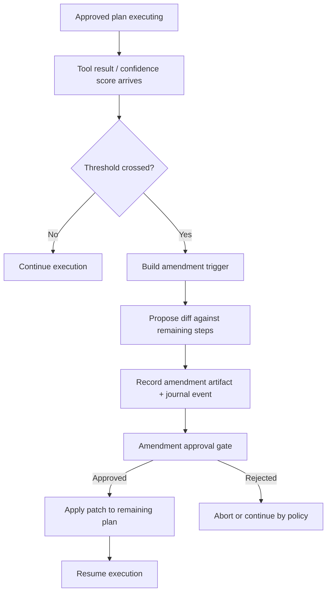

> [!TIP]
> This document is a specialized extension of the [root .copilot/ guidelines](../README.md).

## Status & Context

**Status**: 🚧 Planning
**Phase Dependencies**: Phase 61, Phase 62, Phase 63, Phase 64, Phase 65
**Risk Level**: H — introduces a new approval checkpoint inside execution and therefore affects plan lifecycle, execution continuity, and audit semantics.

## Executive Summary

- **The Problem**: ExaIx’s current plan model is strong on auditability but weak on bounded adaptability. Once execution begins, unexpected tool results or low-confidence outcomes cannot update remaining steps without falling back to full manual restart.
- **The Solution**: Introduce a Plan Amendment Gate that proposes a diff against the remaining approved plan, routes it through an explicit amendment approval checkpoint, and resumes execution only after a recorded decision.
- **The Goal**: Preserve ExaIx’s human-in-loop governance while adding mid-execution adaptability for real-world codebase surprises.

## Current State Analysis

### Key Files

| File | Current Role | Gap |
| ------------------------------------------------- | ------------------------- | --------------------------------------------- |
| `src/services/plan/plan_executor.ts` | Executes approved plans | No amendment lifecycle |
| `src/services/agent/agent_executor.ts` | Runs plan steps | No trigger path for plan amendment proposals |
| `src/services/utils/confidence_scorer.ts` | Scores output quality | No amendment threshold integration |
| `src/services/core/event_logger.ts` | Journals execution events | No amendment proposal / approval event family |
| `src/services/notification/notification.ts` | User-facing notifications | No amendment approval prompt path |

### Constraints

- Must not bypass the existing approval philosophy.
- Amendments should target only remaining steps, never silently rewrite already executed history.
- Amendment diffs must be human-readable and journaled.

### Interfaces Affected

- `src/services/plan/plan_executor.ts:PlanExecutor`
- `src/services/agent/agent_executor.ts:AgentExecutor`
- `src/services/utils/confidence_scorer.ts:ConfidenceScorer`
- `src/services/notification/notification.ts:NotificationService`
- `src/shared/types/notification.ts:IMemoryNotification` — extend `type` union: add `"amendment_pending" | "amendment_approved" | "amendment_rejected" | "amendment_expired"`; add corresponding color entries in `renderNotificationPanel`'s `messageColorByType` map.

## Technical Architecture & Detailed Design

### Schemas

```ts
export const ZPlanAmendmentTrigger = z.object({
  source: z.enum(["tool_error", "low_confidence", "context_mismatch", "manual_request"]),
  stepId: z.string(),
  reason: z.string().min(1),
  confidenceScore: z.number().min(0).max(100).optional(),
  toolName: z.string().optional(),
});

export const ZPlanAmendmentPatch = z.object({
  amendmentId: z.string().uuid(),
  planId: z.string().uuid(),
  affectedRemainingStepIds: z.array(z.string()).min(1),
  summary: z.string().min(1),
  adds: z.array(z.object({ number: z.number().int().min(1), title: z.string().min(1), content: z.string() })).default([]),
  updates: z.array(z.object({ number: z.number().int().min(1), title: z.string().min(1), content: z.string() })).default([]),
  removes: z.array(z.string()).default([]),
  createdAt: z.string().datetime(),
});

export const ZPlanAmendmentDecision = z.object({
  amendmentId: z.string().uuid(),
  decision: z.enum(["approved", "rejected", "expired"]),
  decidedAt: z.string().datetime(),
  decidedBy: z.string().min(1),
  rationale: z.string().optional(),
});
```

### Interfaces

```ts
export interface IPlanAmendmentService {
  shouldAmend(trigger: IPlanAmendmentTrigger): Promise<boolean>;
  proposeAmendment(input: {
    planId: string;
    remainingSteps: IPlanStep[];
    trigger: IPlanAmendmentTrigger;
    sharedContext?: Record<string, unknown>;
  }): Promise<IPlanAmendmentPatch>;
  applyApprovedAmendment(planId: string, patch: IPlanAmendmentPatch): Promise<void>;
}

export interface IAmendmentApprovalAdapter {
  requestDecision(patch: IPlanAmendmentPatch): Promise<IPlanAmendmentDecision>;
}
```

### Logic Flow



### Design Decisions

- **Diff-only scope**: amendment patches operate only on not-yet-run steps.
- **Separate approval adapter**: allows CLI, TUI, and later web UI to share the same amendment flow.
- **Threshold-driven, not always-on**: prevents noisy micro-replans.
- **Audit-preserving**: every proposal and decision becomes a first-class journal artifact.

## Implementation Plan (Step-by-Step)

### Step 66.1: Amendment Schema & Lifecycle Contracts

#### Actions

- [x] Add amendment schemas and types in `src/shared/schemas/plan_amendment.ts`.
- [x] Create `src/services/plan/plan_amendment_service.ts`.
- [x] Define an approval adapter contract for CLI/TUI integration.

#### Architecture Notes

- Keep the patch format intentionally narrow in v1.
- Avoid patching executed steps or changing original plan history in place.
- `amendmentId` and `planId` must be UUIDs (`z.string().uuid()`); always validate before any path construction (OWASP A1).

#### Planned Tests

- `tests/schemas/plan_amendment_schema_test.ts`
- `tests/unit/services/plan_amendment_service_contract_test.ts`

#### Success Criteria

- [x] All amendment schemas validate correctly.
- [x] Decision lifecycle supports approved, rejected, and expired outcomes.
- [x] Types compile with no `any`.

### Step 66.2: Trigger Detection in Execution Path

#### Actions

- Integrate amendment trigger detection into `src/services/agent/agent_executor.ts` and `src/services/plan/plan_executor.ts`.
- Use `ConfidenceScorer` thresholds and typed tool-failure categories as trigger sources.

#### Architecture Notes

- Trigger policy should be config-driven, not hardcoded.
- Low-confidence triggers should include the score and failed criterion summary.
- **Remaining steps computation (G4):** The amendment trigger receives the full `IPlanContext.steps` and the current step's number; remaining steps are computed as `context.steps.filter(s => s.number > currentStep.number)`. No change to `PlanExecutor`'s public API is required.
- **`ConfidenceScorer` injection (G5):** `ConfidenceScorer` is injected into `PlanExecutor` via `IPlanExecutorOptions` as optional `confidenceScorer?: ConfidenceScorer`. After each `agentExecutor.executeStep()` call, `PlanExecutor.executeSteps()` calls `this.options.confidenceScorer?.assessQuick(result.description)` and compares `score` against the config-driven `amendmentThreshold` (`config.amendment?.threshold ?? DEFAULT_AMENDMENT_THRESHOLD`). `AgentExecutor` itself is not modified.

#### Planned Tests

- `tests/integration/agent/plan_amendment_trigger_test.ts`
- `tests/unit/services/amendment_threshold_policy_test.ts`

#### Success Criteria

- Low-confidence and tool-error conditions can both trigger proposals.
- Non-qualifying failures do not create amendment artifacts.
- Trigger payloads are journaled consistently.

### Step 66.3: Amendment Diff Proposal & Approval Gate

#### Actions

- Implement proposal generation against remaining steps only.
- Add approval request path through `src/services/notification/notification.ts` and existing plan review surfaces.
- Persist amendment artifacts under execution-scoped storage.

#### Architecture Notes

- Proposed patch should include a concise human-readable summary plus exact structural diff.
- **Execution pause/resume (G2):** Execution pause is implemented as checkpoint-then-halt: when an amendment is proposed, `PlanExecutor` saves a checkpoint (Phase 63 semantics), writes the amendment artifact, emits `PLAN_AMENDMENT_EVENT_AWAITING_APPROVAL`, and throws `PlanAmendmentPendingError`. Payload for `PLAN_AMENDMENT_EVENT_AWAITING_APPROVAL`: `{ amendmentId: string; planId: string; triggerSource: string; affectedStepCount: number; createdAt: string }`. `ExecutionLoop` catches this, leaves the plan in `Workspace/Active/` with status `amendment_pending`, and exits. Resume: `exactl plan amendment approve <amendmentId>` applies the patch and re-queues the plan. Next `ExecutionLoop` invocation picks up from the checkpoint.
- **Amendment artifact storage (G6):** Amendment artifacts are stored at `Memory/Execution/{traceId}/amendments/{amendmentId}.json`. New constant `AMENDMENT_ARTIFACTS_DIR = 'amendments'` in `src/shared/constants.ts`. Path construction uses the same defensive join pattern as `FlowCheckpointService.getCheckpointPath()`.
- **LLM summary sanitization (G9):** The LLM-generated `summary` field must be sanitized before storage or display: strip YAML front-matter delimiters (`---`), null bytes (`\x00`), and limit to 500 characters. Reference the existing `sanitizePrompt()` pattern in `src/services/agent/agent_executor.ts` (OWASP A8).

#### Planned Tests

- `tests/integration/services/plan_amendment_approval_test.ts`
- `tests/functional/66_plan_amendment_pause_resume_test.ts`

#### Success Criteria

- Execution pauses while awaiting amendment decision.
- Approved amendments update only remaining steps.
- Rejected amendments leave original remaining steps intact.

### Step 66.4: Resume, Reporting, and Guardrails

#### Actions

- Resume execution from amended plan state when approved.
- Emit amendment lifecycle events and include amendment outcomes in mission/flow reports.
- Add expiry timeout for unattended amendment requests.

#### Architecture Notes

- Resume path must integrate with Phase 63 checkpointing.
- Expired amendments should produce deterministic policy behavior: abort by default in v1. Use `config.amendment?.expiryMs ?? DEFAULT_AMENDMENT_EXPIRY_MS`.
- **Amendment events (G14):**
  - `PLAN_AMENDMENT_EVENT_PROPOSED`: emitted in `proposeAmendment()` before approval gate; payload: `{ amendmentId, planId, stepId, triggerSource }`.
  - `PLAN_AMENDMENT_EVENT_APPROVED/REJECTED/EXPIRED`: payload: `{ amendmentId, planId, decidedBy, decidedAt }`.
  - `PLAN_AMENDMENT_EVENT_APPLIED`: emitted on successful resume; payload: `{ amendmentId, planId, appliedStepCount }`.

#### Planned Tests

- `tests/integration/services/plan_amendment_resume_test.ts`
- `tests/unit/services/mission_reporter_amendment_summary_test.ts`

#### Success Criteria

- Approved amendments resume cleanly from the paused point.
- Expired amendments never silently continue.
- Journal and reports show proposal, decision, and resume events.

## Risks & Mitigations

| Risk | Impact | Likelihood | Mitigation Strategy |
| ------------------------------------------- | ------ | ---------: | ------------------------------------------------------------------------- |
| R1: Amendment spam from noisy thresholds | High | Medium | Configurable threshold policy and minimum trigger severity |
| R2: Human approval fatigue | Medium | Medium | Require concise diffs and limit v1 to high-signal triggers |
| R3: Patch corrupts remaining plan structure | High | Low | Validate amended plan through existing plan schema before apply |
| R4: Pause/resume bugs strand executions | High | Medium | Reuse checkpointing semantics from Phase 63 and add explicit resume tests |

## Success Metrics (Quantitative)

- At least 90% of amendment proposals validate successfully on first generation in test fixtures.
- 100% of approved amendments affect only non-executed steps.
- Zero silent continuation after amendment trigger without a recorded decision.
- Reduced full-plan restart rate on amendment-enabled integration scenarios by at least 50%.

## Backward Compatibility

- Amendment support is disabled by default unless configured.
- Existing plan approval remains the required governance gate.
- Non-amendment executions follow the exact current lifecycle.
- Original approved plan history remains immutable; amendments are stored as linked artifacts rather than destructive rewrites.

---

## Pre-Gap Analysis — v1.0 → v1.2 (April 2026)

> Performed before implementation. All gaps resolved in-document.

### Gap Summary

| ID | Sev | Area | Resolution |
| --- | --------- | ------------------------------- | ------------------------------------------------------------------ |
| G1 | 🔴 Critical | All 5 Key File paths incorrect | Corrected to actual src paths; Interfaces Affected updated |
| G2 | 🔴 Critical | Pause/resume mechanism missing | Checkpoint-then-halt pattern documented in Step 66.3 Arch Notes |
| G3 | 🟡 Major | `z.unknown()` in adds/updates | Replaced with typed `IPlanStep`-shape object schema |
| G4 | 🟡 Major | `remainingSteps` source unclear | `context.steps.filter(s > current)` documented in Step 66.2 |
| G5 | 🟠 Moderate | `ConfidenceScorer` injection | Optional `confidenceScorer?` in `IPlanExecutorOptions` documented |
| G6 | 🟠 Moderate | Artifact storage path missing | `Memory/Execution/{traceId}/amendments/` + constant documented |
| G7 | 🟠 Moderate | `IMemoryNotification.type` gap | Amendment variants added to Interfaces Affected entry |
| G8 | 🔒 Security | UUID constraint missing (A1) | `z.string().uuid()` on amendmentId/planId; note in Step 66.1 |
| G9 | 🔒 Security | LLM summary unsanitized (A8) | Sanitization spec + `sanitizePrompt()` ref in Step 66.3 |
| G10 | 🔵 Style | `1. **Actions**` violates §F | All 4 steps reformatted to `#### Actions` H4 subsections |
| G11 | 🔵 Style | `## Usage` is AI meta-content | Section removed |

### Gap Details

## G1 🔴 — Key File Paths (all 5 wrong)

`src/services/confidence_scorer.ts`, `src/services/event_logger.ts`, and
`src/services/notification.ts`. Actual paths verified by search:
`src/services/plan/plan_executor.ts`, `src/services/agent/agent_executor.ts`,
`src/services/utils/confidence_scorer.ts`, `src/services/core/event_logger.ts`,
`src/services/notification/notification.ts`.

## G2 🔴 — Execution Pause/Resume Undefined

but gave no concrete mechanism. Resolved: checkpoint-then-halt semantics using Phase 63
`FlowCheckpointService` pattern; `PlanAmendmentPendingError` thrown; `ExecutionLoop` leaves
plan at `amendment_pending`; CLI `exactl plan amendment approve <id>` triggers resume.

## G3 🟡 — `z.array(z.unknown())` Type Erasure

objects. Replaced with `z.object({ number, title, content })` matching `IPlanStep` shape.

## G4 🟡 — `remainingSteps` Source Not Specified

computes them. Resolved: `context.steps.filter(s => s.number > currentStep.number)`.
No public API change to `PlanExecutor` needed.

## G5 🟠 — `ConfidenceScorer` Injection Path

of `AgentExecutor`. Resolved: inject as optional via `IPlanExecutorOptions.confidenceScorer?`;
called with `assessQuick(result.description)` after each step execution.

## G6 🟠 — Amendment Artifact Storage Path

New constant `AMENDMENT_ARTIFACTS_DIR = 'amendments'` in `src/shared/constants.ts`. Uses
the defensive join pattern from `FlowCheckpointService.getCheckpointPath()`.

## G7 🟠 — `IMemoryNotification.type` Not Extended

`messageColorByType` map. Amendment types would silently fall through. Resolved: Interfaces
Affected now specifies extending `type` with four amendment variants and adding color entries.

## G8 🔒 — No UUID Constraint on IDs (OWASP A1)

path construction. Resolved: `z.string().uuid()` on both fields in `ZPlanAmendmentPatch`
and `ZPlanAmendmentDecision`; architecture note added in Step 66.1.

## G9 🔒 — LLM `summary` Unsanitized (OWASP A8)

when persisted to YAML artifacts or shown in notifications. Resolved: strip `---`, `\x00`,
cap at 500 chars; reference `sanitizePrompt()` in Step 66.3 architecture note.

## G10 🔵 — Wrong Step Section Format (§F Violation)

mandates `#### Actions / #### Architecture Notes / #### Planned Tests / #### Success Criteria`.
All 4 steps (66.1–66.4) reformatted.

## G11 🔵 — AI Meta-Commentary in `## Usage`

the document. Not part of the standard planning doc format. Section removed.

## Pre-Implementation Actions

- [x] Verify `sanitizePrompt()` exists and is exported from `src/services/agent/agent_executor.ts`
- [x] Confirm `FlowCheckpointService.getCheckpointPath()` pattern for use in artifact storage
- [x] Add `AMENDMENT_ARTIFACTS_DIR` constant to `src/shared/constants.ts` before Step 66.3
- [x] Extend `IMemoryNotification` type union and `messageColorByType` map before Step 66.3
- [x] Ensure `IPlanExecutorOptions` interface is exported; add `confidenceScorer?` field in Step 66.2

---

## Phase 3c Review — Traceability & Configurability

> **Performed by:** GitHub Copilot
> **Workflow:** `#pre-gap-analysis` Phase 3c
> **Scope:** Event naming constants, payload typing, audit chain completeness, config schema declaration

### Phase 3c Gap Summary

| ID | Gap (short) | Severity | Checklist Item | In Tests? |
| --- | ------------------------------------------------------------------------------------------------------ | ------------------- | --------------------------- | --------- |
| G12 | 4 of 5 amendment lifecycle event names unspecified — only `plan.amendment.awaiting_approval` is named | 🔴 Traceability | Audit chain completeness | ❌ |
| G13 | Amendment event names are inline literals — no `PLAN_AMENDMENT_EVENT_*` constants in `constants.ts` | 🟡 Traceability | Event naming constants | ❌ |
| G14 | Amendment event payloads untyped — no field lists for any amendment event | 🟡 Traceability | Event payload typing | ❌ |
| G15 | `amendmentThreshold` not declared in any Zod config schema; enable/disable config key absent | 🟡 Configurability | Config schema declaration | ❌ |
| G16 | Amendment expiry timeout (Step 66.4) has no default constant and no config schema field | 🟡 Configurability | Config-driven vs. hardcoded | ❌ |

### Phase 3c Detailed Gap Entries

#### G12 — 🔴 Traceability: 4 of 5 amendment lifecycle event names unspecified

- **Checklist item:** Audit chain completeness
- **Location in plan:** Step 66.3 Architecture Notes — "emits `plan.amendment.awaiting_approval`"; Step 66.4 Actions — "Emit amendment lifecycle events"; Step 66.4 Success Criteria — "Journal and reports show proposal, decision, and resume events"
- **Problem:** The plan names exactly one event. The full amendment lifecycle introduces six state transitions requiring journal coverage:

| Transition | Expected event | Status |
| ---------------------------- | ----------------------------------------- | ---------- |
| Trigger threshold crossed | `plan.amendment.proposed` | ❌ unnamed |
| Proposal recorded, gate open | `plan.amendment.awaiting_approval` | ✅ named |
| Decision = approved | `plan.amendment.approved` | ❌ unnamed |
| Decision = rejected | `plan.amendment.rejected` | ❌ unnamed |
| TTL elapsed without decision | `plan.amendment.expired` | ❌ unnamed |
| Amended plan resumed | `plan.amendment.applied` | ❌ unnamed |

  Without canonical names, each implementer chooses arbitrary strings, creating an incoherent audit trail.

- **Impact:** The amendment governance model depends on journaled events for compliance and human review surfaces. Missing event names mean some transitions leave no searchable trace, breaking audit completeness — a critical failure for a human-in-loop governance feature.
- **To fix:** Name all five missing events in Architecture Notes and add them as constants (see Step 66.5 below).

---

#### G13 — 🟡 Traceability: Amendment event names are inline literals

- **Checklist item:** Event naming constants
- **Location in plan:** Step 66.3 Architecture Notes — `"plan.amendment.awaiting_approval"` as a quoted string
- **Problem:** Even the one named event appears as an inline string literal. The pre-gap G6 fix added `AMENDMENT_ARTIFACTS_DIR` to `src/shared/constants.ts`, but no event-name constants were included. The `FLOW_EVENT_*` constant pattern from other phases is not applied here.
- **Impact:** A rename of `plan.amendment.awaiting_approval` has no type-safety guard; the compiler cannot flag missed replacement sites.
- **To fix:** Add `PLAN_AMENDMENT_EVENT_*` constants to `src/shared/constants.ts` as part of Step 66.5.

---

#### G14 — 🟡 Traceability: Amendment event payloads untyped

- **Checklist item:** Event payload typing
- **Location in plan:** Step 66.3 Architecture Notes — no payload field list for any proposed/awaiting/approved events
- **Problem:** The plan emits `plan.amendment.awaiting_approval` when a proposal is created but never specifies the payload fields. `NotificationService` cannot display amendment info reliably without a known payload shape. Integration tests cannot assert payload correctness.
- **Impact:** Inconsistent payloads across caller sites make the amendment journal unreliable as a source of truth for approval workflows.
- **To fix:** Add payload field specifications to Step 66.3 and 66.4 Architecture Notes (see Step 66.5 below).

---

#### G15 — 🟡 Configurability: `amendmentThreshold` not declared in any Zod config schema

- **Checklist item:** Config schema declaration + Feature enable/disable path
- **Location in plan:** Step 66.2 Architecture Notes — "Trigger policy should be config-driven, not hardcoded" and "config-driven `amendmentThreshold`"
- **Problem:** No implementation step adds `amendmentThreshold` or an `amendment.enabled` flag to any Zod config schema in `src/config/` or `src/shared/schemas/config.ts`. The Backward Compatibility section states the feature is "disabled by default unless configured," but no config key is named and no schema default is provided.
- **Impact:** Feature flag and threshold are unvalidatable. A typo in the config key silently leaves the feature disabled or always-on with no feedback.
- **To fix:** Add an `amendment` sub-object to the Zod config schema with `enabled`, `threshold`, and `expiryMs` fields (see Step 66.6 below).

---

#### G16 — 🟡 Configurability: Amendment expiry timeout has no default constant

- **Checklist item:** Config-driven vs. hardcoded
- **Location in plan:** Step 66.4 Actions — "Add expiry timeout for unattended amendment requests"
- **Problem:** No default expiry duration is named anywhere. Implementers will use an arbitrary inline millisecond value with no constant name, no schema default, and no documented rationale.
- **Impact:** Tests asserting expiry behaviour must hard-code the same arbitrary value. A future change to the default forces manual updates across all copy-sites.
- **To fix:** Add `export const DEFAULT_AMENDMENT_EXPIRY_MS = 86_400_000;` (24 hours) to `src/shared/constants.ts` and reference it in the config schema default (see Step 66.6 below).

---

### Phase 3c Gap Remediation

#### Step 66.5 (G12, G13, G14): Name All Amendment Events and Add Constants

#### Actions

- [ ] `src/shared/constants.ts`: Add a `// Plan amendment event names (Phase 66)` block:

  ```typescript
  // Plan amendment event names (Phase 66)
  export const PLAN_AMENDMENT_EVENT_PROPOSED = "plan.amendment.proposed";
  export const PLAN_AMENDMENT_EVENT_AWAITING_APPROVAL = "plan.amendment.awaiting_approval";
  export const PLAN_AMENDMENT_EVENT_APPROVED = "plan.amendment.approved";
  export const PLAN_AMENDMENT_EVENT_REJECTED = "plan.amendment.rejected";
  export const PLAN_AMENDMENT_EVENT_EXPIRED = "plan.amendment.expired";
  export const PLAN_AMENDMENT_EVENT_APPLIED = "plan.amendment.applied";
  ```

- [ ] Step 66.3 Architecture Notes (this plan): Replace the inline `"plan.amendment.awaiting_approval"` with `PLAN_AMENDMENT_EVENT_AWAITING_APPROVAL`; add payload spec: `{ amendmentId: string; planId: string; triggerSource: string; affectedStepCount: number; createdAt: string }`.
- [ ] Step 66.4 Architecture Notes (this plan): Specify remaining events and payloads:
  - `PLAN_AMENDMENT_EVENT_PROPOSED`: emitted in `proposeAmendment()` before approval gate; payload: `{ amendmentId, planId, stepId, triggerSource }`.
  - `PLAN_AMENDMENT_EVENT_APPROVED/REJECTED/EXPIRED`: payload: `{ amendmentId, planId, decidedBy, decidedAt }`.
  - `PLAN_AMENDMENT_EVENT_APPLIED`: emitted on successful resume; payload: `{ amendmentId, planId, appliedStepCount }`.

#### Architecture Notes

All 6 constants in `src/shared/constants.ts` — not in `plan_amendment_service.ts` — so test files and `PlanExecutor` can reference them without circular imports. `PLAN_AMENDMENT_EVENT_APPLIED` aligns with existing `plan.approved` / `plan.rejected` naming in `PlanService`.

#### Planned Tests

- [ ] `tests/schemas/plan_amendment_schema_test.ts`: `"all 6 PLAN_AMENDMENT_EVENT_* constants have correct string values"` — imports and asserts each symbol.
- [ ] `tests/integration/services/plan_amendment_approval_test.ts`: `"approval emits PLAN_AMENDMENT_EVENT_APPROVED with amendmentId and decidedBy"` — payload assertion via `MockEventLogger`.
- [ ] `tests/integration/services/plan_amendment_approval_test.ts`: `"proposal emits PLAN_AMENDMENT_EVENT_PROPOSED before PLAN_AMENDMENT_EVENT_AWAITING_APPROVAL"` — event order assertion.

#### Success Criteria

- [ ] `src/shared/constants.ts` exports all 6 `PLAN_AMENDMENT_EVENT_*` symbols.
- [ ] No inline `"plan.amendment.*"` string literals remain in implementation files.
- [ ] Payload fields specified for all 6 events in plan architecture notes.
- [ ] Event order test passes: `PROPOSED` precedes `AWAITING_APPROVAL` in the event log.

---

#### Step 66.6 (G15, G16): Declare Amendment Config Schema and Default Constants

#### Actions

- [ ] `src/shared/constants.ts`: Add:

  ```typescript
  // Plan amendment config defaults (Phase 66)
  export const DEFAULT_AMENDMENT_EXPIRY_MS = 86_400_000; // 24 hours
  export const DEFAULT_AMENDMENT_THRESHOLD = 60;         // ConfidenceScorer 0-100
  ```

- [ ] `src/shared/schemas/config.ts` (or relevant Zod config file): Add optional `amendment` sub-object:

  ```typescript
  amendment: z.object({
    enabled: z.boolean().default(false),
    threshold: z.number().min(0).max(100).default(DEFAULT_AMENDMENT_THRESHOLD),
    expiryMs: z.number().int().positive().default(DEFAULT_AMENDMENT_EXPIRY_MS),
  }).optional(),
  ```

- [ ] Step 66.2 Architecture Notes (this plan): Replace "config-driven `amendmentThreshold`" with "`config.amendment?.threshold ?? DEFAULT_AMENDMENT_THRESHOLD`".
- [ ] Step 66.4 Architecture Notes (this plan): Replace "expiry timeout" with "`config.amendment?.expiryMs ?? DEFAULT_AMENDMENT_EXPIRY_MS`".

#### Architecture Notes

`amendment.enabled: false` by default satisfies the Backward Compatibility guarantee without code-path changes. All three fields use Zod `.default()` so omitting `[amendment]` in `exa.config.toml` is valid. `threshold: 60` aligns with the `ConfidenceScorer` 0–100 scale; teams can lower it in their config.

#### Planned Tests

- [ ] `tests/config/config_test.ts`: `"amendment feature defaults to disabled"` — `ConfigSchema.safeParse({})` has falsy `amendment?.enabled`.
- [ ] `tests/config/config_test.ts`: `"amendment threshold rejects values outside 0-100"` — `safeParse` fails for `-1` and `101`.
- [ ] `tests/config/config_test.ts`: `"amendment expiryMs rejects zero and negative values"` — `safeParse` fails for `0` and `-1`.

#### Success Criteria

- [ ] `DEFAULT_AMENDMENT_EXPIRY_MS` and `DEFAULT_AMENDMENT_THRESHOLD` exported from `src/shared/constants.ts`.
- [ ] `config.amendment?.enabled` is falsy when no `amendment` block is present.
- [ ] Invalid threshold and expiry values are rejected by the config schema.
- [ ] Amendment service returns early (no proposal created) when `config.amendment?.enabled !== true`.

### Step 66.7: CLI Command Suite for Amendment Management

#### Actions

- [ ] Implement `exoctl plan amendment list` to discover pending amendments across active traces.
- [ ] Implement `exoctl plan amendment show <amendmentId>` to fetch and display the structural JSON patch as a human-readable diff.
- [ ] Implement `exoctl plan amendment approve <amendmentId>` to apply the patch to the target plan and update status to `planned` for resumption.
- [ ] Implement `exoctl plan amendment reject <amendmentId> --reason <reason>` to mark the amendment as rejected and set the plan status to `failed` or `rejected`.

#### Architecture Notes

- CLI uses `PlanAmendmentAdapter` to interact with the service layer.
- Discovery logic scans `Workspace/Active` for plans with `amendment_id` frontmatter fields.
- Approval/Rejection triggers `PLAN_AMENDMENT_EVENT_APPROVED/REJECTED` and `PLAN_AMENDMENT_EVENT_APPLIED`.
- **Atomic Application**: Patch application must be atomic; any failure during `applyApprovedAmendment` should leave the plan file unchanged.

#### Planned Tests

- `tests/cli/exoctl_plan_amendment_test.ts`
- `tests/unit/cli/plan_amendment_actions_test.ts`

#### Success Criteria

- [ ] `exoctl plan amendment list` correctly identifies plans in `AMENDMENT_PENDING` state.
- [ ] `show` command displays the `summary` and structural changes clearly.
- [ ] `approve` command successfully updates the plan file on disk.
- [ ] `reject` command properly fails the plan and records the reason.

### Step 66.8: Documentation & Scenario-Based Validation

#### Actions

- [ ] Create `docs/user/plan-amendments.md` with operational guidelines, CLI usage examples, and configuration reference.
- [ ] Implement scenario `tests/scenario_framework/scenarios/plan_amendments/amendment_lifecycle.scenario.yaml`.
- [ ] Update `README.md` highlighting the new Replanning Safety Gate feature.

#### Architecture Notes

- Scenario test must use a `mock` provider that returns a "low confidence" result to trigger the amendment flow naturally.
- Documentation must explain the `amendment_id` and `amendment_proposed_at` frontmatter fields for power users.

#### Planned Tests

- `tests/scenario_framework/tests/plan_amendment_scenario_test.ts`

#### Success Criteria

- [ ] User documentation is comprehensive and verified for link integrity.
- [ ] E2E scenario test passes: Trigger -> Pause -> Approve -> Resume -> Completion.
- [ ] CLI help strings are consistent with the user guide.
