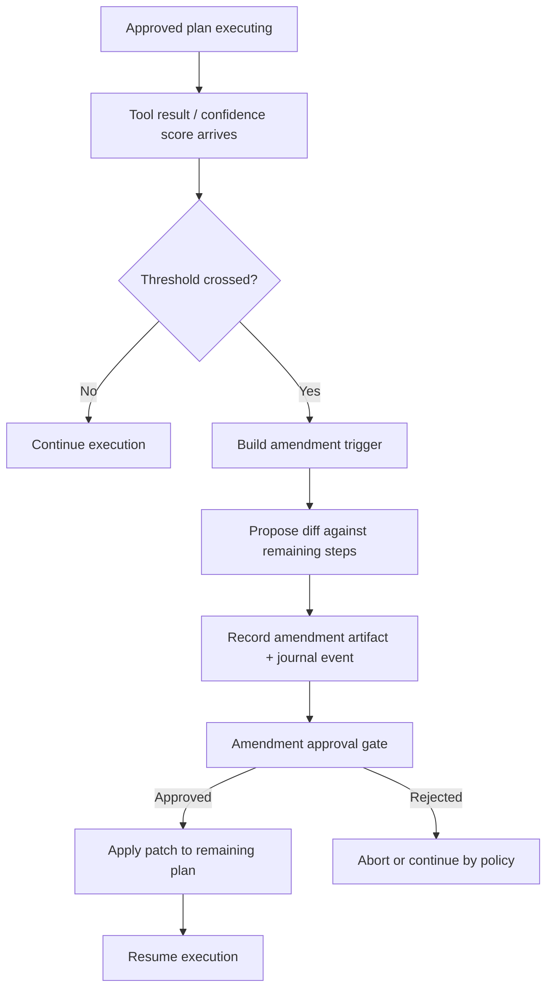

> [!TIP]
> This document is a specialized extension of the [root .copilot/ guidelines](../README.md).

## Status & Context

**Status**: 🚧 Planning
**Phase Dependencies**: Phase 61, Phase 62, Phase 63, Phase 64, Phase 65
**Risk Level**: H — introduces a new approval checkpoint inside execution and therefore affects plan lifecycle, execution continuity, and audit semantics.

## Executive Summary

- **The Problem**: ExaIx’s current plan model is strong on auditability but weak on bounded adaptability. Once execution begins, unexpected tool results or low-confidence outcomes cannot update remaining steps without falling back to full manual restart.
- **The Solution**: Introduce a Plan Amendment Gate that proposes a diff against the remaining approved plan, routes it through an explicit amendment approval checkpoint, and resumes execution only after a recorded decision.
- **The Goal**: Preserve ExaIx’s human-in-loop governance while adding mid-execution adaptability for real-world codebase surprises.

## Current State Analysis

### Key Files

| File                                | Current Role              | Gap                                           |
| ----------------------------------- | ------------------------- | --------------------------------------------- |
| `src/services/plan_executor.ts`     | Executes approved plans   | No amendment lifecycle                        |
| `src/services/agent_executor.ts`    | Runs plan steps           | No trigger path for plan amendment proposals  |
| `src/services/confidence_scorer.ts` | Scores output quality     | No amendment threshold integration            |
| `src/services/event_logger.ts`      | Journals execution events | No amendment proposal / approval event family |
| `src/services/notification.ts`      | User-facing notifications | No amendment approval prompt path             |

### Constraints

- Must not bypass the existing approval philosophy.
- Amendments should target only remaining steps, never silently rewrite already executed history.
- Amendment diffs must be human-readable and journaled.

### Interfaces Affected

- `src/services/plan_executor.ts:PlanExecutor`
- `src/services/agent_executor.ts:AgentExecutor`
- `src/services/confidence_scorer.ts:ConfidenceScorer`
- `src/services/notification.ts:NotificationService`

## Technical Architecture & Detailed Design

### Schemas

```ts
export const ZPlanAmendmentTrigger = z.object({
  source: z.enum(["tool_error", "low_confidence", "context_mismatch", "manual_request"]),
  stepId: z.string(),
  reason: z.string().min(1),
  confidenceScore: z.number().min(0).max(100).optional(),
  toolName: z.string().optional(),
});

export const ZPlanAmendmentPatch = z.object({
  amendmentId: z.string(),
  planId: z.string(),
  affectedRemainingStepIds: z.array(z.string()).min(1),
  summary: z.string().min(1),
  adds: z.array(z.unknown()).default([]),
  updates: z.array(z.unknown()).default([]),
  removes: z.array(z.string()).default([]),
  createdAt: z.string().datetime(),
});

export const ZPlanAmendmentDecision = z.object({
  amendmentId: z.string(),
  decision: z.enum(["approved", "rejected", "expired"]),
  decidedAt: z.string().datetime(),
  decidedBy: z.string().min(1),
  rationale: z.string().optional(),
});
```

### Interfaces

```ts
export interface IPlanAmendmentService {
  shouldAmend(trigger: IPlanAmendmentTrigger): Promise<boolean>;
  proposeAmendment(input: {
    planId: string;
    remainingSteps: IPlanStep[];
    trigger: IPlanAmendmentTrigger;
    sharedContext?: Record<string, unknown>;
  }): Promise<IPlanAmendmentPatch>;
  applyApprovedAmendment(planId: string, patch: IPlanAmendmentPatch): Promise<void>;
}

export interface IAmendmentApprovalAdapter {
  requestDecision(patch: IPlanAmendmentPatch): Promise<IPlanAmendmentDecision>;
}
```

### Logic Flow



### Design Decisions

- **Diff-only scope**: amendment patches operate only on not-yet-run steps.
- **Separate approval adapter**: allows CLI, TUI, and later web UI to share the same amendment flow.
- **Threshold-driven, not always-on**: prevents noisy micro-replans.
- **Audit-preserving**: every proposal and decision becomes a first-class journal artifact.

## Implementation Plan (Step-by-Step)

### Step 66.1: Amendment Schema & Lifecycle Contracts

1. **Actions**

- Add amendment schemas and types in `src/shared/schemas/plan_amendment.ts`.
- Create `src/services/plan/plan_amendment_service.ts`.
- Define an approval adapter contract for CLI/TUI integration.

1. **Architecture Notes**

- Keep the patch format intentionally narrow in v1.
- Avoid patching executed steps or changing original plan history in place.

1. **Planned Tests**

- `tests/schemas/plan_amendment_schema_test.ts`
- `tests/unit/services/plan_amendment_service_contract_test.ts`

1. **Success Criteria**

- All amendment schemas validate correctly.
- Decision lifecycle supports approved, rejected, and expired outcomes.
- Types compile with no `any`.

### Step 66.2: Trigger Detection in Execution Path

1. **Actions**

- Integrate amendment trigger detection into `src/services/agent_executor.ts` and `src/services/plan_executor.ts`.
- Use `ConfidenceScorer` thresholds and typed tool-failure categories as trigger sources.

1. **Architecture Notes**

- Trigger policy should be config-driven, not hardcoded.
- Low-confidence triggers should include the score and failed criterion summary.

1. **Planned Tests**

- `tests/integration/agent/plan_amendment_trigger_test.ts`
- `tests/unit/services/amendment_threshold_policy_test.ts`

1. **Success Criteria**

- Low-confidence and tool-error conditions can both trigger proposals.
- Non-qualifying failures do not create amendment artifacts.
- Trigger payloads are journaled consistently.

### Step 66.3: Amendment Diff Proposal & Approval Gate

1. **Actions**

- Implement proposal generation against remaining steps only.
- Add approval request path through `src/services/notification.ts` and existing plan review surfaces.
- Persist amendment artifacts under execution-scoped storage.

1. **Architecture Notes**

- Proposed patch should include a concise human-readable summary plus exact structural diff.
- Approval must pause the execution state until a decision is recorded.

1. **Planned Tests**

- `tests/integration/services/plan_amendment_approval_test.ts`
- `tests/functional/66_plan_amendment_pause_resume_test.ts`

1. **Success Criteria**

- Execution pauses while awaiting amendment decision.
- Approved amendments update only remaining steps.
- Rejected amendments leave original remaining steps intact.

### Step 66.4: Resume, Reporting, and Guardrails

1. **Actions**

- Resume execution from amended plan state when approved.
- Emit amendment lifecycle events and include amendment outcomes in mission/flow reports.
- Add expiry timeout for unattended amendment requests.

1. **Architecture Notes**

- Resume path must integrate with Phase 63 checkpointing.
- Expired amendments should produce deterministic policy behavior: abort by default in v1.

1. **Planned Tests**

- `tests/integration/services/plan_amendment_resume_test.ts`
- `tests/unit/services/mission_reporter_amendment_summary_test.ts`

1. **Success Criteria**

- Approved amendments resume cleanly from the paused point.
- Expired amendments never silently continue.
- Journal and reports show proposal, decision, and resume events.

## Risks & Mitigations

| Risk                                        | Impact | Likelihood | Mitigation Strategy                                                       |
| ------------------------------------------- | ------ | ---------: | ------------------------------------------------------------------------- |
| R1: Amendment spam from noisy thresholds    | High   |     Medium | Configurable threshold policy and minimum trigger severity                |
| R2: Human approval fatigue                  | Medium |     Medium | Require concise diffs and limit v1 to high-signal triggers                |
| R3: Patch corrupts remaining plan structure | High   |        Low | Validate amended plan through existing plan schema before apply           |
| R4: Pause/resume bugs strand executions     | High   |     Medium | Reuse checkpointing semantics from Phase 63 and add explicit resume tests |

## Success Metrics (Quantitative)

- At least 90% of amendment proposals validate successfully on first generation in test fixtures.
- 100% of approved amendments affect only non-executed steps.
- Zero silent continuation after amendment trigger without a recorded decision.
- Reduced full-plan restart rate on amendment-enabled integration scenarios by at least 50%.

## Backward Compatibility

- Amendment support is disabled by default unless configured.
- Existing plan approval remains the required governance gate.
- Non-amendment executions follow the exact current lifecycle.
- Original approved plan history remains immutable; amendments are stored as linked artifacts rather than destructive rewrites.

## Usage

You can paste these directly into the planning folder as new files. I used the README’s mandatory section order and kept the design style aligned with the recent architecture-heavy phases already present in the folder. [github](https://github.com/dostark/exaix/blob/main/.copilot/planning/README.md)
