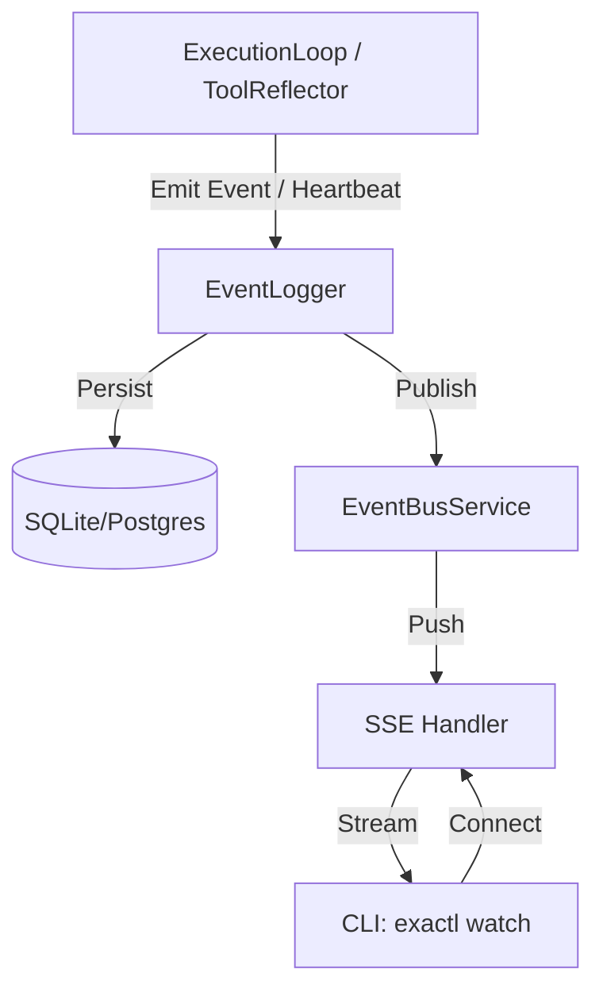

> [!TIP]
> This document is a specialized extension of the [root .copilot/ guidelines](../README.md).

## Status & Context

**Status**: 🚧 Planning
**Phase Dependencies**: Phase 61, Phase 63
**Risk Level**: M — introduces a local event bus and long-lived CLI connections, requiring careful resource cleanup and memory leak prevention.

## Executive Summary

- **The Problem**: Long-running flows and deep codebase analysis provide no real-time feedback. Users either wait for a timeout or completion, lacking visibility into mid-execution tool calls, ReflexiveAgent critique cycles, or stalls (Weakness 8).
- **The Solution**: Add an in-memory pub/sub Event Bus to `EventLogger`, emit an execution heartbeat from `ExecutionLoop`, and expose an SSE endpoint. Add `exactl watch <trace_id>` to tail live executions.
- **The Goal**: Provide instantaneous, `docker logs -f` style observability for the execution engine, enhancing UX and enabling future TUI/Web UI live-streaming.

## Current State Analysis

### Key Files

| File                             | Current Role                          | Gap                                         |
| -------------------------------- | ------------------------------------- | ------------------------------------------- |
| `src/services/event_logger.ts`   | Writes structured events to SQLite/DB | No pub/sub or live broadcast mechanism      |
| `src/services/execution_loop.ts` | Orchestrates the tool/agent loop      | No heartbeat emission during long LLM calls |
| `src/cli/main.ts`                | CLI entry point                       | Missing `watch` command for trace tailing   |

### Constraints

- The event bus must be non-blocking; slow subscribers must not impact the execution loop.
- Must cleanly degrade if no clients are listening.
- SSE connections must gracefully close when the trace completes or the daemon shuts down.

### Interfaces Affected

- `src/services/event_logger.ts:IEventLogger`
- `src/services/execution_loop.ts:ExecutionLoop`

## Technical Architecture & Detailed Design

### Schemas

```ts
export const ZStreamingEvent = z.object({
  eventId: z.string().uuid(),
  traceId: z.string(),
  timestamp: z.string().datetime(),
  type: z.enum(["agent.heartbeat", "tool.start", "tool.end", "llm.stream", "flow.status"]),
  payload: z.record(z.unknown()),
});

export type IStreamingEvent = z.infer<typeof ZStreamingEvent>;
```

### Interfaces

```ts
export interface IEventBusService {
  publish(event: IStreamingEvent): void;
  subscribe(traceId: string, callback: (event: IStreamingEvent) => void): () => void;
  close(): void;
}

export interface ISseServer {
  start(port: number): void;
  stop(): void;
}
```

### Logic Flow



### Design Decisions

- **In-Memory Pub/Sub**: We use a simple `EventEmitter` pattern locally since the daemon and executors run in the same process. No Redis/external broker required for Solo/Team.
- **Heartbeat Interval**: `ExecutionLoop` emits `agent.heartbeat` every 5 seconds during long LLM network wait times.
- **Backpressure**: EventBus will drop events for a specific subscriber if its queue exceeds 1000 events to prevent memory leaks.

## Implementation Plan (Step-by-Step)

### Step 67.1: Event Bus Foundation

1. **Actions**

- Create `src/services/observability/event_bus_service.ts`.
- Implement `publish`, `subscribe`, and clean cleanup logic.
- Update `src/services/event_logger.ts` to push events to the bus synchronously.

1. **Architecture Notes**

- Subscribers are mapped by `traceId`. A `*` wildcard can be used for daemon-wide monitoring.

1. **Planned Tests**

- `tests/unit/services/event_bus_service_test.ts`

1. **Success Criteria**

- Subscribers receive events matching their requested `traceId`.
- Unsubscribing successfully removes the listener and prevents memory leaks.

### Step 67.2: Execution Heartbeat

1. **Actions**

- Update `src/services/execution_loop.ts` to emit `agent.heartbeat` on a `setInterval` timer (5s) while waiting for `provider.generate()`.
- Ensure interval is cleared in `finally` blocks.

1. **Architecture Notes**

- Include current execution step and elapsed time in the heartbeat payload.

1. **Planned Tests**

- `tests/unit/services/execution_loop_heartbeat_test.ts`

1. **Success Criteria**

- Heartbeats are emitted exactly every 5 seconds during mocked long-running LLM calls.
- Timer is rigorously cleared on success, failure, and cancellation.

### Step 67.3: Local SSE Endpoint

1. **Actions**

- Create `src/api/sse_handler.ts`.
- Expose a local HTTP endpoint (e.g., `GET /api/v1/traces/:id/stream`) that bridges HTTP Server-Sent Events to `EventBusService.subscribe`.

1. **Architecture Notes**

- Handle client disconnects (`req.signal.addEventListener("abort")`) to trigger bus unsubscription.

1. **Planned Tests**

- `tests/integration/api/sse_handler_test.ts`

1. **Success Criteria**

- HTTP clients receive well-formatted `text/event-stream` payloads.
- Connections close cleanly without dangling listeners.

### Step 67.4: CLI Watch Command

1. **Actions**

- Create `src/cli/commands/watch.ts`.
- Implement `exactl watch <trace_id>` using Deno/Node native HTTP clients to read the SSE stream and pretty-print it to the terminal.

1. **Architecture Notes**

- Use color-coded output (e.g., dim gray for heartbeats, cyan for tools, white for LLM text).
- If the trace is already finished, fallback to querying the DB and printing historical events, then exit.

1. **Planned Tests**

- `tests/cli/watch_command_test.ts`

1. **Success Criteria**

- CLI successfully tails an active execution in real-time.
- Falls back gracefully for completed traces.

## Risks & Mitigations

| Risk                                          | Impact | Likelihood | Mitigation Strategy                                       |
| --------------------------------------------- | ------ | ---------: | --------------------------------------------------------- |
| R1: Memory leak from unclosed SSE connections | High   |     Medium | Strict `AbortController` bindings and connection timeouts |
| R2: Console spam during fast tool execution   | Low    |       High | Debounce or summarize rapid events in the CLI formatter   |

## Success Metrics (Quantitative)

- Sub-50ms latency from execution event emission to CLI terminal render.
- Zero memory leaks detected in long-running 1-hour soak tests with connecting/disconnecting clients.
- Heartbeats trigger reliably within 5.0s ± 100ms.

## Backward Compatibility

- No database schema changes required.
- Existing CLI commands remain unaffected.

---

## Pre-Gap Analysis — 2026-04-08

### Assessment: 3 critical path errors and 2 security gaps must be resolved before coding

> This section was added by pre-gap analysis on 2026-04-08. All gaps must be
> resolved and the plan updated before implementation of any affected step.

### Gap Summary

| ID | Gap (short) | Severity | Plan Section | Blocks Coding? |
| -- | ----------- | -------- | ------------ | -------------- |
| G1 | `src/services/event_logger.ts` wrong path — actual `src/services/core/event_logger.ts` | 🔴 Critical | Key Files / Step 67.1 | ✅ Yes |
| G2 | `src/services/execution_loop.ts` wrong path — actual `src/services/agent/execution_loop.ts` | 🔴 Critical | Key Files / Step 67.2 | ✅ Yes |
| G3 | `ExecutionLoop` never calls `provider.generate()` — heartbeat injection site is wrong | 🔴 Critical | Step 67.2 | ✅ Yes |
| G4 | `IEventBusService` injection into `EventLogger` not designed — `IEventLoggerConfig` has no `eventBus?` field | 🟡 Feasibility | Step 67.1 | ⚠️ Conditionally |
| G5 | Test paths use non-existent `tests/unit/services/` — project convention is `tests/services/` | 🟠 Testing | Steps 67.1, 67.2 | ❌ No |
| G6 | SSE `traceId` path param has no UUID validation; no localhost-only binding or auth boundary specified | 🔒 Security | Step 67.3 | ⚠️ Conditionally |
| G7 | 5 streaming event type strings are inline enum literals — no `STREAMING_EVENT_*` constants defined | 🟡 Traceability | Schemas | ❌ No |
| G8 | Heartbeat interval (5 s) and backpressure drop threshold (1000) are inline literals | 🟡 Configurability | Steps 67.2, Design Decisions | ❌ No |

### Detailed Gap Entries

#### G1 — 🔴 Critical: `src/services/event_logger.ts` wrong path

- **Location in plan:** Key Files table — "`src/services/event_logger.ts`"; Step 67.1 Actions — "Update `src/services/event_logger.ts`"
- **Problem:** The file does not exist at the stated path. The actual module is `src/services/core/event_logger.ts`. `IEventLogger` and `EventLogger` are exported from there.
- **Impact:** Every step targeting this file would create a rogue new file instead of extending the real one; compile errors would result at plan-execution time.
- **To fix:** Replace all plan references to `src/services/event_logger.ts` with `src/services/core/event_logger.ts`.

---

#### G2 — 🔴 Critical: `src/services/execution_loop.ts` wrong path

- **Location in plan:** Key Files table — "`src/services/execution_loop.ts`"; Step 67.2 Actions — "Update `src/services/execution_loop.ts`"
- **Problem:** The file does not exist at the stated path. The actual module is `src/services/agent/execution_loop.ts` (class `ExecutionLoop`).
- **Impact:** Step 67.2 would modify a non-existent file, creating a ghost module instead of updating the real execution loop.
- **To fix:** Replace all plan references to `src/services/execution_loop.ts` with `src/services/agent/execution_loop.ts`.

---

#### G3 — 🔴 Critical: Heartbeat injection site is wrong — `ExecutionLoop` never calls `provider.generate()`

- **Location in plan:** Step 67.2 Actions — "Update `src/services/execution_loop.ts` to emit `agent.heartbeat` on a `setInterval` timer (5s) while waiting for `provider.generate()`."
- **Problem:** `ExecutionLoop` (`src/services/agent/execution_loop.ts`) orchestrates file-based plan dispatch and delegates LLM calls via `AgentExecutor` → `ReActLoopStrategy`. The actual `provider.generate(prompt, ...)` call is in `ReActLoopStrategy.execute()` at `src/services/agent/strategies/react_loop_strategy.ts`. `ExecutionLoop` itself never directly awaits `provider.generate()`, so a `setInterval` there would never fire during real LLM waits.
- **Impact:** The heartbeat feature would silently not work — the timer wraps nothing that blocks on an LLM response.
- **To fix:** Move the heartbeat emission to `ReActLoopStrategy.execute()` — set a `setInterval` immediately before calling `await this.provider.generate(prompt, ...)` and clear it in the surrounding `try/finally` block. Update the plan to reference `src/services/agent/strategies/react_loop_strategy.ts` as the heartbeat emission site and update the planned test path accordingly.

---

#### G4 — 🟡 Feasibility: `IEventBusService` injection into `EventLogger` is not designed

- **Location in plan:** Step 67.1 Actions — "Update `src/services/event_logger.ts` to push events to the bus synchronously."
- **Problem:** `EventLogger`'s constructor takes `IEventLoggerConfig`, which has no `eventBus?` field. The plan does not specify whether the bus is injected via constructor, a setter, a module-level singleton, or `IApplicationContext`. `EventLogger` is instantiated in many places across the codebase.
- **Impact:** Without a specified injection design, every `new EventLogger(...)` call site becomes in-scope for this change, multiplying work significantly and risking silent failures in non-streaming paths.
- **To fix:** Add `eventBus?: IEventBusService` to `IEventLoggerConfig` (optional, defaults to no-op). Document that only callers wanting live streaming need to pass the bus instance.

---

#### G5 — 🟠 Testing: Test paths reference non-existent `tests/unit/services/` directory

- **Location in plan:** Step 67.1 Planned Tests — `tests/unit/services/event_bus_service_test.ts`; Step 67.2 — `tests/unit/services/execution_loop_heartbeat_test.ts`
- **Problem:** The project convention is `tests/services/` (e.g., `tests/services/event/event_logger_test.ts`, `tests/services/execution/execution_loop_test.ts`). There is no `tests/unit/` subtree in the codebase.
- **Impact:** Tests created at the wrong paths would not be discovered by `deno test` default globs and would not contribute to CI coverage.
- **To fix:** Update planned test paths to `tests/services/observability/event_bus_service_test.ts` and `tests/services/agent/strategies/react_loop_strategy_heartbeat_test.ts`.

---

#### G6 — 🔒 Security: SSE `traceId` not validated; no localhost binding or auth boundary

- **Location in plan:** Step 67.3 Actions — `GET /api/v1/traces/:id/stream`; Step 67.4 — `exactl watch <trace_id>`
- **Problem:** (1) The `traceId` URL path parameter is read from HTTP input with no UUID validation — a crafted value could inject into bus subscription logic (OWASP A03 Injection). (2) No server binding address is specified; the plan does not restrict the SSE server to `127.0.0.1`, meaning it could accept remote connections by default. (3) No auth boundary is specified.
- **Impact:** Any process on the network could subscribe to another user's execution event stream, leaking sensitive LLM outputs and tool results.
- **To fix:** (1) Validate `traceId` against `z.string().uuid()` before forwarding to `EventBusService.subscribe()`. (2) Bind the listener to `127.0.0.1` only. (3) Add a negative test asserting a 400 response for non-UUID `traceId` inputs.

---

#### G7 — 🟡 Traceability: 5 streaming event type strings are inline enum literals

- **Location in plan:** Schemas — `z.enum(["agent.heartbeat", "tool.start", "tool.end", "llm.stream", "flow.status"])`
- **Problem:** The five event type strings exist only inside the Zod `z.enum([...])` literal. No `STREAMING_EVENT_*` constants are planned for `src/shared/constants.ts`. Code that emits or handles these events must re-hardcode the strings.
- **Impact:** A rename of any event type requires searching emitters, subscribers, and the schema with no compile-time guard.
- **To fix:** Define `STREAMING_EVENT_HEARTBEAT`, `STREAMING_EVENT_TOOL_START`, `STREAMING_EVENT_TOOL_END`, `STREAMING_EVENT_LLM_STREAM`, `STREAMING_EVENT_FLOW_STATUS` in `src/shared/constants.ts` and reference them in the `z.enum([...])` declaration.

---

#### G8 — 🟡 Configurability: Heartbeat interval and backpressure threshold are inline literals

- **Location in plan:** Design Decisions — "emits `agent.heartbeat` every 5 seconds"; "drop events… if its queue exceeds 1000 events"
- **Problem:** Both values appear only as prose literals. No constants (`EXECUTION_HEARTBEAT_INTERVAL_MS`, `EVENT_BUS_MAX_SUBSCRIBER_QUEUE`) are planned for `src/shared/constants.ts` or the config schema.
- **Impact:** Operators cannot tune the heartbeat rate or queue depth without modifying source; the values are not discoverable from tooling or config.
- **To fix:** Add `EXECUTION_HEARTBEAT_INTERVAL_MS = 5000` and `EVENT_BUS_MAX_SUBSCRIBER_QUEUE = 1000` to `src/shared/constants.ts` and reference them in Step 67.1/67.2 implementation.

---

## Pre-Implementation Actions

Resolve in order before writing any implementation code:

1. **(G1 + G2)** Update Key Files table, Interfaces Affected, and all step Action items: replace `src/services/event_logger.ts` → `src/services/core/event_logger.ts` and `src/services/execution_loop.ts` → `src/services/agent/execution_loop.ts`.
1. **(G3)** Amend Step 67.2 to target `ReActLoopStrategy.execute()` in `src/services/agent/strategies/react_loop_strategy.ts` as the heartbeat emission site; update planned test path to `tests/services/agent/strategies/react_loop_strategy_heartbeat_test.ts`.
1. **(G4)** Add `eventBus?: IEventBusService` to `IEventLoggerConfig` before Step 67.1 implementation; document no-op default.
1. **(G6)** Add to Step 67.3 Architecture Notes: UUID validation on `traceId`, `127.0.0.1` binding, and a negative-test requirement for 400 response on invalid `traceId`.
1. **(G5)** Fix all Planned Tests paths to follow `tests/services/` convention.
1. **(G7 + G8)** Add a pre-step (Step 67.0) committing `STREAMING_EVENT_*`, `EXECUTION_HEARTBEAT_INTERVAL_MS`, and `EVENT_BUS_MAX_SUBSCRIBER_QUEUE` to `src/shared/constants.ts` before any other step.
