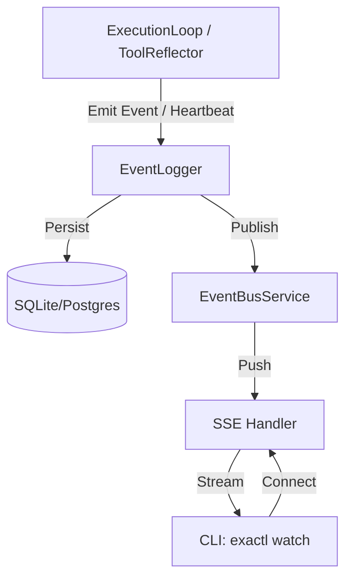

> [!TIP]
> This document is a specialized extension of the [root .copilot/ guidelines](../README.md).

## Status & Context

**Status**: 🚧 Planning
**Phase Dependencies**: Phase 61, Phase 63
**Risk Level**: M — introduces a local event bus and long-lived CLI connections, requiring careful resource cleanup and memory leak prevention.

## Executive Summary

- **The Problem**: Long-running flows and deep codebase analysis provide no real-time feedback. Users either wait for a timeout or completion, lacking visibility into mid-execution tool calls, ReflexiveAgent critique cycles, or stalls (Weakness 8).
- **The Solution**: Add an in-memory pub/sub Event Bus to `EventLogger`, emit an execution heartbeat from `ExecutionLoop`, and expose an SSE endpoint. Add `exactl watch <trace_id>` to tail live executions.
- **The Goal**: Provide instantaneous, `docker logs -f` style observability for the execution engine, enhancing UX and enabling future TUI/Web UI live-streaming.

## Current State Analysis

### Key Files

| File                             | Current Role                          | Gap                                         |
| -------------------------------- | ------------------------------------- | ------------------------------------------- |
| `src/services/event_logger.ts`   | Writes structured events to SQLite/DB | No pub/sub or live broadcast mechanism      |
| `src/services/execution_loop.ts` | Orchestrates the tool/agent loop      | No heartbeat emission during long LLM calls |
| `src/cli/main.ts`                | CLI entry point                       | Missing `watch` command for trace tailing   |

### Constraints

- The event bus must be non-blocking; slow subscribers must not impact the execution loop.
- Must cleanly degrade if no clients are listening.
- SSE connections must gracefully close when the trace completes or the daemon shuts down.

### Interfaces Affected

- `src/services/event_logger.ts:IEventLogger`
- `src/services/execution_loop.ts:ExecutionLoop`

## Technical Architecture & Detailed Design

### Schemas

```ts
export const ZStreamingEvent = z.object({
  eventId: z.string().uuid(),
  traceId: z.string(),
  timestamp: z.string().datetime(),
  type: z.enum(["agent.heartbeat", "tool.start", "tool.end", "llm.stream", "flow.status"]),
  payload: z.record(z.unknown()),
});

export type IStreamingEvent = z.infer<typeof ZStreamingEvent>;
```

### Interfaces

```ts
export interface IEventBusService {
  publish(event: IStreamingEvent): void;
  subscribe(traceId: string, callback: (event: IStreamingEvent) => void): () => void;
  close(): void;
}

export interface ISseServer {
  start(port: number): void;
  stop(): void;
}
```

### Logic Flow



### Design Decisions

- **In-Memory Pub/Sub**: We use a simple `EventEmitter` pattern locally since the daemon and executors run in the same process. No Redis/external broker required for Solo/Team.
- **Heartbeat Interval**: `ExecutionLoop` emits `agent.heartbeat` every 5 seconds during long LLM network wait times.
- **Backpressure**: EventBus will drop events for a specific subscriber if its queue exceeds 1000 events to prevent memory leaks.

## Implementation Plan (Step-by-Step)

### Step 67.1: Event Bus Foundation

1. **Actions**

- Create `src/services/observability/event_bus_service.ts`.
- Implement `publish`, `subscribe`, and clean cleanup logic.
- Update `src/services/event_logger.ts` to push events to the bus synchronously.

1. **Architecture Notes**

- Subscribers are mapped by `traceId`. A `*` wildcard can be used for daemon-wide monitoring.

1. **Planned Tests**

- `tests/unit/services/event_bus_service_test.ts`

1. **Success Criteria**

- Subscribers receive events matching their requested `traceId`.
- Unsubscribing successfully removes the listener and prevents memory leaks.

### Step 67.2: Execution Heartbeat

1. **Actions**

- Update `src/services/execution_loop.ts` to emit `agent.heartbeat` on a `setInterval` timer (5s) while waiting for `provider.generate()`.
- Ensure interval is cleared in `finally` blocks.

1. **Architecture Notes**

- Include current execution step and elapsed time in the heartbeat payload.

1. **Planned Tests**

- `tests/unit/services/execution_loop_heartbeat_test.ts`

1. **Success Criteria**

- Heartbeats are emitted exactly every 5 seconds during mocked long-running LLM calls.
- Timer is rigorously cleared on success, failure, and cancellation.

### Step 67.3: Local SSE Endpoint

1. **Actions**

- Create `src/api/sse_handler.ts`.
- Expose a local HTTP endpoint (e.g., `GET /api/v1/traces/:id/stream`) that bridges HTTP Server-Sent Events to `EventBusService.subscribe`.

1. **Architecture Notes**

- Handle client disconnects (`req.signal.addEventListener("abort")`) to trigger bus unsubscription.

1. **Planned Tests**

- `tests/integration/api/sse_handler_test.ts`

1. **Success Criteria**

- HTTP clients receive well-formatted `text/event-stream` payloads.
- Connections close cleanly without dangling listeners.

### Step 67.4: CLI Watch Command

1. **Actions**

- Create `src/cli/commands/watch.ts`.
- Implement `exactl watch <trace_id>` using Deno/Node native HTTP clients to read the SSE stream and pretty-print it to the terminal.

1. **Architecture Notes**

- Use color-coded output (e.g., dim gray for heartbeats, cyan for tools, white for LLM text).
- If the trace is already finished, fallback to querying the DB and printing historical events, then exit.

1. **Planned Tests**

- `tests/cli/watch_command_test.ts`

1. **Success Criteria**

- CLI successfully tails an active execution in real-time.
- Falls back gracefully for completed traces.

## Risks & Mitigations

| Risk                                          | Impact | Likelihood | Mitigation Strategy                                       |
| --------------------------------------------- | ------ | ---------: | --------------------------------------------------------- |
| R1: Memory leak from unclosed SSE connections | High   |     Medium | Strict `AbortController` bindings and connection timeouts |
| R2: Console spam during fast tool execution   | Low    |       High | Debounce or summarize rapid events in the CLI formatter   |

## Success Metrics (Quantitative)

- Sub-50ms latency from execution event emission to CLI terminal render.
- Zero memory leaks detected in long-running 1-hour soak tests with connecting/disconnecting clients.
- Heartbeats trigger reliably within 5.0s ± 100ms.

## Backward Compatibility

- No database schema changes required.
- Existing CLI commands remain unaffected.
