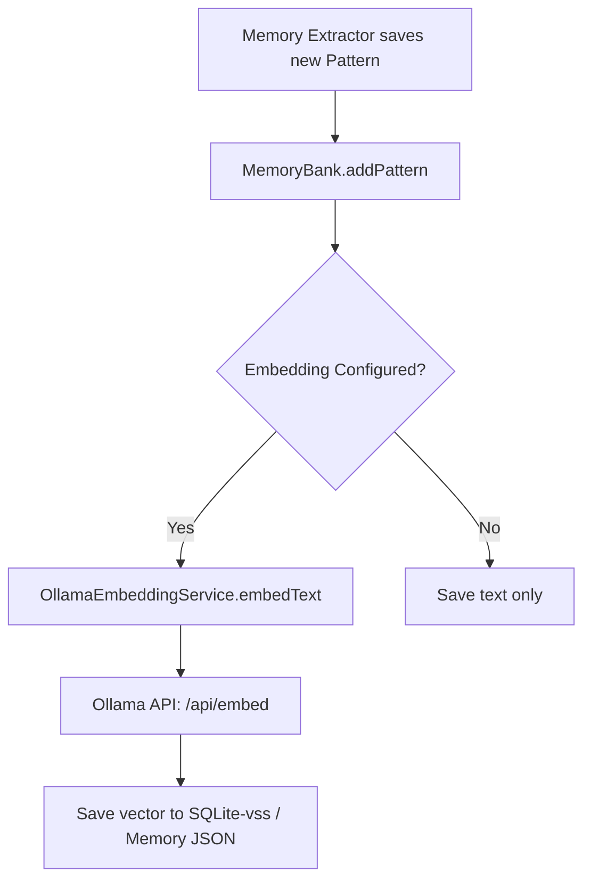

> [!TIP]
> This document is a specialized extension of the [root .copilot/ guidelines](../README.md).

## Status & Context

**Status**: 🚧 Planning
**Phase Dependencies**: None
**Risk Level**: L — plugs into an existing `IMemoryEmbeddingService` interface.

## Executive Summary

- **The Problem**: In the Solo edition, `MemoryBank` falls back to frequency-based keyword scoring (TF-IDF) because vector embeddings are gated to Team+ (Weakness 1). As memory grows, keyword search produces noisy, irrelevant context, degrading agent performance.
- **The Solution**: Wire `nomic-embed-text` (or similar) through the local Ollama provider to implement a zero-cost `IMemoryEmbeddingService` for the Solo tier.
- **The Goal**: Provide high-quality semantic memory matching for all editions, utilizing existing local LLM infrastructure.

## Current State Analysis

### Key Files

| File                               | Current Role                      | Gap                                                          |
| ---------------------------------- | --------------------------------- | ------------------------------------------------------------ |
| `src/services/memory_embedding.ts` | Defines `IMemoryEmbeddingService` | Lacks local Ollama implementation                            |
| `src/services/memory_bank.ts`      | Searches memory                   | Relies on keyword frequency if no embedding service is bound |
| `src/config/exa.config.toml`       | System config                     | Lacks `[memory.embedding]` provider definitions              |

### Constraints

- Must fail gracefully if Ollama is offline or the embedding model is not pulled.
- Must chunk large documents before embedding to respect the `nomic-embed-text` context limit (usually 8192 tokens).

### Interfaces Affected

- `src/services/memory_embedding.ts:IMemoryEmbeddingService`
- `src/services/providers/ollama_provider.ts`

## Technical Architecture & Detailed Design

### Schemas

```ts
export const ZOllamaEmbeddingConfig = z.object({
  provider: z.literal("ollama"),
  model: z.string().default("nomic-embed-text"),
  baseUrl: z.string().url().default("http://127.0.0.1:11434"),
  chunkSize: z.number().int().default(1000),
});
```

### Interfaces

```ts
export interface IOllamaClient {
  // Existing generation methods...
  generateEmbeddings(model: string, texts: string[]): Promise<number[][]>;
}

export class OllamaEmbeddingService implements IMemoryEmbeddingService {
  async embedText(text: string): Promise<number[]>;
  async embedBatch(texts: string[]): Promise<number[][]>;
  async calculateSimilarity(vecA: number[], vecB: number[]): Promise<number>;
}
```

### Logic Flow



### Design Decisions

- **Cosine Similarity**: We will implement standard cosine similarity math in TypeScript for the `calculateSimilarity` method, allowing purely local in-memory vector matching before SQLite-vss is introduced in Phase 78.
- **Auto-Pull**: If the model isn't found, the service should log a warning suggesting `ollama pull nomic-embed-text`, but gracefully fallback to keyword search.

## Implementation Plan (Step-by-Step)

### Step 68.1: Extend Ollama Provider

1. **Actions**

- Extend `src/services/providers/ollama_provider.ts` (or client equivalent) to hit the `/api/embed` endpoint.

1. **Architecture Notes**

- Handle batching if the texts array is large.

1. **Planned Tests**

- `tests/unit/services/providers/ollama_embedding_test.ts`

1. **Success Criteria**

- Provider successfully returns `number[][]` for input texts.

### Step 68.2: Implement Embedding Service

1. **Actions**

- Create `src/services/memory/ollama_embedding_service.ts` implementing `IMemoryEmbeddingService`.
- Implement `calculateSimilarity` using a highly optimized cosine similarity math function.

1. **Architecture Notes**

- Add caching for duplicate strings to save API calls.

1. **Planned Tests**

- `tests/unit/services/memory/ollama_embedding_service_test.ts`
- `tests/unit/utils/cosine_similarity_test.ts`

1. **Success Criteria**

- Embeddings are generated correctly.
- Similarity scores correlate highly with semantic similarity.

### Step 68.3: MemoryBank Integration

1. **Actions**

- Update `src/services/memory_bank.ts` and `exa.config.toml` binding.
- When `memoryBank.searchMemory()` is called, embed the query and calculate cosine similarity against stored patterns/decisions.

1. **Architecture Notes**

- If an embedding call fails, catch the error, log a warning, and fall back to the existing `calculateRelevance` TF-IDF logic seamlessly.

1. **Planned Tests**

- `tests/integration/services/memory_bank_semantic_search_test.ts`

1. **Success Criteria**

- Semantic search surfaces conceptually relevant memories that share no exact keywords.
- Graceful degradation works when Ollama is stopped.

## Risks & Mitigations

| Risk                                           | Impact | Likelihood | Mitigation Strategy                                                                                   |
| ---------------------------------------------- | ------ | ---------: | ----------------------------------------------------------------------------------------------------- |
| R1: Ollama API latency blocks memory retrieval | Medium |     Medium | Set strict timeouts (e.g., 2000ms) on embedding calls; fallback to keywords if exceeded               |
| R2: Memory bank JSON bloats with vectors       | High   |       High | Store vectors in a separate `.embeddings.json` adjacent to the memory file until SQLite-vss migration |

## Success Metrics (Quantitative)

- Semantic search precision (Top-3 retrieval) on test fixtures increases from baseline TF-IDF.
- Embedding generation latency is < 150ms per query.
- Zero crashes if Ollama daemon is absent.

## Backward Compatibility

- Fully transparent. Existing memory banks without vectors will trigger asynchronous backfilling or gracefully rely on keyword search until embedded.
