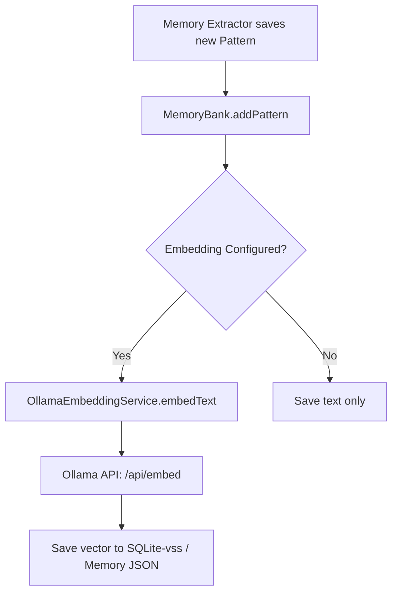

> [!TIP]
> This document is a specialized extension of the [root .copilot/ guidelines](../README.md).

## Status & Context

**Status**: 🚧 Planning
**Phase Dependencies**: None
**Risk Level**: L — plugs into an existing `IMemoryEmbeddingService` interface.

## Executive Summary

- **The Problem**: In the Solo edition, `MemoryBank` falls back to frequency-based keyword scoring (TF-IDF) because vector embeddings are gated to Team+ (Weakness 1). As memory grows, keyword search produces noisy, irrelevant context, degrading agent performance.
- **The Solution**: Wire `nomic-embed-text` (or similar) through the local Ollama provider to implement a zero-cost `IMemoryEmbeddingService` for the Solo tier.
- **The Goal**: Provide high-quality semantic memory matching for all editions, utilizing existing local LLM infrastructure.

## Current State Analysis

### Key Files

| File                               | Current Role                      | Gap                                                          |
| ---------------------------------- | --------------------------------- | ------------------------------------------------------------ |
| `src/services/memory_embedding.ts` | Defines `IMemoryEmbeddingService` | Lacks local Ollama implementation                            |
| `src/services/memory_bank.ts`      | Searches memory                   | Relies on keyword frequency if no embedding service is bound |
| `src/config/exa.config.toml`       | System config                     | Lacks `[memory.embedding]` provider definitions              |

### Constraints

- Must fail gracefully if Ollama is offline or the embedding model is not pulled.
- Must chunk large documents before embedding to respect the `nomic-embed-text` context limit (usually 8192 tokens).

### Interfaces Affected

- `src/services/memory_embedding.ts:IMemoryEmbeddingService`
- `src/services/providers/ollama_provider.ts`

## Technical Architecture & Detailed Design

### Schemas

```ts
export const ZOllamaEmbeddingConfig = z.object({
  provider: z.literal("ollama"),
  model: z.string().default("nomic-embed-text"),
  baseUrl: z.string().url().default("http://127.0.0.1:11434"),
  chunkSize: z.number().int().default(1000),
});
```

### Interfaces

```ts
export interface IOllamaClient {
  // Existing generation methods...
  generateEmbeddings(model: string, texts: string[]): Promise<number[][]>;
}

export class OllamaEmbeddingService implements IMemoryEmbeddingService {
  async embedText(text: string): Promise<number[]>;
  async embedBatch(texts: string[]): Promise<number[][]>;
  async calculateSimilarity(vecA: number[], vecB: number[]): Promise<number>;
}
```

### Logic Flow



### Design Decisions

- **Cosine Similarity**: We will implement standard cosine similarity math in TypeScript for the `calculateSimilarity` method, allowing purely local in-memory vector matching before SQLite-vss is introduced in Phase 78.
- **Auto-Pull**: If the model isn't found, the service should log a warning suggesting `ollama pull nomic-embed-text`, but gracefully fallback to keyword search.

## Implementation Plan (Step-by-Step)

### Step 68.1: Extend Ollama Provider

1. **Actions**

- Extend `src/services/providers/ollama_provider.ts` (or client equivalent) to hit the `/api/embed` endpoint.

1. **Architecture Notes**

- Handle batching if the texts array is large.

1. **Planned Tests**

- `tests/unit/services/providers/ollama*embedding*test.ts`

1. **Success Criteria**

- Provider successfully returns `number[][]` for input texts.

### Step 68.2: Implement Embedding Service

1. **Actions**

- Create `src/services/memory/ollama*embedding*service.ts` implementing `IMemoryEmbeddingService`.
- Implement `calculateSimilarity` using a highly optimized cosine similarity math function.

1. **Architecture Notes**

- Add caching for duplicate strings to save API calls.

1. **Planned Tests**

- `tests/unit/services/memory/ollama*embedding*service_test.ts`
- `tests/unit/utils/cosine*similarity*test.ts`

1. **Success Criteria**

- Embeddings are generated correctly.
- Similarity scores correlate highly with semantic similarity.

### Step 68.3: MemoryBank Integration

1. **Actions**

- Update `src/services/memory_bank.ts` and `exa.config.toml` binding.
- When `memoryBank.searchMemory()` is called, embed the query and calculate cosine similarity against stored patterns/decisions.

1. **Architecture Notes**

- If an embedding call fails, catch the error, log a warning, and fall back to the existing `calculateRelevance` TF-IDF logic seamlessly.

1. **Planned Tests**

- `tests/integration/services/memory*bank*semantic*search*test.ts`

1. **Success Criteria**

- Semantic search surfaces conceptually relevant memories that share no exact keywords.
- Graceful degradation works when Ollama is stopped.

## Risks & Mitigations

| Risk                                           | Impact | Likelihood | Mitigation Strategy                                                                                   |
| ---------------------------------------------- | ------ | ---------: | ----------------------------------------------------------------------------------------------------- |
| R1: Ollama API latency blocks memory retrieval | Medium |     Medium | Set strict timeouts (e.g., 2000ms) on embedding calls; fallback to keywords if exceeded               |
| R2: Memory bank JSON bloats with vectors       | High   |       High | Store vectors in a separate `.embeddings.json` adjacent to the memory file until SQLite-vss migration |

## Success Metrics (Quantitative)

- Semantic search precision (Top-3 retrieval) on test fixtures increases from baseline TF-IDF.
- Embedding generation latency is < 150ms per query.
- Zero crashes if Ollama daemon is absent.

## Backward Compatibility

- Fully transparent. Existing memory banks without vectors will trigger asynchronous backfilling or gracefully rely on keyword search until embedded.

---

## Pre-Gap Analysis — 2026-04-08

### Assessment: 4 critical path/interface errors + 2 security gaps must be resolved before coding

> This section was added by pre-gap analysis on 2026-04-08. All gaps must be
> resolved and the plan updated before implementation of any affected step.

### Gap Summary

| ID | Gap (short) | Severity | Plan Section | Blocks Coding? |
| -- | ----------- | -------- | ------------ | -------------- |
| G1 | `src/services/memory*embedding.ts` wrong path — actual `src/services/memory/memory*embedding.ts` | 🔴 Critical | Key Files / Interfaces Affected | ✅ Yes |
| G2 | `src/services/memory*bank.ts` wrong path — actual `src/services/memory/memory*bank.ts` | 🔴 Critical | Key Files / Step 68.3 | ✅ Yes |
| G3 | `src/services/providers/ollama_provider.ts` doesn't exist — Ollama provider is `src/ai/providers.ts:OllamaProvider` | 🔴 Critical | Key Files / Interfaces Affected / Step 68.1 | ✅ Yes |
| G4 | `OllamaEmbeddingService` declares `embedText`, `embedBatch`, `calculateSimilarity` — none satisfy `IMemoryEmbeddingService` | 🔴 Critical | Technical Architecture / Interfaces | ✅ Yes |
| G5 | Logic Flow diagram shows `MemoryBank.addPattern` as embedding trigger — `addPattern` takes `IPattern`, not raw text | 🟡 Feasibility | Logic Flow | ⚠️ Conditionally |
| G6 | Cache design for duplicate strings is unspecified — no size bound or eviction policy | 🟡 Feasibility | Step 68.2 Architecture Notes | ❌ No |
| G7 | Ollama `/api/embed` response parsed without Zod schema — untyped external data | 🔒 Security | Step 68.1 | ⚠️ Conditionally |
| G8 | `baseUrl: z.string().url()` accepts any URL including external hosts — SSRF risk | 🔒 Security | Schemas | ⚠️ Conditionally |
| G9 | `tests/unit/utils/cosine*similarity*test.ts` duplicates existing `tests/services/memory/memory*embedding*test.ts` coverage | 🟠 Testing | Step 68.2 | ❌ No |
| G10 | `chunkSize` default `1000` is an inline literal — no `DEFAULT*OLLAMA*EMBED*CHUNK*SIZE` constant; `baseUrl` should reuse `DEFAULT*OLLAMA*BASE_URL` | 🟡 Configurability | Schemas | ❌ No |

### Detailed Gap Entries

#### G1 — 🔴 Critical: `src/services/memory_embedding.ts` wrong path

- **Location in plan:** Key Files table — "`src/services/memory*embedding.ts`"; Interfaces Affected — "`src/services/memory*embedding.ts:IMemoryEmbeddingService`"
- **Problem:** The file does not exist at the stated path. The actual module is `src/services/memory/memory*embedding.ts`. The canonical `IMemoryEmbeddingService` interface is at `src/shared/interfaces/i*memory*embedding*service.ts`.
- **Impact:** Any step importing from or modifying the stated path would create a rogue file instead of extending the real module.
- **To fix:** Replace all plan references to `src/services/memory*embedding.ts` with `src/services/memory/memory*embedding.ts`; update Interfaces Affected to reference `src/shared/interfaces/i*memory*embedding_service.ts:IMemoryEmbeddingService`.

---

#### G2 — 🔴 Critical: `src/services/memory_bank.ts` wrong path

- **Location in plan:** Key Files table — "`src/services/memory_bank.ts`"; Step 68.3 Actions
- **Problem:** The actual module is `src/services/memory/memory_bank.ts` (class `MemoryBankService`).
- **Impact:** Step 68.3 would create a new file at the wrong path rather than modifying `MemoryBankService.searchMemory()`.
- **To fix:** Replace all plan references to `src/services/memory*bank.ts` with `src/services/memory/memory*bank.ts`.

---

#### G3 — 🔴 Critical: `src/services/providers/ollama_provider.ts` does not exist

- **Location in plan:** Key Files table — "`src/services/providers/ollama*provider.ts`"; Interfaces Affected; Step 68.1 — "Extend `src/services/providers/ollama*provider.ts`"
- **Problem:** There is no file at this path. The Ollama generation provider lives at `src/ai/providers.ts:OllamaProvider`; a Llama/CodeLlama variant is at `src/ai/providers/llama*provider.ts:LlamaProvider`. Neither exposes an embedding endpoint. The `OllamaProviderFactory` at `src/ai/factories/ollama*factory.ts` wraps `OllamaProvider`.
- **Impact:** Step 68.1 would create a ghost file. The existing `OllamaProvider` would be left unmodified, and no embedding capability would be wired in.
- **To fix:** Update Step 68.1 to reference `src/ai/providers.ts:OllamaProvider` or a new dedicated `src/ai/providers/ollama*embedding*client.ts` as the `/api/embed` caller.

---

#### G4 — 🔴 Critical: `OllamaEmbeddingService` interface does not satisfy `IMemoryEmbeddingService`

- **Location in plan:** Technical Architecture / Interfaces — `OllamaEmbeddingService implements IMemoryEmbeddingService` with methods `embedText`, `embedBatch`, `calculateSimilarity`
- **Problem:** `IMemoryEmbeddingService` (at `src/shared/interfaces/i*memory*embedding_service.ts`) requires: `initializeManifest()`, `embedLearning(learning)`, `searchByEmbedding(query, opts?)`, `getEmbedding(id)`, `deleteEmbedding(id)`, `getStats()`. The plan's proposed interface exposes only `embedText`, `embedBatch`, and `calculateSimilarity` — none of which match the required contract. A class with only these three methods fails to compile as `implements IMemoryEmbeddingService`.
- **Impact:** Step 68.2 produces a TypeScript compile error from the first line.
- **To fix:** Rewrite the `OllamaEmbeddingService` interface in the plan to implement all six methods of `IMemoryEmbeddingService`. Use `embedText`/`embedBatch` as private internal helpers. Add `searchByEmbedding` that embeds the query via Ollama and computes cosine similarity against stored vectors.

---

#### G5 — 🟡 Feasibility: Logic Flow diagram shows wrong embedding trigger

- **Location in plan:** Logic Flow — `A[Memory Extractor saves new Pattern] --> B[MemoryBank.addPattern]`
- **Problem:** `MemoryBankService.addPattern()` takes an `IPattern` object (with `name`, `description`, `examples`, `tags`) — not raw text. Embedding is triggered via `embedLearning(ILearning)` in the existing architecture. The flow diagram conflates pattern storage with learning embedding, which are separate write paths.
- **Impact:** The proposed integration hook would produce a type mismatch and cannot be implemented as shown.
- **To fix:** Update the flow diagram to show `OllamaEmbeddingService.embedLearning(ILearning)` as the embedding trigger — called from `MemoryBankService.addGlobalLearning()` or a background indexer step. Remove `addPattern` from the embedding flow.

---

#### G6 — 🟡 Feasibility: Cache design is unspecified — unbounded cache is a memory leak

- **Location in plan:** Step 68.2 Architecture Notes — "Add caching for duplicate strings to save API calls."
- **Problem:** No cache structure (Map, LRU, etc.), size bound, or eviction policy is specified. An unbounded `Map<string, number[]>` grows indefinitely with unique inputs in a long-running daemon.
- **Impact:** Memory leak in production over time.
- **To fix:** Specify LRU cache with a constant `OLLAMA*EMBED*CACHE*MAX*ENTRIES = 512` in `src/shared/constants.ts`; add a cache-eviction boundary test to Step 68.2's test spec.

---

#### G7 — 🔒 Security: Ollama embedding response parsed without Zod validation

- **Location in plan:** Step 68.1 — calls Ollama `/api/embed` endpoint
- **Problem:** The plan does not specify Zod (or equivalent) validation of the HTTP response body before using the `embeddings` array. An error response from Ollama (e.g., `{"error":"model not found"}`) would be silently treated as a valid `number[][]`, producing `undefined`/`NaN` vectors. OWASP A08 (Software and Data Integrity Failures).
- **Impact:** Silent production of invalid embeddings propagated into `cosineSimilarity()`, causing `NaN` relevance scores and potentially crashing downstream consumers.
- **To fix:** Define `ZOllamaEmbedResponse = z.object({ embeddings: z.array(z.array(z.number())) })` and call `.parse()` on the raw response before using vectors. Add a negative test asserting a typed error is thrown when the mock returns an error payload.

---

#### G8 — 🔒 Security: `baseUrl` accepts any URL — Server-Side Request Forgery risk

- **Location in plan:** Schemas — `baseUrl: z.string().url().default("http://127.0.0.1:11434")`
- **Problem:** `z.string().url()` accepts any valid URL, including `https://internal-metadata-service/`, enabling a misconfigured or attacker-supplied `baseUrl` to redirect embedding calls to arbitrary internal services. OWASP A10 (SSRF).
- **Impact:** In shared/team deployments, a crafted `baseUrl` could exfiltrate embedding payloads to an external server or probe internal network services.
- **To fix:** Add a `z.refine()` check restricting `baseUrl` to `localhost` / `127.0.0.1` / `::1` hostnames, or validate the parsed URL hostname against that allowlist at service construction time. Document the restriction in Architecture Notes.

---

#### G9 — 🟠 Testing: `tests/unit/utils/cosine*similarity*test.ts` duplicates existing coverage and uses wrong path

- **Location in plan:** Step 68.2 Planned Tests — `tests/unit/utils/cosine*similarity*test.ts`
- **Problem:** `cosineSimilarity` is already exported from `src/services/memory/memory*embedding.ts` and comprehensively tested in `tests/services/memory/memory*embedding_test.ts` (identical/orthogonal/similar vectors, length-mismatch error). Additionally, `tests/unit/` does not exist in the project.
- **Impact:** Duplicated test effort; wrong path prevents CI discovery.
- **To fix:** Remove this planned test file. If the new `OllamaEmbeddingService` wraps `calculateSimilarity` in a new way, add those assertions to the already-planned `tests/services/memory/ollama*embedding*service_test.ts`.

---

#### G10 — 🟡 Configurability: `chunkSize` default is an inline literal; `baseUrl` should reuse existing constant

- **Location in plan:** Schemas — `chunkSize: z.number().int().default(1000)`, `baseUrl: z.string().url().default("http://127.0.0.1:11434")`
- **Problem:** The `chunkSize` default `1000` is an inline literal with no corresponding constant. The `baseUrl` default re-hardcodes the Ollama base URL when `DEFAULT*OLLAMA*BASE_URL` already exists in `src/shared/constants.ts`.
- **Impact:** Changing the Ollama endpoint default in `constants.ts` would not propagate to the embedding config schema.
- **To fix:** Add `DEFAULT*OLLAMA*EMBED*CHUNK*SIZE = 1000` to `src/shared/constants.ts` and use `DEFAULT*OLLAMA*BASE_URL` for the `baseUrl` default.

---

## Pre-Implementation Actions

Resolve in order before writing any implementation code:

1. **(G1 + G2 + G3)** Correct all file paths in Key Files, Interfaces Affected, and step Actions — use `src/services/memory/memory*embedding.ts`, `src/services/memory/memory*bank.ts`, and `src/ai/providers.ts:OllamaProvider` (or a new `src/ai/providers/ollama*embedding*client.ts`).
1. **(G4)** Rewrite the `OllamaEmbeddingService` interface in Technical Architecture to implement the full `IMemoryEmbeddingService` contract (`initializeManifest`, `embedLearning`, `searchByEmbedding`, `getEmbedding`, `deleteEmbedding`, `getStats`).
1. **(G5)** Correct the Logic Flow diagram — replace `MemoryBank.addPattern` with `OllamaEmbeddingService.embedLearning(ILearning)` as the embedding trigger.
1. **(G7)** Add `ZOllamaEmbedResponse` Zod schema and validate Ollama HTTP responses before use; add a negative test to Step 68.1 spec.
1. **(G8)** Add a `z.refine()` localhost-only validator on `baseUrl`; document in Architecture Notes.
1. **(G6)** Specify LRU cache with `OLLAMA*EMBED*CACHE*MAX*ENTRIES` constant before Step 68.2 implementation.
1. **(G9 + G10)** Remove duplicate test path; add `DEFAULT*OLLAMA*EMBED*CHUNK*SIZE` constant and reference `DEFAULT*OLLAMA*BASE_URL` in the schema.
