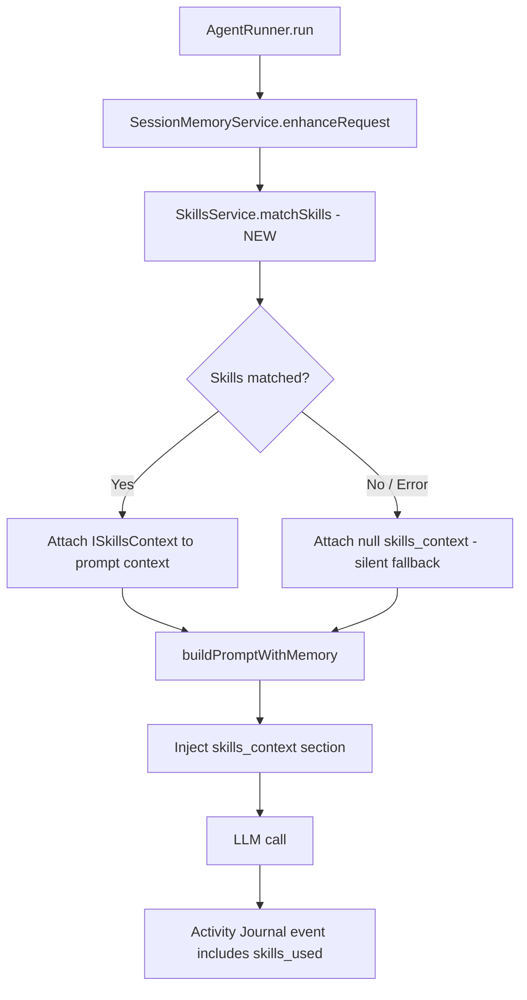

> [!TIP]
> This document is a specialized extension of the [root .copilot/ guidelines](../README.md).

## Status & Context

**Status**: ✅ Completed
**Phase Dependencies**: Phase 68
**Risk Level**: L — purely additive. `SkillsService` already exists and compiles;
this phase wires it into an already-established prompt construction call chain.

## Executive Summary

- **The Problem**: `SkillsService` is fully implemented but never called. Procedural
  knowledge (how to run tests in this codebase, how to handle merge conflicts, deployment
  steps) accumulates in `Skills/` but is never retrieved or injected into agent context
  (Weakness 4). This wastes an ExaIx differentiator that has no equivalent in Ruflo.
- **The Solution**: Call `SkillsService.matchSkills(request)` inside `AgentRunner` after
  `SessionMemoryService.enhanceRequest()` and inject the results as a `skills_context`
  section into the prompt template, parallel to `memoryContext`. Add `exactl skills
  list|show` commands for inspection and testing.
- **The Goal**: Make procedural memory a first-class contributor to every agent
  execution, closing the gap between its implemented state and its intended purpose.

## Current State Analysis

### Key Files

| File | Current Role | Gap |
| ------------------------------------------- | ---------------------------------------- | ------------------------------------------------------------ |
| `src/services/skills/skills.ts` | Full `SkillsService` implementation | `[skills]` config block not yet surfaced in `exa.config.toml` |
| `src/services/agent/agent_runner.ts` | Assembles agent prompt + context; `matchAndApplySkills()` already wired (Phase 17) | Config values not yet promoted to `exa.config.toml` |
| `src/services/memory/session_memory.ts` | Enhances request with declarative memory | Unrelated to skills injection (skills are injected independently) |
| `src/cli/exactl.ts` | CLI routing; Phase 17 already adds `exactl memory skill list/show` | Top-level `exactl skills` alias not yet present |

### Constraints

- Skill injection occurs in `AgentRunner.matchAndApplySkills()`, called directly from
  `AgentRunner.run()` before final prompt assembly, independently of `SessionMemoryService`
  (Phase 17 implementation; verified in `tests/agents/agent_runner_test.ts` lines 761–910).
- `maxSkillsPerRequest: 5` and `matchThreshold: 0.3` are already configured in
  `SkillsService`; this phase respects those values and makes them surfaced in
  `exa.config.toml` rather than hardcoded.
- If `SkillsService.matchSkills()` fails or returns empty, execution must continue
  without interruption.

### Interfaces Affected

- `src/services/agent/agent_runner.ts:AgentRunner`
- `src/services/skills/skills.ts:SkillsService`
- `src/shared/types/prompt_context.ts`
- `src/cli/exactl.ts`

## Technical Architecture & Detailed Design

### Schemas

```ts
// src/shared/types/prompt_context.ts — extend existing interface
export const ZSkillMatch = z.object({
  skillId: z.string().uuid(),
  title: z.string().min(1),
  description: z.string().min(1),
  content: z.string().min(1),
  matchScore: z.number().min(0).max(1),
  tags: z.array(z.string()).default([]),
});

export const ZSkillsContext = z.object({
  matched: z.array(ZSkillMatch),
  totalAvailable: z.number().int().min(0),
  retrievalLatencyMs: z.number().int().min(0),
});

export type ISkillsContext = z.infer<typeof ZSkillsContext>;
```

### Interfaces

```ts
// Extend prompt context
export interface IAgentPromptContext {
  systemPrompt: string;
  memoryContext: string | null;
  skillsContext: ISkillsContext | null; // NEW
  portalKnowledge: string | null;
  userRequest: string;
}

// Extend SkillsService (read-only inspection interface for CLI)
export interface ISkillsInspector {
  listSkills(portalPath: string): Promise<ISkillMeta[]>;
  showSkill(skillId: string): Promise<ISkillDetail>;
}
```

### Logic Flow



### Prompt Template Addition

## Procedural Knowledge

The following procedural skills are relevant to this request.
Apply them when they match the task at hand:

```md
{{#each skills_context.matched}}

### {{this.title}}

{{this.content}}
{{/each}}
```

The `skills_context` section is rendered **between** `memoryContext` and the user
request section to give it appropriate hierarchical weight in the model's attention.

### Config Extension

```toml
# exa.config.toml — promoted from hardcoded defaults
[skills]
max_per_request     = 5
match_threshold     = 0.30
inject_in_prompt    = true
log_matched_ids     = true
```

### Design Decisions

- **Parallel injection with memory**: skills go in their own template section to stay
  clearly separated from declarative memory (facts vs. procedures).
- **Fail-open**: a `SkillsService` error must never abort execution. Catch and log
  a `WARN` event; proceed with `skillsContext: null`.
- **Latency guard**: add a 500ms timeout on `matchSkills()`; if exceeded, fall back
  to null context and emit a `skills.retrieval_timeout` journal event.
- **Journal traceability**: include matched `skillId[]` in the `agent.prompt_assembled`
  journal event so usage can be analysed retroactively.

## Implementation Plan (Step-by-Step)

### Step 70.1: Schema & Config Promotion

1. **Actions**

   - [x] Add `ZSkillMatch` and `ZSkillsContext` types to `src/shared/types/prompt_context.ts`.
   - [x] Add `[skills]` section to `exa.config.toml` schema and reader.
   - [x] Validate config defaults with Zod in `src/config/config_loader.ts`.

1. **Architecture Notes**

   - Keep `ISkillsContext` distinct from `IMemoryContext` — they are parallel sections,
     not nested.

1. **Planned Tests**

   - `tests/shared/types/skills_context_schema_test.ts`
   - `tests/config/skills_config_defaults_test.ts`

1. **Success Criteria**

   - `ZSkillsContext` validates correctly with zero matches and with five matches.
   - Config loader exposes `skills.max_per_request` and `skills.match_threshold`.

---

### Step 70.2: AgentRunner Injection

1. **Actions**

   - [x] Verify `matchAndApplySkills()` in `src/services/agent/agent_runner.ts` has a 500ms timeout guard (fail-safe retrieval).
   - [x] Promote hardcoded `maxSkillsPerRequest` and `matchThreshold` in `matchAndApplySkills()` to use the new `skills` config block.
   - [x] Confirm `agent.prompt_assembled` journal event includes `skillIdsUsed: string[]`; add the field if missing.

1. **Architecture Notes**

   - `matchAndApplySkills()` is already invoked from `AgentRunner.run()` (Phase 17)
     independently of `SessionMemoryService`. No changes to the call chain are needed.
   - Skills injection is fail-open: a `SkillsService` error must never abort execution.

1. **Planned Tests**

   - `tests/agents/agent_runner_skills_injection_test.ts` (already present from Phase 17; extend if missing coverage)
   - `tests/agents/agent_runner_skills_timeout_fallback_test.ts`

1. **Success Criteria**

   - Skills section appears in generated prompt when matches are returned.
   - Skills section is absent when `matchSkills` returns empty or times out.
   - `agent.prompt_assembled` journal event contains `skillIdsUsed: []` field.

---

### Step 70.3: Prompt Rendering & Budget Awareness

1. **Actions**

   - [x] Add `renderSkillsSection(context: ISkillsContext): string` in
     `src/services/agent/prompt_formatter.ts`.
   - [x] Respect `PromptBudgetAllocator` (Phase 62) — skills budget is already allocated;
     truncate matched skills content to fit within the budget if Phase 62 is active.

1. **Architecture Notes**

   - Truncation order: trim lowest-score skill first.
   - Rendered section should include a trailing count line if any skills were truncated:
     `(N additional skills omitted due to context budget)`.

1. **Planned Tests**

   - `tests/services/prompt_context_skills_render_test.ts`
   - `tests/services/prompt_context_skills_truncation_test.ts`

1. **Success Criteria**

   - Rendered section is deterministic for identical input.
   - Truncation removes lowest-scoring skills first.
   - Truncation message appears only when trimming occurs.

---

### Step 70.4: CLI `exactl skills` Command Alias

1. **Actions**

   - [x] Verify `exactl memory skill list` and `exactl memory skill show` are functional in the active portal.
   - [x] Add a top-level `exactl skills` alias in `src/cli/exactl.ts` pointing to the existing `exactl memory skill` command group.

1. **Architecture Notes**

   - Implementation already lives in `src/cli/commands/memory_commands.ts`. Do not create a new CLI command file.

1. **Planned Tests**

   - `tests/cli/skills_command_alias_test.ts`

1. **Success Criteria**

   - `exactl skills list` works as an alias for `exactl memory skill list`.
   - `exactl skills show <id>` works as an alias for `exactl memory skill show <id>`.

---

### Step 70.5: Journal Integration & Observability

1. **Actions**

   - [x] Add `skills.match_completed` event to `EventLogger` schema with fields:
     `skillIds: string[]`, `matchCount: number`, `latencyMs: number`.
   - [x] Add `skills.retrieval_timeout` and `skills.retrieval_failed` warning events.

1. **Architecture Notes**

   - Keep journal events thin; do not embed full skill content.

1. **Planned Tests**

   - `tests/services/event_logger_skills_events_test.ts`

1. **Success Criteria**

   - Journal correctly records skill IDs used per execution.
   - Warning events fire on timeout and error conditions.

## Risks & Mitigations

| Risk | Impact | Likelihood | Mitigation Strategy |
| ---------------------------------------------- | ------ | ---------: | ----------------------------------------------------------------- |
| R1: Skills injection bloats prompts | High | Medium | Respect `PromptBudgetAllocator`; truncate lowest-score first |
| R2: `matchSkills` latency delays fast requests | Medium | Low | Hard 500ms timeout with fail-open fallback |
| R3: Irrelevant skills degrade output quality | Medium | Medium | Keep `match_threshold = 0.30` default; make tunable per blueprint |
| R4: Skills directory absent on fresh portal | Low | High | Graceful empty-list return; no error thrown |

## Success Metrics (Quantitative)

- `matchSkills()` is invoked for 100% of `AgentRunner.run()` executions.
- Skills section appears in > 60% of prompts when the skill library has ≥ 10 entries.
- `skills.match_completed` event latency P99 < 300ms on a populated library of 100 skills.
- CLI commands exit 0 in < 200ms for libraries with up to 500 skills.

## Backward Compatibility

- No existing prompt schema changes — `skills_context` is an additive section.
- `SkillsService` API is unchanged.
- If `[skills]` block is absent from config, defaults apply silently.
- Portals without a `Skills/` directory produce an empty match result with no error.

---

## Pre-Gap Analysis — 2026-04-08

### Assessment: 5 critical path errors must be resolved before coding

> This section was added by pre-gap analysis on 2026-04-08. All gaps must be
> resolved and the plan updated before implementation of any affected step.

### Gap Summary

| ID | Gap (short) | Severity | Plan Section | Blocks Coding? |
| --- | ----------- | -------- | ------------ | -------------- |
| G1 | `src/services/skills.ts` wrong path — actual `src/services/skills/skills.ts` | 🔴 Critical | Key Files / Step 70.2 | ✅ Yes |
| G2 | `src/services/agent_runner.ts` wrong path — actual `src/services/agent/agent_runner.ts` | 🔴 Critical | Key Files / Steps 70.2–70.3 | ✅ Yes |
| G3 | `src/services/session_memory.ts` wrong path — actual `src/services/memory/session_memory.ts` | 🔴 Critical | Key Files / Constraints | ✅ Yes |
| G4 | Phase 17 already fully wired `matchAndApplySkills()` in `AgentRunner.run()` — Step 70.2 describes completed work | 🔴 Critical | Step 70.2 | ✅ Yes |
| G5 | Constraints reference non-existent `SessionMemoryService.enhanceRequest()` — actual call is `matchAndApplySkills()` standalone in `AgentRunner.run()` | 🔴 Critical | Constraints / Step 70.2 | ✅ Yes |
| G6 | `exactl memory skill list/show` already exists since Phase 17 — Step 70.4 would create a duplicate | 🔵 Conceptual | Step 70.4 | ❌ No |
| G7 | Test paths use non-existent `tests/unit/` prefix — project convention is `tests/services/`, `tests/agents/`, `tests/cli/`, `tests/config/` | 🟠 Testing | Steps 70.1–70.5 | ❌ No |
| G8 | `skills.match_completed`, `skills.retrieval_timeout`, `skills.retrieval_failed` are inline event-name literals | 🟡 Traceability | Step 70.5 | ❌ No |

### Detailed Gap Entries

#### G1 — 🔴 Critical: `src/services/skills.ts` wrong path

- **Location in plan:** Key Files table — "`src/services/skills.ts`"; Step 70.2 — "call `SkillsService.matchSkills()`"
- **Problem:** The file does not exist at the stated path. The actual module is `src/services/skills/skills.ts` (class `SkillsService`).
- **Impact:** Step 70.2 would target a non-existent file, creating a ghost module instead of extending the real `SkillsService`.
- **To fix:** Replace all plan references to `src/services/skills.ts` with `src/services/skills/skills.ts`.

---

#### G2 — 🔴 Critical: `src/services/agent_runner.ts` wrong path

- **Location in plan:** Key Files table — "`src/services/agent_runner.ts`"; Interfaces Affected — "`src/services/agent_runner.ts:AgentRunner`"
- **Problem:** The file does not exist at the stated path. The actual module is `src/services/agent/agent_runner.ts` (class `AgentRunner`).
- **Impact:** All steps targeting this file would create a rogue new file rather than modifying the real `AgentRunner`.
- **To fix:** Replace all plan references to `src/services/agent_runner.ts` with `src/services/agent/agent_runner.ts`.

---

#### G3 — 🔴 Critical: `src/services/session_memory.ts` wrong path

- **Location in plan:** Key Files table — "`src/services/session_memory.ts`"; Constraints — "after `SessionMemoryService.enhanceRequest()`"
- **Problem:** The file does not exist at the stated path. The actual module is `src/services/memory/session_memory.ts` (class `SessionMemoryService`).
- **Impact:** Any step referencing this file would operate on a non-existent module.
- **To fix:** Replace all plan references to `src/services/session_memory.ts` with `src/services/memory/session_memory.ts`.

---

#### G4 — 🔴 Critical: Skills injection in `AgentRunner` already fully implemented in Phase 17

- **Location in plan:** Step 70.2 Actions — "In `src/services/agent_runner.ts`, after `SessionMemoryService.enhanceRequest()`, call `SkillsService.matchSkills(enhancedRequest)`"; Executive Summary — "connect the dormant `SkillsService.matchSkills()`"
- **Problem:** `AgentRunner.run()` at `src/services/agent/agent_runner.ts` already calls `matchAndApplySkills()` (Phase 17, line 239). The method is fully implemented: calls `skillsService.matchSkills()`, handles explicit `request.skills` override, builds skill context via `buildSkillContext()`, records usage. Tests covering this exist at `tests/agents/agent_runner_test.ts` lines 761–910 with a `MockSkillsService`. The plan describes already-completed work.
- **Impact:** Implementing Step 70.2 as written would create a second parallel injection path, silently doubling skill invocations and producing duplicate context blocks.
- **To fix:** Reframe Step 70.2 as a verification and extension step: confirm `matchAndApplySkills()` has a timeout guard, verify `agent.prompt_assembled` includes `skillIdsUsed`, add any missing constants.

---

#### G5 — 🔴 Critical: Constraint references non-existent `SessionMemoryService.enhanceRequest()`

- **Location in plan:** Constraints — "Skill injection must occur after `SessionMemoryService.enhanceRequest()` and before final prompt assembly"
- **Problem:** `SessionMemoryService` has no `enhanceRequest()` method. `matchAndApplySkills()` is called directly from `AgentRunner.run()` independently of `SessionMemoryService`. The ordering constraint is fictitious.
- **Impact:** A developer following this constraint would search for a non-existent method call site and likely produce an incorrect integration.
- **To fix:** Replace the constraint with the actual flow: skill injection runs inside `AgentRunner.matchAndApplySkills()`, called from `run()` before final prompt assembly, independently of `SessionMemoryService`.

---

#### G6 — 🔵 Conceptual: `exactl memory skill list/show` already exists since Phase 17

- **Location in plan:** Step 70.4 Actions — "Create `src/cli/commands/skills.ts` with `exactl skills list` and `exactl skills show`"
- **Problem:** Phase 17 already implemented `MemoryCommands.skillList()` and `MemoryCommands.skillShow()` in `src/cli/commands/memory_commands.ts`, wired as `exactl memory skill list` and `exactl memory skill show` in `src/cli/exactl.ts`. Creating a new `src/cli/commands/skills.ts` would duplicate this implementation.
- **Impact:** Duplicate command registrations; two code paths to maintain; potential output format divergence.
- **To fix:** Remove the "create `src/cli/commands/skills.ts`" action. Scope Step 70.4 to verifying existing commands meet the listed success criteria and optionally adding a top-level `exactl skills` alias.

---

#### G7 — 🟠 Testing: `tests/unit/` prefix does not exist

- **Location in plan:** Steps 70.1–70.5 Planned Tests — `tests/unit/shared/types/`, `tests/unit/config/`, `tests/unit/services/`
- **Problem:** There is no `tests/unit/` directory in the project. The project convention is `tests/services/`, `tests/agents/`, `tests/cli/`, `tests/config/`, etc.
- **Impact:** Tests created at wrong paths are not discovered by `deno test` default globs and do not contribute to CI coverage.
- **To fix:** Remove the `unit/` prefix from all planned test paths.

---

#### G8 — 🟡 Traceability: Event name strings are inline literals

- **Location in plan:** Step 70.5 Actions — "`skills.match_completed`", "`skills.retrieval_timeout`", "`skills.retrieval_failed`"
- **Problem:** The three event name strings appear only as prose; no named constants are specified for `src/shared/constants.ts`.
- **Impact:** Emitters and consumers must re-hardcode the strings with no compile-time guard.
- **To fix:** Add `SKILL_EVENT_MATCH_COMPLETED`, `SKILL_EVENT_RETRIEVAL_TIMEOUT`, `SKILL_EVENT_RETRIEVAL_FAILED` to `src/shared/constants.ts` and reference them in Step 70.5.

---

## Pre-Implementation Actions

Resolve in order before writing any implementation code:

1. **(G1 + G2 + G3)** Update Key Files table and Interfaces Affected: replace all three wrong paths with their actual locations.
1. **(G4 + G5)** Reframe Step 70.2 as a verification/extension step; remove the `SessionMemoryService.enhanceRequest()` constraint and replace with the actual `matchAndApplySkills()` flow.
1. **(G6)** Remove "create `src/cli/commands/skills.ts`" from Step 70.4; scope step to verifying and optionally aliasing the existing `exactl memory skill` commands.
1. **(G7)** Fix all Planned Tests paths to follow the project convention (remove `unit/` prefix; use `tests/agents/` for agent runner tests).
1. **(G8)** Commit `SKILL_EVENT_MATCH_COMPLETED`, `SKILL_EVENT_RETRIEVAL_TIMEOUT`, `SKILL_EVENT_RETRIEVAL_FAILED` to `src/shared/constants.ts` before Step 70.5.
