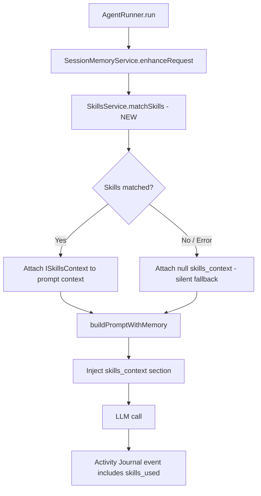

> [!TIP]
> This document is a specialized extension of the [root .copilot/ guidelines](../README.md).

## Status & Context

**Status**: 🚧 Planning
**Phase Dependencies**: Phase 68
**Risk Level**: L — purely additive. `SkillsService` already exists and compiles;
this phase wires it into an already-established prompt construction call chain.

## Executive Summary

- **The Problem**: `SkillsService` is fully implemented but never called. Procedural
  knowledge (how to run tests in this codebase, how to handle merge conflicts, deployment
  steps) accumulates in `Skills/` but is never retrieved or injected into agent context
  (Weakness 4). This wastes an ExaIx differentiator that has no equivalent in Ruflo.
- **The Solution**: Call `SkillsService.matchSkills(request)` inside `AgentRunner` after
  `SessionMemoryService.enhanceRequest()` and inject the results as a `skills_context`
  section into the prompt template, parallel to `memoryContext`. Add `exactl skills
  list|show` commands for inspection and testing.
- **The Goal**: Make procedural memory a first-class contributor to every agent
  execution, closing the gap between its implemented state and its intended purpose.

## Current State Analysis

### Key Files

| File                             | Current Role                             | Gap                                                          |
| -------------------------------- | ---------------------------------------- | ------------------------------------------------------------ |
| `src/services/skills.ts`         | Full `SkillsService` implementation      | `matchSkills()` is never invoked                             |
| `src/services/agent_runner.ts`   | Assembles agent prompt + context         | Has no `skills_context` section in `buildPromptWithMemory()` |
| `src/services/session_memory.ts` | Enhances request with declarative memory | Skills injection would follow this step                      |
| `src/cli/main.ts`                | CLI routing                              | No `skills` command group                                    |

### Constraints

- Skill injection must occur **after** `SessionMemoryService.enhanceRequest()` and
  **before** final prompt assembly so that skills enrich the full context, not just the
  raw request text.
- `maxSkillsPerRequest: 5` and `matchThreshold: 0.3` are already configured in
  `SkillsService`; this phase respects those values and makes them surfaced in
  `exa.config.toml` rather than hardcoded.
- If `SkillsService.matchSkills()` fails or returns empty, execution must continue
  without interruption.

### Interfaces Affected

- `src/services/agent_runner.ts:AgentRunner`
- `src/services/skills.ts:SkillsService`
- `src/shared/types/prompt_context.ts`
- `src/cli/main.ts`

## Technical Architecture & Detailed Design

### Schemas

```ts
// src/shared/types/prompt_context.ts — extend existing interface
export const ZSkillMatch = z.object({
  skillId: z.string().uuid(),
  title: z.string().min(1),
  description: z.string().min(1),
  content: z.string().min(1),
  matchScore: z.number().min(0).max(1),
  tags: z.array(z.string()).default([]),
});

export const ZSkillsContext = z.object({
  matched: z.array(ZSkillMatch),
  totalAvailable: z.number().int().min(0),
  retrievalLatencyMs: z.number().int().min(0),
});

export type ISkillsContext = z.infer<typeof ZSkillsContext>;
```

### Interfaces

```ts
// Extend prompt context
export interface IAgentPromptContext {
  systemPrompt: string;
  memoryContext: string | null;
  skillsContext: ISkillsContext | null; // NEW
  portalKnowledge: string | null;
  userRequest: string;
}

// Extend SkillsService (read-only inspection interface for CLI)
export interface ISkillsInspector {
  listSkills(portalPath: string): Promise<ISkillMeta[]>;
  showSkill(skillId: string): Promise<ISkillDetail>;
}
```

### Logic Flow



### Prompt Template Addition

## Procedural Knowledge

The following procedural skills are relevant to this request.
Apply them when they match the task at hand:

```md
{{#each skills_context.matched}}

### {{this.title}}

{{this.content}}
{{/each}}
```

The `skills_context` section is rendered **between** `memoryContext` and the user
request section to give it appropriate hierarchical weight in the model's attention.

### Config Extension

```toml
# exa.config.toml — promoted from hardcoded defaults
[skills]
max_per_request     = 5
match_threshold     = 0.30
inject_in_prompt    = true
log_matched_ids     = true
```

### Design Decisions

- **Parallel injection with memory**: skills go in their own template section to stay
  clearly separated from declarative memory (facts vs. procedures).
- **Fail-open**: a `SkillsService` error must never abort execution. Catch and log
  a `WARN` event; proceed with `skillsContext: null`.
- **Latency guard**: add a 500ms timeout on `matchSkills()`; if exceeded, fall back
  to null context and emit a `skills.retrieval_timeout` journal event.
- **Journal traceability**: include matched `skillId[]` in the `agent.prompt_assembled`
  journal event so usage can be analysed retroactively.

## Implementation Plan (Step-by-Step)

### Step 70.1: Schema & Config Promotion

1. **Actions**

   - Add `ZSkillMatch` and `ZSkillsContext` types to `src/shared/types/prompt_context.ts`.
   - Add `[skills]` section to `exa.config.toml` schema and reader.
   - Validate config defaults with Zod in `src/config/config_loader.ts`.

1. **Architecture Notes**

   - Keep `ISkillsContext` distinct from `IMemoryContext` — they are parallel sections,
     not nested.

1. **Planned Tests**

   - `tests/unit/shared/types/skills_context_schema_test.ts`
   - `tests/unit/config/skills_config_defaults_test.ts`

1. **Success Criteria**

   - `ZSkillsContext` validates correctly with zero matches and with five matches.
   - Config loader exposes `skills.max_per_request` and `skills.match_threshold`.

---

### Step 70.2: AgentRunner Injection

1. **Actions**

   - In `src/services/agent_runner.ts`, after `SessionMemoryService.enhanceRequest()`,
     call `SkillsService.matchSkills(enhancedRequest)` wrapped in a `Promise.race`
     with a 500ms timeout.
   - Attach result (or `null`) to the prompt context object.
   - Update `buildPromptWithMemory()` to render the `skills_context` template section.

1. **Architecture Notes**

   - Retrieve `IAgentPromptContext` construction in a single builder function to avoid
     scattered mutation.

1. **Planned Tests**

   - `tests/unit/services/agent_runner_skills_injection_test.ts`
   - `tests/unit/services/agent_runner_skills_timeout_fallback_test.ts`

1. **Success Criteria**

   - Skills section appears in generated prompt when matches are returned.
   - Skills section is absent when `matchSkills` returns empty or times out.
   - `agent.prompt_assembled` journal event contains `skillIdsUsed: []` field.

---

### Step 70.3: Prompt Rendering & Budget Awareness

1. **Actions**

   - Add `renderSkillsSection(context: ISkillsContext): string` in
     `src/services/prompt_context.ts`.
   - Respect `PromptBudgetAllocator` (Phase 62) — skills budget is already allocated;
     truncate matched skills content to fit within the budget if Phase 62 is active.

1. **Architecture Notes**

   - Truncation order: trim lowest-score skill first.
   - Rendered section should include a trailing count line if any skills were truncated:
     `(N additional skills omitted due to context budget)`.

1. **Planned Tests**

   - `tests/unit/services/prompt_context_skills_render_test.ts`
   - `tests/unit/services/prompt_context_skills_truncation_test.ts`

1. **Success Criteria**

   - Rendered section is deterministic for identical input.
   - Truncation removes lowest-scoring skills first.
   - Truncation message appears only when trimming occurs.

---

### Step 70.4: CLI `exactl skills` Command Group

1. **Actions**

   - Create `src/cli/commands/skills.ts` with:
     - `exactl skills list [--portal <name>]` — tabular list of all available skills
       with `title | tags | matchThreshold | lastUsed`.
     - `exactl skills show <skill-id>` — full skill content, metadata, usage history.
   - Wire into `src/cli/main.ts`.

1. **Architecture Notes**

   - `skills list` should paginate for large skill sets (default 20 per page).
   - `skills show` should print raw content with a metadata header block.

1. **Planned Tests**

   - `tests/cli/skills_list_command_test.ts`
   - `tests/cli/skills_show_command_test.ts`

1. **Success Criteria**

   - `exactl skills list` correctly outputs all skills for the active portal.
   - `exactl skills show <id>` prints full content for a known skill.
   - Both commands exit cleanly when no skills directory exists.

---

### Step 70.5: Journal Integration & Observability

1. **Actions**

   - Add `skills.match_completed` event to `EventLogger` schema with fields:
     `skillIds: string[]`, `matchCount: number`, `latencyMs: number`.
   - Add `skills.retrieval_timeout` and `skills.retrieval_failed` warning events.

1. **Architecture Notes**

   - Keep journal events thin; do not embed full skill content.

1. **Planned Tests**

   - `tests/unit/services/event_logger_skills_events_test.ts`

1. **Success Criteria**

   - Journal correctly records skill IDs used per execution.
   - Warning events fire on timeout and error conditions.

## Risks & Mitigations

| Risk                                           | Impact | Likelihood | Mitigation Strategy                                               |
| ---------------------------------------------- | ------ | ---------: | ----------------------------------------------------------------- |
| R1: Skills injection bloats prompts            | High   |     Medium | Respect `PromptBudgetAllocator`; truncate lowest-score first      |
| R2: `matchSkills` latency delays fast requests | Medium |        Low | Hard 500ms timeout with fail-open fallback                        |
| R3: Irrelevant skills degrade output quality   | Medium |     Medium | Keep `match_threshold = 0.30` default; make tunable per blueprint |
| R4: Skills directory absent on fresh portal    | Low    |       High | Graceful empty-list return; no error thrown                       |

## Success Metrics (Quantitative)

- `matchSkills()` is invoked for 100% of `AgentRunner.run()` executions.
- Skills section appears in > 60% of prompts when the skill library has ≥ 10 entries.
- `skills.match_completed` event latency P99 < 300ms on a populated library of 100 skills.
- CLI commands exit 0 in < 200ms for libraries with up to 500 skills.

## Backward Compatibility

- No existing prompt schema changes — `skills_context` is an additive section.
- `SkillsService` API is unchanged.
- If `[skills]` block is absent from config, defaults apply silently.
- Portals without a `Skills/` directory produce an empty match result with no error.
