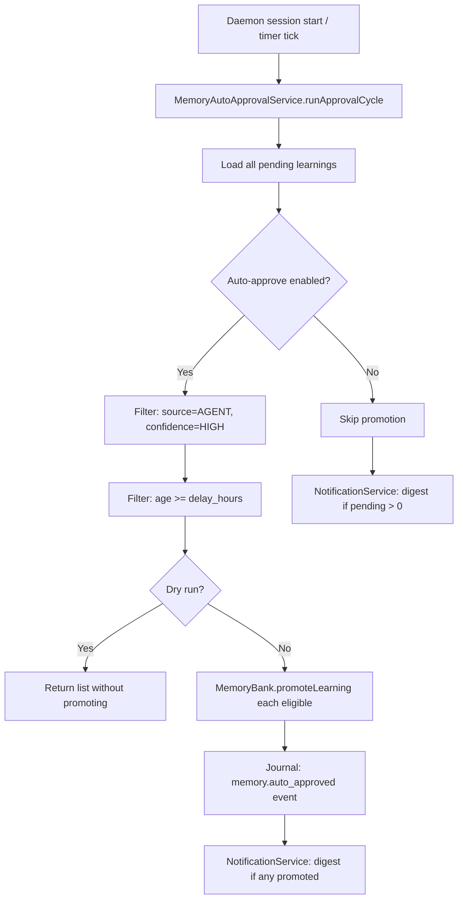

> [!TIP]
> This document is a specialized extension of the [root .copilot/ guidelines](../README.md).

## Status & Context

**Status**: 🚧 Planning
**Phase Dependencies**: Phase 68
**Risk Level**: L — additive lifecycle logic layered on top of existing
`MemoryBank` and `NotificationService`.

## Executive Summary

- **The Problem**: Learnings extracted by `memory_extractor.ts` accumulate in
  `Memory/Pending/` indefinitely because the manual `exactl memory pending approve`
  step is easily forgotten (Weakness 5). The `ConfidenceScorer` already produces
  HIGH/MEDIUM/LOW ratings at extraction time, but those ratings are never acted upon
  by the memory lifecycle.
- **The Solution**: Introduce a configurable auto-approval scheduler that promotes
  `AGENT`-sourced learnings with `confidence: HIGH` after a configurable quiet period.
  Add a `--dry-run` flag to the approval command and wire the existing
  `NotificationService` to emit a session digest of pending items.
- **The Goal**: Close the loop between agent execution and memory growth without
  removing human oversight for low-confidence or USER-sourced learnings.

## Current State Analysis

### Key Files

| File                                | Current Role                              | Gap                                                     |
| ----------------------------------- | ----------------------------------------- | ------------------------------------------------------- |
| `src/services/memory_extractor.ts`  | Produces learnings into `Memory/Pending/` | No lifecycle feedback after extraction                  |
| `src/services/memory_bank.ts`       | Stores, promotes, demotes learnings       | `promoteLearning()` exists but is only called manually  |
| `src/services/confidence_scorer.ts` | Scores output quality                     | Returns `HIGH/MEDIUM/LOW`; not wired to memory approval |
| `src/services/notification.ts`      | Emits user notifications                  | Not connected to pending memory state                   |
| `src/cli/commands/memory.ts`        | `exactl memory pending *` commands        | Lacks `--dry-run` flag and count summary                |

### Constraints

- Auto-approval must **never** promote `source: USER` learnings — only `source: AGENT`.
- A minimum delay (`delay_hours`) must elapse before auto-promotion regardless of
  confidence, giving humans time to veto.
- The feature must be opt-in (`enabled = false` default) to avoid surprising users on
  upgrade.

### Interfaces Affected

- `src/services/memory_bank.ts:MemoryBank`
- `src/services/notification.ts:NotificationService`
- `src/cli/commands/memory.ts`
- `src/config/exa.config.toml`

## Technical Architecture & Detailed Design

### Schemas

```ts
// Config
export const ZAutoApproveConfig = z.object({
  enabled: z.boolean().default(false),
  confidence_threshold: z.enum(["high", "medium"]).default("high"),
  delay_hours: z.number().int().min(1).max(720).default(24),
  sources_allowed: z.array(z.enum(["AGENT"])).default(["AGENT"]),
  max_batch_size: z.number().int().min(1).max(100).default(20),
});

// Pending learning metadata
export const ZPendingLearning = z.object({
  learningId: z.string().uuid(),
  title: z.string().min(1),
  description: z.string().min(1),
  confidence: z.enum(["HIGH", "MEDIUM", "LOW"]),
  source: z.enum(["AGENT", "USER"]),
  extractedAt: z.string().datetime(),
  traceId: z.string(),
  eligibleAt: z.string().datetime().optional(),
});

// Auto-approval run record
export const ZAutoApprovalResult = z.object({
  runAt: z.string().datetime(),
  promoted: z.array(z.string()).describe("Learning IDs promoted"),
  skipped: z.array(z.string()).describe("Learning IDs not yet eligible"),
  dryRun: z.boolean(),
});
```

### Interfaces

```ts
export interface IMemoryAutoApprovalService {
  runApprovalCycle(opts: { dryRun: boolean }): Promise<IAutoApprovalResult>;
  listEligible(): Promise<IPendingLearning[]>;
}

export interface IPendingDigestPayload {
  totalPending: number;
  eligibleNow: number;
  oldestPendingAge: string; // human-readable, e.g. "3 days"
  portalName: string;
}
```

### Logic Flow



### Digest Notification Format

```text
[ExaIx Memory Digest]
Portal: my-project
Pending learnings: 7  (3 eligible for auto-approval)
Oldest pending: 3 days ago

Run `exactl memory pending list` to review.
Run `exactl memory pending approve --dry-run` to preview auto-approvals.
```

### Design Decisions

- **Source guard is non-negotiable**: `source: USER` learnings always require
  explicit human approval because users may have added corrections or preferences.
- **`delay_hours` as quiet period**: this mirrors GDPR-style right-to-review windows.
  Even `HIGH` confidence learnings wait the full delay before promotion.
- **Digest throttle**: notification fires at most once per session start and once per
  24-hour window to avoid notification fatigue.
- **Batch limit**: `max_batch_size` caps a single approval cycle to prevent large
  backlog flushing all at once, which could corrupt memory bank indices.

## Implementation Plan (Step-by-Step)

### Step 71.1: Schema, Config & Pending Metadata

1. **Actions**

   - Add `[memory.auto_approve]` block to `exa.config.toml` schema and reader.
   - Extend pending learning file format to store `confidence`, `source`, and
     `extractedAt` at write time from `memory_extractor.ts`.

1. **Architecture Notes**

   - `eligibleAt` is derived: `eligibleAt = extractedAt + delay_hours`. Compute at
     read time to avoid stale stored values if config changes.

1. **Planned Tests**

   - `tests/unit/config/auto_approve_config_test.ts`
   - `tests/unit/services/memory_extractor_metadata_test.ts`

1. **Success Criteria**

   - Config defaults parse cleanly with `enabled = false`.
   - All new pending learnings include `confidence`, `source`, and `extractedAt` in
     their stored metadata.

---

### Step 71.2: MemoryAutoApprovalService

1. **Actions**

   - Create `src/services/memory/memory_auto_approval_service.ts`.
   - Implement `listEligible()` and `runApprovalCycle({ dryRun })`.
   - Use `MemoryBank.promoteLearning()` for actual promotion.

1. **Architecture Notes**

   - Use `MemoryBank`'s existing file lock before batch promotion.
   - Do not promote learnings in an ongoing active execution (check daemon state).

1. **Planned Tests**

   - `tests/unit/services/memory/memory_auto_approval_service_test.ts`
   - `tests/integration/memory/auto_approval_cycle_test.ts`

1. **Success Criteria**

   - Only `AGENT + HIGH` learnings older than `delay_hours` are promoted.
   - `USER` learnings are never promoted regardless of confidence.
   - `dryRun: true` returns the eligible list without mutating memory.

---

### Step 71.3: Daemon Integration & Scheduling

1. **Actions**

   - Wire `MemoryAutoApprovalService.runApprovalCycle()` into the daemon startup
     sequence and on a 1-hour timer tick.
   - Emit `memory.auto_approved` journal events for each promoted learning.

1. **Architecture Notes**

   - Use `setInterval` wrapped in a cleanup-safe pattern (cleared on graceful shutdown).
   - Timer period is not user-configurable in v1; the `delay_hours` config governs
     eligibility, not run frequency.

1. **Planned Tests**

   - `tests/integration/daemon/auto_approval_daemon_cycle_test.ts`

1. **Success Criteria**

   - Approval cycle runs on daemon start and every hour.
   - Journal records each promoted learning with `learningId` and `traceId`.
   - Cycle skips silently when `enabled = false`.

---

### Step 71.4: Pending Digest Notification

1. **Actions**

   - Extend `src/services/notification.ts` to consume `IPendingDigestPayload` and
     emit a formatted digest to the TUI notification pane and CLI stdout.
   - Throttle: emit at most once per 24-hour wall clock window.

1. **Architecture Notes**

   - Store last-digest timestamp in an in-memory variable (not persisted), cleared on
     daemon restart.

1. **Planned Tests**

   - `tests/unit/services/notification_memory_digest_test.ts`
   - `tests/unit/services/notification_digest_throttle_test.ts`

1. **Success Criteria**

   - Digest fires on daemon session start if there are pending learnings.
   - Digest does not fire twice within a 24-hour window.

---

### Step 71.5: CLI Enhancements

1. **Actions**

   - Add `--dry-run` flag to `exactl memory pending approve`.
   - Add `exactl memory pending list --eligible` sub-filter to show only auto-approval
     candidates.

1. **Architecture Notes**

   - `--dry-run` output format: a table with `learningId | title | confidence | age |
     eligible`.

1. **Planned Tests**

   - `tests/cli/memory_pending_dry_run_test.ts`
   - `tests/cli/memory_pending_list_eligible_test.ts`

1. **Success Criteria**

   - `--dry-run` outputs the eligible list without modifying any files.
   - `--eligible` filter surfaces only learnings that qualify for auto-approval.

## Risks & Mitigations

| Risk                                                 | Impact | Likelihood | Mitigation Strategy                                   |
| ---------------------------------------------------- | ------ | ---------: | ----------------------------------------------------- |
| R1: High-confidence but wrong learning auto-promoted | Medium |        Low | `delay_hours` gives veto window; `--dry-run` previews |
| R2: Batch promotion corrupts memory index            | High   |        Low | File lock + `max_batch_size` cap                      |
| R3: Digest notification fatigue                      | Low    |     Medium | 24-hour throttle + configurable opt-out               |
| R4: Concurrent approval cycle and manual approve     | Medium |        Low | MemoryBank file lock prevents simultaneous writes     |

## Success Metrics (Quantitative)

- Auto-approval cycle runs at P99 < 500ms for libraries with up to 500 pending items.
- 100% of promoted learnings have a corresponding `memory.auto_approved` journal entry.
- Digest notification fires within 5 seconds of daemon session start when pending count > 0.
- Zero USER-sourced learnings auto-promoted across all test scenarios.

## Backward Compatibility

- Feature is disabled by default (`enabled = false`).
- Existing pending learnings without `confidence`/`source` metadata are treated as
  ineligible for auto-approval (safest default).
- `exactl memory pending approve` without `--dry-run` retains its existing behavior.
