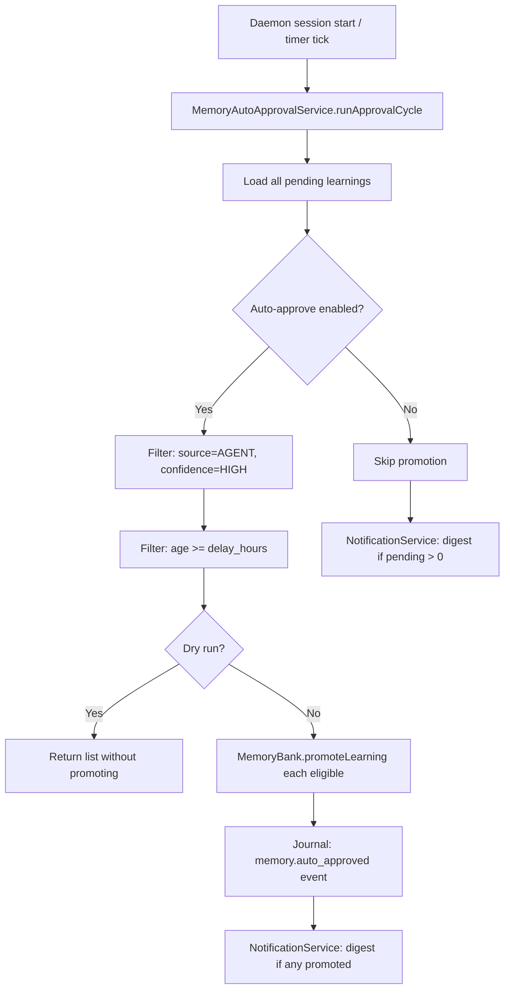

> [!TIP]
> This document is a specialized extension of the [root .copilot/ guidelines](../README.md).

## Status & Context

**Status**: 🚧 Planning
**Phase Dependencies**: Phase 68
**Risk Level**: L — additive lifecycle logic layered on top of existing
`MemoryBank` and `NotificationService`.

## Executive Summary

- **The Problem**: Learnings extracted by `memory_extractor.ts` accumulate in
  `Memory/Pending/` indefinitely because the manual `exactl memory pending approve`
  step is easily forgotten (Weakness 5). The `ConfidenceScorer` already produces
  HIGH/MEDIUM/LOW ratings at extraction time, but those ratings are never acted upon
  by the memory lifecycle.
- **The Solution**: Introduce a configurable auto-approval scheduler that promotes
  `AGENT`-sourced learnings with `confidence: HIGH` after a configurable quiet period.
  Add a `--dry-run` flag to the approval command and wire the existing
  `NotificationService` to emit a session digest of pending items.
- **The Goal**: Close the loop between agent execution and memory growth without
  removing human oversight for low-confidence or USER-sourced learnings.

## Current State Analysis

### Key Files

| File | Current Role | Gap |
| ------------------------------------------------ | ----------------------------------------- | ------------------------------------------------------- |
| `src/services/memory/memory_extractor.ts` | Produces learnings into `Memory/Pending/` | No lifecycle feedback after extraction |
| `src/services/memory/memory_bank.ts` | Stores, promotes, demotes learnings | `approvePending()` (via `MemoryExtractorService`) is only called manually |
| `src/services/utils/confidence_scorer.ts` | Scores output quality | `ConfidenceAssessmentLevel` not wired to memory approval |
| `src/services/notification/notification.ts` | Emits user notifications | Not connected to pending memory state |
| `src/cli/commands/memory_commands.ts` | `exactl memory pending *` commands | Lacks `--dry-run` flag and count summary |

### Constraints

- Auto-approval must **never** promote `source: USER` learnings — only `source: AGENT`.
- A minimum delay (`delay_hours`) must elapse before auto-promotion regardless of
  confidence, giving humans time to veto.
- The feature must be opt-in (`enabled = false` default) to avoid surprising users on
  upgrade.

### Interfaces Affected

- `src/services/memory/memory_bank.ts:MemoryBankService`
- `src/services/memory/memory_extractor.ts:MemoryExtractorService` (approval via `approvePending()`)
- `src/services/notification/notification.ts:NotificationService`
- `src/cli/commands/memory_commands.ts:MemoryCommands`
- `src/config/exa.config.toml`

## Technical Architecture & Detailed Design

### Schemas

```ts
// Config
export const ZAutoApproveConfig = z.object({
  enabled: z.boolean().default(false),
  confidence_threshold: z.enum(["high", "medium"]).default("high"),
  delay_hours: z.number().int().min(1).max(720).default(24),
  sources_allowed: z.array(z.enum(["AGENT"])).default(["AGENT"]),
  max_batch_size: z.number().int().min(1).max(100).default(20),
});

// Pending learning metadata
export const ZPendingLearning = z.object({
  learningId: z.string().uuid(),
  title: z.string().min(1),
  description: z.string().min(1),
  confidence: z.nativeEnum(ConfidenceAssessmentLevel),
  source: z.enum(["AGENT", "USER"]),
  extractedAt: z.string().datetime(),
  traceId: z.string(),
  eligibleAt: z.string().datetime().optional(),
});

// Auto-approval run record
export const ZAutoApprovalResult = z.object({
  runAt: z.string().datetime(),
  promoted: z.array(z.string()).describe("Learning IDs promoted"),
  skipped: z.array(z.string()).describe("Learning IDs not yet eligible"),
  dryRun: z.boolean(),
});
```

### Interfaces

```ts
export interface IMemoryAutoApprovalService {
  runApprovalCycle(opts: { dryRun: boolean }): Promise<IAutoApprovalResult>;
  listEligible(): Promise<IPendingLearning[]>;
}

export interface IPendingDigestPayload {
  totalPending: number;
  eligibleNow: number;
  oldestPendingAge: string; // human-readable, e.g. "3 days"
  portalName: string;
}
```

### Logic Flow



### Digest Notification Format

```text
[ExaIx Memory Digest]
Portal: my-project
Pending learnings: 7  (3 eligible for auto-approval)
Oldest pending: 3 days ago

Run `exactl memory pending list` to review.
Run `exactl memory pending approve --dry-run` to preview auto-approvals.
```

### Design Decisions

- **Source guard is non-negotiable**: `source: USER` learnings always require
  explicit human approval because users may have added corrections or preferences.
- **`delay_hours` as quiet period**: this mirrors GDPR-style right-to-review windows.
  Even `HIGH` confidence learnings wait the full delay before promotion.
- **Digest throttle**: notification fires at most once per session start and once per
  24-hour window to avoid notification fatigue.
- **Batch limit**: `max_batch_size` caps a single approval cycle to prevent large
  backlog flushing all at once, which could corrupt memory bank indices.

## Implementation Plan (Step-by-Step)

### Step 71.1: Schema, Config & Pending Metadata

1. **Actions**

   - Add `[memory.auto_approve]` block to `exa.config.toml` schema and reader.
   - Extend pending learning file format to store `confidence`, `source`, and
     `extractedAt` at write time from `memory_extractor.ts`.

1. **Architecture Notes**

   - `eligibleAt` is derived: `eligibleAt = extractedAt + delay_hours`. Compute at
     read time to avoid stale stored values if config changes.

1. **Planned Tests**

   - `tests/config/auto_approve_config_test.ts`
   - `tests/services/memory_extractor_metadata_test.ts`

1. **Success Criteria**

   - Config defaults parse cleanly with `enabled = false`.
   - All new pending learnings include `confidence`, `source`, and `extractedAt` in
     their stored metadata.

---

### Step 71.2: MemoryAutoApprovalService

1. **Actions**

   - Create `src/services/memory/memory_auto_approval_service.ts`.
   - Implement `listEligible()` and `runApprovalCycle({ dryRun })`.
   - Use `MemoryExtractorService.approvePending(proposalId)` for actual promotion
     (`MemoryBankService.promoteLearning()` creates a new Pattern/Decision from scratch
     and must not be used for approving pending proposals).

1. **Architecture Notes**

   - Use `MemoryBankService`'s existing file lock before batch promotion.
   - `listEligible()` must read `proposal.learning.confidence` and
     `proposal.learning.source` — these fields are nested inside the `learning`
     sub-object of `IMemoryUpdateProposal`, not at the proposal top level.
   - Do not promote learnings in an ongoing active execution (check daemon state).

1. **Planned Tests**

   - `tests/services/memory/memory_auto_approval_service_test.ts`
   - `tests/integration/memory/auto_approval_cycle_test.ts`

1. **Success Criteria**

   - Only `AGENT + HIGH` learnings older than `delay_hours` are promoted.
   - `USER` learnings are never promoted regardless of confidence.
   - `dryRun: true` returns the eligible list without mutating memory.

---

### Step 71.3: Daemon Integration & Scheduling

1. **Actions**

   - Wire `MemoryAutoApprovalService.runApprovalCycle()` into the daemon startup
     sequence and on a 1-hour timer tick.
   - Emit `memory.auto_approved` journal events for each promoted learning.

1. **Architecture Notes**

   - Use `setInterval` wrapped in a cleanup-safe pattern (cleared on graceful shutdown).
   - Timer period is not user-configurable in v1; the `delay_hours` config governs
     eligibility, not run frequency.

1. **Planned Tests**

   - `tests/integration/daemon/auto_approval_daemon_cycle_test.ts`

1. **Success Criteria**

   - Approval cycle runs on daemon start and every hour.
   - Journal records each promoted learning with `learningId` and `traceId`.
   - Cycle skips silently when `enabled = false`.

---

### Step 71.4: Pending Digest Notification

1. **Actions**

   - Extend `src/services/notification/notification.ts` to consume `IPendingDigestPayload` and
     emit a formatted digest to the TUI notification pane and CLI stdout.
   - Throttle: emit at most once per 24-hour wall clock window.

1. **Architecture Notes**

   - Store last-digest timestamp in an in-memory variable (not persisted), cleared on
     daemon restart.

1. **Planned Tests**

   - `tests/services/notification_memory_digest_test.ts`
   - `tests/services/notification_digest_throttle_test.ts`

1. **Success Criteria**

   - Digest fires on daemon session start if there are pending learnings.
   - Digest does not fire twice within a 24-hour window.

---

### Step 71.5: CLI Enhancements

1. **Actions**

   - Add `--dry-run` flag to `exactl memory pending approve`.
   - Add `exactl memory pending list --eligible` sub-filter to show only auto-approval
     candidates.

1. **Architecture Notes**

   - `--dry-run` output format: a table with `learningId | title | confidence | age |
     eligible`.

1. **Planned Tests**

   - `tests/cli/memory_pending_dry_run_test.ts`
   - `tests/cli/memory_pending_list_eligible_test.ts`

1. **Success Criteria**

   - `--dry-run` outputs the eligible list without modifying any files.
   - `--eligible` filter surfaces only learnings that qualify for auto-approval.

## Risks & Mitigations

| Risk | Impact | Likelihood | Mitigation Strategy |
| ---------------------------------------------------- | ------ | ---------: | ----------------------------------------------------- |
| R1: High-confidence but wrong learning auto-promoted | Medium | Low | `delay_hours` gives veto window; `--dry-run` previews |
| R2: Batch promotion corrupts memory index | High | Low | File lock + `max_batch_size` cap |
| R3: Digest notification fatigue | Low | Medium | 24-hour throttle + configurable opt-out |
| R4: Concurrent approval cycle and manual approve | Medium | Low | MemoryBank file lock prevents simultaneous writes |

## Success Metrics (Quantitative)

- Auto-approval cycle runs at P99 < 500ms for libraries with up to 500 pending items.
- 100% of promoted learnings have a corresponding `memory.auto_approved` journal entry.
- Digest notification fires within 5 seconds of daemon session start when pending count > 0.
- Zero USER-sourced learnings auto-promoted across all test scenarios.

## Backward Compatibility

- Feature is disabled by default (`enabled = false`).
- Existing pending learnings without `confidence`/`source` metadata are treated as
  ineligible for auto-approval (safest default).
- `exactl memory pending approve` without `--dry-run` retains its existing behavior.

---

## Pre-Gap Analysis — 2026-04-08

### Assessment: 6 critical path errors must be resolved before coding

> This section was added by pre-gap analysis on 2026-04-08. All gaps must be
> resolved and the plan updated before implementation of any affected step.

### Gap Summary

| ID | Gap (short) | Severity | Plan Section | Blocks Coding? |
| --- | ----------- | -------- | ------------ | -------------- |
| G1 | `src/services/memory_extractor.ts` wrong path — actual `src/services/memory/memory_extractor.ts` | 🔴 Critical | Key Files / Steps 71.1, 71.2 | ✅ Yes |
| G2 | `src/services/memory_bank.ts:MemoryBank` wrong path/class — actual `src/services/memory/memory_bank.ts:MemoryBankService` | 🔴 Critical | Key Files / Interfaces Affected | ✅ Yes |
| G3 | `src/services/confidence_scorer.ts` wrong path — actual `src/services/utils/confidence_scorer.ts` | 🔴 Critical | Key Files | ✅ Yes |
| G4 | `src/services/notification.ts` wrong path — actual `src/services/notification/notification.ts` | 🔴 Critical | Key Files / Steps 71.3, 71.4 | ✅ Yes |
| G5 | `src/cli/commands/memory.ts` wrong path — actual `src/cli/commands/memory_commands.ts` | 🔴 Critical | Key Files / Interfaces Affected | ✅ Yes |
| G6 | Step 71.2 calls `MemoryBank.promoteLearning()` for auto-approval — wrong method; correct is `MemoryExtractorService.approvePending(proposalId)` | 🔴 Critical | Step 71.2 | ✅ Yes |
| G7 | `ZPendingLearning.confidence`/`source`/`extractedAt` are nested in `proposal.learning`, not at proposal top level | 🟡 Feasibility | Step 71.2 / Schemas | ⚠️ Conditionally |
| G8 | `ConfidenceAssessmentLevel` uses snake_case values (`"high"`, `"medium"`) not `"HIGH"`/`"MEDIUM"` — `ZPendingLearning.confidence` schema must align | 🟡 Feasibility | Schemas | ⚠️ Conditionally |
| G9 | `tests/unit/config/` and `tests/unit/services/memory/` don't exist — project convention is `tests/config/` and `tests/services/memory/` | 🟠 Testing | Steps 71.1–71.4 | ❌ No |
| G10 | `memory.auto_approved` event string is an inline literal | 🟡 Traceability | Step 71.3 | ❌ No |

### Detailed Gap Entries

#### G1 — 🔴 Critical: `src/services/memory_extractor.ts` wrong path

- **Location in plan:** Key Files table — "`src/services/memory_extractor.ts`"; Step 71.1 — "metadata enrichment in `memory_extractor.ts`"
- **Problem:** The file does not exist at the stated path. The actual module is `src/services/memory/memory_extractor.ts` (class `MemoryExtractorService`).
- **Impact:** Any step targeting this file would create a ghost module rather than extending the real `MemoryExtractorService`.
- **To fix:** Replace all plan references to `src/services/memory_extractor.ts` with `src/services/memory/memory_extractor.ts`.

---

#### G2 — 🔴 Critical: `src/services/memory_bank.ts:MemoryBank` wrong path and class name

- **Location in plan:** Key Files table — "`src/services/memory_bank.ts`"; Interfaces Affected — "`src/services/memory_bank.ts:MemoryBank`"
- **Problem:** The file does not exist at the stated path, and the class is named `MemoryBankService`, not `MemoryBank`. Actual module: `src/services/memory/memory_bank.ts`.
- **Impact:** Steps referencing `MemoryBank` would create a ghost module; compilation would fail.
- **To fix:** Replace all plan references to `src/services/memory_bank.ts:MemoryBank` with `src/services/memory/memory_bank.ts:MemoryBankService`.

---

#### G3 — 🔴 Critical: `src/services/confidence_scorer.ts` wrong path

- **Location in plan:** Key Files table — "`src/services/confidence_scorer.ts`"
- **Problem:** The file does not exist at the stated path. The actual module is `src/services/utils/confidence_scorer.ts` (class `ConfidenceScorer`).
- **Impact:** Steps referencing this path would operate on a non-existent file.
- **To fix:** Replace all plan references to `src/services/confidence_scorer.ts` with `src/services/utils/confidence_scorer.ts`.

---

#### G4 — 🔴 Critical: `src/services/notification.ts` wrong path

- **Location in plan:** Key Files table — "`src/services/notification.ts`"; Step 71.4 — "Extend `src/services/notification.ts`"
- **Problem:** The file does not exist at the stated path. The actual module is `src/services/notification/notification.ts` (class `NotificationService`).
- **Impact:** Step 71.4 would create a ghost file instead of extending the real `NotificationService`.
- **To fix:** Replace all plan references to `src/services/notification.ts` with `src/services/notification/notification.ts`.

---

#### G5 — 🔴 Critical: `src/cli/commands/memory.ts` wrong path

- **Location in plan:** Key Files table — "`src/cli/commands/memory.ts`"; Interfaces Affected — "`src/cli/commands/memory.ts`"
- **Problem:** The file does not exist at the stated path. The actual module is `src/cli/commands/memory_commands.ts` (class `MemoryCommands`).
- **Impact:** CLI step actions targeting this file would modify a non-existent module.
- **To fix:** Replace all plan references to `src/cli/commands/memory.ts` with `src/cli/commands/memory_commands.ts`.

---

#### G6 — 🔴 Critical: Step 71.2 calls `MemoryBank.promoteLearning()` — wrong method for auto-approval

- **Location in plan:** Step 71.2 Actions — "Use `MemoryBank.promoteLearning()` for actual promotion"
- **Problem:** `MemoryBankService.promoteLearning(portal, {type, name, title, description, category, tags, confidence})` creates a new Pattern/Decision from a form submission — it does not approve an existing pending `IMemoryUpdateProposal`. The correct method to approve a pending proposal is `MemoryExtractorService.approvePending(proposalId)`, which merges the proposal into memory and clears it from the pending queue. Using `promoteLearning()` would bypass the proposal lifecycle entirely and create duplicate memory entries.
- **Impact:** Auto-approval would corrupt the memory state: pending proposals would remain open while spurious Pattern entries are created.
- **To fix:** Replace "Use `MemoryBank.promoteLearning()` for actual promotion" with "Use `MemoryExtractorService.approvePending(proposalId)` for actual promotion".

---

#### G7 — 🟡 Feasibility: `confidence`/`source`/`extractedAt` nested inside `proposal.learning`

- **Location in plan:** Schemas — `ZPendingLearning` has top-level `confidence`, `source`, `extractedAt`
- **Problem:** In the stored `IMemoryUpdateProposal`, these fields are nested inside the `learning` sub-object (`proposal.learning.confidence`, `proposal.learning.source`), not at the proposal top level. The `listEligible()` implementation must read `proposal.learning.confidence` etc., not `proposal.confidence`.
- **Impact:** `listEligible()` would always return an empty list if it reads from the wrong field path.
- **To fix:** Add an Architecture Note to Step 71.2: "Read `proposal.learning.confidence` / `proposal.learning.source` when populating `ZPendingLearning`; these are nested, not top-level fields of `IMemoryUpdateProposal`."

---

#### G8 — 🟡 Feasibility: `ZPendingLearning.confidence` enum values do not match `ConfidenceAssessmentLevel`

- **Location in plan:** Schemas — `confidence: z.enum(["HIGH", "MEDIUM", "LOW"])`
- **Problem:** `ConfidenceAssessmentLevel` (used by `ConfidenceScorer`) uses snake_case values: `"very_high"`, `"high"`, `"medium"`, `"low"`, `"very_low"`. The plan's uppercase `"HIGH"/"MEDIUM"/"LOW"` would never match the values stored by the scorer, causing all learnings to be ineligible.
- **Impact:** Auto-approval cycle would silently promote zero learnings even with valid high-confidence entries.
- **To fix:** Change `z.enum(["HIGH", "MEDIUM", "LOW"])` to `z.nativeEnum(ConfidenceAssessmentLevel)` (or `z.enum(["high", "medium", "low"])`) and align with the actual stored values.

---

#### G9 — 🟠 Testing: `tests/unit/` prefix does not exist

- **Location in plan:** Steps 71.1–71.4 Planned Tests — `tests/unit/config/`, `tests/unit/services/memory/`, `tests/unit/services/`
- **Problem:** There is no `tests/unit/` directory in the project. Convention: `tests/config/`, `tests/services/memory/`, `tests/services/`, etc.
- **Impact:** Tests created at wrong paths are not discovered by `deno test` and do not contribute to CI coverage.
- **To fix:** Remove the `unit/` prefix from all planned test paths.

---

#### G10 — 🟡 Traceability: `memory.auto_approved` event string is an inline literal

- **Location in plan:** Step 71.3 Actions — "Emit `memory.auto_approved` journal events"
- **Problem:** The event string appears only as prose; no named constant is specified for `src/shared/constants.ts`.
- **Impact:** Emitters and consumers must re-hardcode the string with no compile-time guard.
- **To fix:** Add `MEMORY_EVENT_AUTO_APPROVED = "memory.auto_approved"` to `src/shared/constants.ts` and reference it in Step 71.3.

---

## Pre-Implementation Actions

Resolve in order before writing any implementation code:

1. **(G1 + G2 + G3 + G4 + G5)** Update Key Files table and Interfaces Affected: replace all five wrong paths with their actual locations.
1. **(G6)** In Step 71.2, replace "Use `MemoryBank.promoteLearning()`" with "Use `MemoryExtractorService.approvePending(proposalId)`".
1. **(G7)** Add Architecture Note to Step 71.2: read `proposal.learning.confidence` and `proposal.learning.source` (nested, not top-level).
1. **(G8)** Change `ZPendingLearning.confidence` enum to align with `ConfidenceAssessmentLevel` lowercase values.
1. **(G9)** Fix all Planned Tests paths to remove the `unit/` prefix.
1. **(G10)** Add `MEMORY_EVENT_AUTO_APPROVED` constant to `src/shared/constants.ts` before Step 71.3.
