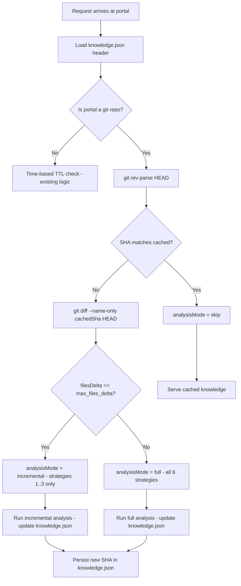

> [!TIP]
> This document is a specialized extension of the [root .copilot/ guidelines](../README.md).

## Status & Context

**Status**: 🚧 Planning
**Phase Dependencies**: None
**Risk Level**: L — isolated change to `PortalKnowledgeService` invalidation logic
with no impact on downstream prompt assembly or memory services.

## Executive Summary

- **The Problem**: `PortalKnowledgeService` re-runs the 6-strategy codebase analysis
  pipeline based purely on elapsed time (default staleness threshold: 168 hours). This
  causes two failure modes: re-analysis fires after a large refactor even if the agent
  could use perfectly fresh cached knowledge; re-analysis is skipped when the codebase
  changed significantly within the TTL window (Weakness 11).
- **The Solution**: Store the portal's `HEAD` commit SHA alongside `gatheredAt` in
  `knowledge.json`. At request time, compare the live SHA via `git rev-parse HEAD`
  and trigger re-analysis only on change. Add a `max_files_delta` threshold for
  incremental vs. full pipeline selection.
- **The Goal**: Make portal knowledge invalidation accurate, cost-free for unchanged
  codebases, and faster for small diffs by running only the three cheapest strategies
  when few files changed.

## Current State Analysis

### Key Files

| File | Current Role | Gap |
| -------------------------------- | ------------------------------------- | ---------------------------------------------------------------------- |
| `src/services/portal_knowledge/` | 6-strategy codebase analysis pipeline | Invalidation is purely time-based (`gatheredAt` timestamp) |
| `knowledge.json` | Cached analysis output per portal | Does not store `HEAD` SHA |
| `src/services/core/git_service.ts` | Full Git abstraction | Already has `git rev-parse HEAD` capability — unused in knowledge path |

### Constraints

- `git rev-parse HEAD` must be treated as a fast, cheap check (typically < 5ms).
- Non-git portals (directories without a `.git` root) must fall back to the existing
  time-based TTL logic unchanged.
- If the git command fails (e.g., a detached HEAD or corrupted repo), fall back
  silently to time-based staleness.

### Interfaces Affected

- `src/services/portal_knowledge/portal_knowledge_service.ts`
- `src/services/portal_knowledge/knowledge_persistence.ts` (persistence layer: `loadKnowledge()` / `saveKnowledge()`)
- `knowledge.json` schema

## Technical Architecture & Detailed Design

### Schemas

```ts
// Extend knowledge.json stored format
export const ZPortalKnowledgeHeader = z.object({
  version: z.number().int().default(2),
  portalId: z.string(),
  portalPath: z.string(),
  gatheredAt: z.string().datetime(),
  headCommitSha: z.string().length(40).optional(),
  filesAnalyzed: z.number().int().min(0),
  strategiesRun: z.array(z.string()),
  fullAnalysis: z.boolean().describe("true = all 6 strategies; false = incremental"),
});

// Invalidation decision
export const ZKnowledgeValidityCheck = z.object({
  isValid: z.boolean(),
  reason: z.enum(["sha_match", "sha_mismatch", "no_git", "time_ttl", "error_fallback"]),
  currentSha: z.string().optional(),
  cachedSha: z.string().optional(),
  filesDelta: z.number().int().optional(),
  analysisMode: z.enum(["skip", "incremental", "full"]),
});
```

### Interfaces

```ts
export interface IKnowledgeInvalidationStrategy {
  check(
    portalPath: string,
    cached: IPortalKnowledgeHeader,
  ): Promise<IKnowledgeValidityCheck>;
}

export interface IGitHeadResolver {
  resolve(portalPath: string): Promise<string | null>;
  changedFilesSince(portalPath: string, fromSha: string): Promise<string[]>;
}
```

### Logic Flow



### Analysis Mode Strategy Map

| Mode | Strategies Executed | Typical Use Case |
| ------------- | --------------------------------------------------- | ------------------------------------------------------------------- |
| `skip` | None | Codebase unchanged since last analysis |
| `incremental` | 1 Directory Census, 2 Key File ID, 3 Config Parsing | Small commits: docs, comments, minor config tweaks |
| `full` | All 6 strategies | Structural changes: new modules, renamed files, architecture shifts |

### Config Extension

```toml
[portal.knowledge]
max_files_delta         = 20      # files changed below this: incremental mode
git_check_enabled       = true    # set false for non-git portals
fallback_ttl_hours      = 168     # TTL for non-git portals (unchanged)
log_invalidation_reason = true    # emit portal.knowledge.validity_check to journal
```

### Design Decisions

- **SHA comparison is the primary gate**: TTL is demoted to a secondary fallback only
  for non-git environments.
- **`git diff --name-only`** is used instead of `git status` to count changed files
  between the cached SHA and current HEAD. This is accurate even after branch switches.
- **Incremental strategies**: strategies 1–3 (Directory Census, Key File ID, Config
  Parsing) do not require full symbol extraction and complete in under 1 second for
  typical project sizes.
- **Atomic knowledge.json update**: write to a temp file and rename to prevent
  partially-written cache files being read mid-update.

## Implementation Plan (Step-by-Step)

### Step 72.1: Schema & Storage Migration

1. **Actions**

   - Extend `PortalKnowledgeSchema` in `src/shared/schemas/portal_knowledge.ts` with optional
     `headCommitSha` and `fullAnalysis` fields.
   - Update `saveKnowledge()` / `loadKnowledge()` in
     `src/services/portal_knowledge/knowledge_persistence.ts` to persist these new fields.
   - Add a one-time migration step in `loadKnowledge()` that treats old `knowledge.json`
     files lacking `headCommitSha` as a cache miss (returns `null`).

1. **Architecture Notes**

   - Keep schema version as integer. Old `knowledge.json` with no `version` field
     is treated as version 1 and will be re-analyzed in full on next request.

1. **Planned Tests**

   - `tests/services/portal_knowledge/knowledge_header_schema_test.ts`
   - `tests/services/portal_knowledge/knowledge_persistence_migration_test.ts`

1. **Success Criteria**

   - Old `knowledge.json` files parse without error; migration runs once.
   - New files include `headCommitSha` and `fullAnalysis` fields.

---

### Step 72.2: GitHeadResolver

1. **Actions**

   - Create `src/services/portal_knowledge/git_head_resolver.ts`.
   - Implement `resolve()` using `SafeSubprocess.run('git', [GIT_CMD_REV_PARSE, 'HEAD'],
     {cwd: portalPath, timeoutMs: DEFAULT_GIT_REV_PARSE_TIMEOUT_MS})` — the same
     pattern as `AgentExecutor.getPortalHeadSha()` and `PlanExecutor.getPortalHeadSha()`.
   - Implement `changedFilesSince()` using `git diff --name-only <sha> HEAD`.

1. **Architecture Notes**

   - Both calls use `SafeSubprocess.run()` — no raw `Deno.Command` or `GitService`
     instance needed; `IGitHeadResolver` is a standalone, lightweight helper.
   - Return `null` on any git error; do not throw.
   - The return value of `changedFilesSince()` is used solely as a count
     (`filesDelta = result.length`). Filenames must never be used for file I/O or
     path construction.

1. **Planned Tests**

   - `tests/services/portal_knowledge/git_head_resolver_test.ts`
   - `tests/integration/services/portal_knowledge/git_head_resolver_integration_test.ts`

1. **Success Criteria**

   - Returns a valid 40-char SHA on a normal git repository.
   - Returns `null` for non-git directories without throwing.
   - `changedFilesSince` returns empty array on no changes.

---

### Step 72.3: Invalidation Strategy Implementation

1. **Actions**

   - Create `src/services/portal_knowledge/knowledge_invalidation_strategy.ts`.
   - Implement `check()` as specified in the logic flow above, returning
     `IKnowledgeValidityCheck`.
   - Wire into `PortalKnowledgeService.analyze()` as the entry decision.

1. **Architecture Notes**

   - `check()` must complete in < 50ms for the `skip` and `sha_match` paths.
   - Emit `portal.knowledge.validity_check` journal event with the full
     `IKnowledgeValidityCheck` payload.

1. **Planned Tests**

   - `tests/services/portal_knowledge/invalidation_strategy_test.ts`

1. **Success Criteria**

   - `sha_match` → `analysisMode: skip` with no re-analysis triggered.
   - `sha_mismatch + filesDelta <= threshold` → `analysisMode: incremental`.
   - `sha_mismatch + filesDelta > threshold` → `analysisMode: full`.
   - Non-git portal → `analysisMode` derived from TTL as before.

---

### Step 72.4: Incremental Pipeline Execution

1. **Actions**

   - Update `PortalKnowledgeService` to accept `IKnowledgeValidityCheck.analysisMode`
     and conditionally skip strategies 4–6 in incremental mode.
   - After analysis, write new `headCommitSha` and `fullAnalysis` flag to
     `knowledge.json`.

1. **Architecture Notes**

   - Strategies 4–6 (Pattern Detection, Architecture Inference, Symbol Extraction)
     are expensive — skipping them in incremental mode is the primary performance gain.
   - Incremental mode must still update directory census and key file list to reflect
     new/renamed files.

1. **Planned Tests**

   - `tests/integration/services/portal_knowledge/incremental_analysis_test.ts`
   - `tests/integration/services/portal_knowledge/full_vs_incremental_accuracy_test.ts`

1. **Success Criteria**

   - Incremental analysis completes in < 1 second on a 1 000-file project.
   - `fullAnalysis: false` is written to `knowledge.json` after incremental run.
   - Full analysis still runs when `filesDelta > max_files_delta`.

---

### Step 72.5: Logging & Observability

1. **Actions**

   - Emit `portal.knowledge.skipped` event when cache is valid.
   - Emit `portal.knowledge.incremental` and `portal.knowledge.full` events on analysis
     runs, including `filesDelta` and `elapsedMs`.

1. **Planned Tests**

   - `tests/services/portal_knowledge/knowledge_journal_events_test.ts`

1. **Success Criteria**

   - Every validity check produces exactly one journal event.
   - Skip events include `cachedSha` and `currentSha` confirming equality.

## Risks & Mitigations

| Risk | Impact | Likelihood | Mitigation Strategy |
| ------------------------------------------------------------ | ------ | ---------: | ------------------------------------------------------------------ |
| R1: Git command fails silently during analysis | Medium | Low | Return `null` from resolver; fall back to TTL |
| R2: SHA changes on every rebase even without semantic change | Low | Medium | Acceptable: full analysis is cheap; this is an edge case |
| R3: `knowledge.json` corruption on concurrent access | High | Low | Atomic write (temp + rename) + existing daemon lease |
| R4: Incremental misses structural changes | Medium | Low | `max_files_delta = 20` default; reduce for safety-critical portals |

## Success Metrics (Quantitative)

- SHA validity check + skip decision executes in < 30ms P99.
- Incremental analysis completes in < 1 000ms for a project with 1 000 files.
- 100% of analysis runs produce a corresponding journal event.
- Re-analysis rate drops by > 70% on portals with low commit frequency during standard
  usage.

## Backward Compatibility

- Existing `knowledge.json` files without `headCommitSha` are treated as cache miss;
  one full analysis runs on first upgrade.
- Non-git portals continue to use TTL logic unchanged.
- All 6-strategy pipeline outputs remain identical to before when `full` mode runs.

---

## Pre-Gap Analysis — 2026-04-08

### Assessment: 2 critical path errors and 1 security gap must be resolved before coding

> This section was added by pre-gap analysis on 2026-04-08. All gaps must be
> resolved and the plan updated before implementation of any affected step.

### Gap Summary

| ID | Gap (short) | Severity | Plan Section | Blocks Coding? |
| --- | ----------- | -------- | ------------ | -------------- |
| G1 | `src/services/git_service.ts` wrong path — actual `src/services/core/git_service.ts` | 🔴 Critical | Key Files / Step 72.2 | ✅ Yes |
| G2 | `knowledge_storage.ts` does not exist — actual persistence layer is `src/services/portal_knowledge/knowledge_persistence.ts` | 🔴 Critical | Key Files / Interfaces Affected / Step 72.1 | ✅ Yes |
| G3 | Step 72.2 references "`GitService` subprocess abstraction" but `IGitService` has no `getHeadSha()` — the correct API is `runGitCommand([GIT_CMD_REV_PARSE, "HEAD"], {throwOnError: false})` | 🟡 Feasibility | Step 72.2 | ⚠️ Conditionally |
| G4 | `tests/unit/services/portal_knowledge/` does not exist — project convention is `tests/services/portal_knowledge/` | 🟠 Testing | Steps 72.1–72.5 | ❌ No |
| G5 | `git diff --name-only` output is user-repository-controlled; each filename must be treated as untrusted input (OWASP A03) | 🔒 Security | Step 72.2 | ⚠️ Conditionally |

### Detailed Gap Entries

#### G1 — 🔴 Critical: `src/services/git_service.ts` wrong path

- **Location in plan:** Key Files table — "`src/services/git_service.ts`"; Step 72.2 — "using `GitService` to call `git rev-parse HEAD`"
- **Problem:** The file does not exist at the stated path. The actual module is `src/services/core/git_service.ts` (class `GitService`, interface `IGitService`).
- **Impact:** Any step targeting this path would create a ghost module; `GitService` from the real path would be unavailable to `IGitHeadResolver`.
- **To fix:** Replace all plan references to `src/services/git_service.ts` with `src/services/core/git_service.ts`.

---

#### G2 — 🔴 Critical: `knowledge_storage.ts` does not exist

- **Location in plan:** Key Files table — `src/services/portal_knowledge/knowledge_storage.ts (or equivalent)`; Interfaces Affected — `knowledge_storage.ts`; Step 72.1 — "migration in `KnowledgeStorage`"
- **Problem:** There is no `knowledge_storage.ts` in the project. The actual persistence layer is `src/services/portal_knowledge/knowledge_persistence.ts`, which exports `loadKnowledge()` and `saveKnowledge()` (no class, just functions). The `"or equivalent"` hedge signals the plan author was uncertain.
- **Impact:** Step 72.1 would create a ghost file instead of extending the real persistence layer; `loadKnowledge()` / `saveKnowledge()` are the actual entry points for schema migration.
- **To fix:** Replace all plan references to `knowledge_storage.ts` / `KnowledgeStorage` with `knowledge_persistence.ts` / `loadKnowledge()` + `saveKnowledge()`.

---

#### G3 — 🟡 Feasibility: `IGitHeadResolver` must use `runGitCommand()`, not a mythical `getHeadSha()`

- **Location in plan:** Step 72.2 Architecture Notes — "Both calls use `GitService`'s existing subprocess abstraction"
- **Problem:** `IGitService` (at `src/shared/interfaces/i_git_service.ts`) has no `getHeadSha()` method. The canonical way to run `git rev-parse HEAD` via `GitService` is `runGitCommand([GIT_CMD_REV_PARSE, "HEAD"], {throwOnError: false})`. The plan does not specify this, leaving the implementation undefined. Alternatively, `IGitHeadResolver` can use `SafeSubprocess.run("git", [GIT_CMD_REV_PARSE, "HEAD"], {cwd: portalPath})` — the pattern already used in `AgentExecutor.getPortalHeadSha()` and `PlanExecutor.getPortalHeadSha()`.
- **Impact:** Without a specified API, the implementation might introduce raw `Deno.Command` calls rather than using the established subprocess abstraction.
- **To fix:** Add to Step 72.2 Architecture Notes: "Use `SafeSubprocess.run('git', [GIT_CMD_REV_PARSE, 'HEAD'], {cwd: portalPath, timeoutMs: DEFAULT_GIT_REV_PARSE_TIMEOUT_MS})` — the same pattern as `AgentExecutor.getPortalHeadSha()`. Wrap in try/catch; return `null` on any non-zero exit code or exception."

---

#### G4 — 🟠 Testing: `tests/unit/services/portal_knowledge/` does not exist

- **Location in plan:** Steps 72.1, 72.2, 72.3, 72.5 Planned Tests — `tests/unit/services/portal_knowledge/*`
- **Problem:** There is no `tests/unit/` directory in the project. The existing portal knowledge tests live at `tests/services/portal_knowledge/` (verified: `tests/services/portal_knowledge/portal_knowledge_service_test.ts`, `tests/services/portal_knowledge/knowledge_persistence_test.ts`).
- **Impact:** Tests created at wrong paths are not discovered by `deno test` and do not contribute to CI coverage.
- **To fix:** Remove the `unit/` prefix from all planned test paths: use `tests/services/portal_knowledge/`.

---

#### G5 — 🔒 Security: `git diff --name-only` output is untrusted user-controlled input (OWASP A03)

- **Location in plan:** Step 72.2 Actions — "Implement `changedFilesSince()` using `git diff --name-only <sha> HEAD`"
- **Problem:** The output of `git diff --name-only` is a list of filenames from the repository. Repository filenames are user-controlled and can contain path-traversal sequences, shell metacharacters, or null bytes. If `filesDelta` count is used only as a numeric threshold (as in the logic flow), this is safe — but if any code downstream attempts to use the filenames for file I/O or path construction, injection is possible.
- **Impact:** A malicious filename (e.g., `../../etc/passwd`) in the diff output could cause path traversal if used for file access (OWASP A03 Injection).
- **To fix:** Add to Step 72.2 Architecture Notes: "The return value of `changedFilesSince()` is used solely as a count (`filesDelta = result.length`). Filenames must not be used for any file I/O or path construction. Document this constraint in the `IGitHeadResolver` interface JSDoc."

---

## Pre-Implementation Actions

Resolve in order before writing any implementation code:

1. **(G1)** Update Key Files table, Interfaces Affected, and Step 72.2: replace `src/services/git_service.ts` with `src/services/core/git_service.ts`.
1. **(G2)** Update Key Files table, Interfaces Affected, and Step 72.1: replace `knowledge_storage.ts` / `KnowledgeStorage` with `knowledge_persistence.ts` / `loadKnowledge()` + `saveKnowledge()`.
1. **(G3)** Add to Step 72.2 Architecture Notes: specify `SafeSubprocess.run()` as the subprocess pattern, matching `AgentExecutor.getPortalHeadSha()`.
1. **(G5)** Add to Step 72.2 Architecture Notes: document that `changedFilesSince()` output is used as a count only, never for path construction.
1. **(G4)** Fix all Planned Tests paths to remove `unit/` prefix; use `tests/services/portal_knowledge/`.
