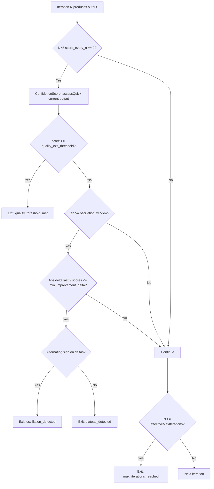

> [!TIP]
> This document is a specialized extension of the [root .copilot/ guidelines](../README.md).

## Status & Context

**Status**: 🚧 Planning
**Phase Dependencies**: Phase 45 (IRequestAnalysis), Phase 62
**Risk Level**: M — modifies loop exit conditions in a critical execution path.
Incorrect thresholds could cause premature exits or infinite loops; thresholds
must therefore be rigorously tested and config-guarded.

## Executive Summary

- **The Problem**: `ReflexiveAgent` runs up to a fixed `maxIterations` regardless of
  whether output quality has plateaued or is oscillating (Weakness 12). A one-line
  fix gets the same number of refinement passes as a full authentication system
  refactor, wasting tokens and time.
- **The Solution**: Wire `ConfidenceScorer` inline after each iteration to detect
  convergence (quality threshold met), plateau (insufficient delta between consecutive
  scores), and oscillation (alternating scores). Compute `effectiveMaxIterations`
  from `IRequestAnalysis.complexity` so complex tasks get proportionally more budget.
- **The Goal**: Make `ReflexiveAgent` both faster for simple tasks and more persistent
  for genuinely complex ones, while preventing indefinite loops on non-converging tasks.

## Current State Analysis

### Key Files

| File | Current Role | Gap |
| -------------------------------------- | ---------------------------------------- | --------------------------------------------------------- |
| `src/services/agent/reflexive_agent.ts` | Self-critique loop up to `maxIterations` | No inline quality feedback; exits only on iteration count |
| `src/services/utils/confidence_scorer.ts` | Post-execution quality scoring | Not called during the refinement loop |
| `src/services/agent/agent_runner.ts` | Passes `IRequestAnalysis` to execution | Does not pass `complexity` to `ReflexiveAgent` |
| `src/shared/schemas/request_analysis.ts` | Defines `IRequestAnalysis.complexity` | Unused as an iteration budget signal |

### Constraints

- `ConfidenceScorer` may invoke LLM sub-calls; inline use must be bounded by a
  configurable frequency (e.g., score every N iterations, not every iteration) to
  avoid doubling token cost on long loops.
- Oscillation detection requires at least a 2-iteration history window.
- `effectiveMaxIterations` must be capped absolutely at `ABSOLUTE_MAX_ITERATIONS`
  (proposed: 12) to prevent unbounded resource consumption regardless of complexity.

### Interfaces Affected

- `src/services/agent/reflexive_agent.ts:ReflexiveAgent`
- `src/services/utils/confidence_scorer.ts:ConfidenceScorer`
- `src/services/agent/reflexive_agent.ts` (interfaces co-located in main file)
- `exa.config.toml`

## Technical Architecture & Detailed Design

### Schemas

```ts
export const ZReflexiveConvergenceConfig = z.object({
  // Thresholds
  quality_exit_threshold: z.number().min(0).max(100).default(85),
  min_improvement_delta: z.number().min(0).max(20).default(3),
  oscillation_window: z.number().int().min(2).max(4).default(2),

  // Iteration budget
  base_max_iterations: z.number().int().min(1).max(10).default(3),
  complexity_scale_factor: z.number().min(0).max(3).default(1.0),
  absolute_max_iterations: z.number().int().min(1).max(12).default(12),

  // Scoring frequency
  score_every_n_iterations: z.number().int().min(1).max(5).default(1),
});

export const ZIterationScore = z.object({
  iteration: z.number().int().min(0),
  score: z.number().min(0).max(100),
  scoredAt: z.string().datetime(),
});

export const ZConvergenceDecision = z.object({
  shouldExit: z.boolean(),
  reason: z.enum([
    "quality_threshold_met",
    "plateau_detected",
    "oscillation_detected",
    "max_iterations_reached",
    "absolute_max_reached",
  ]),
  scores: z.array(ZIterationScore),
});
```

### Interfaces

```ts
export interface IConvergenceDetector {
  evaluate(
    scores: IIterationScore[],
    config: IReflexiveConvergenceConfig,
  ): IConvergenceDecision;
}

export interface IReflexiveAgentOpts {
  request: IEnhancedRequest;
  requestAnalysis: IRequestAnalysis; // NEW — provides complexity signal
  convergenceConfig: IReflexiveConvergenceConfig;
}
```

### Effective Max Iterations Formula

```text
effectiveMaxIterations =
  MIN(
    base_max_iterations + FLOOR(complexity * complexity_scale_factor),
    absolute_max_iterations
  )
```

Where `complexity` is first mapped from `RequestAnalysisComplexity` enum to a numeric
weight (`SIMPLE=0`, `MEDIUM=3`, `COMPLEX=6`, `EPIC=10`) before applying the formula.
With defaults (`base=3, scale=1.0, absolute=12`):

| Complexity | effectiveMax |
| ----------------- | ------------ |
| 0 (trivial) | 3 |
| 3 (moderate) | 6 |
| 6 (complex) | 9 |
| 10 (very complex) | 12 |

### Convergence Detector Logic



### Design Decisions

- **Score frequency gate (`score_every_n_iterations`)**: calling `ConfidenceScorer`
  every iteration can double token cost on long loops. Default `1` keeps the
  current token cost parity; operators can set `2` or `3` to halve scoring cost.
- **Oscillation detection**: two consecutive score deltas of opposite sign and both
  within `min_improvement_delta` indicate the loop is bouncing between two local
  maxima. Exit is warranted.
- **Plateau vs oscillation distinction**: plateau means deltas are consistently small
  and positive (converging too slowly). Oscillation means the direction alternates.
  Both warrant exit; the reason is logged separately for analysis.
- **`absolute_max_iterations` as hard ceiling**: regardless of complexity, no loop
  runs more than 12 iterations to prevent runaway cost in edge cases.

## Implementation Plan (Step-by-Step)

### Step 73.1: Schema & Config Foundation

1. **Actions**

   - Add `ZReflexiveConvergenceConfig` to the shared schema module.
   - Add `[agents.convergence]` section to `exa.config.toml`.
   - Parse and inject config into `ReflexiveAgent` constructor.

1. **Architecture Notes**

   - Keep `base_max_iterations` aligned with the existing `maxIterations` default to
     avoid behavioral change before complexity wiring.

1. **Planned Tests**

   - `tests/schemas/reflexive_convergence_config_test.ts`
   - `tests/config/convergence_config_defaults_test.ts`

1. **Success Criteria**

   - Config parses with all defaults.
   - Boundary values (complexity 0 and 10) produce correct `effectiveMax` values.

---

### Step 73.2: ConvergenceDetector Service

1. **Actions**

   - Create `src/services/agent/convergence_detector.ts` implementing
     `IConvergenceDetector`.
   - Implement `evaluate()` covering all four exit reasons.
   - Export as a pure function with no side effects.

1. **Architecture Notes**

   - Keep the detector stateless — all state (score history) is passed in.
   - Use integer arithmetic for delta comparison to avoid floating-point edge cases.

1. **Planned Tests**

   - `tests/services/agent/convergence_detector_quality_exit_test.ts`
   - `tests/services/agent/convergence_detector_plateau_test.ts`
   - `tests/services/agent/convergence_detector_oscillation_test.ts`
   - `tests/services/agent/convergence_detector_max_iterations_test.ts`

1. **Success Criteria**

   - All four exit conditions are triggered correctly on crafted score sequences.
   - No exit fires below the configured thresholds.
   - Exactly correct iteration is identified as exit point in each scenario.

---

### Step 73.3: EffectiveMaxIterations Computation

1. **Actions**

   - Create `src/services/agent/iteration_budget.ts` with a pure `computeBudget()`
     function.
   - Wire into `ReflexiveAgent.run()` using `IRequestAnalysis.complexity` passed via
     `IReflexiveAgentOpts`.

1. **Architecture Notes**

   - `complexity` from `IRequestAnalysis` is a `RequestAnalysisComplexity` enum; map to
     numeric weight (`SIMPLE=0, MEDIUM=3, COMPLEX=6, EPIC=10`) before applying the formula.

1. **Planned Tests**

   - `tests/services/agent/iteration_budget_test.ts`

1. **Success Criteria**

   - `computeBudget(complexity=0)` returns `base_max_iterations`.
   - `computeBudget(complexity=10)` returns `absolute_max_iterations`.
   - Intermediate values match the formula without floating-point drift.

---

### Step 73.4: ReflexiveAgent Integration

1. **Actions**

   - Update `src/services/agent/reflexive_agent.ts`:
     - Accept `IReflexiveAgentOpts` (adds `requestAnalysis` and `convergenceConfig`).
     - Compute `effectiveMaxIterations` at start of `run()` using `computeBudget()`.
     - Call `scorer.assessQuick(currentResponse.content)` every `score_every_n_iterations`
       iterations (pass `originalRequest.userPrompt` as `request` if using async `assess()`).
     - Call `ConvergenceDetector.evaluate()` after each scoring event.
     - Exit loop on `shouldExit: true`; log exit reason to journal.

1. **Architecture Notes**

   - Accumulate `IIterationScore[]` in local state; pass full history to the detector.
   - Ensure `ConfidenceScorer` timeout from Phase 62 applies here too.

1. **Planned Tests**

   - `tests/services/reflexive/reflexive_agent_early_exit_test.ts`
   - `tests/services/reflexive/reflexive_agent_complexity_budget_test.ts`
   - `tests/integration/services/reflexive_agent_convergence_integration_test.ts`

1. **Success Criteria**

   - Loop exits before `effectiveMax` when quality threshold is met.
   - Loop exits exactly at `effectiveMax` when quality never reaches threshold.
   - Loop exits on oscillation after minimum 2 scored iterations.
   - High-complexity requests run more iterations than low-complexity ones.

---

### Step 73.5: Journal Events & Observability

1. **Actions**

   - Emit `agent.iteration_scored` event per scoring call with `iteration`, `score`,
     and `delta`.
   - Emit `agent.converged` event on early exit with `reason` and full `scores[]` array.
   - Emit `agent.iteration_budget_computed` at loop start with `complexity`,
     `effectiveMax`, and `configuredBase`.

1. **Architecture Notes**

   - `agent.iteration_scored` should only be emitted on iterations where scoring
     actually occurs (`iteration % score_every_n_iterations === 0`).
   - `agent.converged` must include `exitReason`, `iterationCount`, and the final
     output quality score so later analytics can compare early-exit quality against
     max-iteration completions.
   - Journal payloads should remain compact; store score history as
     `Array<{ iteration: number; score: number }>` and not the full intermediate agent
     outputs.

1. **Planned Tests**

   - `tests/services/event_logger_convergence_events_test.ts`
   - `tests/integration/services/reflexive_agent_journal_events_test.ts`

1. **Success Criteria**

   - All scoring iterations emit exactly one `agent.iteration_scored` event.
   - Early exits emit exactly one `agent.converged` event with the correct reason.
   - Budget computation emits exactly one `agent.iteration_budget_computed` event at
     the start of every `ReflexiveAgent.run()` call.

## Risks & Mitigations

| Risk | Impact | Likelihood | Mitigation Strategy |
| ----------------------------------------------------------------- | ------ | ---------: | -------------------------------------------------------------------------------------------------- |
| R1: Premature exit due to noisy score fluctuation | High | Medium | Require `min_improvement_delta` and at least two scored iterations before plateau/oscillation exit |
| R2: Inline scoring increases token cost too much | Medium | Medium | Make `score_every_n_iterations` configurable; default to 1 but allow 2–3 for cost-sensitive modes |
| R3: Complexity score is inaccurate and over-allocates iterations | Medium | Low | Hard-cap with `absolute_max_iterations` |
| R4: Oscillation detector mistakes legitimate refinement for churn | Medium | Low | Require alternating sign and low delta across the configured oscillation window |
| R5: Additional exit paths complicate debugging | Low | Medium | Emit explicit convergence journal events and keep exit reasons strongly typed |

## Success Metrics (Quantitative)

- Average iteration count decreases by at least 30% for low-complexity requests
  (`complexity <= 2`) without lowering final confidence score.
- High-complexity requests (`complexity >= 7`) receive at least 2 additional
  refinement iterations compared to the fixed-budget baseline when needed.
- 100% of early exits produce a correctly typed `agent.converged` journal event.
- Zero infinite-loop scenarios across the convergence detector test suite.
- P95 additional overhead from convergence logic remains under 150ms per scored
  iteration, excluding any external provider latency inside `ConfidenceScorer`.

## Backward Compatibility

- If `requestAnalysis` is absent, `ReflexiveAgent` falls back to
  `base_max_iterations` only.
- If `[agents.convergence]` is absent from config, defaults are applied silently.
- Existing callers of `ReflexiveAgent` remain valid as long as the new options object
  provides defaulting at the constructor or factory layer.
- Existing journal consumers remain compatible because new event types are additive.

---

## Pre-Gap Analysis — 2026-04-08

> Consulted: `src/services/agent/reflexive_agent.ts`, `src/services/utils/confidence_scorer.ts`,
> `src/services/agent/agent_runner.ts`, `src/shared/schemas/request_analysis.ts`,
> `tests/services/reflexive/`.

### Gap Summary

| ID | Severity | Area | Title | Blocking? |
| --- | --------------- | -------------------- | ------------------------------------------------------------------ | --------- |
| G1 | 🔴 Critical | File Path | Wrong path for `ReflexiveAgent` | Yes |
| G2 | 🔴 Critical | File Path | Wrong path for `ConfidenceScorer` | Yes |
| G3 | 🔴 Critical | File Path | Wrong path for `AgentRunner` | Yes |
| G4 | 🔴 Critical | File Path | Wrong path for `IRequestAnalysis` | Yes |
| G5 | 🔴 Critical | Algorithm | `complexity` is an enum, not a 0–10 numeric score | Yes |
| G6 | 🔴 Critical | API Contract | `ConfidenceScorer.score()` method does not exist | Yes |
| G7 | 🟡 Feasibility | Directory Convention | `src/services/agents/` is wrong; convention is `src/services/agent/` | No |
| G8 | 🟠 Testing | Test Paths | `tests/unit/services/agents/` prefix does not exist in this project | No |
| G9 | 🟡 Traceability | Step Detail | `assess()` call-site arguments not specified | No |

### Detailed Gap Entries

#### G1 — 🔴 Critical: Wrong path for `ReflexiveAgent`

**Plan says:** `src/services/reflexive_agent.ts`\
**Actual path:** `src/services/agent/reflexive_agent.ts`\
**Evidence:** File confirmed at `src/services/agent/reflexive_agent.ts`.\
**Resolution:** Update all Key Files and Interfaces Affected references.

---

#### G2 — 🔴 Critical: Wrong path for `ConfidenceScorer`

**Plan says:** `src/services/confidence_scorer.ts`\
**Actual path:** `src/services/utils/confidence_scorer.ts`\
**Evidence:** File confirmed at `src/services/utils/confidence_scorer.ts`.\
**Resolution:** Update Interfaces Affected and all step references.

---

#### G3 — 🔴 Critical: Wrong path for `AgentRunner`

**Plan says:** `src/services/agent_runner.ts`\
**Actual path:** `src/services/agent/agent_runner.ts`\
**Evidence:** File confirmed at `src/services/agent/agent_runner.ts`.\
**Resolution:** Update Key Files table and Step 73.4 references.

---

#### G4 — 🔴 Critical: Wrong path for `IRequestAnalysis`

**Plan says:** `src/shared/types/request_analysis.ts`\
**Actual path:** `src/shared/schemas/request_analysis.ts`\
**Evidence:** `IRequestAnalysis` and `RequestAnalysisComplexity` are exported from
`src/shared/schemas/request_analysis.ts`.\
**Resolution:** Update Key Files table, Interfaces Affected, and all step references.

---

#### G5 — 🔴 Critical: `complexity` is an enum, not a 0–10 numeric score

**Plan says:** `complexity` is "a normalized 0–10 score from `IRequestAnalysis.complexity`"
and proposes: `MIN(base + FLOOR(complexity * scale), absolute)`.\
**Actual type:** `RequestAnalysisComplexity` is an alias of `TaskComplexity` enum with
string values `SIMPLE | MEDIUM | COMPLEX | EPIC` — not a number.\
**Impact:** Multiplying an enum string by `complexity_scale_factor` produces `NaN`,
silently breaking the budget formula.\
**Resolution:** Step 73.3 `computeBudget()` must first map the enum to a numeric weight:

```ts
const COMPLEXITY_NUMERIC: Record<RequestAnalysisComplexity, number> = {
  [RequestAnalysisComplexity.SIMPLE]: 0,
  [RequestAnalysisComplexity.MEDIUM]: 3,
  [RequestAnalysisComplexity.COMPLEX]: 6,
  [RequestAnalysisComplexity.EPIC]: 10,
};
```

The table examples (`complexity=0 → 3`, `complexity=10 → 12`) remain valid once
mapped. Update the Effective Max Iterations Formula section accordingly.

---

#### G6 — 🔴 Critical: `ConfidenceScorer.score()` does not exist

**Plan says:** "Call `ConfidenceScorer.score()` on the output every N iterations."\
**Actual API:** `ConfidenceScorer` exposes two public assessment methods:

- `assess(request, response, traceId?, critique?): Promise<IConfidenceResult>` — LLM-backed,
  async
- `assessQuick(response): ConfidenceAssessment` — heuristic-only, sync, returns `score` 0–100

Neither is named `score()`.\
**Impact:** Step 73.4 will not compile.\
**Resolution:** Use `assessQuick(currentResponse.content)` for inline use (no extra LLM
call, sync), mapping `.score` directly to the convergence threshold. If async LLM scoring
is desired, use `assess(originalRequest.userPrompt, currentResponse.content)` and honor the
scoring-frequency gate. Update all `ConfidenceScorer.score()` references in Step 73.4.

---

#### G7 — 🟡 Feasibility: Wrong service subdirectory convention

**Plan says:** New files at `src/services/agents/convergence_detector.ts` and
`src/services/agents/iteration_budget.ts` (plural `agents/`).\
**Actual convention:** All agent-related services sit under `src/services/agent/`
(singular): `agent_runner.ts`, `reflexive_agent.ts`, `agent_executor.ts`,
`agent_capabilities.ts`.\
**Resolution:** Use `src/services/agent/convergence_detector.ts` and
`src/services/agent/iteration_budget.ts`.

---

#### G8 — 🟠 Testing: `tests/unit/` prefix does not exist

**Plan says:** Test paths `tests/unit/services/agents/...`, `tests/unit/shared/schemas/...`,
`tests/unit/config/...`.\
**Actual structure:** Tests live directly under `tests/services/`, `tests/schemas/`,
`tests/config/`. Existing reflexive tests are at `tests/services/reflexive/`.\
**Resolution:** Strip the `unit/` prefix; use `tests/services/agent/`,
`tests/services/reflexive/`, `tests/schemas/`, `tests/config/`, `tests/services/`.

---

#### G9 — 🟡 Traceability: `assess()` call-site arguments unspecified

**Plan says:** "Call `ConfidenceScorer.score()` on the output every N iterations" — no
mention of the `request` argument required by `assess()`.\
**Actual signature:** `assess(request: string, response: string, ...)`.\
**Resolution:** Clarify in Step 73.4: `request` = `originalRequest.userPrompt`, `response` =
`currentResponse.content`.

---

## Pre-Implementation Actions

- [ ] **[G1]** Fix: `src/services/reflexive_agent.ts` → `src/services/agent/reflexive_agent.ts` throughout
- [ ] **[G2]** Fix: `src/services/confidence_scorer.ts` → `src/services/utils/confidence_scorer.ts` throughout
- [ ] **[G3]** Fix: `src/services/agent_runner.ts` → `src/services/agent/agent_runner.ts` throughout
- [ ] **[G4]** Fix: `src/shared/types/request_analysis.ts` → `src/shared/schemas/request_analysis.ts` throughout
- [ ] **[G5]** Rewrite `computeBudget()` spec: map `RequestAnalysisComplexity` enum → numeric weight before applying formula
- [ ] **[G6]** Replace all `ConfidenceScorer.score()` with `assessQuick(currentResponse.content)` or `assess(request, response)` in Step 73.4
- [ ] **[G7]** Change `src/services/agents/` → `src/services/agent/` for all new files
- [ ] **[G8]** Remove `unit/` prefix from all test paths; use `tests/services/agent/` and `tests/services/reflexive/`
- [ ] **[G9]** Document in Step 73.4 that `assess()` receives `originalRequest.userPrompt` as the `request` argument
