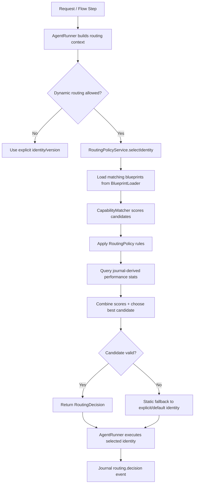

> [!TIP]
> This document is a specialized extension of the [root .copilot/ guidelines](../README.md).

## Status & Context

**Status**: 🚧 Planning
**Phase Dependencies**: Phase 45, Phase 51, Phase 61, Phase 69, Phase 70
**Risk Level**: M — this phase affects identity selection and execution quality, but it can be introduced as an additive policy layer with a safe fallback to the current explicit identity resolution path.

## Executive Summary

- **The Problem**: Identity selection is currently too static. Requests are routed by explicit identity IDs and flow definitions, but ExaIx lacks a runtime policy layer for choosing between multiple identity versions, capability-compatible candidates, or controlled experiments. This leaves the Activity Journal’s execution quality history underused and makes blueprint evolution manual and brittle.
- **The Solution**: Add a `RoutingPolicyService` between request analysis and final identity resolution. The service evaluates declared blueprint capabilities, request signals from `IRequestAnalysis`, explicit routing rules, and journal-derived performance statistics to choose the most suitable identity version, while preserving deterministic fallback behavior.
- **The Goal**: Make identity selection adaptive, observable, and version-aware without compromising auditability, predictability, or approval-gated execution.

## Current State Analysis

### Key Files

| File | Current Role | Gap |
| ------------------------------------------------ | -------------------------------------------------- | ------------------------------------------------------------- |
| `src/services/agent/agent_runner.ts` | Assembles execution context and invokes identities | No policy-based identity selection stage |
| `src/services/agent/agent_capabilities.ts` | Capability-related identity metadata support | Not used as a first-class routing decision engine |
| `src/services/blueprint/blueprint_loader.ts` | Loads identity blueprints and versions | Returns available blueprints but does not rank or route them |
| `src/services/request_analysis/` | Produces `IRequestAnalysis` | Signals exist but are not used for runtime identity selection |
| `src/services/core/event_logger.ts` / journal queries | Stores execution outcomes and trace data | No routing-performance aggregation service |
| `src/services/blueprint/blueprint_loader.ts:ILoadedBlueprint` | Runtime blueprint shape with `capabilities: string[]` | Capabilities declared but not leveraged for routing |
| `src/flows/flow_runner.ts` | Executes flow-defined identities | No dynamic identity substitution or policy evaluation hook |

### Constraints

- Explicit identity declarations in plans and flows must remain authoritative unless the plan or policy explicitly permits dynamic selection.
- Routing decisions must be journaled with enough detail to explain **why** a specific identity version was chosen.
- If the routing layer cannot find a qualified candidate, it must fall back to the currently configured identity deterministically.
- Policy evaluation must remain fast; it cannot materially slow normal request handling.
- Version experiments must be bounded and auditable rather than opaque probabilistic drift.

### Interfaces Affected

- `src/services/agent/agent_runner.ts:AgentRunner`
- `src/services/blueprint/blueprint_loader.ts:BlueprintLoader` (add `listAll()` method)
- `src/services/agent/agent_capabilities.ts`
- `src/services/blueprint/blueprint_loader.ts:ILoadedBlueprint` (carries capabilities)
- `src/shared/schemas/request_analysis.ts`
- `src/services/core/event_logger.ts`

## Technical Architecture & Detailed Design

### Schemas

```ts
import { z } from "zod";

export const ZRoutingMatchCriteria = z.object({
  capability: z.string().min(1).optional(),
  complexityMin: z.number().min(0).max(10).optional(),
  complexityMax: z.number().min(0).max(10).optional(),
  language: z.string().min(1).optional(),
  taskType: z.string().min(1).optional(),
  portalType: z.string().min(1).optional(),
  tags: z.array(z.string()).default([]),
});

export const ZRoutingPreference = z.object({
  identityId: z.string().min(1),
  version: z.string().min(1).optional(),
  fallbackIdentityId: z.string().min(1).optional(),
  fallbackVersion: z.string().min(1).optional(),
  trafficSplit: z.number().min(0).max(1).optional(),
  enabled: z.boolean().default(true),
});

export const ZRoutingRule = z.object({
  ruleId: z.string().min(1),
  priority: z.number().int().min(0).default(100),
  match: ZRoutingMatchCriteria,
  prefer: ZRoutingPreference,
});

export const ZRoutingPolicy = z.object({
  version: z.string().default("1.0"),
  rules: z.array(ZRoutingRule),
  defaultMode: z.enum(["static", "capability_first", "policy_first"]).default("policy_first"),
  allowExperiments: z.boolean().default(false),
});

export const ZRoutingCandidate = z.object({
  identityId: z.string().min(1),
  version: z.string().min(1),
  capabilities: z.array(z.string()),
  score: z.number(),
  scoreBreakdown: z.object({
    capabilityScore: z.number(),
    policyScore: z.number(),
    journalScore: z.number(),
    experimentScore: z.number(),
  }),
});

export const ZRoutingPolicyDecision = z.object({
  selectedIdentityId: z.string().min(1),
  selectedVersion: z.string().min(1),
  strategy: z.enum(["explicit", "policy", "capability_fallback", "static_fallback"]),
  matchedRuleId: z.string().optional(),
  candidates: z.array(ZRoutingCandidate),
  rationale: z.string().min(1),
  decidedAt: z.string().datetime(),
});
```

### Interfaces

```ts
export interface IRoutingContext {
  requestText: string;
  requestAnalysis: IRequestAnalysis | null;
  explicitIdentityId?: string;
  explicitVersion?: string;
  portalName?: string;
  flowStepId?: string;
  allowDynamicRouting: boolean;
}

export interface IIdentityPerformanceSnapshot {
  identityId: string;
  version: string;
  successRate: number;
  averageConfidence: number;
  averagePromptTokens: number;
  averageCostUsd: number;
  sampleSize: number;
  lastUsedAt?: string;
}

export interface IRoutingPolicyService {
  selectIdentity(context: IRoutingContext): Promise<IRoutingPolicyDecision>;
  listCandidates(context: IRoutingContext): Promise<IRoutingCandidate[]>;
}

export interface IIdentityPerformanceRepository {
  getPerformanceByCapability(
    capability: string,
    portalName?: string,
  ): Promise<IIdentityPerformanceSnapshot[]>;

  getPerformanceByIdentity(
    identityId: string,
  ): Promise<IIdentityPerformanceSnapshot[]>;
}

export interface ICapabilityMatcher {
  scoreCandidates(
    candidates: ILoadedBlueprint[],
    context: IRoutingContext,
  ): IRoutingCandidate[];
}
```

### Routing Policy File Example

```yaml
version: "1.0"
defaultMode: policy_first
allowExperiments: true

rules:
  - ruleId: security-high-complexity
    priority: 10
    match:
      capability: security_analysis
      complexityMin: 7
      taskType: code_review
    prefer:
      identityId: security-architect
      version: "2.1"
      fallbackIdentityId: security-architect
      fallbackVersion: "2.0"

  - ruleId: ts-codegen-experiment
    priority: 20
    match:
      capability: code_generation
      language: typescript
      taskType: implementation
    prefer:
      identityId: senior-coder
      version: "3.0-beta"
      fallbackIdentityId: senior-coder
      fallbackVersion: "2.8"
      trafficSplit: 0.10
```

### Logic Flow



### Selection Scoring Model

The routing layer uses a weighted composite score:

\[
score = capabilityScore \times 0.40 + policyScore \times 0.25 + journalScore \times 0.25 + experimentScore \times 0.10
\]

Where:

- `capabilityScore`: overlap between required/requested capabilities and blueprint capabilities
- `policyScore`: strength of explicit policy rule match
- `journalScore`: historical success, confidence, and cost-efficiency
- `experimentScore`: bounded adjustment when controlled rollout is enabled

### Design Decisions

- **Policy layer, not hidden automation**: routing is an explicit service with rules, logs, and fallback paths.
- **Explicit identity remains authoritative by default**: plans and flow steps can opt in to dynamic selection via `allowDynamicRouting`.
- **Journal-derived performance is advisory**: it influences ranking but never overrides hard policy disqualifications.
- **Capability-first fallback**: if no rule matches, the router can still choose a strong candidate using capability overlap before falling back to static behavior.
- **Bounded experiments**: `trafficSplit` is allowed only when `allowExperiments = true`, and every experiment decision is journaled.
- **Deterministic auditability**: the full candidate list and score breakdown are stored in `routing.decision` events.

## Implementation Plan (Step-by-Step)

### Step 74.1: Routing Schema & Policy Loader

1. **Actions**

   - Create `src/shared/schemas/routing_policy.ts` with all routing schemas.
   - Create `src/services/routing/routing_policy_loader.ts` to load and validate `routing.policy.yaml`.
   - Add config hooks in `exa.config.toml` for routing defaults and policy file location.

1. **Architecture Notes**

   - Default policy path: `.exaix/routing.policy.yaml`.
   - Policy loader should cache the parsed result and invalidate on file mtime change.
   - Missing policy file is not an error; it should produce an empty policy object.

1. **Planned Tests**

   - `tests/schemas/routing_policy_schema_test.ts`
   - `tests/services/routing/routing_policy_loader_test.ts`

1. **Success Criteria**

   - Valid policy YAML parses successfully.
   - Invalid policy YAML returns actionable validation errors.
   - Missing policy file returns defaults without throwing.

---

### Step 74.2: Candidate Discovery & Capability Matching

1. **Actions**

   - Create `src/services/routing/capability_matcher.ts`.
   - Add `BlueprintLoader.listAll(): Promise<ILoadedBlueprint[]>` to enumerate all
     `*.md` files under `Blueprints/Identities/` (required prerequisite).
   - Extend `BlueprintLoader` access pattern to enumerate candidate blueprints by identity family and capability.
   - Score candidates based on capability overlap, language/task metadata, and explicit version availability.

1. **Architecture Notes**

   - Normalize capability names to lowercase canonical strings before comparison.
   - Candidate enumeration should exclude deprecated or disabled blueprint versions unless explicitly requested.
   - If `explicitIdentityId` is provided, candidate discovery begins from that identity family before broadening.

1. **Planned Tests**

   - `tests/services/routing/capability_matcher_test.ts`
   - `tests/services/routing/candidate_discovery_test.ts`

1. **Success Criteria**

   - Candidate list includes all version-compatible blueprints for the requested family/capability.
   - Capability scoring is deterministic for identical inputs.
   - Deprecated candidates are excluded unless allowed by policy.

---

### Step 74.3: Journal Performance Repository

1. **Actions**

   - Create `src/services/routing/identity_performance_repository.ts`.
   - Aggregate historical journal data from Phase 69 token/cost persistence and existing confidence/outcome events.
   - Expose performance snapshots keyed by `(identityId, version, capability, portalName)`.

1. **Architecture Notes**

   - Use a minimum sample threshold (default: 5) before journal statistics materially affect ranking.
   - Below threshold, `journalScore` is neutral rather than punitive.
   - Keep aggregation query-based first; no separate materialized table in v1.

1. **Planned Tests**

   - `tests/services/routing/identity_performance_repository_test.ts`
   - `tests/integration/services/routing/journal_performance_aggregation_test.ts`

1. **Success Criteria**

   - Repository returns stable performance summaries from journal fixtures.
   - Low-sample candidates do not receive misleadingly extreme scores.
   - Aggregation remains performant on large journal datasets.

---

### Step 74.4: RoutingPolicyService Core Selection

1. **Actions**

   - Create `src/services/routing/routing_policy_service.ts`.
   - Implement `selectIdentity(context)` using:
     - policy rules,
     - capability matcher results,
     - journal performance signals,
     - bounded experiment logic,
     - deterministic fallback strategy.
   - Return a fully populated `IRoutingPolicyDecision`.

1. **Architecture Notes**

   - Rule evaluation order: ascending `priority`, then declaration order.
   - `trafficSplit` must be implemented deterministically using
     `crypto.subtle.digest("SHA-256", textEncoder.encode(traceId + experimentSalt))`
     where `experimentSalt` is a non-empty string from config (`[routing] experiment_salt`).
     Do not log the hash input in `routing.decision` journal events; log only the outcome
     and experiment bucket.
   - Fallback order:
     1. explicit identity/version,
     1.
     1.
     1.

1. **Planned Tests**

   - `tests/services/routing/routing_policy_service_rule_match_test.ts`
   - `tests/services/routing/routing_policy_service_fallback_test.ts`
   - `tests/services/routing/routing_policy_service_experiment_split_test.ts`

1. **Success Criteria**

   - Matching rule selects the correct preferred identity/version.
   - Fallback path is deterministic when no rule matches.
   - Experiment split is stable for the same request identity key.

---

### Step 74.5: AgentRunner Integration

1. **Actions**

   - Insert the routing stage into `src/services/agent/agent_runner.ts` after request analysis and before blueprint loading/execution.
   - Add `allowDynamicRouting` to request/step execution context.
   - Preserve current behavior when dynamic routing is disabled.

1. **Architecture Notes**

   - For flow steps, dynamic selection should be opt-in at the step or flow level in v1.
   - For ad hoc requests, dynamic routing can be enabled globally via config.
   - `AgentRunner` should attach the resulting `IRoutingPolicyDecision` to the execution context for later reporting.

1. **Planned Tests**

   - `tests/integration/services/agent_runner_routing_integration_test.ts`
   - `tests/integration/flows/flow_step_dynamic_routing_test.ts`

1. **Success Criteria**

   - AgentRunner uses the routed identity when dynamic routing is enabled.
   - Existing static execution path is unchanged when routing is disabled.
   - Routing decision is available to downstream logging/reporting services.

---

### Step 74.6: Journal Events & Explainability

1. **Actions**

   - Add `routing.decision`, `routing.fallback_used`, and `routing.experiment_applied` events to the journal schema.
   - Include selected candidate, matched rule ID, candidate score breakdowns, and fallback rationale.
   - Surface routing information in mission/flow reports at summary level.

1. **Architecture Notes**

   - Do not log full prompt text in routing events.
   - Candidate lists should include top N only (default 5) to keep payloads compact.

1. **Planned Tests**

   - `tests/services/event_logger_routing_events_test.ts`
   - `tests/services/mission_reporter_routing_summary_test.ts`

1. **Success Criteria**

   - Every dynamic routing execution emits exactly one `routing.decision` event.
   - Fallbacks emit an explicit `routing.fallback_used` event.
   - Reports show the selected identity version and routing strategy.

---

### Step 74.7: Optional CLI Inspection Surface

1. **Actions**

   - Add `exactl routing explain --request <file>` to inspect candidate ranking without executing.
   - Add `exactl routing policy validate` to validate the YAML policy file.

1. **Architecture Notes**

   - `routing explain` should print:
     - matched rules,
     - top candidates,
     - selected identity,
     - score breakdown.
   - Keep this optional but strongly recommended for rollout safety.

1. **Planned Tests**

   - `tests/cli/routing_explain_command_test.ts`
   - `tests/cli/routing_policy_validate_command_test.ts`

1. **Success Criteria**

   - Operators can preview routing decisions offline.
   - Policy validation catches invalid rule definitions before runtime.

## Risks & Mitigations

| Risk | Impact | Likelihood | Mitigation Strategy |
| ------------------------------------------------------------- | ------ | ---------: | -------------------------------------------------------------------------- |
| R1: Misrouting to a lower-quality identity | High | Medium | Deterministic fallback, minimum sample thresholds, explicit opt-in |
| R2: Experiments create non-obvious behavior | Medium | Medium | Stable hash-based split + explicit journal events |
| R3: Policy file becomes too complex to maintain | Medium | Low | Keep v1 schema narrow and add `routing policy validate` |
| R4: Journal statistics are too sparse or noisy | Medium | Medium | Neutral scoring below minimum sample size |
| R5: Dynamic routing conflicts with explicit plan expectations | High | Low | Explicit identities remain authoritative unless dynamic routing is enabled |

## Success Metrics (Quantitative)

- Routing decision latency remains under 25ms P95 excluding journal query cold starts.
- 100% of dynamically routed executions emit a `routing.decision` journal event.
- Stable experiment splits vary by less than 1% from configured `trafficSplit` over 10,000 synthetic traces.
- Candidate ranking is deterministic for identical inputs and policy state.
- Fallback path executes successfully in 100% of no-match policy scenarios.

## Backward Compatibility

- Static identity resolution remains the default when routing is disabled.
- Existing plans, requests, and flows continue to work unchanged without a routing policy file.
- Missing or invalid policy files fall back to current behavior rather than blocking execution.
- Capability metadata already present in blueprints becomes more valuable but does not require immediate blueprint rewrites.
- Experiment logic is disabled by default and must be explicitly enabled in policy/config.

---

## Pre-Gap Analysis — 2026-04-08

> Consulted: `src/services/agent/agent_runner.ts`, `src/services/agent/agent_capabilities.ts`,
> `src/services/blueprint/blueprint_loader.ts`, `src/services/core/event_logger.ts`,
> `src/services/request/request_router.ts`, `src/flows/flow_runner.ts`,
> `src/shared/schemas/request_analysis.ts`.

### Gap Summary

| ID | Severity | Area | Title | Blocking? |
| --- | -------------- | ------------------- | ----------------------------------------------------------------- | --------- |
| G1 | 🔴 Critical | File Path | Wrong path for `AgentRunner` | Yes |
| G2 | 🔴 Critical | File Path | Wrong path for `agent_capabilities.ts` | Yes |
| G3 | 🔴 Critical | File Path | Wrong path for `BlueprintLoader` | Yes |
| G4 | 🔴 Critical | File Path | Wrong path for `EventLogger` | Yes |
| G5 | 🔴 Critical | File Path / API | `src/shared/types/blueprint.ts` does not exist; capabilities live on `ILoadedBlueprint` | Yes |
| G6 | 🔴 Critical | Naming Conflict | `IRoutingDecision` already exported from `request_router.ts` | Yes |
| G7 | 🟡 Feasibility | Missing API | `BlueprintLoader` has no capability-enumeration method | No |
| G8 | 🟠 Testing | Test Paths | `tests/unit/services/routing/` prefix does not exist | No |
| G9 | 🔒 Security | Determinism / Audit | `trafficSplit` hash must use keyed digest; raw input must not be logged | No |

### Detailed Gap Entries

#### G1 — 🔴 Critical: Wrong path for `AgentRunner`

**Plan says:** `src/services/agent_runner.ts`\
**Actual path:** `src/services/agent/agent_runner.ts`\
**Resolution:** Update Key Files table row and Step 74.5 references.

---

#### G2 — 🔴 Critical: Wrong path for `agent_capabilities.ts`

**Plan says:** `src/services/agent_capabilities.ts`\
**Actual path:** `src/services/agent/agent_capabilities.ts`\
**Evidence:** `execution_loop.ts` imports it as `"./agent_capabilities.ts"` from inside
`src/services/agent/`; test is at `tests/services/agent/agent_capability_test.ts`.\
**Resolution:** Update Key Files table row.

---

#### G3 — 🔴 Critical: Wrong path for `BlueprintLoader`

**Plan says:** `src/services/blueprint_loader.ts`\
**Actual path:** `src/services/blueprint/blueprint_loader.ts`\
**Evidence:** `flow_runner.ts` imports `import { BlueprintLoader } from "../services/blueprint/blueprint_loader.ts"`.\
**Resolution:** Update Key Files table and Steps 74.1 and 74.2 references.

---

#### G4 — 🔴 Critical: Wrong path for `EventLogger`

**Plan says:** `src/services/event_logger.ts`\
**Actual path:** `src/services/core/event_logger.ts`\
**Evidence:** Confirmed from test imports across the codebase.\
**Resolution:** Update Key Files table and Step 74.6 references.

---

#### G5 — 🔴 Critical: `src/shared/types/blueprint.ts` does not exist; capabilities on `ILoadedBlueprint`

**Plan says:** `src/shared/types/blueprint.ts` holds "Blueprint shape and capability
declarations" and that `CapabilityMatcher.scoreCandidates(candidates: ILoadedBlueprint[], ...)`
receives `ILoadedBlueprint[]`.\
**Actual situation:** There is `src/shared/schemas/blueprint.ts` (Zod schema for frontmatter
validation) but the runtime type carrying `capabilities: string[]` is `ILoadedBlueprint`,
exported from `src/services/blueprint/blueprint_loader.ts`. The legacy `IBlueprint` interface
in `agent_runner.ts` is `{ systemPrompt: string; identityId?: string }` and has no capabilities
field.\
**Impact:** The Key Files table row misleads implementors about where capability declarations
live.\
**Resolution:**

- Remove the `src/shared/types/blueprint.ts` row from Key Files.
- Add row: `src/services/blueprint/blueprint_loader.ts:ILoadedBlueprint` — carries
  `capabilities: string[]` used by `CapabilityMatcher`.
- Clarify throughout Step 74.2 that `CapabilityMatcher` receives `ILoadedBlueprint[]`, not
  `IBlueprint[]`.

---

#### G6 — 🔴 Critical: `IRoutingDecision` naming collision

**Plan says:** Create `IRoutingDecision` (new schema and interfaces).\
**Actual situation:** `src/services/request/request_router.ts` already exports
`IRoutingDecision` (used by `RequestRouter.routeToAgent()` and `routeToDefaultAgent()`).
Introducing a second `IRoutingDecision` with a different shape causes TypeScript import
conflicts.\
**Resolution:** Rename the Phase 74 type to `IRoutingPolicyDecision` and the Zod schema to
`ZRoutingPolicyDecision` throughout the schemas section, interfaces section, Steps 74.4,
74.5, and 74.6, and all journal event descriptions.

---

#### G7 — 🟡 Feasibility: `BlueprintLoader` has no capability-enumeration method

**Plan says (Step 74.2):** "Extend `BlueprintLoader` access pattern to enumerate candidate
blueprints by identity family and capability."\
**Actual API:** `BlueprintLoader` exposes only `load(identityId)`, `loadOrThrow()`, `exists()`,
`clearCache()`, `invalidate()`, `toLegacyBlueprint()` — no enumeration or list method.\
**Impact:** Candidate discovery cannot be implemented without first adding enumeration to
`BlueprintLoader`.\
**Resolution:** Add to Step 74.2 Actions: "Add `BlueprintLoader.listAll(): Promise<ILoadedBlueprint[]>`
scanning `Blueprints/Identities/` for all `*.md` files." This is a required prerequisite API
change that must be tracked in tests.

---

#### G8 — 🟠 Testing: `tests/unit/` prefix does not exist

**Plan says:** `tests/unit/services/routing/...`, `tests/unit/shared/schemas/...`,
`tests/unit/services/event_logger_`, `tests/unit/services/mission_reporter_`.\
**Actual structure:** Tests live under `tests/services/`, `tests/schemas/` — no `tests/unit/`
level.\
**Resolution:** Remove the `unit/` prefix from all planned test paths.

---

#### G9 — 🔒 Security: `trafficSplit` hash must use keyed digest; input must not be logged

**Plan says (Step 74.4):** "`trafficSplit` should be implemented deterministically using a
stable hash of `traceId`." No specification of hash algorithm or secret keying.\
**Concern:** A simple modular hash of a predictable `traceId` allows an attacker with
knowledge of the routing logic to craft trace IDs that always select (or always avoid) the
experiment branch. Additionally, logging the raw hash input in `routing.decision` journal
events could expose internal trace IDs unnecessarily.\
**Resolution:**

- Implement using `crypto.subtle.digest("SHA-256", textEncoder.encode(traceId + salt))` where
  `salt` is a fixed, non-empty config-provided string (e.g., from `[routing] experiment_salt`).
- `encodeHex` utility is already available in the codebase (`src/flows/flow_runner.ts` uses it).
- Log only the routing decision outcome and experiment bucket in journal events; do not log
  the hash input or intermediate digest.
- Document this in Step 74.4 Architecture Notes.

---

## Pre-Implementation Actions

- [ ] **[G1]** Fix: `src/services/agent_runner.ts` → `src/services/agent/agent_runner.ts` throughout
- [ ] **[G2]** Fix: `src/services/agent_capabilities.ts` → `src/services/agent/agent_capabilities.ts` throughout
- [ ] **[G3]** Fix: `src/services/blueprint_loader.ts` → `src/services/blueprint/blueprint_loader.ts` throughout
- [ ] **[G4]** Fix: `src/services/event_logger.ts` → `src/services/core/event_logger.ts` throughout
- [ ] **[G5]** Remove `src/shared/types/blueprint.ts` from Key Files; replace with `src/services/blueprint/blueprint_loader.ts:ILoadedBlueprint`
- [ ] **[G6]** Rename Phase 74 `IRoutingDecision` → `IRoutingPolicyDecision` and `ZRoutingDecision` → `ZRoutingPolicyDecision` throughout
- [ ] **[G7]** Add to Step 74.2 Actions: "Add `BlueprintLoader.listAll()` to enumerate all Identity blueprints"
- [ ] **[G8]** Remove `unit/` prefix from all test paths
- [ ] **[G9]** Specify in Step 74.4: use `crypto.subtle.digest("SHA-256", ...)` with config-provided `experiment_salt`; do not log hash inputs
