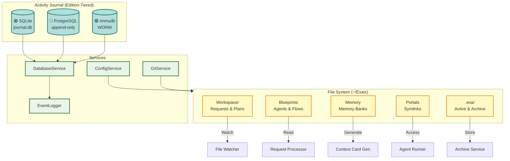

**Version:** 3.1\
**Date:** June 2, 2026

> **What this document covers:** component boundaries, dependency direction, edition-tiering rationale, and architectural invariants — the "why" that code alone doesn't convey.
> **What this document does NOT cover:** configuration syntax, CLI command trees, score formulas, step-by-step protocols, or schema definitions. Those live in package and app READMEs under `packages/` and `apps/`, with redirects in `docs/dev/`.

---

## Project Overview

Exaix is an **asynchronous, file-based AI agent harness** built with **Deno** and **TypeScript** — conceptually closer to GitHub Actions for AI agents than to a chat or IDE tool. Unlike session-oriented tools (OpenCode, Claude Code, Cursor) where conversation _is_ the state, Exaix models work as discrete, auditable artifacts:

- **Requests** are markdown files in `Workspace/Requests/`
- **Plans** are generated artifacts in `Workspace/Plans/`
- **Execution** produces Git branches for human review
- **Every step** is journaled to SQLite for a permanent audit trail

The pipeline processes work through a gated pipeline (file → plan → approve → execute → review → merge) rather than interactive chat sessions. It is designed for **autonomous, multi-agent orchestration with explicit gates** — plan approval, amendment approval, review/merge — not for interactive back-and-forth. This makes it suitable for CI/CD-like workflows where humans set policies and review outputs rather than steering each conversation turn.

## Edition Model Overview

> **Current Status (June 2026):** The **Solo edition** is fully implemented in this repository. Team and Enterprise editions use the **Option-C layout** — `packages-team/` (BSL) lives in the same repo; `exaix-enterprise/` is a private submodule. Edition-specific code is never loaded into Solo builds.

Exaix follows a **three-tier edition model** served by a single **`IEditionComposer`** composition seam:

```text
┌────────────────────────────────────────────────────────────┐
│                     exaix (monorepo)                       │
│ ┌────────────────────────────────────────────────────────┐ │
│ │  packages/  (MIT — always compiled)                    │ │
│ │  apps/daemon · apps/exactl · apps/tui · apps/mcp-server│ │
│ └────────────────────────────────────────────────────────┘ │
│ ┌────────────────────────────────────────────────────────┐ │
│ │  packages-team/  (BSL — Team+Enterprise)               │ │
│ └────────────────────────────────────────────────────────┘ │
│ ┌────────────────────────────────────────────────────────┐ │
│ │  exaix-enterprise/  (private submodule — Enterprise)   │ │
│ └────────────────────────────────────────────────────────┘ │
└────────────────────────────────────────────────────────────┘
```

**Composition architecture:** `IEditionComposer` (`@exaix/core/composer/`) is the single attach point for edition-specific capabilities. The Solo edition uses `SoloComposer` (default — zero paid features). SoloComposer is **passive**: it stores registered modules but does not invoke their hooks — Team/Enterprise composers will invoke them. Each runtime entry point (daemon, exactl, agent-entrypoint) instantiates `SoloComposer` as the hook anchor (`_editionComposer`), keeping the import path live for Team/Enterprise wiring. Team and Enterprise editions register `ICapabilityModule` instances that fill optional hooks (flow-step handlers, symbol extractors, guardrail runner, routing strategy, entitlement).

**Publishing:** Solo+Team source is published as OSS mirrors (`exaix-core` MIT, `exaix-team` BSL) via `git subtree split` with a leak-guard (`scripts/leak_guard.ts`) that blocks proprietary Enterprise code. The Enterprise submodule is excluded from the subtree filter and stripped from `.gitmodules` before publishing.

| Edition           | Target Audience                         | Key Differentiation                                             |
| ----------------- | --------------------------------------- | --------------------------------------------------------------- |
| **Solo** 🟢       | Individual developers, OSS contributors | CLI + TUI, SQLite audit, MCP client, local-first                |
| **Team** 🔵       | Small teams, startups, consulting firms | + Web UI, PostgreSQL, MCP server mode, multi-user collaboration |
| **Enterprise** 🟣 | Regulated industries, large enterprises | + Governance dashboard, compliance frameworks, immudb, SSO/SAML |

For the full component availability matrix by edition, see `docs/Reference_Data.md#edition-model--component-availability`.

---

## Composability with Session-Oriented Tools

Exaix is designed to **orchestrate rather than replace** session-oriented agent tools (OpenCode, Claude Code, Codex, Cursor). These tools excel at interactive refinement — clarifying intent, iterating on plans, or pair-programming code changes — while Exaix provides the governance, audit trail, and multi-agent orchestration that session tools lack.

The embedding points for session tools are the **pipeline gates** where human judgment adds most value: refinement, plan review, code changes, and review/merge.

Session tools are treated as **external delegates** — launched via a configurable tool call, not embedded in the Exaix process. The launch is configured per request, portal, or blueprint via a `session_delegate` section in TOML config.

### Architectural Invariant

Session tool integration **must not introduce session state into Exaix's core pipeline**. The pipeline remains file-driven and asynchronous. The session tool is a transient external process that reads from and writes to the same file system — it does not change how Exaix models work.

### Handoff Contract (session delegation)

The integration is realized by the `@exaix/session` package as a strict three-part handoff, so the invariant holds by construction (only files + a typed `return.json` cross back):

1. **Brief** — `SessionDelegateService.prepareBrief` (`@exaix/session`) atomically writes `Session/{traceId}/brief.json` (objective, scope globs, token budget, single-use resume token, deadline).
1. **Launch** — a per-tool `ISessionAdapter` from `SessionAdapterRegistry` (`@exaix/session`) builds a hardened launch (bare binary + discrete argv, token-budget env only); supervised spawns strip provider secrets and enforce a binary allowlist (`@exaix/session`). When `[session_delegate].harden_permissions = true`, `SessionDelegateService.resolveHardenedLaunch()` inserts a permission-derivation step before the launch: version probe → per-tool permission config generation → modified launch with `configPath` (OpenCode) or derived CLI flags (Claude Code, Codex).
1. **Return + Reconcile** — the daemon drains the tool's full stdout stream (bounded by `DELEGATE_STDOUT_DRAIN_MS`), parses tool-specific JSON events (`opencode` JSONL `text`/`step_finish`/`tool_use` events, `claude-code` single `{type:"result"}` object, or `codex`'s `item.completed`/`turn.completed` JSONL events), computes `git diff --name-only HEAD` for `paths_touched`, and atomically writes `Session/{traceId}/return.json` with real `paths_touched`, `token_stats`, and `cost_usd`. `SessionReturnWatcher` then invokes `SessionReturnProcessor`/`reconcile` (constant-time token check, two-stage path-scope enforcement against actual touched paths, gate/decision legality, non-blocking budget overage), maps the outcome into the existing amendment/review/clarification contracts (`@exaix/session`), and resumes the gate's durable wait state (`@exaix/session`).

Delegated output is **untrusted** and still flows through the same quality, critique, and review gates as autonomous output. For the pipeline gate diagram with ASCII art and TOML configuration sample, see `packages/flow/README.md#session-tool-integration`.

### Launch Modes

The session tool can be launched in one of three modes, configured via `session_delegate.launch_mode`:

| Mode       | Value        | Description                                                                                                                                                                                                    | Use case                                                               |
| ---------- | ------------ | -------------------------------------------------------------------------------------------------------------------------------------------------------------------------------------------------------------- | ---------------------------------------------------------------------- |
| **Mode 1** | `advisory`   | Exaix prints the command and waits for the human to run the tool out-of-band. The daemon parks a wait state; the human drops a `return.json` to resume.                                                        | Default for all tools; safe when the human wants to control execution. |
| **Mode 2** | `supervised` | Interactive TTY spawn from `exactl execute --delegate`. The CLI attaches the parent terminal so the human can interact with the session tool directly.                                                         | Interactive debugging or pair-delegation from the CLI.                 |
| **Mode 3** | `headless`   | Non-interactive spawn via `claude -p` / `opencode run` / `codex exec`. The daemon spawns the binary with a discrete argv prompt, fire-and-forget; `SessionReturnWatcher` reconciles the dropped `return.json`. | CI, automation, and daemon-side delegation where no human is present.  |

Mode 3 requires `bin_overrides` to add a tool binary to the spawn allowlist — except the
five built-in tools (`claude-code`, `opencode`, `cursor`, `vscode`, `codex`), which
`apps/daemon/main.ts` seeds into the allowlist unconditionally and never need
`bin_overrides` (see `packages/flow/README.md#session-tool-integration`). The compiled mock
tool at `.cache/mock_session_tool_bin` (built via `deno task build:mock-tool`) is used for
CI testing.

Codex's tested, intended integration path is Mode 3 (headless):
`createDefaultSessionAdapterRegistry()` (`@exaix/session`) registers `codex` without
supervised-launch support (`resolveLaunch()` throws for Mode 2), unlike `claude-code`/`opencode`.
With `harden_permissions = true`, `deriveCodexSandboxFlags` (`@exaix/session`) derives `--sandbox
workspace-write` for the `code_changes` gate or `--sandbox read-only` otherwise — a first,
in-process enforcement layer independent of the post-hoc `permitted_paths` scope check in step 3
above.

Mode 3 also supports a `[session_delegate.provider]` block (multi-delegate provider routing) that
declares which API gateway the delegate should use. When present, the daemon reads
the key from `key_env` and injects it into the child process **after** environment
sanitisation, so injected `API_KEY` vars survive the `SECRET_ENV_PATTERN` strip:

```toml
[session_delegate.provider]
name = "openrouter"       # "openrouter" | "anthropic" | "ollama"
key_env = "OPENROUTER_API_KEY"
base_url = "https://openrouter.ai/api"
```

Per-tool env injection follows a translation table
(`SessionDelegateService.resolveDelegateEnv`): OpenRouter+opencode sets
`OPENROUTER_API_KEY`; OpenRouter+claude-code sets `ANTHROPIC_BASE_URL`,
`ANTHROPIC_AUTH_TOKEN`, and `ANTHROPIC_API_KEY=""`.

The OpenRouter in-process provider (`@exaix/ai-openrouter`) also exposes OpenRouter's
control surface via a `routing` config block (Phase 123 R10): `provider` ordering
(`order`/`only`/`ignore`/`sort`), model fallbacks (`models`, ≤3), zero-data-retention
(`zdr`), and data-collection consent (`data_collection`). These fields are serialised
into the request body alongside `model` and `messages`.

### Session Delegate Cycle — Sequential Governed Delegations {#session-delegate-cycle}

The Handoff Contract above hands **one** pipeline gate to a session tool: one brief, one
launch, one return. `FlowStepType.SESSION_DELEGATE_CYCLE` (`type: session_delegate_cycle`,
Phase 174) is a distinct flow-step **type** — not a `strategy` value (see the `Flow Step
Execution Axes` subsection below) — that drives **N** of those single-shot handoffs in
strict sequence, one hardened-plan step at a time, each individually reviewed before the next
is allowed to start. It is the production replacement for routing an entire multi-step
implementation phase through the `cli_delegate` strategy on a single step: that strategy hands
the whole task to one unsupervised CLI session, while `session_delegate_cycle` decomposes it
into N governed, independently-reviewed delegations.

**Mechanism** (`SessionDelegateCycleStepHandler`, `@exaix/flow`): `PlanContextResolver`
resolves the request's sandboxed hardened-plan copy (`plan_context_ref`, always
root-relative to the configured portal — never request prose or flow YAML), the shared
phase-step-manifest parser parses its per-step manifests, and each parsed step is delegated
strictly in sequence via the injected `ISessionDelegationCoordinator`. No
promise for sequence N+1 exists before sequence N's outcome AND its `IGateEvaluator` review
both pass; any failure class halts before further coordinator calls.

**Configuration** (`ISessionDelegateCycleConfig`, on the step's `delegateCycle:` key):

```yaml
delegateCycle:
  requireChangedPaths: true # non-empty paths_touched required; always true today
  review:
    identity: quality-judge # judge identity evaluating each completed step
    criteria: [code_correctness, has_tests, task_fulfillment]
    threshold: 0.8
    onFail: halt # halt | retry
    maxRetries: 3
    includeRequestCriteria: false
```

**Durability and lineage (Phase 174 Step 4):** a SQLite-backed `ISessionDelegateCycleClaimStore`
is the launch source of truth — a unique `(parentTraceId, parentStepId, sequence, planDigest)`
key guarantees at most one durable launch across crash points and duplicate handler/watcher
entry. An atomic JSON checkpoint (`ISessionDelegateCycleStore`) mirrors progress
(`completedSteps`, an optional `inFlight` step, `status`) for cheap resume without re-scanning
claims; a checkpoint whose identity or `planDigest` no longer matches, or that is already
terminal, is rejected (`checkpoint_mismatch`) rather than silently overwritten. Each sequence's
delegation runs under its own `delegationTraceId`, distinct from the parent flow's trace, with
`parent_trace_id` carried in the `session.delegate.launched` event payload for lineage.

**Journal events:** `session.delegate.cycle_started`, `.cycle_step_completed`,
`.cycle_step_rejected` (carrying a categorical `ISessionDelegateCycleRejectionReason` —
`plan_too_large` | `too_many_steps` | `plan_parse_failed` | `non_completed_status` |
`empty_paths_touched` | `review_failed` | `checkpoint_mismatch` — deliberately excluding free
text, review feedback, or paths, since those could carry prompt content or host paths),
`.cycle_completed`, and `.cycle_resumed` — all journaled under the **parent** flow's trace
(unlike `session.delegate.launched`, journaled under the delegation's own trace).

**Production usage:** `Blueprints/Flows/dogfood-meta-workflow.flow.yaml:next-steps` is the
shipped consumer — it replaced a `strategy: cli_delegate` step with `type:
session_delegate_cycle`, so the dogfood loop's per-step implementation now runs through this
governed mechanism instead of one unsupervised CLI session. Full design, durability model, and
verification evidence: `exaix-dev-docs/planning/phase-174-dogfood-recursive-step-orchestration.md`;
package-level configuration and restart/failure semantics:
`packages/flow/README.md#session-delegate-cycle`, `packages/session/README.md`.

---

## Key Design Principles

### 1. **Files as API**

- Request input: Markdown files in `Workspace/Requests`
- Plan output: Markdown files in `Workspace/Plans`
- Configuration: TOML with Zod validation
- Context: File system is source of truth

### 2. **Separation of Concerns**

- **CLI Layer**: Human interface (exactl)
- **Core Layer**: Daemon orchestration (main.ts, watcher)
- **Service Layer**: Business logic (processors, runners)
- **Storage Layer**: Edition-tiered databases + file system

### 3. **Auditability & Governance**

- Every action logged to Activity Journal (tiered by edition)
- Trace ID links: request → plan → review → commit
- Immutable event stream for compliance (🟣 Enterprise: WORM storage)
- Explicit approval gates: plans and reviews require human authorization
- Durable, resumable wait states for approval gates — explicit lifecycle transitions, resume tokens, and time-based expiry via `exactl wait approve|reject|amend|expire`

### 4. **Multi-Provider Support**

- Local-first: Ollama (no cloud required)
- Cloud options: Claude, GPT, Gemini (🟢 all editions)
- Vertex AI: Google service-account auth for project-based quotas and regional endpoints (🔵 Team+; `@exaix-team/ai-vertex`)
- OpenRouter: unified gateway to many models (ships in the Solo build; positioned as a 🔵 Team+ differentiator; `@exaix/ai-openrouter`)
- Enterprise providers: Azure OpenAI, AWS Bedrock (🟣 Enterprise)
- Provider factory pattern for extensibility; concrete providers register at bootstrap via `apps/common/registry_bootstrap.ts` (Solo) or `packages-team/team-composer/src/team_bootstrap.ts` (Team)
- Cost management with edition-tiered capabilities
- **Model registry (Solo tier, the curated model registry):** the model resolver consults an `IModelRegistry` when selecting a concrete model for an intent. Solo ships a lightweight **floor** — a static, no-network catalog of provider/model capabilities and pricing provenance — so resolution stays offline and deterministic. Resolution honours a user-**curated list** first (per-size preferred providers, `preferred_list` reason), exempts genuinely local/free providers from cost filtering, and never fabricates a price for an unknown-priced model. A live catalog and routing rigor are Team+ capabilities, attached through the edition seam (`IModelRegistryProvider`); when no Team module is present the Solo floor is used and behaviour is unchanged. See `packages/model-registry/README.md` and the User Guide's model-intent section.

### 5. **Portal System**

- Symlink-based external project access
- Context cards for agent understanding
- Scoped permissions (Deno security model)
- Multi-project refactoring support

### 6. **Edition-Aware Architecture**

- Core components available in all editions (🟢 Solo)
- Collaboration features in Team+ (🔵 Team)
- Governance and compliance features in Enterprise (🟣 Enterprise)
- **Composition seam:** `IEditionComposer` (`@exaix/core/composer/`) is the single attach point for paid capabilities; `ICapabilityModule` registers hooks per seam
- **Option-C layout:** `packages/` (MIT) · `packages-team/` (BSL, same repo) · `exaix-enterprise/` (private submodule)
- **Solo defaults:** `SoloComposer` with `AllowAllAuthorizer` — zero paid code in Solo builds
- **Edition build:** `build:solo|team|enterprise` selects entry point + prefix via `scripts/ci.ts`
- **Leak-guard:** `scripts/leak_guard.ts` blocks Enterprise paths and proprietary headers from OSS publish targets
- **Seam registries** (flow-step handlers, symbol extractors, guardrail runner, routing strategy) use `ISeamRegistryPlaceholder` in core; concrete types resolved at the app-entry level
- Transparent feature tiering with upgrade path

### 7. **Packages vs. Services — Placement Model**

**The placement test — one question:** _Can an external consumer use this module without knowing the Exaix daemon exists?_

- **Yes** → it belongs in a package under `packages/`.
- **No** → it belongs in `apps/` (runtime wiring).

An `apps/` or runtime-wiring module orchestrates the running Exaix process. It coordinates multiple packages and runtime concerns: `Config`, `DatabaseService`, `EventLogger`, file-system state, process lifecycle. It wires packages together into coherent business flows, bootstrapped in `apps/daemon/main.ts` and `apps/exactl/src/init.ts`.

**Common tells that a module belongs in a package:**

- It has no `Config`, `DatabaseService`, or `EventLogger` in its constructor.
- Its tests use only in-memory stubs or temp directories — no `initTestDbService()`.
- Another package already imports it (or would need to, for type correctness).
- Its domain logic would be equally valid in a different application.

**Common tells that a module belongs in `apps/` (runtime wiring):**

- It instantiates or receives a `DatabaseService` to persist state.
- It emits events via `EventLogger` as part of its contract.
- It reads from `Config` to determine runtime behaviour (paths, thresholds, feature flags).
- It coordinates two or more packages — it is glue, not logic.
- Removing it would break daemon startup or the request-processing pipeline directly.

---

## Execution Semantics

Exaix's reliability rests on three layered guarantees — each inspectable through the Activity Journal, CLI, and flow artifacts rather than asserted as marketing language:

1. **Visibility** — Every significant runtime transition emits a typed, versioned, trace-linked domain event (`DomainEventType`; see the `Event Taxonomy` subsection below) — "trace-linked" means every lifecycle event for one operation carries that operation's canonical trace ID as the logger call's fourth argument, not just an embedded payload field, so the events are joinable in the Activity Journal. Operators can inspect what happened at any point in a run's lifecycle without reading raw runtime state. A class carrying the `@visible` JSDoc tag (see `CODE_STYLE.md#jsdoc-header-tags`) declares itself explicitly load-bearing for this guarantee — `scripts/check_event_coverage.ts --fail-on-tagged` treats any coverage gap on it as blocking at the real pre-commit hook (Gate 19), not advisory, and requires the emitted action to be a registered `DomainEventType` member, not merely a logger call. A streaming or async-generator operation on a tagged class must emit exactly one terminal event covering every exit path, including early consumer cancellation, not only normal completion and thrown error.
1. **Recoverability** — Step results are persisted with idempotency keys so a failed run can resume from the last successful step rather than recompute from scratch; this resumption path is still maturing and should not yet be relied on as a complete guarantee. Long-running execution context is managed and compacted automatically by the Context Budget Manager (see the `Context Budget Management` subsection below).
1. **Governance** — Human approval gates are first-class durable wait states with explicit lifecycle transitions, resume tokens, and operator-driven resolution via `exactl wait approve|reject|amend|expire` (see `Request Quality Gate` below and `packages/flow/README.md` for the full wait-state lifecycle).

Together these three tiers answer the question every operator asks before trusting an agent with a codebase: _what is it doing right now, can it recover from a transient failure without starting over, and can a human stop it before it commits to something irreversible?_

### Semantic Progress Milestones

Milestone events are higher-level projections of domain events for operator-facing UX surfaces. They follow a stable enumerated taxonomy (`ExecutionMilestoneSchema`, `@exaix/schemas`) and are emitted via `IMilestoneEmitter` (`@exaix/core`).

- **Schema**: `ExecutionMilestoneSchema` (Zod) validates `milestoneId` (UUID), `traceId`, `milestoneType` (18-value enum), `requiresAttention` flag, `attentionReason`, `progressHint` (steps completed/total/current label), `occurredAt` timestamp, and `summary` (printable ASCII).
- **Emitter interface**: `IMilestoneEmitter` exposes `emit(milestone: IExecutionMilestone): Promise<void>`. A `NoopMilestoneEmitter` provides a no-op default when milestone streaming is disabled.
- **Bridge to SSE**: `MilestoneEventBusEmitter` implements `IMilestoneEmitter` and publishes milestones as `IStreamingEvent` with type `"milestone"` via `EventBusService`, making them available to the SSE endpoint and CLI `watch` command.
- **Design invariant**: Milestones are projections of existing domain events — they do not replace domain events or change execution semantics. The `requiresAttention` flag enables operator notification for approval gates and other human-in-the-loop scenarios.

---

## Storage & Data Flow

Exaix uses a **tiered database architecture** aligned with edition requirements:

| Edition           | Audit Database           | Compliance Level                               |
| ----------------- | ------------------------ | ---------------------------------------------- |
| **Solo** 🟢       | SQLite (embedded)        | Basic audit logging                            |
| **Team** 🔵       | PostgreSQL (append-only) | Multi-user with database-enforced immutability |
| **Enterprise** 🟣 | PostgreSQL + immudb      | WORM-compliant, cryptographically verified     |



### Path settings (`config.paths`)

Every directory the runtime touches is named by a `config.paths.*` entry, and consumers resolve
`join(config.system.root, config.paths.<key>)`. Two of these entries carry contracts worth knowing
before reading a config:

- **`paths.memoryExecution` accepts two forms.** It shipped as the bare `"Execution"`, meaning
  _relative to `paths.memory`_, and the default was later repointed to the composite
  `"Memory/Execution"`, meaning _relative to the workspace root_. Configs carrying either value are
  still valid. Resolution goes through one helper —
  `packages/core/src/config/paths.ts:resolveMemoryExecutionRoot` — which treats a value containing
  a separator as already root-relative and joins a bare name onto `paths.memory`. Joining a
  composite value onto `paths.memory` yields `Memory/Memory/Execution`, which is the failure the
  helper exists to prevent; `tests/config/memory_execution_resolution_test.ts` pins both forms and
  fails if a consumer inlines the rule instead of calling the helper.

- **`paths.flows` has exactly one resolution rule and one rejected legacy value.** Consumers read
  the setting; none recomposes it from `paths.blueprints` plus the flows subfolder, because the two
  rules agree only on a default workspace and diverge under an override. The pre-Phase-142 default
  `"Flows"` is refused at config load with a message naming `Blueprints/Flows`: it resolves to a
  directory the catalog has never shipped in, and the symptom was `exactl flow list` reporting
  "No flows found" against a workspace holding twenty flows.

### Config DB (.exa/config.db)

The `.exa/config.db` SQLite database stores configuration overrides for keys registered via `configurable()`. It complements the TOML bootstrap (`exa.config.toml`) which supplies only `system.root` and boot-time paths. As of Phase 137, **180+ `configurable()` keys** are registered across all packages (core, AI providers, git, etc.).

**Schema:** Append-only `config_overrides` table (`id`, `key`, `value`, `source`, `swap_class`, `created_at`) with no UPDATE path — every override creates a new row. The latest row per key (by max id) is the effective value; a NULL value means "use registry default."

**Adapter pattern:** `IConfigAdapter` interface (`packages/core/src/config/adapter.ts`) provides `get`, `set`, `unset`, `validate`, `diff`, `getProvenance`, etc. Two implementations:

- `DirectConfigAdapter` — opens its own `@db/sqlite` connection for offline read/write (CLI mode, daemon not running).
- `DaemonConfigAdapter` extends `DirectConfigAdapter` — shares the daemon's `@db/sqlite` handle, reads from `InMemoryConfigStore` (daemon's live cache), writes through to Config DB. For hot-swappable (`swap: "hot"`) keys, applies changes to the in-memory store immediately. Warns on auth-secret plaintext writes.

**Factory:** For external callers (CLI/MCP), `createConfigAdapter()` (sync) selects the daemon adapter when both a store+db handle are supplied and a PID file EXISTS — it does not verify liveness. `createConfigAdapterAsync()` additionally verifies the PID is a live process (`kill -0`, via the core-local `isPidAlive`) and falls back to `DirectConfigAdapter` on a stale PID; prefer it when attaching to a possibly-dead daemon. The **daemon process itself does not use the factory for self-detection** — it constructs `DaemonConfigAdapter` directly at boot (`apps/daemon/main.ts`).

**Cutover (daemon read path):** At boot the daemon populates `InMemoryConfigStore` from `getAllEffectiveValues()` + registry defaults, constructs a `DaemonConfigAdapter`, and wires it into `IApplicationContext.configAdapter` (the narrow `IConfigAdapter` types-only surface). The daemon resolves non-bootstrap keys through the adapter (bootstrap keys — `system.root`, `schema_version` — stay on TOML). Boot journals a `config.cutover.resolved` event carrying a representative migrated key's resolved value + provenance, so the read path is observable end-to-end (`tests/integration/config_cutover_daemon_boot_test.ts`).

**DB watcher:** A polling loop (`DEFAULT_CONFIG_DB_POLL_INTERVAL_MS` = 5s; overridable via `EXA_CONFIG_DB_POLL_INTERVAL_MS` for tests) compares `MAX(id)` in `config_overrides`. When a new override is detected, `createDbWatcherHandler()` hot-applies `swap: "hot"` keys to the in-memory store and journals a `config.db_watcher.change_detected` event (distinct from the `config.updated` used for direct writes). Restart-required keys are skipped (applied on next boot). The poll loop also runs periodic integrity verification gated by `CONFIG_INTEGRITY_POLL_INTERVAL_MS` (default 60s), journals `config.integrity_verified` or `config.integrity_mismatch`, and is cleared on shutdown.

**Resolution order** for `get(key)`: (1) Config DB override → (2) registry default (from `configurable()`) → (3) ConfigSchema default → (4) undefined. Profile-scoped keys (`profile.<name>.<key>`) validate against their unscoped base key's metadata via `resolveValidationKey()`; global reads do not fall through to the active profile (explicit `--profile` scoping only).

**MCP config tools:** 6 domain tools registered at `packages-team/mcp-server/config_tools.ts`: `ConfigGet`, `ConfigSet` (staging), `ConfigValidate`, `ConfigDiff`, `ConfigGetProvenance`, `ConfigApply`.

The 4 read-only tools are auto-approved; the mutation tools (`ConfigSet`, `ConfigApply`) gate on human approval. `ConfigApply` awaits each staged `set()` and records per-key applied/error results.

**Security controls (config security hardening):**

- **Three-tier MCP authorization** — `ConfigSet.execute()` routes by the key's tier, **derived** (not hand-annotated) from existing metadata via `resolveTier(key)` (`packages/core/src/config/registry.ts`): `swap: "restart"` or `edition: "team"` → `"dangerous"` (stage + human approval + a `requires_confirmation: true` marker in the response for a future approval-UI phase); otherwise → `"leaf"` (stage + human approval); an explicit `tier: "safe"` override on the `configurable()` opts → `"safe"` (writes through immediately, no staging). The own-portal auto-approve tier is deferred (no own-portal context on the MCP tool yet). `requires_confirmation` on `IToolManifestEntry` is metadata-only this phase.
- **Deny-permanently blocklist** — a `config_mcp_blocklist` table (`agent_id` nullable = all-agents; `key_pattern` glob) blocks MCP config writes. `ConfigSet`/`ConfigApply` refuse blocked paths through `IConfigAdapter.isPathBlocked()` (the adapter owns the private config `Database`; MCP tools never touch a raw handle), returning a `ConfigPathBlockedError` via `formatToolError`. Managed by `exactl config block {add,remove,list}`.
- **Rate limiting** — CLI debounce (max `CLI_CONFIG_SET_MAX_WRITES_PER_WINDOW` per `CLI_CONFIG_SET_DEBOUNCE_WINDOW_MS`) is **DB-backed** via `IConfigAdapter.countRecentWrites()` so it survives across separate CLI processes; MCP staging is capped at `MCP_CONFIG_SET_MAX_PENDING` (in-process); the append-only log has a `CONFIG_DB_OVERRIDE_HARD_LIMIT` anti-DoS page-limit that **exempts tombstone (`unset`) and `init` writes** so recovery always works, with `exactl config compact` (`IConfigAdapter.compact()`, collapses to one row per key) as the escape hatch. All three throw/surface `ConfigRateLimitedError`.

**Config history, rollback, and integrity checksum:**

- **Config history/rollback CLI** — `config history <key>` reads the append-only log via `IConfigAdapter.getHistory(key)` (already on the interface), displaying each entry as `id=<id> <value> <created_at> (source: <source>)` newest-first. `config rollback <key> <id>` looks up the historical row by id, appends a new row restoring that value with `source="rollback"`, and emits `config.rolled_back`. Both leverage the existing `getOverrideHistory` and `insertOverride` DAOs with no schema changes.
- **Key locking (`config_locked_keys`)** — a `config_locked_keys` SQLite table (`key`, `locked_at`, `locked_by`, `reason`) checked by a shared `assertWritable(validationKey)` guard inside both `DirectConfigAdapter.set()` and `DaemonConfigAdapter.set()`, called with the **resolved** validation key (not the raw caller-supplied key) so a lock on a base key also covers profile-scoped writes to it (GAP-1, closed in post-gap remediation). A locked key is refused by every write surface (CLI `set`, MCP `ConfigApply`, daemon own writes, profile-scoped `set`) with `ConfigKeyLockedError` until `config unlock`. Managed by `config lock/unlock/lock-list` CLI commands; emits `config.key_locked`/`config.key_unlocked` events.
- **Integrity checksum (`_checksum`)** — a SHA-256 hash over the effective Config DB (all keys except `_checksum` itself, sorted, concatenated as `key||value`), stored as a synthetic `_checksum` row in `config_overrides` with `source="integrity"`. `persistChecksum()` refreshes it after every adapter write so legitimate writes never trip a mismatch. `verifyIntegrity()` compares stored vs. computed at daemon boot and on each periodic poll tick (gated by `CONFIG_INTEGRITY_POLL_INTERVAL_MS`), journaling `config.integrity_verified` (match) or `config.integrity_mismatch` (tamper detected). Excluded from `listOverrides()`, `diff()`, and the DB watcher's hot-apply loop.
- **Config edit (`$EDITOR`)** — `config edit` renders current overrides (excluding `_checksum`) to a temp file as `key = value` lines, opens `$EDITOR`, and applies changed lines through `adapter.set()` so lock/validation/debounce all still apply. Non-zero editor exit discards all changes. Every changed line is validated via `adapter.validateAtPath()` **before** any line is applied; if any line fails, the edit aborts with no committed changes (GAP-3, closed in post-gap remediation) — avoids the partial-apply state where a later invalid line would otherwise leave earlier valid lines already written. Mirrors the existing `$EDITOR` spawn pattern from blueprint commands.
- **Rollback id validation** — `config rollback <key> <id>` rejects a non-integer or non-positive `id` with a clear `rollback id must be a positive integer` error before it reaches the DAO lookup, instead of silently coercing to `NaN` and surfacing a confusing `ConfigKeyNotFoundError` (GAP-4, closed in post-gap remediation).

**CLI surface:** `exactl config {get,set,unset,validate,show,diff,set-model,set-provider,set-path,use-profile,list-profiles,history,rollback,lock,unlock,lock-list,edit,block {add,remove,list},compact}` with `--json`, `--sources`, and `--profile <name>` (scopes `get`/`set` to `profile.<name>.<key>`) flags.

**Validation bounds:** Zod schemas use `resolveConfigurableBounds(key)` from `@exaix/core/config` (via `c()`/`cBounds()` helpers at `packages/schemas/src/config.ts`) to derive min/max/default from the registry — no separate MIN/MAX constants needed.

**CI gate:** `deno task check:config-keys` ensures no duplicate keys.

Design docs: `exaix-dev-docs/planning/phase-136-configuring.md`, `exaix-dev-docs/planning/phase-137-configuring-cutover.md`

---

## Parsing & Schema Layer

Exaix centralizes file-format parsing and validation into two layers:

- **Parsers** (`@exaix/core`): extract structure from Markdown files (YAML frontmatter + body).
- **Schemas** (`@exaix/schemas`): validate structured objects using Zod (requests, plans, flows, portals, MCP).

This layer is what keeps file-driven workflows safe and deterministic: request/plan files may come from humans or LLMs, but the runtime only proceeds when schemas validate.

For the key modules table with file paths and sub-schema listings, see `docs/Reference_Data.md#parsing--schema-layer--key-modules`.

---

## Request Analysis Layer

The `RequestAnalyzer` performs intent extraction before routing, identifying goals, requirements, constraints, and ambiguities. It classifies complexity and actionability to guide provider selection and execution strategy. Analysis runs in three modes (Heuristic / LLM / Hybrid) with a default actionability threshold of 80.

Request-analysis events use constructor injection all the way to the journal. The exported
`IRequestServiceConfig.logger` is the CLI service seam: `apps/exactl/src/init.ts` supplies its
canonical `EventLogger`, while `RequestProcessor` supplies its already-resolved processor logger.
Both paths pass that logger to `RequestAnalyzer`. `RequestAnalyzer._logActivity` maps
`IRequestAnalysisContext.traceId` through `LogSyncMethod.traceIdMapper`, so every
`request.analyzed` lifecycle row is persisted under the originating request trace rather than a
new decorator-generated trace. Package code does not construct its own `EventLogger`.

For analysis mode details, data flow steps, and hardening additions, see `packages/request/README.md#request-analysis-layer`.

---

## Request Processing Flow

<!-- AGENT_LOGIC: {
  "flow": "Request Processing Loop",
  "steps": [
    "CLI/Daemon creates request file in Workspace/Requests",
    "File Watcher triggers RequestProcessor",
    "RequestProcessor validates and initializes context",
    "RequestAnalyzer extracts intent and requirements",
    "RequestProcessor routes internally: agent requests to AgentRunner, flow requests to FlowRunner",
    "AgentRunner executes agent task and generates Plan via AI Provider (ProviderFactory chain)",
    "FlowRunner executes multi-agent flow with declared/dynamic steps via AgentExecutorAdapter",
    "PlanWriter materializes Plan to Workspace/Plans",
    "FlowRunner pauses on failing quality gates, creating durable wait states for operator resolution",
    "Operator approves, rejects, or amends wait states via `exactl wait` CLI commands",
    "Activity Journal records lifecycle events (including wait-state events)"
  ]
} -->

For the step table (component→file path mapping), sequence diagram, and analysis mode details, see `packages/request/README.md`.

For frontmatter YAML examples, request type samples, flow validation rules, routing policy audit events, and CLI inspection commands, see `packages/request/README.md#request-routing`.

---

## Request Quality Gate

The **Request Quality Gate** is a pre-execution filter that assesses every incoming request body before routing. It prevents vague or unactionable requests from consuming LLM budget and provides an iterative Q&A loop to improve request quality.

When a quality gate step fails during flow execution and a `waitStateService` is configured, the `FlowRunner` creates a **durable wait state** that pauses the flow until an operator resolves it via `exactl wait approve|reject|amend|expire`. This replaces the previous feedback-loop retry model with an explicit asynchronous approval workflow with resume tokens and time-based expiry.

The gate produces one of four recommendations: **PROCEED**, **AUTO_ENRICH**, **NEEDS_CLARIFICATION**, or **REJECT** — each with configurable score thresholds. Assessment runs in `heuristic`, `llm`, or `hybrid` mode.

For thresholds, assessment modes, Q&A protocol, session structure, configuration schema, and CLI commands, see `packages/quality-gate/README.md#request-quality-assessment`.

---

## Acceptance Criteria Propagation

Acceptance criteria propagation closes the gap between "what was asked" and "what quality gates evaluate" by propagating extracted acceptance criteria through the entire evaluation pipeline.

Verification occurs at **three independent layers**:

1. **Quality Gate** (blocking, post-step) — `GateEvaluator` invoked synchronously by `FlowRunner` after guarded agent steps; blocks the flow if scores fall below threshold.
1. **Reflexive Critique** (iterative, in-flight) — `ReflexiveAgent.run()` embeds structured requirements into the critique prompt; corrects artifacts before they reach a gate.
1. **Confidence Scoring** (non-blocking, post-execution) — `ConfidenceScorer.assess()` blends requirement-fulfilment evidence into the final confidence score.

All three layers degrade gracefully when `IRequestAnalysis` is absent: gates use only static criteria, `ReflexiveAgent` omits the requirements block, and `ConfidenceScorer` applies no goal-alignment penalty.

For criteria generation rules, gate configuration, built-in criteria definitions, critique prompt format, and scoring formulas, see `packages/quality-gate/README.md#acceptance-criteria-propagation`.

---

## Plan Execution Flow {#plan-execution-flow}

<!-- AGENT_LOGIC: {
  "flow": "Plan Execution Loop",
  "steps": [
    "PlanWatcher detects approved plan in Workspace/Active",
    "Daemon initializes PlanExecutor with plan path",
    "PlanExecutor parses Plan and loads execution context",
    "ReAct loop starts for each step in the plan",
    "AI Provider proposes tool actions in structural TOML",
    "ToolRegistry validates and executes requested tools",
    "GitService commits atomic changes and generates trace metadata",
    "Activity Journal persists results for auditing"
  ]
} -->

The **Plan Executor** service orchestrates the step-by-step execution of approved plans. It uses a ReAct-style loop to prompt the LLM for actions, executes them via the **Tool Registry**, and commits changes to Git after each step.

For the step table, sequence diagram, component hierarchy, MCP server implementation notes, tool execution paths and ownership map, plan file structure diagram, and activity logging events, see `packages/execution/README.md`.

---

For flow namespace coordination, error recovery, parallel execution groups, and
wait states, see `packages/flow/README.md`. Step-level durability and replay —
idempotency-keyed step persistence enabling resumption from the last successful
step rather than recomputation from scratch — is still maturing and should not
yet be relied on as a complete guarantee.

---

### Flow Step Execution Axes {#flow-step-execution-axes}

A flow step has two independent, orthogonal execution controls — changing one never changes
the other's behaviour:

- **`execution_mode`** (`declared` | `dynamic`, default `declared`) — the _engine_ axis:
  whether the step's tool calls are pre-declared (`tools:`/`permitted_tools:`, human-authored)
  or selected by the model at runtime.
- **`strategy`** (`react` | `mcp` | `cli_delegate`, optional, DECLARED-only) — the _agent
  strategy_ axis: routes a DECLARED step through the agent strategy registry
  (`AgentOrchestrator.executeStep`) instead of the default single-shot `AgentRunner.run` path.
  Left unset (the catalog default for most steps), the step takes the direct-generate path.
  `react` runs the daemon's own ReAct tool-use loop against the step's portal; `cli_delegate`
  delegates the whole step to a headless CLI subprocess (`opencode`/`claude`) driving its own
  autonomous session. Setting `strategy` on a `dynamic` step is a schema validation error —
  a dynamic step already selects its own tools at runtime, so a forced strategy is redundant
  and the two axes would conflict.

`AgentStepHandler.execute` checks `step.strategy` first: when set, it calls
`IAgentExecutor.runWithStrategy`, which builds a fresh, per-call `AgentOrchestrator` (never a
stored, long-lived instance, so one flow's writes can never leak into an unrelated flow's audit)
and dispatches through the forced strategy; otherwise it falls through to the unchanged `run()`
path, so a step with no `strategy` is byte-for-byte unaffected. See
`exaix-dev-docs/planning/phase-159-flow-step-execution-strategy.md` for the full rollout
rationale and the catalog-wide decision rubric, and `docs/Exaix_User_Guide.md` for the
field's user-facing documentation.

`type: session_delegate_cycle` (see the `Session Delegate Cycle` subsection above) is
a separate axis from both of these: a flow step's `type:` selects its `IFlowStepHandler`
entirely (`FlowRunner`'s dispatch, before `AgentStepHandler`/`execution_mode`/`strategy` ever
apply), so `strategy: cli_delegate` and `type: session_delegate_cycle` are not alternatives on
the same step — one is an `AgentStepHandler` execution mode, the other is a different handler
altogether that happens to solve the same "delegate this work to a session tool" problem at a
different granularity (one whole step vs. N reviewed sub-steps).

## Per-Action HITL Governance {#hitl-governance}

_Phase 118, Team/Enterprise Edition — gated by `CAP_HITL_GOVERNANCE`._

Exaix provides **three distinct human checkpoints**, each with a different scope:

| Checkpoint             | Scope                                               | Config                                    | Surface                                                      |
| ---------------------- | --------------------------------------------------- | ----------------------------------------- | ------------------------------------------------------------ |
| **Plan approval**      | Authorizes an entire plan before execution          | `amendment.hitl_timeout_ms`               | Plan gate                                                    |
| **Amendment approval** | Authorizes plan changes during execution            | `amendment.hitl_timeout_ms`               | `PlanAmendmentGate`                                          |
| **Per-action HITL**    | Pauses a specific tool invocation by argument match | `config.hitl.enabled` + `mandatory_rules` | `ToolRegistry` (primary) + `DynamicStepExecutor` (secondary) |

### How it works

A blueprint author declares which tool invocations need secondary approval via an optional
`hitl.require_secondary_approval` block in the YAML frontmatter. An administrator can declare
non-bypassable `config.hitl.mandatory_rules`. Both use the same `HitlRuleSchema` with per-argument
glob matching (`path_pattern`, `command_pattern`, `branch_pattern`, `tables`).

When a tool is invoked, a single `IHitlPolicyEvaluator` instance is consulted at **two call-sites**:

1. **`ToolRegistry` pipeline (primary)** — a HITL middleware stage runs before the core executor,
   covering all mutating tools (`write_file`, `git_commit`, `run_command`, etc.).
1. **`DynamicStepExecutor` (secondary)** — the same evaluator is consulted at the existing tool confirmation interceptor
   decision point, covering read-biased tools in the ReAct loop.

On a rule match, the pipeline journals a typed `HitlPolicyMatched` event (carrying the matched
`rule.reason` and `surface: "tool_registry" | "dynamic"`) and routes through the existing
`IToolConfirmationInterceptor`. On denial, the tool is short-circuited with a denied `IToolResult`.
If no interceptor is available, **mandatory** rules fail closed (tool denied), while **blueprint-only**
rules degrade gracefully (tool proceeds).

The Team-only `HitlPolicyEvaluator` lives in the `@exaix-team/hitl` package.
The MIT seam (`IHitlPolicyEvaluator`) is exported from `@exaix/core/types`.
Solo edition injects no evaluator, producing identical behaviour to pre-P118.

---

The `voting_group` flow step type enables multi-agent consensus by fanning out N
runner executions and resolving a winner via configurable strategy. It is a
**Team/Enterprise** feature (Solo ❌ / Team ✅ / Enterprise ✅).

### Step Type

`FlowStepType.VOTING_GROUP` (`"voting_group"`) is dispatched by the
`FlowRunner` to `VotingStepHandler`, which delegates to
`VotingConsensusService`. The handler is registered at daemon bootstrap via the
`VotingCapabilityModule` → `IEditionComposer` seam — in Solo mode no handler is
registered, so a `voting_group` step raises `UnknownFlowStepError`.

### Fan-Out

The service fans out N runners via `Promise.allSettled` over an injected
`IExecutor`. Each runner executes a distinct blueprint with an optional
prompt variant. Partial failures (some runners crash) are isolated — survivors
still resolve.

### Strategy Table

| Strategy    | Deterministic | CI-safe | Description                                               |
| ----------- | ------------- | ------- | --------------------------------------------------------- |
| `majority`  | ✅            | ✅      | Most frequent response wins                               |
| `weighted`  | ✅            | ✅      | Highest `confidence` score wins; ties → no-consensus      |
| `llm-judge` | ❌            | ❌      | Judge blueprint ranks candidates; requires eval substrate |

### No-Consensus Governance

When consensus cannot be reached, the `halt_on_no_consensus` config flag
determines behavior:

- **`true`** (default) — triggers the Plan Amendment gate via
  `IPlanAmendmentService`, halting execution
- **`false`** — continues with the best-confidence candidate, journaling a
  `dissent_summary`

### Cost Attribution

Each runner execution records a cost entry through `ICostTracker` (if
configured), attributed per `runner_id` with the voting step's `traceId`.

---

## AI Provider Architecture {#ai-provider-architecture}

Provider integrations are organized as independent packages (`@exaix/ai-anthropic`, `@exaix/ai-openai`, `@exaix/ai-google`, `@exaix-team/ai-vertex`, `@exaix/ai-openrouter`, `@exaix/ai-ollama`, `@exaix/ai-clidelegate`), selected via `ProviderSelector` → `CircuitBreaker` → `ProviderFactory`. Solo-edition providers are registered by `apps/common/registry_bootstrap.ts`; Team-edition providers (Vertex AI) are registered by `@exaix-team/team-composer`.

`@exaix/ai-clidelegate` registers a distinct kind of `IModelProvider`: `CliDelegateModelProvider` implements ReAct-loop `generate()` by spawning a headless CLI subprocess (`codex exec --json`, `claude --print`, or `opencode run`) and parsing its stdout, rather than calling a metered HTTP API. It backs three providers — `codex-cli`, `claude-cli`, `opencode-cli` — selectable via `[ai].provider` / `[models.<name>].provider` like any other provider, but billed against the CLI's own subscription (`cost_usd` always `0`). This is independent of the `[session_delegate]`/Mode 3 session-delegation contract above, which hands an entire pipeline gate — not a single `generate()` call — to the same external tools.

For the provider component table and edition availability matrix, see `packages/ai/README.md#provider-components`.

### LLM Routing Architecture

Exaix has **five independent routing mechanisms** that control how LLM calls reach their target. They operate at different layers and can be combined:

#### 1. Provider Selection — API Provider A vs B

**File:** `packages/ai/src/provider_factory.ts` (line 240), `packages/ai/src/routing/default_routing_strategy.ts` (line 76)

Selects which LLM API provider to call (Anthropic, OpenAI, Google, Ollama, OpenRouter, or Mock):

```text
EXA_LLM_PROVIDER env var ──guard──→ config.ai.provider ──guard──→
  config.provider_strategy.task_routing[taskType] ──guard──→
    selectProvider(capability + free + budget + health + complexity)
```

**Guards at each step:** provider must be registered, not blocked in CI/Test (`EXA_TEST_ENABLE_PAID_LLM=1` to unblock), and healthy. Defaults to `mock` when nothing is configured.

#### 2. Quality Gate Mode — Heuristic vs LLM Assessment

**File:** `packages/quality-gate/src/request_quality_gate.ts` (line 221)

Controls whether the request quality gate uses zero-cost heuristics or LLM-powered assessment:

| Config `quality_gate.mode` | LLM called?                           | Fallback                 |
| -------------------------- | ------------------------------------- | ------------------------ |
| `"heuristic"`              | Never                                 | N/A                      |
| `"llm"`                    | Always                                | Heuristic on LLM failure |
| `"hybrid"` (default)       | Only if heuristic score is borderline | Heuristic                |

#### 3. Refinement Routing — LLM Q&A vs Session Tool Delegation

**File:** `packages/request/src/processor.ts` (line 457)

When the quality gate determines a request needs clarification, decides between the LLM-powered Q&A loop and delegation to an external session tool (OpenCode, Claude Code):

```text
NEEDS_CLARIFICATION
  ├── session_delegate.enabled && gates.includes("refinement")
  │   └── HeadlessSessionLauncher → external CLI tool
  └── otherwise → _startClarificationSession() → LLM Q&A loop
```

Controlled by `[session_delegate]` TOML config and `EXA_SESSION_DELEGATE_*` env vars.

#### 4. Step Execution Routing — AgentExecutor vs Session Tool Delegation

**File:** `packages/core/src/planning/plan_executor.ts` (line 368)

During plan execution, each step can be executed by the LLM ReAct loop or delegated to an external CLI tool:

```text
For each plan step:
  onCodeChangesDelegate set?
    ├── YES, returns "changes_made" → skip AgentExecutor, use delegated result
    ├── YES, returns "abandoned"    → skip step entirely
    └── NO → AgentExecutor.executeStep() (ReAct loop via LLM)
```

Controlled by `EXA_SESSION_DELEGATE_GATES=code_changes` env var.

Inside `AgentExecutor.executeStep()` itself, a **second, independent** routing decision picks which `IExecutionStrategy` runs the step — not the whole-gate delegation above, but a per-step choice among direct-API and headless-CLI execution. See §6a below.

#### 5. Route Decision Matrix

All five mechanisms can be combined for dual-mode operation:

| Mode                     | Provider                                                                       | Refinement            | Step execution        | Use case                     |
| ------------------------ | ------------------------------------------------------------------------------ | --------------------- | --------------------- | ---------------------------- |
| **Pure API**             | `EXA_LLM_PROVIDER=anthropic`                                                   | LLM Q&A               | AgentExecutor         | Standard pipeline            |
| **API + CLI delegation** | `EXA_LLM_PROVIDER=anthropic` + `EXA_SESSION_DELEGATE_ENABLED=true`             | Delegated to OpenCode | AgentExecutor         | Human-in-the-loop gates only |
| **Pure CLI**             | `EXA_LLM_PROVIDER=mock` + `EXA_SESSION_DELEGATE_GATES=refinement,code_changes` | Delegated to OpenCode | Delegated to OpenCode | Full pipeline via CLI tool   |
| **Testing**              | `EXA_LLM_PROVIDER=mock`                                                        | Heuristic             | Mock                  | Deterministic CI             |

For env var reference, see `packages/flow/README.md#session-tool-integration` and `docs/Reference_Data.md#environment-variables`.

#### 6. AgentExecutor Decomposition — Service-oriented Architecture

**File:** `packages/execution/src/agent_orchestrator.ts`

AgentExecutor is a **thin orchestrator and strategy dispatcher** — its sole responsibility is routing each execution sub-step to the appropriate injected service. Sub-domain logic lives in dedicated services, not in AgentExecutor itself:

```text
AgentExecutor (dispatcher)
  ├── loadBlueprint()      → BlueprintService
  ├── buildExecutionPrompt() → PromptBuilder
  ├── executeStep()        → StrategyRegistry.select() → IExecutionStrategy
  ├── budget allocation    → ExecutionContextService
  ├── guardrail screening  → GuardrailRunner
  ├── model resolution     → ModelResolver
  ├── tool registry        → ToolRegistry (lazy-init)
  └── dispose()            → ExecutionContextService, StrategyRegistry
```

**Extracted services (completed):**

| Service                   | File                           | Responsibility                                                                                 |
| ------------------------- | ------------------------------ | ---------------------------------------------------------------------------------------------- |
| `ExecutionContextService` | `execution_context_service.ts` | Budget allocation, context cache, token counting, context budget manager, snapshot store       |
| `BlueprintService`        | `blueprint_service.ts`         | Blueprint loading, YAML parsing, Zod validation, model resolution, prompt sanitization         |
| `PromptBuilder`           | `prompt_builder.ts`            | Execution prompt assembly, token budget enforcement, input sanitization, context cache marking |
| `GitAuditService`         | `git_audit_service.ts`         | Git audit, SHA resolution, file path validation, unauthorized change detection                 |
| `OutputParser`            | `output_parser.ts`             | LLM JSON response parsing, changeset result validation                                         |
| `HistoryManager`          | `history_manager.ts`           | Loop history ring buffer, compaction, budget checking                                          |
| `ReActLoopAdapter`        | `react_loop_adapter.ts`        | IReActLoopExecutor implementation, decouples ReActLoopStrategy from AgentExecutor              |

**AgentExecutor trajectory:** ~1750 lines → ~950 lines, 16 direct deps → 11 deps.

**Trajectory evaluation contract:** the scenario framework's `trajectory-assert`
step type reads `action_type = "dynamic_tool_call"` rows from the `activity`
table (the `ReActLoopStrategy` journals tool calls via `ActivityJournal.log()`
with `tool`/`args` in the JSON `payload` column). It does NOT read
`MILESTONE_TOOL_CALL_STARTED`/`COMPLETED` milestone events, which are a separate
best-effort UX stream (NDJSON + in-memory event bus) and never reach the
`activity` table. The two event families serve different consumers and must not
be conflated — see `tests/scenario_framework/tests/unit/trajectory_evaluator_test.ts`
for the parity guard.

**Design rationale:**

- Each service is **independently constructable and testable** — no service depends on AgentExecutor or another service.
- AgentExecutor's remaining ~1400 lines will shrink to ~300 lines of pure orchestration.
- The `IAgentExecutorDeps` interface (16 fields at peak, now 12) continues to shrink as services bundle their own sub-dependencies.
- Adding a new execution capability means adding a new service, not growing AgentExecutor.

For the full extraction plan, see `packages/execution/src/agent_orchestrator.ts` class comment.

#### 6a. IExecutionStrategy — Per-Step Direct-API vs Headless-CLI Execution

**File:** `packages/execution/src/strategies/` (`legacy_strategy.ts`, `react_loop_strategy.ts`, `mcp_agent_strategy.ts`, `cli_delegate_strategy.ts`)

`AgentExecutor.executeStep()` resolves one `IExecutionStrategy` per step from a `StrategyRegistry`, selected by the executing identity's `IAgentFileBlueprint.capabilities`:

```text
capabilities.includes("mcp")          → McpAgentStrategy
capabilities.includes("cli_delegate") → CliDelegateStrategy   (only if [cli_delegate].enabled)
capabilities.includes("react")        → ReActLoopStrategy
(none of the above)                   → LegacyAgentStrategy
```

`CliDelegateStrategy` drives a **headless `claude`/`opencode` CLI subprocess** in place of a direct `IModelProvider` call — the same effect as `ReActLoopStrategy`'s multi-turn tool-use loop, but executed by the external CLI's own agent loop instead of Exaix's. It never falls back to the direct-API path silently; a missing/unspawnable binary is a hard `AgentExecutionError`, not a degrade. Selection requires both the capability tag and a `[cli_delegate]` config block (`enabled = true`, `tool = "claude-code" | "opencode"`) — an explicit opt-in, not a runtime fallback.

**Why a second CLI-execution path exists (cost):** `claude`/`opencode` headless calls authenticate the same way the interactive CLI does — against a Claude Pro/Max (or equivalent) **subscription** by default, not the metered Anthropic API `ReActLoopStrategy`'s direct `IModelProvider` calls use. `CliDelegateStrategy` deliberately strips `ANTHROPIC_API_KEY`/`ANTHROPIC_AUTH_TOKEN` from the spawned process's environment (`cli_delegate_strategy.ts:buildDelegateEnv`) so the CLI's stored subscription login wins per its own documented auth precedence, even when the daemon's own env carries an API key for its other (direct-API) calls. This makes headless-CLI execution the cost-preferred choice for repeated live evaluation runs (see `tests/scenario_framework/README.md` and `docs/Exaix_User_Guide.md` §2.5a) — flat subscription-rate instead of per-token billing.

**Multi-turn mechanism:** both tools cold-spawn one subprocess per plan step and resume the prior turn's conversation via a captured session id — `claude -p <objective> --resume <session_id>` and `opencode run --session <session_id>` respectively (Claude Code's officially documented multi-turn pattern; opencode's own native session-resume shape). The session id is captured from the first turn's response and kept per `trace_id` for the life of the plan. On a trace's **first** turn only, the objective includes the whole plan (`IExecutionContext.full_plan`, built once by `PlanExecutor.executeSteps` via `buildFullPlanText`) rather than just the current step's isolated fragment — a fresh CLI session needs the full task to act coherently; a resumed session already has it in its own conversation history.

**Permissions:** `--permission-mode acceptEdits` plus a scoped `--allowedTools` (via `packages/session/src/claude_permission_flags.ts:deriveClaudeToolFlags`, shared with `session_delegate`'s hardened launch) let the headless session write files without an interactive approval prompt it can never answer.

**Known limitation:** a plan executing under `PortalExecutionStrategy.WORKTREE` (forced whenever the plan's frontmatter carries a `portal`) commits real changes inside `.exa/worktrees/<portal>/<trace_id>/` — but nothing in the codebase currently merges that worktree branch back into the portal's own working tree. This affects any `WORKTREE`-strategy execution, not `CliDelegateStrategy` specifically; see `exaix-dev-docs/planning/phase-140-evaluation-framework-maturation.md` (`Ledger:CLI_DELEGATE_WORKTREE_MERGE`) for the current investigation.

#### 7. ModelResolver — Policy-driven Model Resolution

**File:** `packages/ai/src/model_resolver.ts` (line 56)

Accepts a `ModelIntent` and returns an `IResolvedModel` (provider + model + per-call options). Resolution follows a strict precedence chain, unchanged in shape since model resolution and intent but extended per-step by the Team `IResolutionStrategy` seam (below) where present:

```text
ModelIntent ──→ tryResolveOverride (EXA_MODEL_PRESET_OVERRIDE env var)
             └─→ tryResolveExplicit  (model: "provider:model" string)
                   [Team: IResolutionStrategy.validateExplicit — live-catalog
                    validation + auto-admit on first use; Solo: pass-through]
                └─→ tryResolveBareName (bare model name — provider or curated match)
                   └─→ tryResolveCurated (the curated model registry: model_presets.<SIZE>.candidates —
                       first healthy registered provider in the list wins)
                      └─→ tryResolveFromPreset (model_size → preset profile)
                         └─→ fallback iteration (intent.fallbacks[])
                               for each attempt:
                                 IProviderRoutingStrategy.selectProvider()
                                 → ProviderRegistry metadata → selectModelForProvider
                                 → scoreCandidates (characteristics: cheapest/fastest/best)
                                   [Team: IResolutionStrategy.scoreBest — benchmark_map
                                    lookup keyed by derived TaskType, the Team edition model registry Step 8]
                                 → decideWinner (+ IResolutionStrategy.rankUsage
                                   opt-in usage tiebreak when no characteristics given)
                                 → IResolutionStrategy.selectRoute — multi-route pricing
                                   policy when 2+ providers offer the same model
                                 → thinking constraint re-resolution
                                 → context-window overflow detection & model-size bump
```

**Team seam (`IResolutionStrategy`, `packages/ai/src/i_resolution_strategy.ts`):** four optional hooks (`validateExplicit`, `selectRoute`, `scoreBest`, `rankUsage`) a strategy may implement; an absent hook is a Solo-identical no-op, never an error. `apps/daemon/src/bootstrap_team.ts:buildTeamResolutionStrategy` constructs the concrete `TeamResolutionStrategy` (`packages-team/model-registry-live/src/team_resolution_strategy.ts`) only in Team edition; Solo passes no strategy at all. `packages/core/src/planning/plan_executor.ts:createAgentExecutor` threads the resolver (and, for `best`, the skill-derived task type via `deriveTopSkillTaskTypes`) into `AgentExecutor` per plan execution.

**Team live model registry (`packages-team/model-registry-live/`, `model_registry.enabled` config gate):** a `RegistryRefreshScheduler` periodically fetches each provider's catalog through a per-provider adapter (`packages-team/model-registry-live/src/adapters/`) and admits a filtered subset — curated, first-party/native, previously-used, or top-N of a tracked benchmark — persisting to SQLite (`model_catalog`, `model_pricing`, `model_benchmark` tables). `validateExplicit` re-fetches and auto-admits a real-but-unadmitted explicit model on first use rather than rejecting it. `selectRoute` applies a configurable route policy (`cheapest`/`reliability`/`native_first`/`user_order`) when a model has 2+ provider routes. `scoreBest` looks up each candidate's benchmark score for the request's derived `TaskType` (`packages/execution/src/task_type_derivation.ts:deriveTaskType`, a 5-tier precedence: frontmatter > identity > skill > static map > analyzer). Cost records (`packages/core/src/cost/cost_tracker.ts:CostTracker.resolveCost`) carry `cost_source: "registry_computed"` when the resolved `provider:model` has a live-registry price and no provider-reported cost exists, replacing the legacy blended estimate; a reported-vs-computed divergence beyond `model_registry.cost_divergence_tolerance_pct` emits `model.cost.divergence`. Solo's `DefaultModelRegistry` (`packages/model-registry/`) is a static offline floor with no scheduler and no live hooks — selected instead of the Team service via the edition-composer seam (`apps/daemon/main.ts:getModelRegistryProvider`) whenever `model_registry.enabled` is `false` or the Team module isn't present.

**Trace events:** every `resolve()` call emits a `model.resolved` (`DomainEventType.ModelResolved`) journal event with the intent, candidates, scores, selection, reason (`explicit_override`/`preferred_list`/`preset_default`/`characteristics_scored`/`best_ranked`/`usage_ranked`/`fallback`/…), attempt count, and duration; Team additionally journals `model.admitted`/`model.retired` (catalog changes), `model.route.selected` (multi-route decisions), `model.catalog.refreshed`/`model.pricing.refreshed`/`model.benchmark.refreshed` (scheduler cycles), and `model.cost.divergence`.

**Testing determinism:** `EXA_MODEL_PRESET_OVERRIDE` env var pins all model sizes to `mock:mock-model` for any registered preset name (e.g., `test`), enabling hermetic CI tests. `model_registry.adapter_base_urls` (Team, test-only) lets a real daemon subprocess point its catalog adapters at local stub HTTP servers instead of vendor hosts.

**CLI integration:** `--model-size <S|M|L|XL>`, `--thinking`, and `--effort <low|medium|high>` flags feed directly into the `ModelIntent` fields (`model_size`, `thinking`, `effort`) in `apps/exactl/src/exactl.ts:366-369` and are serialized into request frontmatter by `request_create_handler.ts:133`. `exactl models list` / `exactl models pricing` / `exactl config model` (Solo and Team) and `exactl models refresh` / `exactl models list --benchmark` (Team-only) are implemented in `apps/exactl/src/commands/model_commands.ts`. See `docs/Model_Resolution.md` for the user-facing guide.

#### 8. Native Tool-Calling (`IModelProvider` + `IToolDefinition`)

The `IModelProvider.generate()` interface (`packages/ai/src/types.ts`) accepts an optional `IModelOptions` with `tools?: IToolDefinition[]`, `toolChoice?: IToolChoice`, and `priorTurn?: IProviderTurn` fields. When set, the provider serializes these into a real API-level `tools[]`/`tool_choice` parameter (each provider's own wire format) instead of relying on prose instructions in the prompt.

**Scope boundary:** `AnthropicProvider`, `OpenAIProvider`, `GoogleProvider`, and `OpenRouterProvider` (reusing OpenAI's byte-for-byte-compatible serialization) all implement native tool serialization; only `ReActLoopStrategy` (`packages/execution/src/strategies/react_loop_strategy.ts`) reads the capability gate (`IProviderMetadata.supportsNativeTools`). `LegacyAgentStrategy` and `LlmClient.reasonNextAction()` are explicitly out of scope (Phase 155).

**Live-verification status** (Phase 153 Step 5, 2026-08-14): Anthropic, OpenAI, and Google are proven end-to-end via real API calls showing provider-enforced `dynamic_tool_call` journal rows. Google's live verification was confirmed with a standard paid-tier run returning `"serviceTier": "standard"` (25 dynamic tool call rows, total cost `$0.1211575`). OpenRouter has complete, unit-tested `attemptGenerate()` serialization and `supportsNativeTools: true` registration, but end-to-end live verification remains pending an available API key. All are code-complete, not unimplemented.

**Flow:** `ReActLoopStrategy.execute()` → checks `options.native_tools_enabled` + `ProviderRegistry.getProviderMetadata(provider.id)?.supportsNativeTools` → builds `IToolDefinition[]` from `ToolRegistry.getTools()` → calls `provider.generate(prompt, {tools, toolChoice: {type: "any" | "tool", name?}, priorTurn?})` → the resolved provider serializes into its own wire format (`AnthropicRequestBody.tools[]`/`tool_choice`, OpenAI/OpenRouter `tools[].function`/`tool_choice`, Google `tools[].functionDeclarations[]`/`toolConfig`) → response tool-call blocks surfaced as `IGenerateResult.toolCalls[]` → executed via `ToolRegistry.execute()`. Tool results fed back as native tool-result content via `priorTurn` on the next iteration.

**Key interfaces:** `IToolDefinition` (name, description, inputSchema, strict?, cache_control?, input_examples?), `IToolChoice` (auto/any/tool/none with disable_parallel_tool_use), `IProviderTurn` (toolUseId, toolName, toolInput, toolResultContent, toolResultIsError), `IProviderToolCall` (id, name, input). All in `packages/ai/src/types.ts` and `packages/ai/src/providers/common.ts`. Reused verbatim across all four providers — Phase 153 added zero new fields to any of them.

**Config:** `[execution] native_tools_enabled = true` in TOML config (`packages/schemas/src/config.ts`), threaded through `PlanExecutor.executeSteps()` to `IAgentExecutionOptions.native_tools_enabled`.

**Post-gap refinements (nativeDescription, prompt guidance, targeted-edit heuristic):** `ITool.nativeDescription` (`packages/core/src/types/i_tool_registry.ts`) provides behavioral-preference signals for the native tool UI (e.g., "PREFERRED for targeted edits"). `ReActLoopStrategy.buildPrompt()` always renders `AVAILABLE TOOLS:` and `TOOL SELECTION GUIDELINES:` (only the `FORMAT:` TOML block is gated). A targeted-edit keyword heuristic (`context.plan` matching fix/patch/null-guard/refactor/edit/bug/repair) sets `tool_choice: {type: "tool", name: "patch_file"}` on the first iteration.

Details: `exaix-dev-docs/planning/phase-152-native-tool-calling.md` (Anthropic), `exaix-dev-docs/planning/phase-153-multi-provider-native-tool-calling.md` (OpenAI/Google/OpenRouter).

---

## Agent Orchestration Architecture

Advanced agent orchestration capabilities provide improved output quality, reliability, and context awareness.

### Orchestration Components

The agent orchestration flow runs: request → session memory → reflexive
agent → output validation → retry/confidence → tool reflection → response.

### Service Responsibilities

For the service responsibilities table (Session Memory, Reflexive Agent, Output Validator, Retry Policy, Confidence Scorer, Tool Reflector), see `packages/flow/README.md#evaluation-components`.

---

## ReAct Reasoning Engine

Exaix implements a ReAct (Reasoning + Acting) reasoning engine for dynamic flow step execution. This enables LLM-driven tool selection within declared permission boundaries while maintaining full auditability.

### Dynamic vs Declared Execution Modes

| Mode            | Description                                         | Use Case                                    |
| --------------- | --------------------------------------------------- | ------------------------------------------- |
| **Declared** 🟢 | Tools committed during planning phase (ReWOO-style) | Standard execution with full human approval |
| **Dynamic** 🔵  | Agent selects tools at runtime from permitted set   | Exploratory tasks, codebase analysis        |

### Tool Selection & Resolution

Which tools an execution can see is resolved from three layered sources: **registry discovery** (`AgentOrchestrator` reads `IToolRegistry.getTools()` and `PromptBuilder` renders the resulting `## Available Tools` prompt section plus the TOML action-block calling convention `LegacyAgentStrategy` parses responses against), **identity `permitted_tools`** (a least-privilege allowlist declared in `Blueprints/Identities/*.md` frontmatter — the ceiling every narrower source is bound by), and **matched-skill `tools`** (each `ISkill.tools` declaration, unioned across every skill matched onto the request and then intersected with the identity's `permitted_tools` — a skill can narrow the tool set but can never grant a tool the identity doesn't already permit). `PlanExecutor.deriveMatchedSkillTools()` is the production wiring: it re-runs the same skill match `deriveTopSkillTaskTypes` uses and fetches each match's `.tools`.

For the full resolution order, the fail-closed semantics (`permitted_tools: []` permits nothing regardless of skill declarations; `undefined` means no restriction), and the pure `resolveEffectiveSkillTools()` union+intersect function, see `packages/execution/README.md#tool-selection--resolution`.

### ReAct Loop Architecture

The ReAct loop runs: step objective → blueprint → MCP client → LLM
reasoning → tool call → permission check → observe → iterate/complete.

### ACI (Agent-Computer Interface) Tool Guidance

Each ReAct-catalog tool may carry a bounded `aciDoc` block (Anthropic ACI / Poka-Yoke
pattern: `summary`, `when_to_use`, `when_not_to_use`, a worked `example`, and an
`anti_example`) alongside its existing JSON-schema parameters. Only the trusted, local
ReAct catalog populates this metadata — remote MCP tool descriptions never reach it, and
the field never appears on the MCP-facing tool manifest, so authoring guidance and the
MCP protocol surface stay strictly separate. See `.copilot/docs/TOOLS.md`'s ACI authoring
guide for the schema and worked examples, and `packages/schemas/README.md` for field
bounds.

Rendering is fail-closed and delimiter-safe: a tool whose `aciDoc` fails schema validation,
or that declares no side-effect scope, is silently omitted rather than partially rendered,
and every free-text value is JSON-encoded so injected newlines or backticks cannot break
out of the prompt's tool-guidance section. Allocation is complete-fragment and
order-preserving — each candidate's fragment is included in full or skipped whole against
a per-fragment cap and a shared aggregate character budget (`agents.aci_doc_prompt_max_chars`,
further capped by the model's own plan budget when present); a large fragment being skipped
does not block a smaller later one from still fitting.

`ReActLoopStrategy` renders these fragments once per iteration and emits a typed
`agent.prompt_assembled` event immediately before the provider call, discriminated by a
`prompt_kind` field (`"react"` carries the iteration index, injected tool IDs, fragment
count/chars, budget, and a truncation flag; `"planning"` preserves the pre-existing
non-ReAct producer's fields) — making prompt-injection content and volume independently
auditable per call, not merely inferable from the final prompt text.

### Context Budget Management

Dynamic execution is bounded by a two-layer context budget system:

1. **Section-level allocation** (`PromptBudgetAllocator`, `@exaix/core`):
   resolves token limits per section (system / plan / portalKnowledge / memory / skills / loopHistory)
   using `SECTION_BASE_WEIGHTS` before the first LLM call. The model's total context window is
   resolved via an injected `IModelRegistry` (the same edition-selected registry used for
   `ModelResolver`/`CostTracker`, the Team edition model registry Step 11), falling back to
   `LOCAL_MODEL_CONTEXT_WINDOW_FALLBACK` for local models or a hardcoded 128K default when no
   registry is injected or the model is unresolved.

1. **Segment-level compaction** (`IContextBudgetManager`, `@exaix/execution`):
   runs before each ReAct iteration. It decomposes the accumulated prompt (system prompt, prior
   thoughts as `"reflection"` segments, tool observations as `"tool_result"` segments) into typed
   `IContextSegment[]` units, applies a priority-driven keep / trim / drop policy within each
   section's token limit, and records every decision as an `IContextBudgetDecision`.

Every compaction decision is persisted to `Memory/Execution/{traceId}/` as an
`IContextBudgetSnapshot` and emitted as a `context.budget.compacted` journal event, making
prompt-state hygiene observable and auditable. Protected segment classes (`"system"`,
`"request"`, `"acceptance_criteria"`, `metadata.nonCompactable = true`) are never dropped.

Context budget management is activated by injecting `contextBudgetManager` and (optionally)
`snapshotStore` as the 12th and 13th constructor parameters of `AgentExecutor`. Without that injection the
`_contextBudgetManager` field is `undefined` and budget compaction is silently skipped on
every ReAct iteration. `ReActLoopStrategy` reads both values via `IReActLoopExecutor`.

For segment kinds, priority constants, and the two-tier timing model, see
`packages/execution/README.md#context-budget-manager`.

### Concurrent Guardrail Runner

The guardrail runner is a **side-channel safety screener** that runs in parallel with the primary
ReAct agent. It screens each iteration's generated output against configurable policies using a
fast-slot LLM, **without blocking** the primary agent loop.

**Architecture:**

- `IGuardrailRunner` interface (`@exaix/execution`, MIT) defines the
  post-output contract: `screen(agentOutput, traceId, iteration)` and `hasBlockingViolation(traceId)`.
- `GuardrailRunner` implementation (`@exaix-team/guardrail`, BSL) uses
  `Promise.allSettled` over configured policies, parses structured JSON verdicts, and journals
  outcomes via `EventLogger` using the `guardrail.*` event family.
- `ReActLoopStrategy` calls `screen()` fire-and-forget after each iteration; checks
  `hasBlockingViolation()` at the top of the next iteration.
- On a block-severity violation, `GuardrailBlockedError` is thrown and caught by `PlanExecutor`,
  which triggers a plan amendment with `source: "guardrail_violation"`.

**Events** (`DomainEventType`):

- `guardrail.screen.pass` — output passed all policies
- `guardrail.screen.violation` — output violated a policy
- `guardrail.screen.error` — policy evaluation errored (non-blocking)
- `guardrail.warn` — warn-severity violation (execution continues)
- `guardrail.block` — block-severity violation (execution halts via amendment)

**Edition:** Team/Enterprise only. Solo builds never construct the runner.
Capability constant: `CAP_GUARDRAIL_ADVANCED` in `@exaix/core`.

### Security and Auditability

For the security features table (runtime supervision, permission boundaries, traceability, cost control), see `packages/mcp/README.md#security-boundaries`.

For core interfaces, tool confirmation interceptor flow, blueprint schema extensions, and flow step configuration, see `packages/mcp/README.md`.

### Container Sandbox

Because the runtime requires `--allow-ffi` (for `@db/sqlite`'s native library), the Deno permission model cannot provide OS-level process containment — an in-process escape via FFI bypasses language-level permissions. The **container sandbox** is the authoritative containment boundary for agent execution. Three artifacts ship with the repo:

| Artifact            | Location                          | Purpose                                                                                                                    |
| ------------------- | --------------------------------- | -------------------------------------------------------------------------------------------------------------------------- |
| **Dockerfile**      | `Dockerfile`                      | Multi-stage build that produces the hardened runtime image                                                                 |
| **Dev container**   | `.devcontainer/devcontainer.json` | Development sandbox with VS Code integration, delegate CLIs, and the `builder` stage                                       |
| **Compose sandbox** | `compose.sandbox.yaml`            | Hardened runtime profile: read-only rootfs, `cap_drop: ALL`, `no-new-privileges`, resource limits, isolated bridge network |

**Dockerfile structure** — two stages:

- **`builder`** (`denoland/deno:2.8.2`): vendors the module graph via `deno cache`, warms the SQLite FFI native library so the runtime container can run with restricted egress (no GitHub access needed at startup), and installs Node.js + delegate CLI tools (`@anthropic-ai/claude-code`, `opencode`) for headless agent integration tests and dogfooding.
- **`runtime`** (`denoland/deno:2.8.2`): minimal toolset (git, ca-certificates; no node/npm), dedicated non-root user (uid/gid 10001), scoped Deno permissions as defense-in-depth only, and the SQLite native lib pre-warmed from the builder stage.

**Compose sandbox hardening:**

```yaml
user: "10001:10001"
read_only: true
cap_drop: [ALL]
security_opt: [no-new-privileges:true]
tmpfs: [/tmp:rw, noexec, nosuid, size=256m]
pids_limit: 512
mem_limit: 2g
cpus: 2.0
```

The container mounts only the workspace and portal directories needed for agent execution, and attaches to an isolated `exaix-egress` bridge network. Even a full in-process escape (e.g. via the SQLite FFI) is confined to these mounts and the allowlisted egress — it cannot reach the host or other containers.

**Dev container** (`devcontainer.json`) targets the `builder` stage so developers get the full toolchain (Deno, delegate CLIs, VS Code deno extension). It runs as the `deno` user with `--cap-drop=ALL` and `--security-opt=no-new-privileges:true`. The `postCreateCommand` verifies Deno, Claude Code, and OpenCode are all available.

**Relationship to the architecture:** The container sandbox is **orthogonal** to portal isolation (invariant 4). Portal isolation controls _which files_ an agent can read/write via Deno permissions and `PathResolver`. The container sandbox controls _what OS-level resources_ the process can access. Together they provide defense in depth: portal isolation handles path-level access control, the container handles process-level containment.

For installation and usage instructions, see `exaix-dev-docs/dev/Exaix_Developer_Setup.md`. For the vulnerability analysis that motivated this design, see `exaix-dev-docs/dev/security/Exaix_Security_Vulnerability_Analysis.md` §Security Fix 2.

---

## Tool Result Validation & Discovery

For remediation behavior details and discovery surface protocol, see `packages/execution/README.md`.

---

## MCP Tool Handlers Architecture

Exaix includes an extensible MCP tool handler system that enables agents to perform file operations, directory management, and system commands within portal boundaries. All tools enforce security boundaries and log executions to the Activity Journal.

### Tool Handler Categories

| Category            | Tools                                                                      | Purpose                  |
| ------------------- | -------------------------------------------------------------------------- | ------------------------ |
| **Read-Only**       | `read_file`, `list_directory`, `search_files`                              | Exploration and analysis |
| **Write Tools**     | `write_file`, `patch_file`, `delete_file`, `move_file`                     | File mutations           |
| **Directory Tools** | `create_directory`                                                         | Directory management     |
| **Command Tools**   | `run_command`                                                              | System command execution |
| **Git Tools**       | `git_status`, `git_log`, `git_commit`, `git_create_branch`, `git_worktree` | Repository operations    |

All tools enforce portal-scoped operations. Git tools obtain `IGitService` through `context.gitServiceFactory` (set by the composition root) via `ToolHandler.resolveGitService(portalPath)` — never through direct `Deno.Command("git")`. The service path inherits `validateArgs` (destructive-operation and protected-branch guards), command timeout, `index.lock` retry, and trace-attributed journalling. For the class diagram, patch file strategy, and security boundary details, see `packages/mcp/README.md`.

### Inbound vs. Outbound MCP

`packages/mcp` owns MCP in both directions. **Inbound** (existing, `packages-team/mcp-server`): Exaix acts as an MCP _server_, exposing the tool handlers above to external agents — built on the official `@modelcontextprotocol/server` SDK (Phase 163), serving the current spec protocol version over stdio and Streamable HTTP, with an opt-in bearer-token gate (`mcp.require_auth` + `MCP_AUTH_TOKEN` env indirection). **Outbound** (Phase 162, new): Exaix acts as an MCP _client_, via `ExternalMcpClient`/`IExternalMcpClient` (`packages/mcp/src/external_mcp_client.ts`), reaching a real external MCP server over the wire (Streamable HTTP primary, legacy SSE fallback, with optional bearer-token auth), through `exactl mcp connect`. Do not confuse this with `LocalToolDispatcher` (`packages/mcp/server/local_tool_dispatcher.ts`) — a local, in-process facade that dispatches to Exaix's own tool handlers and never opens a network connection; its `callTool` is keyed by the closed `McpToolName` enum, structurally incompatible with `IExternalMcpClient`'s string-keyed one. Since Phase 163 Step 6, `LocalToolDispatcher` is real-daemon-reachable: the Team-edition daemon (`apps/daemon/main.ts`) builds it from `buildDynamicHandlers(context, portalPermissions)` and passes it as `mcpClient` into the real `FlowRunner`, so `execution_mode: dynamic` flow steps execute for real on a Team/Enterprise daemon (previously the class existed only under test). Follow-up deferred from Step 5: the `IMcpClient`/`IToolManifestResolver` interface names still carry the pre-rename `McpClient` name and are candidates for a future rename phase — explicitly out of Phase 163's scope.

**Scope Note:** Phase 162 ships the outbound client and CLI subcommand only — no benchmark integration (e.g. Terminal-Bench) is included; Phase 144's Terminal-Bench-harness-fidelity gap remains open and unrelated to this phase's completion. `exactl mcp connect` reaches unauthenticated and bearer-token-authenticated servers only — any server requiring interactive OAuth or `client_credentials`/JWT-assertion grants is out of reach until a further follow-up.

Two `[live]`-tagged tests in `tests/integration/external_mcp_client_live_test.ts` prove reachability against genuine third-party servers (DeepWiki, unauthenticated; GitHub's official remote MCP server, bearer-token-authenticated). Neither runs in default CI (`ignore: Deno.env.get("CI") === "true"`); run them on demand:

```bash
# DeepWiki only (no token needed)
deno test --allow-all --filter "DeepWiki" tests/integration/external_mcp_client_live_test.ts

# Both, including the GitHub-authenticated proof
GITHUB_TOKEN=$(gh auth token) deno test --allow-all tests/integration/external_mcp_client_live_test.ts
```

### Tool Catalog Parity: `ToolRegistry` vs `TOOL_MANIFEST`

Two independent tool catalogs exist side by side; Phase 154 established an enforced parity gate
between them rather than merging them into one. `ToolRegistry`
(`packages/tool-runtime/src/tool_registry.ts`) is the plan-execution catalog, dispatched directly
by `ReActLoopStrategy`, `LegacyAgentStrategy`, and `McpAgentStrategy` (all three, despite the
latter's name — Phase 154 Step 2's Routing Evaluation). `TOOL_MANIFEST`
(`packages/mcp/src/manifest.ts`) is the MCP-facing catalog, served to external MCP clients
(`apps/mcp-server/`) and Flow's `DynamicStepExecutor` alike through `LocalToolDispatcher`.
`deno task check:tool-catalog-parity` (`checkToolCatalogParity()`,
`packages/mcp/src/tool_catalog_parity.ts`) runs in CI and fails on any required-param shape
divergence between the two, so drift is caught mechanically rather than relying on manual
synchronization. Phase 154 Step 2 evaluated and explicitly decided **against** migrating
`ReActLoopStrategy`/`LegacyAgentStrategy`/`McpAgentStrategy` onto `LocalToolDispatcher` — the two
dispatch paths' independent HITL/confirmation pipelines were found to be organic drift, not
intentional divergence, and are tracked and remediated per-path rather than justifying a full
migration.

---

## CLI Commands Architecture

The CLI is organized as command groups (Request, Plan, Review, Git, Daemon, Portal, Blueprint, Dashboard), each extending a shared `BaseCommand` with `CommandContext` for config and database access.

For the command group mermaid diagram and extends-relationship details, see `docs/Reference_Data.md#cli-commands-architecture`.

---

## TUI Dashboard Architecture

The dashboard is an interactive terminal UI launched from the CLI, providing a unified cockpit for Exaix operations.

### Component Architecture

For the dashboard overview (entry point, integrated views), component architecture mermaid diagram, and view integration method listing, see `apps/tui/README.md`.

---

## Memory Banks Architecture {#memory-banks-architecture}

<!-- AGENT_LOGIC: {
  "flow": "Context & Knowledge Retrieval",
  "steps": [
    "ContextLoader identifies active portal/project",
    "RequestProcessor loads Workspace context files (overview, patterns)",
    "MemoryService loads Global Cross-project learnings",
    "Analyst/Agent merges Local + Global context into prompt",
    "PlanExecutor updates memory with new learnings after task completion",
    "CommitTrace annotates Git log with memory references"
  ]
} -->

The Memory Banks system provides persistent knowledge storage for project context, execution history, and cross-project learnings across four bank types (Local, Execution, Global, Skills).

For the bank-type-to-service mapping table, directory structure mermaid, update workflow sequence diagram, CLI command tree, and key components table, see `docs/Reference_Data.md#memory-banks`.

### Skill Stores

Skills exist in three distinct stores, each with a different origin and lifecycle:

- **`.copilot/skills/` (dev skills)** — Markdown files with YAML frontmatter and an optional `exaix:` block. These are authored by Exaix developers and ship with the repo. During `dogfood_bootstrap.ts`, the `generate_skill_json.ts` transform converts them into runtime JSON in the **sandbox's** `Memory/Skills/` only (never the main repo). Each skill's `exaix:` block defines trigger conditions (keywords, tags, task types), constraints, output requirements, and quality criteria so the dogfood daemon can auto-select them for matching requests. All 23 skills in `.copilot/skills/` carry `exaix:` blocks as of Phase 125. To add a new dev skill, create a `SKILL.md` in `.copilot/skills/<name>/` with frontmatter + `exaix:` block (see existing skills for the pattern); the CI gate `check:skill-envelopes` validates the envelope.

- **`Blueprints/Skills/` (universal seed set)** — Skills bundled with `deploy_workspace.ts` for new portal setup. These are the canonical seeds shipped to every user portal. The `.copilot`→sandbox transform never writes to `Blueprints/` or `deploy_workspace.ts`. A known follow-up (Phase 126+) will sync dev skills from `.copilot/skills/` into `Blueprints/Skills/` to keep user portals current.

- **`Memory/Skills/` (runtime store)** — JSON files loaded by `SkillsService` at daemon start via `loadIndex()`/`buildIndex()`. Contains self-improvement-learned skills (from learning extraction), product skills from `Blueprints/` seeding, and (in dogfood sandbox only) the transformed `.copilot/` dev skills. The `SkillEnvelopeSchema`/`SkillSchema` dual validation ensures every JSON skill matches the runtime shape.

---

## Portal System Architecture

Portals provide symlink-based access to external projects, each tracked by a context card in `Memory/Banks/` and configured via `exa.config.toml`. The system enforces Deno security permissions and generates structured `knowledge.json` for agent consumption.

For the portal architecture mermaid diagram, CLI command details, and knowledge gathering pipeline, see `packages/portal/README.md#knowledge-gathering-pipeline`.

### Knowledge Gathering Pipeline

Automated codebase analysis runs for every portal. `PortalKnowledgeService` runs a configurable analysis pipeline (quick/standard/deep modes) and persists structured knowledge to `Memory/Projects/{alias}/knowledge.json` with staleness-based re-analysis.

Symbol extraction is language-aware through the `ISymbolExtractorRegistry` seam (`packages/portal/knowledge/symbol_extractor_registry.ts`). The **Solo (MIT) baseline** ships TypeScript/JavaScript (via `deno doc --json`) and **Python** (via a local tree-sitter WASM grammar, no `--allow-ffi` or `--allow-net`). The **Team (BSL) edition** adds extended-language extractors (Rust, Go, Java, …) gated by `CAP_EXTENDED_LANG_EXTRACTION`, registered through `PortalExtractorsModule`. Extraction follows a single-primary-language model — only the dominant language's symbols are mapped; secondary languages are absent and unsupported languages fail-soft. True per-language extraction across language zones is deferred to a successor phase.

For analysis modes, strategies, configuration, CLI commands, and review cleanup semantics, see `packages/portal/README.md`.

### Portal review cleanup semantics

Portal execution supports two execution strategies — `branch` (default) and `worktree` (isolated checkout). Approval merges into the recorded `base_branch`; reject deletes the feature branch. For worktree reviews, approval also removes the checkout and execution pointer.

For full cleanup behavior details, see `packages/portal/README.md#review-cleanup-semantics`.

---

## Blueprint Management System

Blueprints define agent identities, each stored as `Blueprints/Identities/{identity_id}.md` with YAML frontmatter specifying provider/model, behavioural capabilities, least-privilege `permitted_tools`, `default_skills`, and persona instructions. The catalog is a flat set of concrete identities — the former `examples/` and `templates/` subdirectories were retired in Phase 131 (examples merged into concrete identities, templates converted to skills). Shared "how to work" knowledge lives in `Blueprints/Skills/`, referenced via `default_skills`.

For the blueprint CLI commands (including `create --from <identity-id>` to clone a prototype) and the runtime usage flow diagram, see `docs/Reference_Data.md#blueprint-management`.

---

## Daemon Lifecycle

For the daemon state diagram with all transitions and notes, see `docs/Reference_Data.md#daemon-lifecycle`.

### Least-Privilege Spawn

The daemon launcher does not run the daemon with blanket `--allow-all`.
`DaemonCommands.buildSpawnFlags()` (`apps/exactl/src/commands/daemon_commands.ts`)
constructs a minimal `--allow-*` set from the typed `DAEMON_SPAWN_PERMISSIONS`
template (`packages/core/src/types/constants.ts`): unscoped `--allow-read` (the
daemon reads the Deno cache, sqlite plugin, `$HOME`, and the repo),
`--allow-write` scoped to the data root, `--allow-run` limited to a single shared
binary allowlist (`DAEMON_SPAWN_RUN_BINARIES`), `--allow-env`/`--allow-ffi`/`--allow-import`,
and a `--allow-net` derived from `[system].allow_net` (omitted → default hosts;
`[]` → outbound blocked; list → narrowed). `--allow-all` is used only as a
defence-in-depth fallback when the config cannot be read, and that fallback is
logged. The dogfood launcher (`scripts/dogfood_daemon.ts`) mirrors this and shares
the same run-binary allowlist constant so the two launch paths cannot drift.

Because the launcher flag is frozen for build-time-fixed launch paths (the
compiled `exaix` binary, `deno task dev`), the daemon also **self-enforces** the
strict-block policy at startup: `evaluateNetPolicy` (`@exaix/core/security`)
compares `Deno.permissions.query({name:"net"})` against `allow_net`, and if the
config says block-all (`[]`) while the process holds net access, the daemon
refuses to start (fail-closed). Host-level allowlists remain launcher-enforced
(the OS reports net permission only at the blanket level). The TUI Daemon Control
view spawns `exactl daemon` via the scoped `EXACTL_CLI_SPAWN_FLAGS` constant, not
`--allow-all`.

### Crash Recovery for Orphaned Delegations

When a session delegation is launched, `apps/daemon/main.ts` emits
`session.delegate.launched` (with the trace and brief) **before** spawning the
headless tool, so a crash mid-delegation leaves a launched event with no terminal
event. At startup, `recoverOrphanedDelegations` (`apps/daemon/src/recovery.ts`)
scans the journal for such orphans and re-queues each as a
`Workspace/Requests/{trace}_crash_recovery.md` request (emitting
`session.delegate.crash_recovered`), which the FileWatcher then picks up for human
review. The recovery write target is the watched `Workspace/Requests/` directory
(rooted at `config.system.root`).

---

## Activity Journal Flow {#activity-journal-flow}

For the component table, event flow mermaid diagram, database schema details, and retrieval commands, see `docs/Reference_Data.md#activity-journal`.

### Event Taxonomy {#event-taxonomy}

All event type strings are defined as members of the `DomainEventType` const object (from `@exaix/core/events`). Inline string literals for event actions are prohibited — every emission site must reference a `DomainEventType` member.

Event sources register with `EventRegistry` (from `@exaix/core/events`) before emitting, which validates the source + event type combination before delegating to `EventLogger`. `EventLogger` is the single delivery gate: console → DB → event bus, in that order.

For the full event type table grouped by domain, see `docs/Reference_Data.md#event-taxonomy`.

---

## Live Execution Streaming

Real-time execution observability via an in-memory event bus, execution heartbeats, an SSE HTTP endpoint, and a CLI watch command.

### Architecture

```text
                           ┌─ MilestoneEventBusEmitter ──┐
                           │  IMilestoneEmitter ──────►  │
                           │  FlowRunner / AgentRunner   │
                           └─────────────┬───────────────┘
                                         │ milestone events
                                         ▼
ReActLoopStrategy ──heartbeat──▶ EventBusService ◀── EventLogger.publish()
                                         │
                                         ▼
                                   SseHandler (GET /api/v1/traces/:id/stream)
                                         │
                                         ▼
                                   WatchCommand (exactl watch <trace_id>)
                                         │
                                         ▼
                               Color-coded terminal output
                               (milestones render as stage
                                indicators + progress hints
                                + attention markers)
```

For the component responsibilities table, key design decisions, and configuration constants, see `docs/Reference_Data.md#live-execution-streaming`.

---

## Scenario Framework Extension

The scenario framework provides comprehensive end-to-end testing for Exaix features including dynamic tool selection, ReAct reasoning, and extended MCP tool handlers. For scenario pack definitions and execution modes, see `docs/Reference_Data.md#scenario-framework`.

### Subsystem evaluation layer

Scenarios carry a `subsystem:` tag naming what they measure — `tools`, `mcp-server`, `mcp-client`, `identities`, `skills`, `flows` — and an optional `entity:<name>` narrowing to a single tool, identity, skill or flow. This is the axis coverage is read on: a subsystem with no green scenario is a subsystem nothing measures, and the parity gates (`tests/eval/*_parity_test.ts`) fail when a catalog entry has neither a scenario nor a reasoned exclusion in `tests/eval/parity_exclusions.json`.

Three properties are structural rather than conventional, because each failed silently before it was enforced:

- **The suite score must be able to fall below its own gate.** Setup and teardown steps carry zero weight (`tests/scenario_framework/runner/scoring.ts`); a step-weighted mean over every step made the score "the fraction of steps that passed", and a total failure of the mechanism under test still scored 0.800 against a 0.7 threshold.
- **A green pack must be known to go red.** Each subsystem declares a mutation in `tests/scenario_framework/runner/pack_mutations.ts` that must turn its pack red, and a test verifies the mutation's anchor still resolves in its source file.
- **A mean is reported only where criteria are graded.** Contract packs ask yes/no questions and report `passed/total`; gradedness is derived from the observed scores, not a maintained list.

Cadence tiers (`ci-smoke`, `ci-core`, `ci-extended`, nightly provider-live) are selection profiles plus manually-invoked `deno task` entries — they are not attached to CI jobs. See `docs/Exaix_Evaluation.md` §12 and `tests/scenario_framework/README.md` §4b.

---

## Trigger Adapter Layer

The trigger adapter layer defines how external signals (webhooks, cron schedules, filesystem events, CLI invocations, internal daemon events) are translated into a canonical `ExecutionTriggerEnvelope` before entering the ingestion pipeline. All adapters implement `ITriggerAdapter<TRawInput>` from `@exaix/core/triggers`.

<!-- AGENT_LOGIC: {
  "flow": "Trigger Ingestion",
  "steps": [
    "External signal arrives at a source-specific adapter (WebhookAdapter, ScheduleAdapter, FilesystemAdapter, CliAdapter, InternalEventAdapter)",
    "Adapter validates source-specific constraints (HMAC signature, cron syntax, path boundary)",
    "Adapter produces a typed ExecutionTriggerEnvelope with triggerId, source, action, idempotencyKey, subject, payload, metadata, occurredAt",
    "AdapterRegistry dispatches rawInput to the correct registered adapter by TTriggerSource",
    "TriggerIngestionService receives the envelope, applies policy via TriggerPolicyGate, checks idempotency via InMemoryIdempotencyLedger",
    "Accepted envelopes are forwarded to RequestProcessor; rejected envelopes emit TriggerRejected domain events"
  ]
} -->

For operator configuration, adapter-by-adapter reference, HMAC setup, cron rules, path traversal protection, and `AdapterRegistry` usage examples, see `packages/triggers/README.md`.

---

## Developer Tooling Architecture

Exaix includes repository tooling under `scripts/` to keep development workflows deterministic, along with a developer-facing knowledge base under `.copilot/`.

For the full script inventory and `.copilot/` artifact details, see `docs/Reference_Data.md#developer-tooling`.

---

## Module Grounding Index

This section provides explicit grounding for core infrastructure modules and helpers. For the full lookup table, see `docs/Reference_Data.md#module-grounding-index`.

---

## Component Responsibilities

For the full 60+ entry component responsibilities table with file paths and edition tiers, see `docs/Reference_Data.md#component-responsibilities`.

---

## Related Documentation

- **[User Guide](docs/Exaix_User_Guide.md)** — End-user documentation
- **Package and App READMEs** — Implementation reference (formerly `docs/dev/`):
  - `packages/flow/README.md` — Flow engine, orchestration services, session tool integration
  - `packages/request/README.md` — Request processing, analysis, routing
  - `packages/execution/README.md` — Plan execution, tool paths, events, tool result validation
  - `packages/quality-gate/README.md` — Quality assessment pipeline, evaluation criteria
  - `packages/model-registry/README.md` — Solo-tier model registry floor, static overlay, cost units
  - `packages/ai/README.md` — AI provider contracts, component table, edition availability
  - `packages/portal/README.md` — Portal analysis, persistence, architecture diagram
  - `packages/mcp/README.md` — MCP tool handlers, ReAct engine, security
  - `apps/tui/README.md` — Terminal UI views, layout, keyboard reference
  - `packages/memory/README.md` — Memory bank architecture, schemas, CLI commands
  - `packages/triggers/README.md` — Trigger adapter layer, adapter sources, HMAC setup, cron rules, path traversal protection
  - `docs/Reference_Data.md` — Edition matrix, scenario packs, scripts, module index, live streaming, component responsibilities, activity journal, daemon lifecycle, event taxonomy
- **[Test Directory Guide](tests/README.md)** — Test structure and package-local test mapping
- **[Testing Helpers](packages/testing/README.md)** - Shared test helpers (`@exaix/testing`)
- **[Dogfooding Guide](docs/Exaix_Dogfooding.md)** — Self-hosted dogfooding workflow: config preset (`configs/dogfood.toml`), daemon lifecycle script (`scripts/dogfood_daemon.ts`), bootstrap workflow (`scripts/dogfood_bootstrap.ts`)
- **[Dogfood Identity, Skills & Generator](exaix-dev-docs/planning/phase-122-dogfooding-e.md)** — The `dogfood-developer` identity (`Blueprints/Identities/dogfood-developer.md`, renamed from `dogfood-coder` in Phase 131) bundles 5 rigor skills (tdd-methodology, exaix-conventions, portal-grounding, security-first, code-review) as `default_skills`. Two meta-workflow skills (`gap-analysis`, `step-execution`) are stored as runtime JSON in `Memory/Skills/global/`. The `agent_runner` (`packages/execution/src/agent_runner.ts`) now unions `default_skills` with explicit `request.skills` so identity rigor skills are never bypassed. The `plan_to_requests.ts` script (`scripts/plan_to_requests.ts`) reads a `phase-NN-*.md` document and generates RequestSchema-valid request files, completing the dogfooding loop.
- **[Dogfood Meta-Workflow Skills](exaix-dev-docs/planning/phase-125-dogfood-meta-workflow-skills.md)** — Completes the dogfood meta-workflow loop by (a) adding `exaix:` blocks to all 23 `.copilot/skills/` so every dev skill becomes a runtime skill in the dogfood sandbox, (b) wiring the `generate_skill_json.ts` transform into `dogfood_bootstrap.ts`, (c) adding gap-remediation skills (`remediate-plan-gaps`, `remediate-code-gaps`) that consume pre-/post-gap-analysis output, (d) making `/plan` emit step-manifests for every step with a `check_step_manifests.ts` CI gate (`--since 130`), and (e) an E2E cutover test proving a generated skill loads and injects through the real `SkillsService`. Delivers dogfooding roadmap items R5 (skill transform), R6 (gap remediation), and R7 (manifest-first plans).

---
