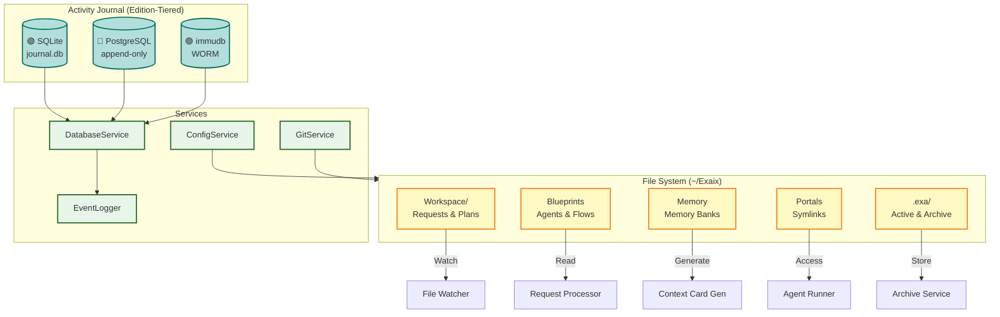
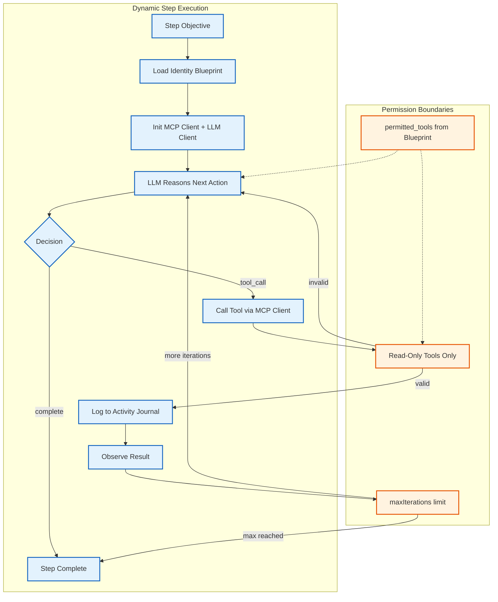

**Version:** 3.1\
**Date:** June 2, 2026

> **What this document covers:** component boundaries, dependency direction, edition-tiering rationale, and architectural invariants — the "why" that code alone doesn't convey.
> **What this document does NOT cover:** configuration syntax, CLI command trees, score formulas, step-by-step protocols, or schema definitions. Those live in package and app READMEs under `packages/` and `apps/`, with redirects in `docs/dev/`.

---

## Project Overview

Exaix is an **asynchronous, file-based AI agent harness** built with **Deno** and **TypeScript** — conceptually closer to GitHub Actions for AI agents than to a chat or IDE tool. Unlike session-oriented tools (OpenCode, Claude Code, Cursor) where conversation _is_ the state, Exaix models work as discrete, auditable artifacts:

- **Requests** are markdown files in `Workspace/Requests/`
- **Plans** are generated artifacts in `Workspace/Plans/`
- **Execution** produces Git branches for human review
- **Every step** is journaled to SQLite for a permanent audit trail

The pipeline processes work through a gated pipeline (file → plan → approve → execute → review → merge) rather than interactive chat sessions. It is designed for **autonomous, multi-agent orchestration with explicit gates** — plan approval, amendment approval, review/merge — not for interactive back-and-forth. This makes it suitable for CI/CD-like workflows where humans set policies and review outputs rather than steering each conversation turn.

## Edition Model Overview

> **Current Status (May 2026):** The **Solo edition** is fully implemented in this repository. Team and Enterprise editions describe aspirational features (Web UI, PostgreSQL, immudb, SSO/SAML, governance dashboard) that are planned but not yet present in the codebase. See `exaix-dev-docs/dev/Exaix_White_Paper.md` for the full product vision.

Exaix follows a **three-tier edition model** to serve different organizational needs:

| Edition           | Target Audience                         | Key Differentiation                                             |
| ----------------- | --------------------------------------- | --------------------------------------------------------------- |
| **Solo** 🟢       | Individual developers, OSS contributors | CLI + TUI, SQLite audit, MCP client, local-first                |
| **Team** 🔵       | Small teams, startups, consulting firms | + Web UI, PostgreSQL, MCP server mode, multi-user collaboration |
| **Enterprise** 🟣 | Regulated industries, large enterprises | + Governance dashboard, compliance frameworks, immudb, SSO/SAML |

For the full component availability matrix by edition, see `docs/Reference_Data.md#edition-model--component-availability`.

---

## Composability with Session-Oriented Tools

Exaix is designed to **orchestrate rather than replace** session-oriented agent tools (OpenCode, Claude Code, Cursor). These tools excel at interactive refinement — clarifying intent, iterating on plans, or pair-programming code changes — while Exaix provides the governance, audit trail, and multi-agent orchestration that session tools lack.

The embedding points for session tools are the **pipeline gates** where human judgment adds most value: refinement, plan review, code changes, and review/merge.

Session tools are treated as **external delegates** — launched via a configurable tool call, not embedded in the Exaix process. The launch is configured per request, portal, or blueprint via a `session_delegate` section in TOML config.

### Architectural Invariant

Session tool integration **must not introduce session state into Exaix's core pipeline**. The pipeline remains file-driven and asynchronous. The session tool is a transient external process that reads from and writes to the same file system — it does not change how Exaix models work.

For the pipeline gate diagram with ASCII art and TOML configuration sample, see `packages/flow/README.md#session-tool-integration`.

---

## Key Design Principles

### 1. **Files as API**

- Request input: Markdown files in `Workspace/Requests`
- Plan output: Markdown files in `Workspace/Plans`
- Configuration: TOML with Zod validation
- Context: File system is source of truth

### 2. **Separation of Concerns**

- **CLI Layer**: Human interface (exactl)
- **Core Layer**: Daemon orchestration (main.ts, watcher)
- **Service Layer**: Business logic (processors, runners)
- **Storage Layer**: Edition-tiered databases + file system

### 3. **Auditability & Governance**

- Every action logged to Activity Journal (tiered by edition)
- Trace ID links: request → plan → review → commit
- Immutable event stream for compliance (🟣 Enterprise: WORM storage)
- Explicit approval gates: plans and reviews require human authorization

### 4. **Multi-Provider Support**

- Local-first: Ollama (no cloud required)
- Cloud options: Claude, GPT, Gemini (🟢 all editions)
- Vertex AI: Google service-account auth for project-based quotas and regional endpoints (🟢 all editions; `@exaix/ai-vertex`)
- OpenRouter: unified gateway to many models (ships in the Solo build; positioned as a 🔵 Team+ differentiator; `@exaix/ai-openrouter`)
- Enterprise providers: Azure OpenAI, AWS Bedrock (🟣 Enterprise)
- Provider factory pattern for extensibility; concrete providers register at bootstrap via `apps/common/registry_bootstrap.ts`
- Cost management with edition-tiered capabilities

### 5. **Portal System**

- Symlink-based external project access
- Context cards for agent understanding
- Scoped permissions (Deno security model)
- Multi-project refactoring support

### 6. **Edition-Aware Architecture**

- Core components available in all editions (🟢 Solo)
- Collaboration features in Team+ (🔵 Team)
- Governance and compliance features in Enterprise (🟣 Enterprise)
- Transparent feature tiering with upgrade path

---

## Storage & Data Flow

Exaix uses a **tiered database architecture** aligned with edition requirements:

| Edition           | Audit Database           | Compliance Level                               |
| ----------------- | ------------------------ | ---------------------------------------------- |
| **Solo** 🟢       | SQLite (embedded)        | Basic audit logging                            |
| **Team** 🔵       | PostgreSQL (append-only) | Multi-user with database-enforced immutability |
| **Enterprise** 🟣 | PostgreSQL + immudb      | WORM-compliant, cryptographically verified     |



---

## Parsing & Schema Layer

Exaix centralizes file-format parsing and validation into two layers:

- **Parsers** (`packages/core/src/parsing/`): extract structure from Markdown files (YAML frontmatter + body).
- **Schemas** (`packages/schemas/src/`): validate structured objects using Zod (requests, plans, flows, portals, MCP).

This layer is what keeps file-driven workflows safe and deterministic: request/plan files may come from humans or LLMs, but the runtime only proceeds when schemas validate.

For the key modules table with file paths and sub-schema listings, see `docs/Reference_Data.md#parsing--schema-layer--key-modules`.

---

## Request Analysis Layer

The `RequestAnalyzer` performs intent extraction before routing, identifying goals, requirements, constraints, and ambiguities. It classifies complexity and actionability to guide provider selection and execution strategy. Analysis runs in three modes (Heuristic / LLM / Hybrid) with a default actionability threshold of 80.

For analysis mode details, data flow steps, and hardening additions, see `packages/request/README.md#request-analysis-layer`.

---

## Request Processing Flow

<!-- AGENT_LOGIC: {
  "flow": "Request Processing Loop",
  "steps": [
    "CLI/Daemon creates request file in Workspace/Requests",
    "File Watcher triggers RequestProcessor",
    "RequestProcessor validates and initializes context",
    "RequestAnalyzer extracts intent and requirements",
    "RequestRouter selects Agent or Flow runner",
    "Agent/Flow Runner generates Plan via AI Provider",
    "PlanAdapter materializes Plan to Workspace/Plans",
    "Activity Journal records lifecycle events"
  ]
} -->

For the step table (component→file path mapping), sequence diagram, and analysis mode details, see `packages/request/README.md`.

For frontmatter YAML examples, request type samples, flow validation rules, routing policy audit events, and CLI inspection commands, see `packages/request/README.md#request-routing`.

---

## Request Quality Gate

The **Request Quality Gate** is a pre-execution filter that assesses every incoming request body before routing. It prevents vague or unactionable requests from consuming LLM budget and provides an iterative Q&A loop to improve request quality.

The gate produces one of four recommendations: **PROCEED**, **AUTO_ENRICH**, **NEEDS_CLARIFICATION**, or **REJECT** — each with configurable score thresholds. Assessment runs in `heuristic`, `llm`, or `hybrid` mode.

For thresholds, assessment modes, Q&A protocol, session structure, configuration schema, and CLI commands, see `packages/quality-gate/README.md#request-quality-assessment`.

---

## Acceptance Criteria Propagation

Acceptance criteria propagation closes the gap between "what was asked" and "what quality gates evaluate" by propagating extracted acceptance criteria through the entire evaluation pipeline.

Verification occurs at **three independent layers**:

1. **Quality Gate** (blocking, post-step) — `GateEvaluator` invoked synchronously by `FlowRunner` after guarded agent steps; blocks the flow if scores fall below threshold.

1.

All three layers degrade gracefully when `IRequestAnalysis` is absent: gates use only static criteria, `ReflexiveAgent` omits the requirements block, and `ConfidenceScorer` applies no goal-alignment penalty.

For criteria generation rules, gate configuration, built-in criteria definitions, critique prompt format, and scoring formulas, see `packages/quality-gate/README.md#acceptance-criteria-propagation`.

---

## Plan Execution Flow {#plan-execution-flow}

<!-- AGENT_LOGIC: {
  "flow": "Plan Execution Loop",
  "steps": [
    "PlanWatcher detects approved plan in Workspace/Active",
    "Daemon initializes PlanExecutor with plan path",
    "PlanExecutor parses Plan and loads execution context",
    "ReAct loop starts for each step in the plan",
    "AI Provider proposes tool actions in structural TOML",
    "ToolRegistry validates and executes requested tools",
    "GitService commits atomic changes and generates trace metadata",
    "Activity Journal persists results for auditing"
  ]
} -->

The **Plan Executor** service orchestrates the step-by-step execution of approved plans. It uses a ReAct-style loop to prompt the LLM for actions, executes them via the **Tool Registry**, and commits changes to Git after each step.

For the step table, sequence diagram, component hierarchy, MCP server implementation notes, tool execution paths and ownership map, plan file structure diagram, and activity logging events, see `packages/execution/README.md`.

---

For flow namespace coordination, error recovery, parallel execution groups, and step
durability, see `packages/flow/README.md`.

---

## AI Provider Architecture {#ai-provider-architecture}

For the provider component table and edition availability matrix, see `packages/ai/README.md#provider-components`.

---

## Agent Orchestration Architecture

Advanced agent orchestration capabilities provide improved output quality, reliability, and context awareness.

### Orchestration Components

For the agent orchestration flow diagram (request → session memory → reflexive
agent → output validation → retry/confidence → tool reflection → response), see
`exaix-dev-docs/dev/Agent_Orchestration_Diagram.md`.

### Service Responsibilities

For the service responsibilities table (Session Memory, Reflexive Agent, Output Validator, Retry Policy, Confidence Scorer, Tool Reflector), see `packages/flow/README.md#evaluation-components`.

---

## ReAct Reasoning Engine

Exaix implements a ReAct (Reasoning + Acting) reasoning engine for dynamic flow step execution. This enables LLM-driven tool selection within declared permission boundaries while maintaining full auditability.

### Dynamic vs Declared Execution Modes

| Mode            | Description                                         | Use Case                                    |
| --------------- | --------------------------------------------------- | ------------------------------------------- |
| **Declared** 🟢 | Tools committed during planning phase (ReWOO-style) | Standard execution with full human approval |
| **Dynamic** 🔵  | Agent selects tools at runtime from permitted set   | Exploratory tasks, codebase analysis        |

### ReAct Loop Architecture



### Security and Auditability

For the security features table (runtime supervision, permission boundaries, traceability, cost control), see `packages/mcp/README.md#security-boundaries`.

For core interfaces, tool confirmation interceptor flow, blueprint schema extensions, and flow step configuration, see `packages/mcp/README.md`.

---

## Tool Result Validation & Discovery

For remediation behavior details and discovery surface protocol, see `packages/execution/README.md`.

---

## MCP Tool Handlers Architecture

Exaix includes an extensible MCP tool handler system that enables agents to perform file operations, directory management, and system commands within portal boundaries. All tools enforce security boundaries and log executions to the Activity Journal.

### Tool Handler Categories

| Category            | Tools                                                  | Purpose                  |
| ------------------- | ------------------------------------------------------ | ------------------------ |
| **Read-Only**       | `read_file`, `list_directory`, `search_files`          | Exploration and analysis |
| **Write Tools**     | `write_file`, `patch_file`, `delete_file`, `move_file` | File mutations           |
| **Directory Tools** | `create_directory`                                     | Directory management     |
| **Command Tools**   | `run_command`                                          | System command execution |

All tools enforce portal-scoped operations. For the class diagram, patch file strategy, and security boundary details, see `packages/mcp/README.md`.

---

## CLI Commands Architecture

The CLI is organized as command groups (Request, Plan, Review, Git, Daemon, Portal, Blueprint, Dashboard), each extending a shared `BaseCommand` with `CommandContext` for config and database access.

For the command group mermaid diagram and extends-relationship details, see `docs/Reference_Data.md#cli-commands-architecture`.

---

## TUI Dashboard Architecture

The dashboard is an interactive terminal UI launched from the CLI, providing a unified cockpit for Exaix operations.

### Component Architecture

For the dashboard overview (entry point, integrated views), component architecture mermaid diagram, and view integration method listing, see `apps/tui/README.md`.

---

## Memory Banks Architecture {#memory-banks-architecture}

<!-- AGENT_LOGIC: {
  "flow": "Context & Knowledge Retrieval",
  "steps": [
    "ContextLoader identifies active portal/project",
    "RequestProcessor loads Workspace context files (overview, patterns)",
    "MemoryService loads Global Cross-project learnings",
    "Analyst/Agent merges Local + Global context into prompt",
    "PlanExecutor updates memory with new learnings after task completion",
    "CommitTrace annotates Git log with memory references"
  ]
} -->

The Memory Banks system provides persistent knowledge storage for project context, execution history, and cross-project learnings across four bank types (Local, Execution, Global, Skills).

For the bank-type-to-service mapping table, directory structure mermaid, update workflow sequence diagram, CLI command tree, and key components table, see `docs/Reference_Data.md#memory-banks`.

---

## Portal System Architecture

Portals provide symlink-based access to external projects, each tracked by a context card in `Memory/Banks/` and configured via `exa.config.toml`. The system enforces Deno security permissions and generates structured `knowledge.json` for agent consumption.

For the portal architecture mermaid diagram, CLI command details, and knowledge gathering pipeline, see `packages/portal/README.md#knowledge-gathering-pipeline`.

### Knowledge Gathering Pipeline

Automated codebase analysis runs for every portal. `PortalKnowledgeService` runs a configurable analysis pipeline (quick/standard/deep modes) and persists structured knowledge to `Memory/Projects/{alias}/knowledge.json` with staleness-based re-analysis.

For analysis modes, strategies, configuration, CLI commands, and review cleanup semantics, see `packages/portal/README.md`.

### Portal review cleanup semantics

Portal execution supports two execution strategies — `branch` (default) and `worktree` (isolated checkout). Approval merges into the recorded `base_branch`; reject deletes the feature branch. For worktree reviews, approval also removes the checkout and execution pointer.

For full cleanup behavior details, see `packages/portal/README.md#review-cleanup-semantics`.

---

## Blueprint Management System

Blueprints define agent identities, each stored as `Workspace/Blueprints/Identities/{agent_id}.md` with TOML frontmatter specifying provider, model, capabilities, and persona instructions.

For the built-in template list, blueprint CLI commands, and runtime usage flow diagram, see `docs/Reference_Data.md#blueprint-management`.

---

## Daemon Lifecycle

For the daemon state diagram with all transitions and notes, see `docs/Reference_Data.md#daemon-lifecycle`.

---

## Activity Journal Flow {#activity-journal-flow}

For the component table, event flow mermaid diagram, database schema details, and retrieval commands, see `docs/Reference_Data.md#activity-journal`.

---

## Live Execution Streaming

Real-time execution observability via an in-memory event bus, execution heartbeats, an SSE HTTP endpoint, and a CLI watch command.

### Architecture

```text
ReActLoopStrategy ──heartbeat──▶ EventBusService ◀── EventLogger.publish()
                                        │
                                        ▼
                                  SseHandler (GET /api/v1/traces/:id/stream)
                                        │
                                        ▼
                                  WatchCommand (exactl watch <trace_id>)
                                        │
                                        ▼
                              Color-coded terminal output
```

For the component responsibilities table, key design decisions, and configuration constants, see `docs/Reference_Data.md#live-execution-streaming`.

---

## Scenario Framework Extension

The scenario framework provides comprehensive end-to-end testing for Exaix features including dynamic tool selection, ReAct reasoning, and extended MCP tool handlers. For scenario pack definitions and execution modes, see `docs/Reference_Data.md#scenario-framework`.

---

## Developer Tooling Architecture

Exaix includes repository tooling under `scripts/` to keep development workflows deterministic, along with a developer-facing knowledge base under `.copilot/`.

For the full script inventory and `.copilot/` artifact details, see `docs/Reference_Data.md#developer-tooling`.

---

## Module Grounding Index

This section provides explicit grounding for core infrastructure modules and helpers. For the full lookup table, see `docs/Reference_Data.md#module-grounding-index`.

---

## Component Responsibilities

For the full 60+ entry component responsibilities table with file paths and edition tiers, see `docs/Reference_Data.md#component-responsibilities`.

---

## Related Documentation

- **[System_Architecture_Diagram](exaix-dev-docs/dev/System_Architecture_Diagram.md)** - full architecture
  with focused Mermaid diagrams broken down by subsystem layer.
- **[User Guide](docs/Exaix_User_Guide.md)** — End-user documentation
- **[White Paper](exaix-dev-docs/dev/Exaix_White_Paper.md)** — Vision and philosophy
- **Package and App READMEs** — Implementation reference (formerly `docs/dev/`):
  - `packages/flow/README.md` — Flow engine, orchestration services, session tool integration
  - `packages/request/README.md` — Request processing, analysis, routing
  - `packages/execution/README.md` — Plan execution, tool paths, events, tool result validation
  - `packages/quality-gate/README.md` — Quality assessment pipeline, evaluation criteria
  - `packages/ai/README.md` — AI provider contracts, component table, edition availability
  - `packages/portal/README.md` — Portal analysis, persistence, architecture diagram
  - `packages/mcp/README.md` — MCP tool handlers, ReAct engine, security
  - `apps/tui/README.md` — Terminal UI views, layout, keyboard reference
  - `packages/memory/README.md` — Memory bank architecture, schemas, CLI commands
  - `docs/Reference_Data.md` — Edition matrix, scenario packs, scripts, module index, live streaming, component responsibilities, activity journal, daemon lifecycle
- **[Test Directory Guide](tests/README.md)** — Test structure and package-local test mapping
- **[Testing Helpers](packages/testing/README.md)** - Shared test helpers (`@exaix/testing`)

---
