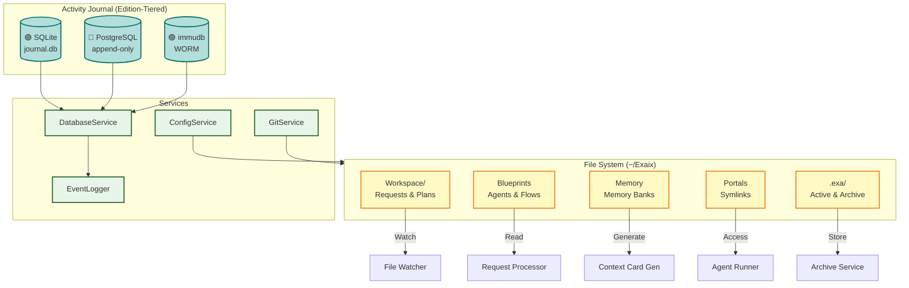

**Version:** 3.1\
**Date:** June 2, 2026

> **What this document covers:** component boundaries, dependency direction, edition-tiering rationale, and architectural invariants — the "why" that code alone doesn't convey.
> **What this document does NOT cover:** configuration syntax, CLI command trees, score formulas, step-by-step protocols, or schema definitions. Those live in package and app READMEs under `packages/` and `apps/`, with redirects in `docs/dev/`.

---

## Project Overview

Exaix is an **asynchronous, file-based AI agent harness** built with **Deno** and **TypeScript** — conceptually closer to GitHub Actions for AI agents than to a chat or IDE tool. Unlike session-oriented tools (OpenCode, Claude Code, Cursor) where conversation _is_ the state, Exaix models work as discrete, auditable artifacts:

- **Requests** are markdown files in `Workspace/Requests/`
- **Plans** are generated artifacts in `Workspace/Plans/`
- **Execution** produces Git branches for human review
- **Every step** is journaled to SQLite for a permanent audit trail

The pipeline processes work through a gated pipeline (file → plan → approve → execute → review → merge) rather than interactive chat sessions. It is designed for **autonomous, multi-agent orchestration with explicit gates** — plan approval, amendment approval, review/merge — not for interactive back-and-forth. This makes it suitable for CI/CD-like workflows where humans set policies and review outputs rather than steering each conversation turn.

## Edition Model Overview

> **Current Status (June 2026):** The **Solo edition** is fully implemented in this repository. Team and Enterprise editions use the **Option-C layout** — `packages-team/` (BSL) lives in the same repo; `exaix-enterprise/` is a private submodule. Edition-specific code is never loaded into Solo builds.

Exaix follows a **three-tier edition model** served by a single **`IEditionComposer`** composition seam:

```text
┌─────────────────────────────────────────────────────────┐
│                    exaix (monorepo)                       │
│  ┌────────────────────────────────────────────────────┐  │
│  │  packages/  (MIT — always compiled)                 │  │
│  │  apps/daemon · apps/exactl · apps/tui · apps/mcp-server   │  │
│  └────────────────────────────────────────────────────┘  │
│  ┌────────────────────────────────────────────────────┐  │
│  │  packages-team/  (BSL — Team+Enterprise)            │  │
│  └────────────────────────────────────────────────────┘  │
│  ┌────────────────────────────────────────────────────┐  │
│  │  exaix-enterprise/  (private submodule — Enterprise) │  │
│  └────────────────────────────────────────────────────┘  │
└─────────────────────────────────────────────────────────┘
```

**Composition architecture:** `IEditionComposer` (`@exaix/core/composer/`) is the single attach point for edition-specific capabilities. The Solo edition uses `SoloComposer` (default — zero paid features). SoloComposer is **passive**: it stores registered modules but does not invoke their hooks — Team/Enterprise composers will invoke them. Each runtime entry point (daemon, exactl, agent-entrypoint) instantiates `SoloComposer` as the hook anchor (`_editionComposer`), keeping the import path live for Team/Enterprise wiring. Team and Enterprise editions register `ICapabilityModule` instances that fill optional hooks (flow-step handlers, symbol extractors, guardrail runner, routing strategy, entitlement).

**Publishing:** Solo+Team source is published as OSS mirrors (`exaix-core` MIT, `exaix-team` BSL) via `git subtree split` with a leak-guard (`scripts/leak_guard.ts`) that blocks proprietary Enterprise code. The Enterprise submodule is excluded from the subtree filter and stripped from `.gitmodules` before publishing.

| Edition           | Target Audience                         | Key Differentiation                                             |
| ----------------- | --------------------------------------- | --------------------------------------------------------------- |
| **Solo** 🟢       | Individual developers, OSS contributors | CLI + TUI, SQLite audit, MCP client, local-first                |
| **Team** 🔵       | Small teams, startups, consulting firms | + Web UI, PostgreSQL, MCP server mode, multi-user collaboration |
| **Enterprise** 🟣 | Regulated industries, large enterprises | + Governance dashboard, compliance frameworks, immudb, SSO/SAML |

For the full component availability matrix by edition, see `docs/Reference_Data.md#edition-model--component-availability`.

---

## Composability with Session-Oriented Tools

Exaix is designed to **orchestrate rather than replace** session-oriented agent tools (OpenCode, Claude Code, Cursor). These tools excel at interactive refinement — clarifying intent, iterating on plans, or pair-programming code changes — while Exaix provides the governance, audit trail, and multi-agent orchestration that session tools lack.

The embedding points for session tools are the **pipeline gates** where human judgment adds most value: refinement, plan review, code changes, and review/merge.

Session tools are treated as **external delegates** — launched via a configurable tool call, not embedded in the Exaix process. The launch is configured per request, portal, or blueprint via a `session_delegate` section in TOML config.

### Architectural Invariant

Session tool integration **must not introduce session state into Exaix's core pipeline**. The pipeline remains file-driven and asynchronous. The session tool is a transient external process that reads from and writes to the same file system — it does not change how Exaix models work.

### Handoff Contract (Phase 106)

The integration is realized by the `@exaix/session` package as a strict three-part handoff, so the invariant holds by construction (only files + a typed `return.json` cross back):

1. **Brief** — `SessionDelegateService.prepareBrief` (`@exaix/session`) atomically writes `Session/{traceId}/brief.json` (objective, scope globs, token budget, single-use resume token, deadline).
2. **Launch** — a per-tool `ISessionAdapter` from `SessionAdapterRegistry` (`@exaix/session`) builds a hardened launch (bare binary + discrete argv, token-budget env only); supervised spawns strip provider secrets and enforce a binary allowlist (`@exaix/session`). When `[session_delegate].harden_permissions = true`, `SessionDelegateService.resolveHardenedLaunch()` inserts a permission-derivation step before the launch: version probe → per-tool permission config generation → modified launch with `configPath` (OpenCode) or derived CLI flags (Claude Code).
3. **Return + Reconcile** — the daemon drains the tool's full stdout stream (bounded by `DELEGATE_STDOUT_DRAIN_MS`), parses tool-specific JSON events (`opencode` JSONL `text`/`step_finish`/`tool_use` events or `claude-code` single `{type:"result"}` object), computes `git diff --name-only HEAD` for `paths_touched`, and atomically writes `Session/{traceId}/return.json` with real `paths_touched`, `token_stats`, and `cost_usd`. `SessionReturnWatcher` then invokes `SessionReturnProcessor`/`reconcile` (constant-time token check, two-stage path-scope enforcement against actual touched paths, gate/decision legality, non-blocking budget overage), maps the outcome into the existing amendment/review/clarification contracts (`@exaix/session`), and resumes the gate's durable wait state (`@exaix/session`).

Delegated output is **untrusted** and still flows through the same quality, critique, and review gates as autonomous output. For the pipeline gate diagram with ASCII art and TOML configuration sample, see `packages/flow/README.md#session-tool-integration`.

### Launch Modes (Phase 111)

The session tool can be launched in one of three modes, configured via `session_delegate.launch_mode`:

| Mode       | Value        | Description                                                                                                                                                                                     | Use case                                                               |
| ---------- | ------------ | ----------------------------------------------------------------------------------------------------------------------------------------------------------------------------------------------- | ---------------------------------------------------------------------- |
| **Mode 1** | `advisory`   | Exaix prints the command and waits for the human to run the tool out-of-band. The daemon parks a wait state; the human drops a `return.json` to resume.                                         | Default for all tools; safe when the human wants to control execution. |
| **Mode 2** | `supervised` | Interactive TTY spawn from `exactl execute --delegate`. The CLI attaches the parent terminal so the human can interact with the session tool directly.                                          | Interactive debugging or pair-delegation from the CLI.                 |
| **Mode 3** | `headless`   | Non-interactive spawn via `claude -p` / `opencode run`. The daemon spawns the binary with a discrete argv prompt, fire-and-forget; `SessionReturnWatcher` reconciles the dropped `return.json`. | CI, automation, and daemon-side delegation where no human is present.  |

Mode 3 requires `bin_overrides` to add the tool binary to the spawn allowlist (see `packages/flow/README.md#session-tool-integration`). The compiled mock tool at `.cache/mock_session_tool_bin` (built via `deno task build:mock-tool`) is used for CI testing.

Mode 3 also supports a `[session_delegate.provider]` block (Phase 123 R9) that
declares which API gateway the delegate should use. When present, the daemon reads
the key from `key_env` and injects it into the child process **after** environment
sanitisation, so injected `API_KEY` vars survive the `SECRET_ENV_PATTERN` strip:

```toml
[session_delegate.provider]
name = "openrouter"       # "openrouter" | "anthropic" | "ollama"
key_env = "OPENROUTER_API_KEY"
base_url = "https://openrouter.ai/api"
```

Per-tool env injection follows a translation table
(`SessionDelegateService.resolveDelegateEnv`): OpenRouter+opencode sets
`OPENROUTER_API_KEY`; OpenRouter+claude-code sets `ANTHROPIC_BASE_URL`,
`ANTHROPIC_AUTH_TOKEN`, and `ANTHROPIC_API_KEY=""`.

The OpenRouter in-process provider (`@exaix/ai-openrouter`) also exposes OpenRouter's
control surface via a `routing` config block (Phase 123 R10): `provider` ordering
(`order`/`only`/`ignore`/`sort`), model fallbacks (`models`, ≤3), zero-data-retention
(`zdr`), and data-collection consent (`data_collection`). These fields are serialised
into the request body alongside `model` and `messages`.

---

## Key Design Principles

### 1. **Files as API**

- Request input: Markdown files in `Workspace/Requests`
- Plan output: Markdown files in `Workspace/Plans`
- Configuration: TOML with Zod validation
- Context: File system is source of truth

### 2. **Separation of Concerns**

- **CLI Layer**: Human interface (exactl)
- **Core Layer**: Daemon orchestration (main.ts, watcher)
- **Service Layer**: Business logic (processors, runners)
- **Storage Layer**: Edition-tiered databases + file system

### 3. **Auditability & Governance**

- Every action logged to Activity Journal (tiered by edition)
- Trace ID links: request → plan → review → commit
- Immutable event stream for compliance (🟣 Enterprise: WORM storage)
- Explicit approval gates: plans and reviews require human authorization
- Durable, resumable wait states for approval gates — explicit lifecycle transitions, resume tokens, and time-based expiry via `exactl wait approve|reject|amend|expire`

### 4. **Multi-Provider Support**

- Local-first: Ollama (no cloud required)
- Cloud options: Claude, GPT, Gemini (🟢 all editions)
- Vertex AI: Google service-account auth for project-based quotas and regional endpoints (🔵 Team+; `@exaix-team/ai-vertex`)
- OpenRouter: unified gateway to many models (ships in the Solo build; positioned as a 🔵 Team+ differentiator; `@exaix/ai-openrouter`)
- Enterprise providers: Azure OpenAI, AWS Bedrock (🟣 Enterprise)
- Provider factory pattern for extensibility; concrete providers register at bootstrap via `apps/common/registry_bootstrap.ts` (Solo) or `packages-team/team-composer/src/team_bootstrap.ts` (Team)
- Cost management with edition-tiered capabilities

### 5. **Portal System**

- Symlink-based external project access
- Context cards for agent understanding
- Scoped permissions (Deno security model)
- Multi-project refactoring support

### 6. **Edition-Aware Architecture**

- Core components available in all editions (🟢 Solo)
- Collaboration features in Team+ (🔵 Team)
- Governance and compliance features in Enterprise (🟣 Enterprise)
- **Composition seam:** `IEditionComposer` (`@exaix/core/composer/`) is the single attach point for paid capabilities; `ICapabilityModule` registers hooks per seam
- **Option-C layout:** `packages/` (MIT) · `packages-team/` (BSL, same repo) · `exaix-enterprise/` (private submodule)
- **Solo defaults:** `SoloComposer` with `AllowAllAuthorizer` — zero paid code in Solo builds
- **Edition build:** `build:solo|team|enterprise` selects entry point + prefix via `scripts/ci.ts`
- **Leak-guard:** `scripts/leak_guard.ts` blocks Enterprise paths and proprietary headers from OSS publish targets
- **Seam registries** (flow-step handlers, symbol extractors, guardrail runner, routing strategy) use `ISeamRegistryPlaceholder` in core; concrete types resolved at the app-entry level
- Transparent feature tiering with upgrade path

---

## Execution Semantics

Exaix's reliability rests on three layered guarantees — each inspectable through the Activity Journal, CLI, and flow artifacts rather than asserted as marketing language:

1. **Visibility** — Every significant runtime transition emits a typed, versioned, trace-linked domain event (`DomainEventType`; see the `Event Taxonomy` subsection below). Operators can inspect what happened at any point in a run's lifecycle without reading raw runtime state.
1. **Recoverability** — Step results are persisted with idempotency keys so a failed run can resume from the last successful step rather than recompute from scratch; this resumption path is still maturing and should not yet be relied on as a complete guarantee. Long-running execution context is managed and compacted automatically by the Context Budget Manager (see the `Context Budget Management` subsection below).
1. **Governance** — Human approval gates are first-class durable wait states with explicit lifecycle transitions, resume tokens, and operator-driven resolution via `exactl wait approve|reject|amend|expire` (see `Request Quality Gate` below and `packages/flow/README.md` for the full wait-state lifecycle).

Together these three tiers answer the question every operator asks before trusting an agent with a codebase: _what is it doing right now, can it recover from a transient failure without starting over, and can a human stop it before it commits to something irreversible?_

### Semantic Progress Milestones

Milestone events are higher-level projections of domain events for operator-facing UX surfaces. They follow a stable enumerated taxonomy (`ExecutionMilestoneSchema`, `@exaix/schemas`) and are emitted via `IMilestoneEmitter` (`@exaix/core`).

- **Schema**: `ExecutionMilestoneSchema` (Zod) validates `milestoneId` (UUID), `traceId`, `milestoneType` (18-value enum), `requiresAttention` flag, `attentionReason`, `progressHint` (steps completed/total/current label), `occurredAt` timestamp, and `summary` (printable ASCII).
- **Emitter interface**: `IMilestoneEmitter` exposes `emit(milestone: IExecutionMilestone): Promise<void>`. A `NoopMilestoneEmitter` provides a no-op default when milestone streaming is disabled.
- **Bridge to SSE**: `MilestoneEventBusEmitter` implements `IMilestoneEmitter` and publishes milestones as `IStreamingEvent` with type `"milestone"` via `EventBusService`, making them available to the SSE endpoint and CLI `watch` command.
- **Design invariant**: Milestones are projections of existing domain events — they do not replace domain events or change execution semantics. The `requiresAttention` flag enables operator notification for approval gates and other human-in-the-loop scenarios.

---

## Storage & Data Flow

Exaix uses a **tiered database architecture** aligned with edition requirements:

| Edition           | Audit Database           | Compliance Level                               |
| ----------------- | ------------------------ | ---------------------------------------------- |
| **Solo** 🟢       | SQLite (embedded)        | Basic audit logging                            |
| **Team** 🔵       | PostgreSQL (append-only) | Multi-user with database-enforced immutability |
| **Enterprise** 🟣 | PostgreSQL + immudb      | WORM-compliant, cryptographically verified     |



---

## Parsing & Schema Layer

Exaix centralizes file-format parsing and validation into two layers:

- **Parsers** (`@exaix/core`): extract structure from Markdown files (YAML frontmatter + body).
- **Schemas** (`@exaix/schemas`): validate structured objects using Zod (requests, plans, flows, portals, MCP).

This layer is what keeps file-driven workflows safe and deterministic: request/plan files may come from humans or LLMs, but the runtime only proceeds when schemas validate.

For the key modules table with file paths and sub-schema listings, see `docs/Reference_Data.md#parsing--schema-layer--key-modules`.

---

## Request Analysis Layer

The `RequestAnalyzer` performs intent extraction before routing, identifying goals, requirements, constraints, and ambiguities. It classifies complexity and actionability to guide provider selection and execution strategy. Analysis runs in three modes (Heuristic / LLM / Hybrid) with a default actionability threshold of 80.

For analysis mode details, data flow steps, and hardening additions, see `packages/request/README.md#request-analysis-layer`.

---

## Request Processing Flow

<!-- AGENT_LOGIC: {
  "flow": "Request Processing Loop",
  "steps": [
    "CLI/Daemon creates request file in Workspace/Requests",
    "File Watcher triggers RequestProcessor",
    "RequestProcessor validates and initializes context",
    "RequestAnalyzer extracts intent and requirements",
    "RequestProcessor routes internally: agent requests to AgentRunner, flow requests to FlowRunner",
    "AgentRunner executes agent task and generates Plan via AI Provider (ProviderFactory chain)",
    "FlowRunner executes multi-agent flow with declared/dynamic steps via AgentExecutorAdapter",
    "PlanWriter materializes Plan to Workspace/Plans",
    "FlowRunner pauses on failing quality gates, creating durable wait states for operator resolution",
    "Operator approves, rejects, or amends wait states via `exactl wait` CLI commands",
    "Activity Journal records lifecycle events (including wait-state events)"
  ]
} -->

For the step table (component→file path mapping), sequence diagram, and analysis mode details, see `packages/request/README.md`.

For frontmatter YAML examples, request type samples, flow validation rules, routing policy audit events, and CLI inspection commands, see `packages/request/README.md#request-routing`.

---

## Request Quality Gate

The **Request Quality Gate** is a pre-execution filter that assesses every incoming request body before routing. It prevents vague or unactionable requests from consuming LLM budget and provides an iterative Q&A loop to improve request quality.

When a quality gate step fails during flow execution and a `waitStateService` is configured, the `FlowRunner` creates a **durable wait state** that pauses the flow until an operator resolves it via `exactl wait approve|reject|amend|expire`. This replaces the previous feedback-loop retry model with an explicit asynchronous approval workflow with resume tokens and time-based expiry.

The gate produces one of four recommendations: **PROCEED**, **AUTO_ENRICH**, **NEEDS_CLARIFICATION**, or **REJECT** — each with configurable score thresholds. Assessment runs in `heuristic`, `llm`, or `hybrid` mode.

For thresholds, assessment modes, Q&A protocol, session structure, configuration schema, and CLI commands, see `packages/quality-gate/README.md#request-quality-assessment`.

---

## Acceptance Criteria Propagation

Acceptance criteria propagation closes the gap between "what was asked" and "what quality gates evaluate" by propagating extracted acceptance criteria through the entire evaluation pipeline.

Verification occurs at **three independent layers**:

1. **Quality Gate** (blocking, post-step) — `GateEvaluator` invoked synchronously by `FlowRunner` after guarded agent steps; blocks the flow if scores fall below threshold.
2. **Reflexive Critique** (iterative, in-flight) — `ReflexiveAgent.run()` embeds structured requirements into the critique prompt; corrects artifacts before they reach a gate.
3. **Confidence Scoring** (non-blocking, post-execution) — `ConfidenceScorer.assess()` blends requirement-fulfilment evidence into the final confidence score.

All three layers degrade gracefully when `IRequestAnalysis` is absent: gates use only static criteria, `ReflexiveAgent` omits the requirements block, and `ConfidenceScorer` applies no goal-alignment penalty.

For criteria generation rules, gate configuration, built-in criteria definitions, critique prompt format, and scoring formulas, see `packages/quality-gate/README.md#acceptance-criteria-propagation`.

---

## Plan Execution Flow {#plan-execution-flow}

<!-- AGENT_LOGIC: {
  "flow": "Plan Execution Loop",
  "steps": [
    "PlanWatcher detects approved plan in Workspace/Active",
    "Daemon initializes PlanExecutor with plan path",
    "PlanExecutor parses Plan and loads execution context",
    "ReAct loop starts for each step in the plan",
    "AI Provider proposes tool actions in structural TOML",
    "ToolRegistry validates and executes requested tools",
    "GitService commits atomic changes and generates trace metadata",
    "Activity Journal persists results for auditing"
  ]
} -->

The **Plan Executor** service orchestrates the step-by-step execution of approved plans. It uses a ReAct-style loop to prompt the LLM for actions, executes them via the **Tool Registry**, and commits changes to Git after each step.

For the step table, sequence diagram, component hierarchy, MCP server implementation notes, tool execution paths and ownership map, plan file structure diagram, and activity logging events, see `packages/execution/README.md`.

---

For flow namespace coordination, error recovery, parallel execution groups, and
wait states, see `packages/flow/README.md`. Step-level durability and replay —
idempotency-keyed step persistence enabling resumption from the last successful
step rather than recomputation from scratch — is still maturing and should not
yet be relied on as a complete guarantee.

---

## Per-Action HITL Governance {#hitl-governance}

_Phase 118, Team/Enterprise Edition — gated by `CAP_HITL_GOVERNANCE`._

Exaix provides **three distinct human checkpoints**, each with a different scope:

| Checkpoint             | Scope                                               | Config                                    | Surface                                                      |
| ---------------------- | --------------------------------------------------- | ----------------------------------------- | ------------------------------------------------------------ |
| **Plan approval**      | Authorizes an entire plan before execution          | `amendment.hitl_timeout_ms`               | Plan gate                                                    |
| **Amendment approval** | Authorizes plan changes during execution            | `amendment.hitl_timeout_ms`               | `PlanAmendmentGate`                                          |
| **Per-action HITL**    | Pauses a specific tool invocation by argument match | `config.hitl.enabled` + `mandatory_rules` | `ToolRegistry` (primary) + `DynamicStepExecutor` (secondary) |

### How it works

A blueprint author declares which tool invocations need secondary approval via an optional
`hitl.require_secondary_approval` block in the YAML frontmatter. An administrator can declare
non-bypassable `config.hitl.mandatory_rules`. Both use the same `HitlRuleSchema` with per-argument
glob matching (`path_pattern`, `command_pattern`, `branch_pattern`, `tables`).

When a tool is invoked, a single `IHitlPolicyEvaluator` instance is consulted at **two call-sites**:

1. **`ToolRegistry` pipeline (primary)** — a HITL middleware stage runs before the core executor,
   covering all mutating tools (`write_file`, `git_commit`, `run_command`, etc.).
2. **`DynamicStepExecutor` (secondary)** — the same evaluator is consulted at the existing Phase 79
   decision point, covering read-biased tools in the ReAct loop.

On a rule match, the pipeline journals a typed `HitlPolicyMatched` event (carrying the matched
`rule.reason` and `surface: "tool_registry" | "dynamic"`) and routes through the existing
`IToolConfirmationInterceptor`. On denial, the tool is short-circuited with a denied `IToolResult`.
If no interceptor is available, **mandatory** rules fail closed (tool denied), while **blueprint-only**
rules degrade gracefully (tool proceeds).

The Team-only `HitlPolicyEvaluator` lives in the `@exaix-team/hitl` package.
The MIT seam (`IHitlPolicyEvaluator`) is exported from `@exaix/core/types`.
Solo edition injects no evaluator, producing identical behaviour to pre-P118.

---

The `voting_group` flow step type enables multi-agent consensus by fanning out N
runner executions and resolving a winner via configurable strategy. It is a
**Team/Enterprise** feature (Solo ❌ / Team ✅ / Enterprise ✅).

### Step Type

`FlowStepType.VOTING_GROUP` (`"voting_group"`) is dispatched by the
`FlowRunner` to `VotingStepHandler`, which delegates to
`VotingConsensusService`. The handler is registered at daemon bootstrap via the
`VotingCapabilityModule` → `IEditionComposer` seam — in Solo mode no handler is
registered, so a `voting_group` step raises `UnknownFlowStepError`.

### Fan-Out

The service fans out N runners via `Promise.allSettled` over an injected
`IExecutor`. Each runner executes a distinct blueprint with an optional
prompt variant. Partial failures (some runners crash) are isolated — survivors
still resolve.

### Strategy Table

| Strategy    | Deterministic | CI-safe | Description                                               |
| ----------- | ------------- | ------- | --------------------------------------------------------- |
| `majority`  | ✅            | ✅      | Most frequent response wins                               |
| `weighted`  | ✅            | ✅      | Highest `confidence` score wins; ties → no-consensus      |
| `llm-judge` | ❌            | ❌      | Judge blueprint ranks candidates; requires eval substrate |

### No-Consensus Governance

When consensus cannot be reached, the `halt_on_no_consensus` config flag
determines behavior:

- **`true`** (default) — triggers the Plan Amendment gate via
  `IPlanAmendmentService`, halting execution
- **`false`** — continues with the best-confidence candidate, journaling a
  `dissent_summary`

### Cost Attribution

Each runner execution records a cost entry through `ICostTracker` (if
configured), attributed per `runner_id` with the voting step's `traceId`.

---

## AI Provider Architecture {#ai-provider-architecture}

Provider integrations are organized as independent packages (`@exaix/ai-anthropic`, `@exaix/ai-openai`, `@exaix/ai-google`, `@exaix-team/ai-vertex`, `@exaix/ai-openrouter`, `@exaix/ai-ollama`), selected via `ProviderSelector` → `CircuitBreaker` → `ProviderFactory`. Solo-edition providers are registered by `apps/common/registry_bootstrap.ts`; Team-edition providers (Vertex AI) are registered by `@exaix-team/team-composer`.

For the provider component table and edition availability matrix, see `packages/ai/README.md#provider-components`.

### LLM Routing Architecture

Exaix has **five independent routing mechanisms** that control how LLM calls reach their target. They operate at different layers and can be combined:

#### 1. Provider Selection — API Provider A vs B

**File:** `packages/ai/src/provider_factory.ts` (line 240), `packages/ai/src/routing/default_routing_strategy.ts` (line 76)

Selects which LLM API provider to call (Anthropic, OpenAI, Google, Ollama, OpenRouter, or Mock):

```text
EXA_LLM_PROVIDER env var ──guard──→ config.ai.provider ──guard──→
  config.provider_strategy.task_routing[taskType] ──guard──→
    selectProvider(capability + free + budget + health + complexity)
```

**Guards at each step:** provider must be registered, not blocked in CI/Test (`EXA_TEST_ENABLE_PAID_LLM=1` to unblock), and healthy. Defaults to `mock` when nothing is configured.

#### 2. Quality Gate Mode — Heuristic vs LLM Assessment

**File:** `packages/quality-gate/src/request_quality_gate.ts` (line 221)

Controls whether the request quality gate uses zero-cost heuristics or LLM-powered assessment:

| Config `quality_gate.mode` | LLM called?                           | Fallback                 |
| -------------------------- | ------------------------------------- | ------------------------ |
| `"heuristic"`              | Never                                 | N/A                      |
| `"llm"`                    | Always                                | Heuristic on LLM failure |
| `"hybrid"` (default)       | Only if heuristic score is borderline | Heuristic                |

#### 3. Refinement Routing — LLM Q&A vs Session Tool Delegation

**File:** `packages/request/src/processor.ts` (line 457)

When the quality gate determines a request needs clarification, decides between the LLM-powered Q&A loop and delegation to an external session tool (OpenCode, Claude Code):

```text
NEEDS_CLARIFICATION
  ├── session_delegate.enabled && gates.includes("refinement")
  │   └── HeadlessSessionLauncher → external CLI tool
  └── otherwise → _startClarificationSession() → LLM Q&A loop
```

Controlled by `[session_delegate]` TOML config and `EXA_SESSION_DELEGATE_*` env vars.

#### 4. Step Execution Routing — AgentExecutor vs Session Tool Delegation

**File:** `packages/core/src/planning/plan_executor.ts` (line 368)

During plan execution, each step can be executed by the LLM ReAct loop or delegated to an external CLI tool:

```text
For each plan step:
  onCodeChangesDelegate set?
    ├── YES, returns "changes_made" → skip AgentExecutor, use delegated result
    ├── YES, returns "abandoned"    → skip step entirely
    └── NO → AgentExecutor.executeStep() (ReAct loop via LLM)
```

Controlled by `EXA_SESSION_DELEGATE_GATES=code_changes` env var.

#### 5. Route Decision Matrix

All five mechanisms can be combined for dual-mode operation:

| Mode                     | Provider                                                                       | Refinement            | Step execution        | Use case                     |
| ------------------------ | ------------------------------------------------------------------------------ | --------------------- | --------------------- | ---------------------------- |
| **Pure API**             | `EXA_LLM_PROVIDER=anthropic`                                                   | LLM Q&A               | AgentExecutor         | Standard pipeline            |
| **API + CLI delegation** | `EXA_LLM_PROVIDER=anthropic` + `EXA_SESSION_DELEGATE_ENABLED=true`             | Delegated to OpenCode | AgentExecutor         | Human-in-the-loop gates only |
| **Pure CLI**             | `EXA_LLM_PROVIDER=mock` + `EXA_SESSION_DELEGATE_GATES=refinement,code_changes` | Delegated to OpenCode | Delegated to OpenCode | Full pipeline via CLI tool   |
| **Testing**              | `EXA_LLM_PROVIDER=mock`                                                        | Heuristic             | Mock                  | Deterministic CI             |

For env var reference, see `packages/flow/README.md#session-tool-integration` and `docs/Reference_Data.md#environment-variables`.

---

## Agent Orchestration Architecture

Advanced agent orchestration capabilities provide improved output quality, reliability, and context awareness.

### Orchestration Components

The agent orchestration flow runs: request → session memory → reflexive
agent → output validation → retry/confidence → tool reflection → response.

### Service Responsibilities

For the service responsibilities table (Session Memory, Reflexive Agent, Output Validator, Retry Policy, Confidence Scorer, Tool Reflector), see `packages/flow/README.md#evaluation-components`.

---

## ReAct Reasoning Engine

Exaix implements a ReAct (Reasoning + Acting) reasoning engine for dynamic flow step execution. This enables LLM-driven tool selection within declared permission boundaries while maintaining full auditability.

### Dynamic vs Declared Execution Modes

| Mode            | Description                                         | Use Case                                    |
| --------------- | --------------------------------------------------- | ------------------------------------------- |
| **Declared** 🟢 | Tools committed during planning phase (ReWOO-style) | Standard execution with full human approval |
| **Dynamic** 🔵  | Agent selects tools at runtime from permitted set   | Exploratory tasks, codebase analysis        |

### ReAct Loop Architecture

The ReAct loop runs: step objective → blueprint → MCP client → LLM
reasoning → tool call → permission check → observe → iterate/complete.

### Context Budget Management

Dynamic execution is bounded by a two-layer context budget system:

1. **Section-level allocation** (`PromptBudgetAllocator`, `@exaix/core`):
   resolves token limits per section (system / plan / portalKnowledge / memory / skills / loopHistory)
   using `SECTION_BASE_WEIGHTS` and `MODEL_CONTEXT_WINDOWS` before the first LLM call.

2. **Segment-level compaction** (`IContextBudgetManager`, `@exaix/execution`):
   runs before each ReAct iteration. It decomposes the accumulated prompt (system prompt, prior
   thoughts as `"reflection"` segments, tool observations as `"tool_result"` segments) into typed
   `IContextSegment[]` units, applies a priority-driven keep / trim / drop policy within each
   section's token limit, and records every decision as an `IContextBudgetDecision`.

Every compaction decision is persisted to `Memory/Execution/{traceId}/` as an
`IContextBudgetSnapshot` and emitted as a `context.budget.compacted` journal event, making
prompt-state hygiene observable and auditable. Protected segment classes (`"system"`,
`"request"`, `"acceptance_criteria"`, `metadata.nonCompactable = true`) are never dropped.

Context budget management is activated by injecting `contextBudgetManager` and (optionally)
`snapshotStore` as the 12th and 13th constructor parameters of `AgentExecutor`. Without that injection the
`_contextBudgetManager` field is `undefined` and budget compaction is silently skipped on
every ReAct iteration. `ReActLoopStrategy` reads both values via `IReActLoopExecutor`.

For segment kinds, priority constants, and the two-tier timing model, see
`packages/execution/README.md#context-budget-manager`.

### Concurrent Guardrail Runner (Phase 107)

The guardrail runner is a **side-channel safety screener** that runs in parallel with the primary
ReAct agent. It screens each iteration's generated output against configurable policies using a
fast-slot LLM, **without blocking** the primary agent loop.

**Architecture:**

- `IGuardrailRunner` interface (`@exaix/execution`, MIT) defines the
  post-output contract: `screen(agentOutput, traceId, iteration)` and `hasBlockingViolation(traceId)`.
- `GuardrailRunner` implementation (`@exaix-team/guardrail`, BSL) uses
  `Promise.allSettled` over configured policies, parses structured JSON verdicts, and journals
  outcomes via `EventLogger` using the `guardrail.*` event family.
- `ReActLoopStrategy` calls `screen()` fire-and-forget after each iteration; checks
  `hasBlockingViolation()` at the top of the next iteration.
- On a block-severity violation, `GuardrailBlockedError` is thrown and caught by `PlanExecutor`,
  which triggers a plan amendment with `source: "guardrail_violation"`.

**Events** (`DomainEventType`):

- `guardrail.screen.pass` — output passed all policies
- `guardrail.screen.violation` — output violated a policy
- `guardrail.screen.error` — policy evaluation errored (non-blocking)
- `guardrail.warn` — warn-severity violation (execution continues)
- `guardrail.block` — block-severity violation (execution halts via amendment)

**Edition:** Team/Enterprise only. Solo builds never construct the runner.
Capability constant: `CAP_GUARDRAIL_ADVANCED` in `@exaix/core`.

### Security and Auditability

For the security features table (runtime supervision, permission boundaries, traceability, cost control), see `packages/mcp/README.md#security-boundaries`.

For core interfaces, tool confirmation interceptor flow, blueprint schema extensions, and flow step configuration, see `packages/mcp/README.md`.

### Container Sandbox

Because the runtime requires `--allow-ffi` (for `@db/sqlite`'s native library), the Deno permission model cannot provide OS-level process containment — an in-process escape via FFI bypasses language-level permissions. The **container sandbox** is the authoritative containment boundary for agent execution. Three artifacts ship with the repo:

| Artifact            | Location                          | Purpose                                                                                                                    |
| ------------------- | --------------------------------- | -------------------------------------------------------------------------------------------------------------------------- |
| **Dockerfile**      | `Dockerfile`                      | Multi-stage build that produces the hardened runtime image                                                                 |
| **Dev container**   | `.devcontainer/devcontainer.json` | Development sandbox with VS Code integration, delegate CLIs, and the `builder` stage                                       |
| **Compose sandbox** | `compose.sandbox.yaml`            | Hardened runtime profile: read-only rootfs, `cap_drop: ALL`, `no-new-privileges`, resource limits, isolated bridge network |

**Dockerfile structure** — two stages:

- **`builder`** (`denoland/deno:2.8.2`): vendors the module graph via `deno cache`, warms the SQLite FFI native library so the runtime container can run with restricted egress (no GitHub access needed at startup), and installs Node.js + delegate CLI tools (`@anthropic-ai/claude-code`, `opencode`) for headless agent integration tests and dogfooding.
- **`runtime`** (`denoland/deno:2.8.2`): minimal toolset (git, ca-certificates; no node/npm), dedicated non-root user (uid/gid 10001), scoped Deno permissions as defense-in-depth only, and the SQLite native lib pre-warmed from the builder stage.

**Compose sandbox hardening:**

```yaml
user: "10001:10001"
read_only: true
cap_drop: [ALL]
security_opt: [no-new-privileges:true]
tmpfs: [/tmp:rw, noexec, nosuid, size=256m]
pids_limit: 512
mem_limit: 2g
cpus: 2.0
```

The container mounts only the workspace and portal directories needed for agent execution, and attaches to an isolated `exaix-egress` bridge network. Even a full in-process escape (e.g. via the SQLite FFI) is confined to these mounts and the allowlisted egress — it cannot reach the host or other containers.

**Dev container** (`devcontainer.json`) targets the `builder` stage so developers get the full toolchain (Deno, delegate CLIs, VS Code deno extension). It runs as the `deno` user with `--cap-drop=ALL` and `--security-opt=no-new-privileges:true`. The `postCreateCommand` verifies Deno, Claude Code, and OpenCode are all available.

**Relationship to the architecture:** The container sandbox is **orthogonal** to portal isolation (invariant 4). Portal isolation controls _which files_ an agent can read/write via Deno permissions and `PathResolver`. The container sandbox controls _what OS-level resources_ the process can access. Together they provide defense in depth: portal isolation handles path-level access control, the container handles process-level containment.

For installation and usage instructions, see `exaix-dev-docs/dev/Exaix_Developer_Setup.md`. For the vulnerability analysis that motivated this design, see `exaix-dev-docs/dev/Exaix_Security_Vulnerability_Analysis.md` §Security Fix 2.

---

## Tool Result Validation & Discovery

For remediation behavior details and discovery surface protocol, see `packages/execution/README.md`.

---

## MCP Tool Handlers Architecture

Exaix includes an extensible MCP tool handler system that enables agents to perform file operations, directory management, and system commands within portal boundaries. All tools enforce security boundaries and log executions to the Activity Journal.

### Tool Handler Categories

| Category            | Tools                                                  | Purpose                  |
| ------------------- | ------------------------------------------------------ | ------------------------ |
| **Read-Only**       | `read_file`, `list_directory`, `search_files`          | Exploration and analysis |
| **Write Tools**     | `write_file`, `patch_file`, `delete_file`, `move_file` | File mutations           |
| **Directory Tools** | `create_directory`                                     | Directory management     |
| **Command Tools**   | `run_command`                                          | System command execution |

All tools enforce portal-scoped operations. For the class diagram, patch file strategy, and security boundary details, see `packages/mcp/README.md`.

---

## CLI Commands Architecture

The CLI is organized as command groups (Request, Plan, Review, Git, Daemon, Portal, Blueprint, Dashboard), each extending a shared `BaseCommand` with `CommandContext` for config and database access.

For the command group mermaid diagram and extends-relationship details, see `docs/Reference_Data.md#cli-commands-architecture`.

---

## TUI Dashboard Architecture

The dashboard is an interactive terminal UI launched from the CLI, providing a unified cockpit for Exaix operations.

### Component Architecture

For the dashboard overview (entry point, integrated views), component architecture mermaid diagram, and view integration method listing, see `apps/tui/README.md`.

---

## Memory Banks Architecture {#memory-banks-architecture}

<!-- AGENT_LOGIC: {
  "flow": "Context & Knowledge Retrieval",
  "steps": [
    "ContextLoader identifies active portal/project",
    "RequestProcessor loads Workspace context files (overview, patterns)",
    "MemoryService loads Global Cross-project learnings",
    "Analyst/Agent merges Local + Global context into prompt",
    "PlanExecutor updates memory with new learnings after task completion",
    "CommitTrace annotates Git log with memory references"
  ]
} -->

The Memory Banks system provides persistent knowledge storage for project context, execution history, and cross-project learnings across four bank types (Local, Execution, Global, Skills).

For the bank-type-to-service mapping table, directory structure mermaid, update workflow sequence diagram, CLI command tree, and key components table, see `docs/Reference_Data.md#memory-banks`.

### Skill Stores

Skills exist in three distinct stores, each with a different origin and lifecycle:

- **`.copilot/skills/` (dev skills)** — Markdown files with YAML frontmatter and an optional `exaix:` block. These are authored by Exaix developers and ship with the repo. During `dogfood_bootstrap.ts`, the `generate_skill_json.ts` transform converts them into runtime JSON in the **sandbox's** `Memory/Skills/` only (never the main repo). Each skill's `exaix:` block defines trigger conditions (keywords, tags, task types), constraints, output requirements, and quality criteria so the dogfood daemon can auto-select them for matching requests. All 23 skills in `.copilot/skills/` carry `exaix:` blocks as of Phase 125. To add a new dev skill, create a `SKILL.md` in `.copilot/skills/<name>/` with frontmatter + `exaix:` block (see existing skills for the pattern); the CI gate `check:skill-envelopes` validates the envelope.

- **`Blueprints/Skills/` (universal seed set)** — Skills bundled with `deploy_workspace.ts` for new portal setup. These are the canonical seeds shipped to every user portal. The `.copilot`→sandbox transform never writes to `Blueprints/` or `deploy_workspace.ts`. A known follow-up (Phase 126+) will sync dev skills from `.copilot/skills/` into `Blueprints/Skills/` to keep user portals current.

- **`Memory/Skills/` (runtime store)** — JSON files loaded by `SkillsService` at daemon start via `loadIndex()`/`buildIndex()`. Contains self-improvement-learned skills (from learning extraction), product skills from `Blueprints/` seeding, and (in dogfood sandbox only) the transformed `.copilot/` dev skills. The `SkillEnvelopeSchema`/`SkillSchema` dual validation ensures every JSON skill matches the runtime shape.

---

## Portal System Architecture

Portals provide symlink-based access to external projects, each tracked by a context card in `Memory/Banks/` and configured via `exa.config.toml`. The system enforces Deno security permissions and generates structured `knowledge.json` for agent consumption.

For the portal architecture mermaid diagram, CLI command details, and knowledge gathering pipeline, see `packages/portal/README.md#knowledge-gathering-pipeline`.

### Knowledge Gathering Pipeline

Automated codebase analysis runs for every portal. `PortalKnowledgeService` runs a configurable analysis pipeline (quick/standard/deep modes) and persists structured knowledge to `Memory/Projects/{alias}/knowledge.json` with staleness-based re-analysis.

Symbol extraction is language-aware through the `ISymbolExtractorRegistry` seam (`packages/portal/knowledge/symbol_extractor_registry.ts`). The **Solo (MIT) baseline** ships TypeScript/JavaScript (via `deno doc --json`) and **Python** (via a local tree-sitter WASM grammar, no `--allow-ffi` or `--allow-net`). The **Team (BSL) edition** adds extended-language extractors (Rust, Go, Java, …) gated by `CAP_EXTENDED_LANG_EXTRACTION`, registered through `PortalExtractorsModule`. Extraction follows a single-primary-language model — only the dominant language's symbols are mapped; secondary languages are absent and unsupported languages fail-soft. True per-language extraction across language zones is deferred to a successor phase.

For analysis modes, strategies, configuration, CLI commands, and review cleanup semantics, see `packages/portal/README.md`.

### Portal review cleanup semantics

Portal execution supports two execution strategies — `branch` (default) and `worktree` (isolated checkout). Approval merges into the recorded `base_branch`; reject deletes the feature branch. For worktree reviews, approval also removes the checkout and execution pointer.

For full cleanup behavior details, see `packages/portal/README.md#review-cleanup-semantics`.

---

## Blueprint Management System

Blueprints define agent identities, each stored as `Blueprints/Identities/{identity_id}.md` with YAML frontmatter specifying provider/model, behavioural capabilities, least-privilege `permitted_tools`, `default_skills`, and persona instructions. The catalog is a flat set of concrete identities — the former `examples/` and `templates/` subdirectories were retired in Phase 131 (examples merged into concrete identities, templates converted to skills). Shared "how to work" knowledge lives in `Blueprints/Skills/`, referenced via `default_skills`.

For the blueprint CLI commands (including `create --from <identity-id>` to clone a prototype) and the runtime usage flow diagram, see `docs/Reference_Data.md#blueprint-management`.

---

## Daemon Lifecycle

For the daemon state diagram with all transitions and notes, see `docs/Reference_Data.md#daemon-lifecycle`.

### Least-Privilege Spawn

The daemon launcher does not run the daemon with blanket `--allow-all`.
`DaemonCommands.buildSpawnFlags()` (`apps/exactl/src/commands/daemon_commands.ts`)
constructs a minimal `--allow-*` set from the typed `DAEMON_SPAWN_PERMISSIONS`
template (`packages/core/src/types/constants.ts`): unscoped `--allow-read` (the
daemon reads the Deno cache, sqlite plugin, `$HOME`, and the repo),
`--allow-write` scoped to the data root, `--allow-run` limited to a single shared
binary allowlist (`DAEMON_SPAWN_RUN_BINARIES`), `--allow-env`/`--allow-ffi`/`--allow-import`,
and a `--allow-net` derived from `[system].allow_net` (omitted → default hosts;
`[]` → outbound blocked; list → narrowed). `--allow-all` is used only as a
defence-in-depth fallback when the config cannot be read, and that fallback is
logged. The dogfood launcher (`scripts/dogfood_daemon.ts`) mirrors this and shares
the same run-binary allowlist constant so the two launch paths cannot drift.

Because the launcher flag is frozen for build-time-fixed launch paths (the
compiled `exaix` binary, `deno task dev`), the daemon also **self-enforces** the
strict-block policy at startup: `evaluateNetPolicy` (`@exaix/core/security`)
compares `Deno.permissions.query({name:"net"})` against `allow_net`, and if the
config says block-all (`[]`) while the process holds net access, the daemon
refuses to start (fail-closed). Host-level allowlists remain launcher-enforced
(the OS reports net permission only at the blanket level). The TUI Daemon Control
view spawns `exactl daemon` via the scoped `EXACTL_CLI_SPAWN_FLAGS` constant, not
`--allow-all`.

### Crash Recovery for Orphaned Delegations

When a session delegation is launched, `apps/daemon/main.ts` emits
`session.delegate.launched` (with the trace and brief) **before** spawning the
headless tool, so a crash mid-delegation leaves a launched event with no terminal
event. At startup, `recoverOrphanedDelegations` (`apps/daemon/src/recovery.ts`)
scans the journal for such orphans and re-queues each as a
`Workspace/Requests/{trace}_crash_recovery.md` request (emitting
`session.delegate.crash_recovered`), which the FileWatcher then picks up for human
review. The recovery write target is the watched `Workspace/Requests/` directory
(rooted at `config.system.root`).

---

## Activity Journal Flow {#activity-journal-flow}

For the component table, event flow mermaid diagram, database schema details, and retrieval commands, see `docs/Reference_Data.md#activity-journal`.

### Event Taxonomy {#event-taxonomy}

All event type strings are defined as members of the `DomainEventType` const object (from `@exaix/core/events`). Inline string literals for event actions are prohibited — every emission site must reference a `DomainEventType` member.

Event sources register with `EventRegistry` (from `@exaix/core/events`) before emitting, which validates the source + event type combination before delegating to `EventLogger`. `EventLogger` is the single delivery gate: console → DB → event bus, in that order.

For the full event type table grouped by domain, see `docs/Reference_Data.md#event-taxonomy`.

---

## Live Execution Streaming

Real-time execution observability via an in-memory event bus, execution heartbeats, an SSE HTTP endpoint, and a CLI watch command.

### Architecture

```text
                           ┌─ MilestoneEventBusEmitter ──┐
                           │  IMilestoneEmitter ──────►  │
                           │  FlowRunner / AgentRunner   │
                           └─────────────┬───────────────┘
                                         │ milestone events
                                         ▼
ReActLoopStrategy ──heartbeat──▶ EventBusService ◀── EventLogger.publish()
                                         │
                                         ▼
                                   SseHandler (GET /api/v1/traces/:id/stream)
                                         │
                                         ▼
                                   WatchCommand (exactl watch <trace_id>)
                                         │
                                         ▼
                               Color-coded terminal output
                               (milestones render as stage
                                indicators + progress hints
                                + attention markers)
```

For the component responsibilities table, key design decisions, and configuration constants, see `docs/Reference_Data.md#live-execution-streaming`.

---

## Scenario Framework Extension

The scenario framework provides comprehensive end-to-end testing for Exaix features including dynamic tool selection, ReAct reasoning, and extended MCP tool handlers. For scenario pack definitions and execution modes, see `docs/Reference_Data.md#scenario-framework`.

---

## Trigger Adapter Layer

The trigger adapter layer defines how external signals (webhooks, cron schedules, filesystem events, CLI invocations, internal daemon events) are translated into a canonical `ExecutionTriggerEnvelope` before entering the ingestion pipeline. All adapters implement `ITriggerAdapter<TRawInput>` from `@exaix/core/triggers`.

<!-- AGENT_LOGIC: {
  "flow": "Trigger Ingestion",
  "steps": [
    "External signal arrives at a source-specific adapter (WebhookAdapter, ScheduleAdapter, FilesystemAdapter, CliAdapter, InternalEventAdapter)",
    "Adapter validates source-specific constraints (HMAC signature, cron syntax, path boundary)",
    "Adapter produces a typed ExecutionTriggerEnvelope with triggerId, source, action, idempotencyKey, subject, payload, metadata, occurredAt",
    "AdapterRegistry dispatches rawInput to the correct registered adapter by TTriggerSource",
    "TriggerIngestionService receives the envelope, applies policy via TriggerPolicyGate, checks idempotency via InMemoryIdempotencyLedger",
    "Accepted envelopes are forwarded to RequestProcessor; rejected envelopes emit TriggerRejected domain events"
  ]
} -->

For operator configuration, adapter-by-adapter reference, HMAC setup, cron rules, path traversal protection, and `AdapterRegistry` usage examples, see `packages/triggers/README.md`.

---

## Developer Tooling Architecture

Exaix includes repository tooling under `scripts/` to keep development workflows deterministic, along with a developer-facing knowledge base under `.copilot/`.

For the full script inventory and `.copilot/` artifact details, see `docs/Reference_Data.md#developer-tooling`.

---

## Module Grounding Index

This section provides explicit grounding for core infrastructure modules and helpers. For the full lookup table, see `docs/Reference_Data.md#module-grounding-index`.

---

## Component Responsibilities

For the full 60+ entry component responsibilities table with file paths and edition tiers, see `docs/Reference_Data.md#component-responsibilities`.

---

## Related Documentation

- **[User Guide](docs/Exaix_User_Guide.md)** — End-user documentation
- **Package and App READMEs** — Implementation reference (formerly `docs/dev/`):
  - `packages/flow/README.md` — Flow engine, orchestration services, session tool integration
  - `packages/request/README.md` — Request processing, analysis, routing
  - `packages/execution/README.md` — Plan execution, tool paths, events, tool result validation
  - `packages/quality-gate/README.md` — Quality assessment pipeline, evaluation criteria
  - `packages/ai/README.md` — AI provider contracts, component table, edition availability
  - `packages/portal/README.md` — Portal analysis, persistence, architecture diagram
  - `packages/mcp/README.md` — MCP tool handlers, ReAct engine, security
  - `apps/tui/README.md` — Terminal UI views, layout, keyboard reference
  - `packages/memory/README.md` — Memory bank architecture, schemas, CLI commands
  - `packages/triggers/README.md` — Trigger adapter layer, adapter sources, HMAC setup, cron rules, path traversal protection
  - `docs/Reference_Data.md` — Edition matrix, scenario packs, scripts, module index, live streaming, component responsibilities, activity journal, daemon lifecycle, event taxonomy
- **[Test Directory Guide](tests/README.md)** — Test structure and package-local test mapping
- **[Testing Helpers](packages/testing/README.md)** - Shared test helpers (`@exaix/testing`)
- **[Dogfooding Guide](docs/Exaix_Dogfooding.md)** — Self-hosted dogfooding workflow: config preset (`configs/dogfood.toml`), daemon lifecycle script (`scripts/dogfood_daemon.ts`), bootstrap workflow (`scripts/dogfood_bootstrap.ts`)
- **[Phase 122 — Dogfood Identity, Skills & Generator](exaix-dev-docs/planning/phase-122-dogfooding-e.md)** — The `dogfood-developer` identity (`Blueprints/Identities/dogfood-developer.md`, renamed from `dogfood-coder` in Phase 131) bundles 5 rigor skills (tdd-methodology, exaix-conventions, portal-grounding, security-first, code-review) as `default_skills`. Two meta-workflow skills (`gap-analysis`, `step-execution`) are stored as runtime JSON in `Memory/Skills/global/`. The `agent_runner` (`packages/execution/src/agent_runner.ts`) now unions `default_skills` with explicit `request.skills` so identity rigor skills are never bypassed. The `plan_to_requests.ts` script (`scripts/plan_to_requests.ts`) reads a `phase-NN-*.md` document and generates RequestSchema-valid request files, completing the dogfooding loop.
- **[Phase 125 — Dogfood Meta-Workflow Skills](exaix-dev-docs/planning/phase-125-dogfood-meta-workflow-skills.md)** — Completes the dogfood meta-workflow loop by (a) adding `exaix:` blocks to all 23 `.copilot/skills/` so every dev skill becomes a runtime skill in the dogfood sandbox, (b) wiring the `generate_skill_json.ts` transform into `dogfood_bootstrap.ts`, (c) adding gap-remediation skills (`remediate-plan-gaps`, `remediate-code-gaps`) that consume pre-/post-gap-analysis output, (d) making `/plan` emit step-manifests for every step with a `check_step_manifests.ts` CI gate (`--since 130`), and (e) an E2E cutover test proving a generated skill loads and injects through the real `SkillsService`. Delivers dogfooding roadmap items R5 (skill transform), R6 (gap remediation), and R7 (manifest-first plans).

---
