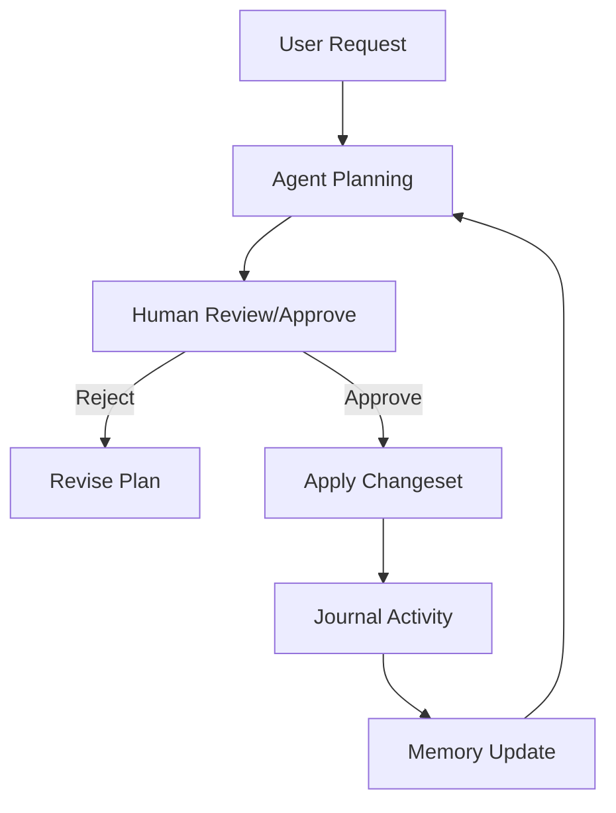

## Exaix — A Local-First, Governed AI Harness for Auditable Code Change

[](https://deno.land/)
[](https://www.sqlite.org/)
[](https://github.com/dostark/exaix/actions)
[](./LICENSE)

> Exaix surrounds AI agents with step-level durability (still maturing), resumable human-approval gates, and a typed domain-event stream — giving you the reliability and governance of a production orchestration system, expressed as inspectable YAML flows and filesystem artifacts instead of an opaque runtime graph, with no cloud infrastructure required.

Exaix processes work requests asynchronously through a gated pipeline: **file → plan → approve → execute → review → merge**. Unlike chat-based agent tools, Exaix is built for autonomous, auditable, multi-agent workflows where humans set the gates and review the outputs.

## Why Exaix

Every operator asks the same question before trusting an autonomous agent with a codebase: _what is it doing right now, can it recover from a transient failure without starting over, and can a human stop it before it commits to something irreversible?_ Exaix answers that question through three layered guarantees — each independently inspectable through the Activity Journal, the CLI, and the flow artifacts on disk:

- **Visibility** — Every significant runtime transition emits a typed, trace-linked event. Watching the Activity Journal or the CLI's live execution stream (`exactl watch <trace_id>`), you can see exactly which step is running, what tool it invoked, and how the result feeds the next step — in real time, with no debugger and no log-grepping.
- **Recoverability** — Step results are persisted with idempotency keys, so a run is designed to resume from its last completed step instead of recomputing earlier LLM calls and tool invocations from scratch. This replay-aware recovery path is still maturing — today's recovery centers on flow-level resume snapshots, with step-level idempotent replay underway — so treat it as the direction the recovery model is converging on, not yet a blanket guarantee for every step type.
- **Governance** — Human approval gates are first-class, durable, and resumable. A plan that would touch production infrastructure pauses and writes a wait-state artifact carrying a deadline and a resume token; you can review and approve it from the CLI hours — or days — later, picking up exactly where the run left off, or let it expire safely if no one acts.

Beyond the three-tier model:

- **Asynchronous by design**: Requests are markdown files. No session, no chat window — submit and walk away.
- **Files-as-API**: The Workspace lives on disk (Requests, Plans, flow artifacts), so it composes naturally with Git, CI, and your existing tooling.
- **Declarative flows, not a second authoring paradigm**: Workflows are authored once, declaratively, and executed by a ReAct-style reasoning engine that selects tools, branches, and recovers based on what it observes at runtime — no parallel code-first SDK to keep in permanent semantic lockstep with the declarative model.
- **MCP-native interoperability**: Built on the Model Context Protocol, the open standard for AI agent tool integration, so Exaix connects to and is connectable from the broader agent ecosystem without proprietary lock-in.
- **Defense-in-depth sandboxing**: Deno's OS-level permission system confines every agent action to explicitly declared file, network, and process boundaries — agents cannot reach beyond what an operator has granted.
- **Multi-agent flows with shared state**: A namespace-scoped flow blackboard lets cooperating agents share intermediate results directly, instead of forcing every handoff through prompt re-injection.
- **Provider-agnostic by design**: Independent provider packages (Anthropic, OpenAI, Google, Vertex, OpenRouter, Ollama) are selected through a circuit-breaker-backed selection layer, so you can mix local and cloud models — or run fully local-first — without rewriting agent logic.

## How Exaix Is Different

| Capability                          | Chat / IDE Agents (Copilot, Cursor) | Orchestration Frameworks (LangChain, AutoGen) | **Exaix**                          |
| ----------------------------------- | ----------------------------------- | --------------------------------------------- | ---------------------------------- |
| Async, file-driven workflow         | ❌ session-bound                    | ⚠️ build-it-yourself                          | ✅ native — Requests are files     |
| Permanent, trace-linked audit trail | ❌ none                             | ⚠️ logging as an afterthought                 | ✅ Activity Journal                |
| Explicit human approval gates       | ⚠️ implicit at best                 | ❌ bring your own                             | ✅ durable, resumable wait states  |
| Replay-aware step recovery          | ❌ not applicable                   | ⚠️ build-it-yourself                          | ✅ idempotency-keyed (maturing)    |
| Real-time execution observability   | ✅ (within the editor session)      | ⚠️ varies by stack                            | ✅ typed event stream + CLI watch  |
| Local-first, no cloud required      | ⚠️ varies by vendor                 | ⚠️ varies by stack                            | ✅ Deno sandbox + local LLM option |

Exaix isn't trying to out-complete your IDE agent or out-orchestrate every framework — it occupies the niche those tools leave open: governed, auditable, asynchronous execution that a human can trust to run unattended and inspect after the fact.

## Key Concepts

| Term               | Description                                                                                                 |
| ------------------ | ----------------------------------------------------------------------------------------------------------- |
| **Request**        | User task input triggering agent workflows.                                                                 |
| **Plan**           | Agent's proposed steps/changes for human review.                                                            |
| **Changeset**      | Approved, atomic file modifications from Plans.                                                             |
| **Plan Amendment** | Mid-execution replanning with human approval when triggers fire.                                            |
| **Wait State**     | Durable, resumable pause point — approval, clarification, or other gate — with deadlines and resume tokens. |
| **Blueprint**      | Reusable agent identity/persona definitions.                                                                |
| **Flow**           | Declarative, multi-agent execution graph with namespace-scoped shared state.                                |
| **Portal**         | Symlink to external project repos for context.                                                              |
| **Memory**         | Persistent vector store for agent recall/search.                                                            |
| **Skills**         | Procedural knowledge ("how-to") injected into agent prompts.                                                |

## Architecture Overview



Every transition in this loop emits a typed, trace-linked event — that event stream is what the Activity Journal, the live execution stream, and the CLI's `watch` command all read from.

## Prerequisites

- Deno 2.0+
- SQLite (built-in)
- Optional: API keys for cloud LLMs (Anthropic, OpenAI, Google) — or run fully local with Ollama

## Quick Start

```bash
# 1. Clone & build
git clone https://github.com/dostark/exaix.git
cd exaix
deno task compile  # or use `deno task start` to run without compiling

# 2. Configure LLM (edit exa.config.toml)
# See LLM Configuration below

# 3. Start daemon + submit example request
deno task start &
exactl request "Refactor src to use new patterns"

# 4. Review the generated plan
exactl plan list
exactl plan approve <id>

# 5. Watch it run in real time
exactl watch <trace_id>
```

## Repo Structure

```text
exaix/
├── packages/       # 21 shared library packages (core, ai, schemas, memory, flow, …)
├── apps/           # 6 app entry points (daemon, exactl, tui, mcp-server, common, agent-entrypoint)
├── scripts/        # Deploy, CI helpers, migration tools
├── tests/          # Integration, scenario, and cross-cutting tests
└── docs/           # User guides
```

Deployed workspace adds `Workspace/`, `Portals/`, `Memory/`, `.exa/` (runtime state).

The current workspace package set includes all 21 packages and 6 app wrappers, declared in `deno.json`. Provider integrations (`@exaix/ai-anthropic`, `@exaix/ai-openai`, `@exaix/ai-google`, `@exaix/ai-vertex`, `@exaix/ai-openrouter`, `@exaix/ai-ollama`) are independent packages selected at bootstrap — see [ARCHITECTURE.md](./ARCHITECTURE.md) for the full provider and package architecture.

## LLM Configuration

Exaix auto-selects providers by cost/performance through a circuit-breaker-backed selection layer. Edit `exa.config.toml`:

**Basic**:

```toml
[ai]
provider = "ollama"
model = "llama3.2"
```

**Advanced Multi-Provider**:

```toml
[models.default]
provider = "anthropic"
model = "claude-3.5-sonnet"

[models.fast]
provider = "openai"
model = "gpt-4o-mini"

[models.local]
provider = "ollama"
model = "llama3.2"

[provider_strategy]
prefer_free = true
max_daily_cost_usd = 5.00
```

Env vars: `ANTHROPIC_API_KEY`, `OPENAI_API_KEY`, etc. Override: `EXA_LLM_PROVIDER=ollama exactl request ...`

## Operator Features

- **CLI Commands**: `exactl request`, `exactl plan`, `exactl review`, `exactl journal`, `exactl wait` (approve/reject/amend/expire pending wait states), `exactl watch <trace_id>` (live execution stream).
- **TUI Dashboard**: `exactl dashboard` — monitor, review, approve in terminal.
- **Daemon**: Background service processes requests via file watcher; also accepts external triggers (webhooks, cron schedules, filesystem events) through a bounded trigger-adapter layer.
- **Least-privilege**: Deno sandbox per agent task — every action is confined to explicitly declared file, network, and process permissions.

## Testing & Contributing

```bash
deno task test_parallel   # Full test suite (parallel + sequential batches)
deno task test            # Run all tests
```

See [CONTRIBUTING.md](CONTRIBUTING.md), [CODE_STYLE.md](CODE_STYLE.md), [AGENTS.md](AGENTS.md).

## Documentation

- **Tools**: [TOOLS.md](./TOOLS.md)
- **Architecture**: [ARCHITECTURE.md](./ARCHITECTURE.md)

## License

Proprietary © Exaix Development Team. See [LICENSE](./LICENSE).

---

## Footer — Agent Knowledge Base

- **Copilot Rules**: [.copilot/rules.md](./.copilot/rules.md)
- **Blueprints**: [.copilot/blueprints/](./.copilot/blueprints/)
- **Manifest**: [.copilot/manifest.json](./.copilot/manifest.json)
