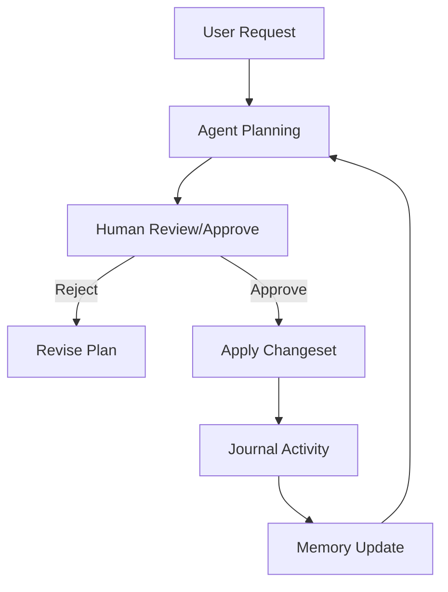

## Exaix — CI/CD for AI Agent Tasks

[](https://deno.land/)
[](https://www.sqlite.org/)
[](https://github.com/dostark/exaix/actions)
[](./LICENSE)

Exaix processes work requests asynchronously through a gated pipeline: **file → plan → approve → execute → review → merge**. Unlike chat-based agent tools, Exaix is designed for autonomous, auditable, multi-agent workflows where humans set gates and review outputs.

## Why Exaix

- **Asynchronous by design**: Requests are markdown files. No session, no chat — submit and walk away.
- **Permanent audit trail**: Every agent action (plan, tool call, file change) is journaled immutably.
- **Explicit approval gates**: Agents propose structured Plans requiring human approval before execution.
- **Files-as-API**: Workspace uses disk files (Requests, Plans) for easy CI/GitHub integration.
- **Multi-agent DAGs**: Flow system pipelines multiple agents with judges, parallel groups, and feedback loops.
- **Local-first security**: Deno permissions + optional cloud LLMs keep data on your machine by default.

## Key Concepts

| Term               | Description                                                      |
| ------------------ | ---------------------------------------------------------------- |
| **Request**        | User task input triggering agent workflows.                      |
| **Plan**           | Agent's proposed steps/changes for human review.                 |
| **Changeset**      | Approved, atomic file modifications from Plans.                  |
| **Plan Amendment** | Mid-execution replanning with human approval when triggers fire. |
| **Safety Gate**    | Approval checkpoint for dynamic mission adjustments.             |
| **Blueprint**      | Reusable agent identity/persona definitions.                     |
| **Portal**         | Symlink to external project repos for context.                   |
| **Memory**         | Persistent vector store for agent recall/search.                 |
| **Skills**         | Procedural knowledge ("how-to") injected into agent prompts.     |

## Architecture Overview



## Prerequisites

- Deno 2.0+
- SQLite (built-in)
- Optional: API keys for cloud LLMs (Anthropic, OpenAI, Google)

## Quick Start

```bash
# 1. Clone & build
git clone https://github.com/dostark/exaix.git
cd exaix
deno task compile  # or use `deno task start` to run without compiling

# 2. Configure LLM (edit exa.config.toml)
# See LLM Configuration below

# 3. Start daemon + submit example request
deno task start &
exactl request "Refactor src to use new patterns"

# 4. Review generated plan
exactl plan list
exactl plan approve <id>
```

## Repo Structure

```text
exaix/
├── packages/       # 21 shared library packages (core, ai, schemas, memory, flow, …)
├── apps/           # 6 app entry points (daemon, exactl, tui, mcp-server, common, agent-entrypoint)
├── scripts/        # Deploy, CI helpers, migration tools
├── tests/          # Integration, scenario, and cross-cutting tests
└── docs/           # User guides (moved to exaix-dev-docs/)
```

Deployed workspace adds `Workspace/`, `Portals/`, `Memory/`, `.exa/` (runtime state).

The current workspace package set includes all 21 packages and 6 app wrappers in `deno.json`.
See `exaix-dev-docs/dev/Exaix_Packages.md` for the full package catalog.

## LLM Configuration

Exaix auto-selects providers by cost/performance. Edit `exa.config.toml`:

**Basic**:

```toml
[ai]
provider = "ollama"
model = "llama3.2"
```

**Advanced Multi-Provider**:

```toml
[models.default]
provider = "anthropic"
model = "claude-3.5-sonnet"

[models.fast]
provider = "openai"
model = "gpt-4o-mini"

[models.local]
provider = "ollama"
model = "llama3.2"

[provider_strategy]
prefer_free = true
max_daily_cost_usd = 5.00
```

Env vars: `ANTHROPIC_API_KEY`, `OPENAI_API_KEY`, etc. Override: `EXA_LLM_PROVIDER=ollama exactl request ...`

## Operator Features

- **CLI Commands**: `exactl request`, `exactl plan`, `exactl review`, `exactl journal`.
- **TUI Dashboard**: `exactl dashboard` — monitor, review, approve in terminal.
- **Daemon**: Background service processes requests via file watcher.
- **Least-privilege**: Deno sandbox per agent task.

## Testing & Contributing

```bash
deno task test_parallel   # Full test suite (parallel + sequential batches)
deno task test            # Run all tests
```

See [CONTRIBUTING.md](CONTRIBUTING.md), [CODE_STYLE.md](CODE_STYLE.md), [AGENTS.md](AGENTS.md).

## Documentation

- **Tools**: [TOOLS.md](./TOOLS.md)
- **Architecture**: [ARCHITECTURE.md](./ARCHITECTURE.md)
- **Developer Setup**: [exaix-dev-docs/dev/Exaix_Developer_Setup.md](./exaix-dev-docs/dev/Exaix_Developer_Setup.md)
- **Package Reference**: [exaix-dev-docs/dev/Exaix_Packages.md](./exaix-dev-docs/dev/Exaix_Packages.md)
- **White Paper**: [exaix-dev-docs/dev/Exaix_White_Paper.md](./exaix-dev-docs/dev/Exaix_White_Paper.md)

## License

Proprietary © Exaix Development Team. See [LICENSE](./LICENSE).

---

## Footer — Agent Knowledge Base

- **Copilot Rules**: [.copilot/rules.md](./.copilot/rules.md)
- **Blueprints**: [.copilot/blueprints/](./.copilot/blueprints/)
- **Dev Docs**: [exaix-dev-docs/](./exaix-dev-docs/)
- **Manifest**: [.copilot/manifest.json](./.copilot/manifest.json)
