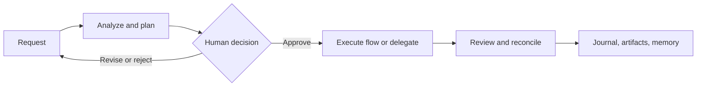

## Exaix — Local-First, Governed AI Orchestration

[](https://deno.land/)
[](https://www.sqlite.org/)
[](https://github.com/dostark/exaix/actions)
[](./LICENSE)

Exaix is an asynchronous, file-driven harness for running AI work with explicit human
control. It turns a request into an inspectable lifecycle — **request → plan → approval
→ execution → review** — rather than treating a chat transcript as the system of record.

Use it when an agent’s work needs to be repeatable, reviewable, and attributable: code
changes across repositories, scheduled analysis, governed delegation to native coding
clients, or workflows that must survive beyond one interactive session. Exaix can run with
local models or supported cloud providers; its runtime state remains in your workspace and
SQLite journal rather than requiring hosted orchestration infrastructure.

> **What Exaix is not:** an IDE autocomplete tool or a replacement for interactive pair
> programming. Copilot and Cursor serve a different, session-oriented workflow; LangChain
> and AutoGen are orchestration frameworks with a different integration model. Claude Code,
> Codex, and OpenCode remain useful for exploratory work. Exaix can delegate bounded work
> to them, then brings the result back through its approval, scope, and audit boundaries.

## Why teams use it

| Need                                     | Exaix approach                                                                                                 |
| ---------------------------------------- | -------------------------------------------------------------------------------------------------------------- |
| Know what an agent did                   | Typed, trace-linked events are written to an Activity Journal and exposed through the CLI.                     |
| Keep people in control                   | Plans, amendments, and other decisions can pause in durable wait states for review.                            |
| Run work asynchronously                  | Requests and plans are filesystem artifacts, so the daemon can continue after the submitting terminal closes.  |
| Work across codebases                    | Portals provide named, scoped project context; flows and policies constrain how it is used.                    |
| Avoid a single model or vendor           | Provider selection supports local Ollama and independent cloud-provider integrations.                          |
| Delegate without surrendering governance | Native CLI delegates return a structured result that is reconciled against permitted paths and existing gates. |

## What you can build with Exaix

- **Governed code-change pipelines:** turn a feature request into a reviewed plan, execute
  the approved work in a scoped project, and retain the trace, diff, and decisions.
- **Multi-agent flows:** compose specialized roles such as analyst, implementer, and
  quality judge in declarative YAML flows with ordered dependencies and shared state.
- **Repository-aware work:** attach projects as portals, maintain durable memory, and
  reuse skills and agent blueprints instead of rebuilding context on every request.
- **Scheduled and external triggers:** accept filesystem, webhook, and scheduled inputs
  through bounded trigger adapters, then process them through the same workflow controls.
- **Session-tool delegation:** launch supported headless native clients where appropriate;
  Exaix treats their output as untrusted until it is reconciled and reviewed.
- **Auditable context for trusted dogfood delegation:** optionally capture Exaix-owned,
  post-redaction context submissions and inspect them later without re-running retrieval.

## How it works



The durable artifacts make each stage inspectable:

| Artifact              | Purpose                                                                             |
| --------------------- | ----------------------------------------------------------------------------------- |
| **Request**           | A structured task, its scope, constraints, priority, and acceptance criteria.       |
| **Plan**              | The proposed work for human review before execution.                                |
| **Flow**              | A declarative graph of roles, dependencies, retries, and outputs.                   |
| **Wait state**        | A durable pause for approval, clarification, amendment, or other decision.          |
| **Activity Journal**  | SQLite-backed trace history for lifecycle events and operator investigation.        |
| **Portal and memory** | Named project context and durable knowledge available within configured boundaries. |

For terminology, start with the [Glossary](./GLOSSARY.md). For component boundaries and
design rationale, see [Architecture](ARCHITECTURE.md).

## Quick start: run from source

This path runs the CLI directly from the repository, so it does not assume a globally
installed `exactl` binary. It uses Ollama for a local model; choose a cloud provider in
the [User Guide](docs/Exaix_User_Guide.md) if that better fits your environment.

### Prerequisites

- Deno 2.x
- Git
- SQLite (bundled with the runtime setup)
- One model provider: [Ollama](https://ollama.com/) for local operation, or credentials
  for a supported cloud provider

```bash
# 1. Clone and prepare the source checkout.
git clone https://github.com/dostark/exaix.git
cd exaix

# 2. For local operation, start Ollama and fetch a model.
ollama serve &
ollama pull llama3.2

# 3. Configure Exaix through its source-run CLI.
deno task cli -- config set ai.provider ollama
deno task cli -- config set ai.model llama3.2

# 4. Start the daemon. It manages its own background process.
deno task start

# 5. Submit a bounded request and keep the trace ID printed by the command.
deno task cli -- request "Add a health endpoint with a 200-status integration test" \
  --acceptance-criteria "GET /health returns 200"

# 6. Review the generated plan before allowing execution.
deno task cli -- plan list
deno task cli -- plan show <plan-id>
deno task cli -- plan approve <plan-id>

# 7. Observe and then stop the daemon when finished.
deno task cli -- watch <trace-id>
deno task stop
```

Do not approve a plan solely because it was generated. Check its scope, proposed tools,
acceptance criteria, target project/branch, and the validation it will run. If a request
needs more detail, use `deno task cli -- request clarify <trace-id>` before proceeding.

The default clone is a complete Solo checkout; Team, Enterprise, and planning submodules
require separate access and are not needed for this path. For deployment and contribution
setup, see [Contributing](CONTRIBUTING.md). For a self-hosted workflow that uses Exaix to
develop Exaix, use the [Dogfooding Guide](docs/Exaix_Dogfooding.md) and its isolated
worktree instructions.

## Core capabilities

### Governed execution

Plans, plan amendments, clarification requests, and review decisions are explicit control
points. A decision can remain pending, expire, or resume later rather than being hidden in
an in-memory agent conversation. Exaix records the lifecycle around that decision so an
operator can explain what happened and why.

### Declarative multi-agent workflows

Flows define the work shape in YAML: the roles involved, dependencies, retry behavior,
and outputs. Agents can exchange deliberately scoped intermediate state through a flow
blackboard. This keeps orchestration visible and reviewable instead of dispersing it
through ad-hoc application code.

### Portals, memory, and skills

Portals attach project repositories under a named alias. Memory stores durable knowledge,
and skills add reusable procedural instructions to an agent’s prompt. These mechanisms
provide context without requiring every task to start from an empty chat session. Their
configuration and access boundaries matter; see the [User Guide](docs/Exaix_User_Guide.md)
before mounting projects that contain sensitive material.

### Provider and native-client flexibility

The Solo repository includes independent integrations for Anthropic, OpenAI, Google,
OpenRouter, and Ollama, plus a CLI-delegate provider. Provider selection includes routing
and circuit-breaker behavior so a flow is not hard-wired to one model vendor. Native
delegation supports headless coding clients as transient external processes; it does not
turn their private session state into Exaix state.

### Observability and operator control

Use the CLI to create requests, inspect plans, act on wait states, follow a trace, and
inspect the journal. The terminal dashboard offers an interactive operational view. See
the [CLI and configuration reference](docs/Exaix_User_Guide.md) for commands, output
contracts, and troubleshooting.

### Security boundaries

Exaix uses Deno permissions and configured path, network, and process boundaries as
defense in depth. Portal and workspace paths are validated before use; delegated work is
subject to configured scope checks and existing review gates. These controls reduce risk,
but they are not a substitute for reviewing a privileged plan, protecting provider
credentials, or isolating untrusted repositories appropriately.

## Repository map

```text
packages/       Reusable domain packages: requests, flows, execution, memory, portals, storage, and providers
apps/           Runtime entry points: daemon, exactl CLI, TUI, MCP server, and shared bootstrap
Blueprints/     Declarative agent roles, skills, tools, and flow definitions
tests/          Unit, integration, scenario, and security-oriented validation
scripts/        Workspace setup, migrations, checks, CI, and operational helpers
docs/           User, evaluation, and developer documentation
```

The workspace runtime adds `Workspace/`, `Portals/`, `Memory/`, and `.exa/` for requests,
artifacts, context, and local journal state. Do not treat those runtime directories as a
source-code replacement; manage the source repository and runtime workspace separately.

## Choose the right workflow

| If you need to...                                | Start here                                                      |
| ------------------------------------------------ | --------------------------------------------------------------- |
| Submit, inspect, and operate ordinary AI work    | [User Guide](docs/Exaix_User_Guide.md)                          |
| Understand architecture and invariants           | [Architecture](ARCHITECTURE.md)                                 |
| Learn the project vocabulary                     | [Glossary](GLOSSARY.md)                                         |
| Run a sandboxed Exaix-on-Exaix development cycle | [Dogfooding Guide](docs/Exaix_Dogfooding.md)                    |
| Build or score scenario evaluations              | [Evaluation Guide](docs/Exaix_Evaluation.md)                    |
| Set up a contributor workspace                   | [Contributing](CONTRIBUTING.md)                                 |
| Contribute code                                  | [Contributing](CONTRIBUTING.md) and [Code Style](CODE_STYLE.md) |
| Review MCP tool contracts                        | [Tool reference](.copilot/docs/TOOLS.md)                        |

## Testing and contributing

Run focused checks while developing; use the repository-wide suite when the change scope
justifies it:

```bash
deno task check
deno task test_parallel
```

Read [CONTRIBUTING.md](CONTRIBUTING.md) before opening a contribution. It covers hooks,
workspace setup, validation expectations, and the edition-aware repository layout.

## Editions and license

The open-source Solo edition in `packages/`, `apps/`, and `scripts/` is licensed under
Apache License 2.0. Team and Enterprise capabilities are mounted as private submodules
when the caller has access; their licenses and availability differ. See the
[edition model](ARCHITECTURE.md#edition-model-overview) and the license files in the
respective directories before redistributing or enabling those editions.

## For AI coding agents

Repository-specific agent instructions live in [AGENTS.md](AGENTS.md) and the
[.copilot knowledge base](.copilot/README.md). They are contributor guidance, not
runtime configuration for an Exaix workspace.
