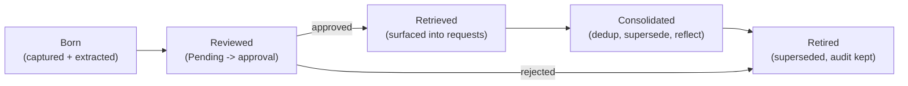
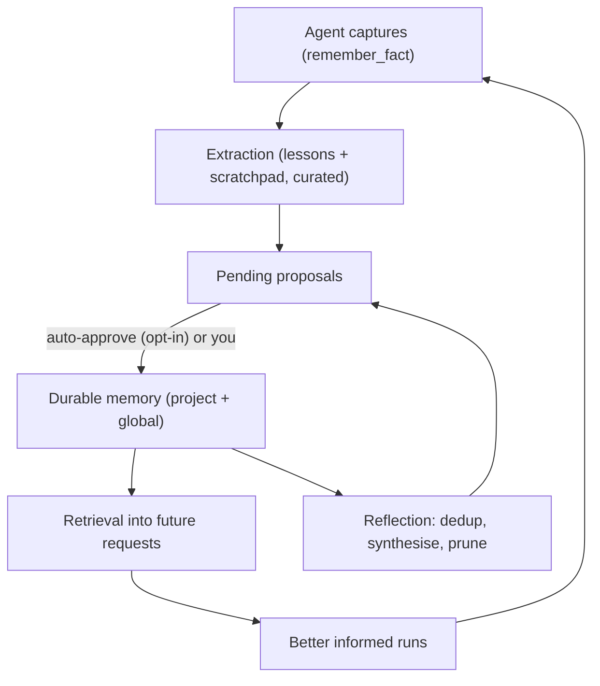

# Exaix Memory Guide

- **Version:** 1.3.0
- **Date:** 2026-09-02
- **Status:** Current — covers the memory system as matured in Phase 147
- **Companion:** operational commands live in [Exaix_User_Guide.md §3.2](Exaix_User_Guide.md#32-memory-banks); contributor view in [ARCHITECTURE.md §Memory Banks Architecture](../ARCHITECTURE.md#memory-banks-architecture)

## 1. Why Exaix Remembers

Every Exaix execution — an agent run, a flow step, a plan you approved — produces
knowledge: a gotcha discovered mid-task, a convention the codebase follows, a
mistake worth never repeating. Without memory, that knowledge evaporates when the
run ends and the same lesson is re-learned (or re-mistaken) next week.

Exaix remembers in layers, so the right knowledge surfaces at the right time:

- **Execution memory** — what happened in one run: summaries, context, the notes
  the agent jotted down while working.
- **Session working memory** — what the current conversation already knows,
  promoted through tiers (`WORKING` → `EPISODIC` → `SEMANTIC`) as it proves
  durable.
- **Project memory** — per-portal knowledge: overview, patterns, decisions tied
  to one codebase.
- **Global learnings** — cross-project, durable insights that survive individual
  runs and improve every future request.

**Local-first and cost-gated by default.** Memory operations prefer the local
Ollama provider; anything that needs a remote (cloud) model passes a cost gate
(`MemoryCostRouter`) first. When no remote is available or the budget says no,
every LLM-driven step falls back to a deterministic, offline-safe path — memory
never becomes a hard dependency on a cloud bill.

## 2. The Memory Lifecycle

Memory in Exaix moves through five stages. Each stage has a human-meaningful
name, and — importantly — you stay in control at the boundary that matters.



### 2.1 Born — capture and extraction

Knowledge enters the system two ways:

1. **Post-run extraction.** When an execution completes, the extractor reads the
   execution record's `lessons_learned`, `summary`, and `error_message`, and proposes
   reusable learnings.
2. **In-the-moment capture.** While the agent works, it can call the
   `remember_fact` tool to jot down a "worth remembering" note the moment it
   notices something — instead of relying on reconstructing it in the final
   summary. These notes land in the execution's scratchpad and feed the same
   extraction pass.

Both sources are read together in one pass, so an insight the agent jotted
mid-run and restated in its summary is extracted **once**, not twice.

#### What exactly does the extractor read?

The extraction input is the **execution record** — a compact digest written when the
run finishes, **not** the session transcript. Concretely, per run:

- **`lessons_learned`** — up to 5 short "lesson" sentences mined from the run's own
  reasoning and summary text (sentences like "learned that …", "discovered …",
  "found that …", "realized …", "important to …"). It is _not_ a session log: model
  reasoning traces, individual tool calls, and user answers are never fed to the
  extractor. A known limitation (tracked as the phase's GAP-9, remediation Step 21):
  in the plan-execution path this digest is currently built from placeholder strings,
  so `lessons_learned` is often empty and the `summary` is boilerplate — until the
  agent's real completion output is wired into the record.
- **`summary`** — the run's completion summary text.
- **`error_message`** — set when the run failed; drives troubleshooting extraction.
- **Scratchpad notes** — everything the agent captured via `remember_fact` during the
  run (often the richest real content today).

If you want reliably rich extraction today, encourage `remember_fact` capture during
runs — the scratchpad is the one source that always carries genuine in-the-moment
content.

**The content-curation gate.** Extraction and consolidation are guided by a
content-curation policy skill (`memory-extraction-content-policy`). It tells the
extractor what is worth remembering — actionable patterns, decisions, do/don't
guidance tied to concrete context — and what to deprioritize: structural facts
like _"file A imports file B"_, which portal knowledge analysis already answers
on demand. This keeps Memory distinct from Portal Knowledge: memory holds what
is **not** trivially re-derivable.

**No fast path.** Scratchpad notes go through exactly the same extraction,
curation, and review pipeline as any other candidate. There is no
direct-to-global shortcut — a captured note can never bypass human or
auto-approval review.

### 2.2 Reviewed — the Pending workflow

Extracted candidates land in `Memory/Pending/` as proposals. Nothing enters the
durable banks without review:

```bash
# See what's waiting
exactl memory pending list

# Approve a proposal
exactl memory pending approve <proposal-id>

# Reject it, with a reason
exactl memory pending reject <proposal-id> --reason "Duplicate of an existing learning"
```

**Opt-in auto-approval.** If you want the loop to close without a human, enable:

```toml
[memory.auto_approve]
enabled = true                # default false — you opt in
confidence_threshold = "high" # minimum model-reported confidence
delay_hours = 24              # quiet period before auto-approval
```

Only proposals that clear the confidence threshold, come from an allowed
source, and have aged past the quiet period are auto-approved. Everything else
waits for you. Defaults never change behavior: with `enabled = false`, you
review everything.

### 2.3 Retrieved — what surfaces into a request

When you submit a request, Exaix retrieves relevant memory and injects it into
the agent's context. What surfaces is ranked by a hybrid of:

- **Keyword signals** — full-text and tag matches (`memory.search` uses the
  same machinery).
- **Semantic signals** — embedding similarity, weight-adjustable via
  `memory.retrieval.vector_weight`.
- **Temporal signals** — recency weighting (half-life configurable via
  `memory.temporal.recency_half_life_days`) so fresh learnings outrank stale
  ones, and superseded knowledge is excluded outright.

You can also inspect what memory holds at any time:

```bash
exactl memory list
exactl memory search "rate limiter"
exactl memory search --tags "error-handling,async"
exactl memory search "database migration" --use-embeddings
```

### 2.4 Consolidated — staying clean over time

Durable memory is actively consolidated, not just accumulated:

- **Deduplication** — when a new learning is a near-duplicate of an approved
  one (similarity above `memory.dedup.similarity_threshold`), the two merge and
  the original is superseded, keeping the stronger of the two texts.
- **Supersession** — when guidance genuinely changes ("limiter resets per
  request" vs "resets on full restart"), the old learning is retired with an
  audit trail: it is marked superseded and linked to its replacement, never
  silently deleted.
- **Reflection** — a periodic consolidation pass over approved global memory:
  it merges near-duplicates, synthesises related learnings into higher-order
  proposals (which re-enter the review stage — synthesis never bypasses
  approval), prunes low-value entries, and links learnings that were compared
  but deliberately kept distinct.

### 2.5 Retired — honest endings

Retirement is reversible-by-audit, not amnesia:

- Superseded learnings stay on disk with a typed link to their replacement.
- Rejections and removals are journalled in the activity log
  (`exactl memory execution list` shows the runs; the journal shows the memory
  events).
- Learnings can also be removed explicitly:
  `exactl memory delete-learning <learningId>`.

> **Operator note (one-time sweep):** installations that ran earlier builds may hold
> orphaned pending entries in the global learnings store, left behind by the old
> insight feed. They are excluded from retrieval and review; sweep them by deleting
> entries whose status is "pending" (keep a backup first).

## 3. The Self-Learning Loop

Put together, the stages form a loop that closes without a human when you opt
in:



- **Capture** happens in the moment (`remember_fact`) and after the run
  (`lessons_learned`).
- **Extraction** merges both sources under the curation policy.
- **Approval** is yours, or automatic under `memory.auto_approve.enabled = true`
  with the confidence bar you set.
- **Retrieval** makes the next run smarter; **reflection** keeps the store
  clean.

This loop is verified end-to-end by the phase's integration cutover tests — a
single run exercises capture → extraction → auto-approval → retrieval →
reflection against the real service graph.

## 4. Configuration Reference

| Config key                                    | Default      | What it controls                                                                                   |
| --------------------------------------------- | ------------ | -------------------------------------------------------------------------------------------------- |
| `memory.auto_approve.enabled`                 | `false`      | Opt into closing the loop without human review                                                     |
| `memory.auto_approve.confidence_threshold`    | `high`       | Minimum confidence for auto-approval                                                               |
| `memory.auto_approve.delay_hours`             | `24`         | Quiet period before a proposal is eligible                                                         |
| `memory.auto_approve.sources_allowed`         | `["AGENT"]`  | Which extraction sources may auto-approve                                                          |
| `memory.dedup.similarity_threshold`           | `0.92`       | Similarity above which learnings merge                                                             |
| `memory.temporal.recency_half_life_days`      | (see config) | How fast old learnings down-rank                                                                   |
| `memory.retrieval.vector_weight`              | (see config) | Embedding-signal weight in hybrid retrieval                                                        |
| `memory.scratchpad.max_entries_per_execution` | `200`        | Cap on `remember_fact` notes per run                                                               |
| `memory.session.expand_links`                 | `false`      | Opt-in: retrieval follows one hop of inter-memory links (multi-hop surfacing of related learnings) |

## 5. Deterministic Fallbacks

| Capability                 | LLM path                             | Fallback (offline/CI safe)                     |
| -------------------------- | ------------------------------------ | ---------------------------------------------- |
| Extraction                 | Skill-guided LLM extraction          | Heuristic keyword-based categorised extraction |
| Contradiction adjudication | LLM decides add/update/supersede     | Cosine-similarity dedup merge                  |
| Reflection synthesis       | LLM proposes synthesis/prune actions | Deterministic merge phase + skip synthesis     |
| Embeddings                 | Provider embeddings                  | Deterministic hash-based local vectors         |

Every memory feature works with the provider off; the LLM paths make it better.

## 6. Measuring It

Phase 148 owns the measurement story — extraction quality vs the heuristic
baseline, dedup rates, retrieval precision/recall, consolidation gains, and
per-provider positioning. Positioning claims are per-benchmark and
per-provider; consult the phase-148 measurement outputs before quoting numbers.
