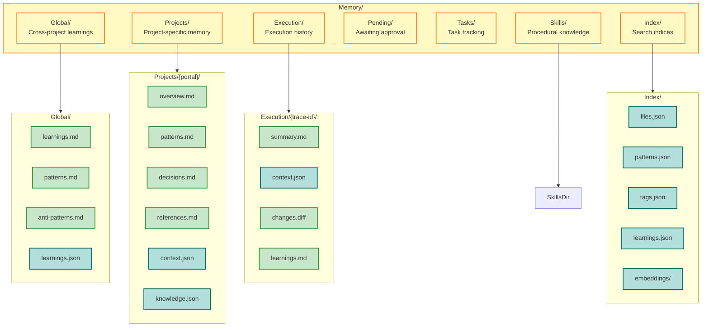
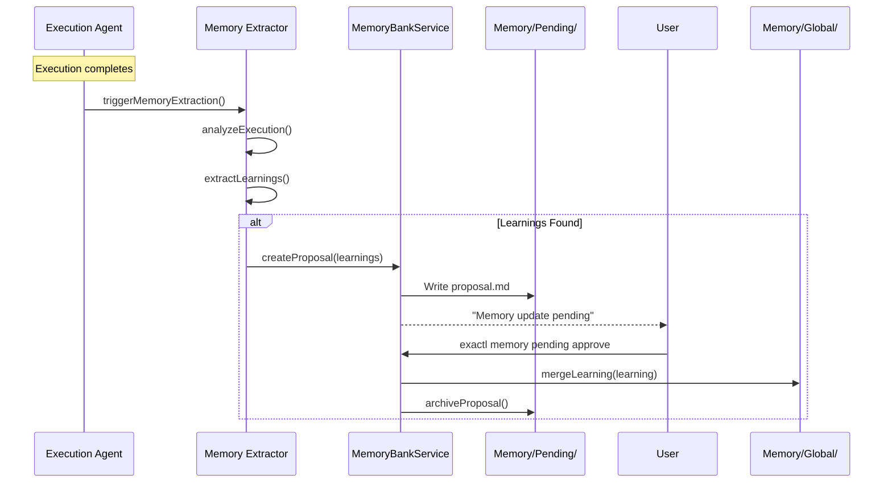
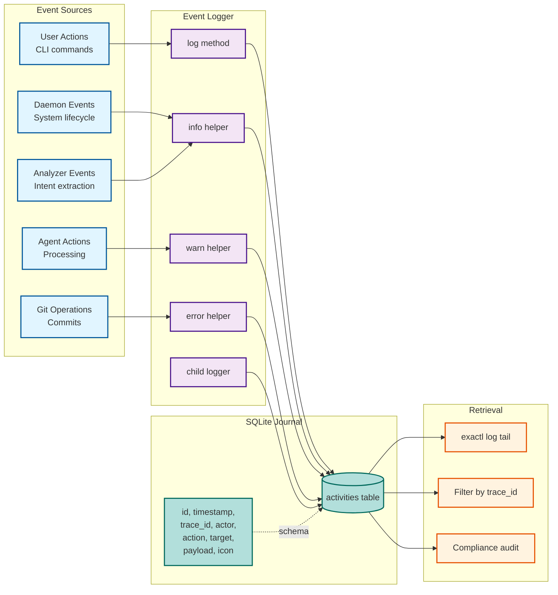
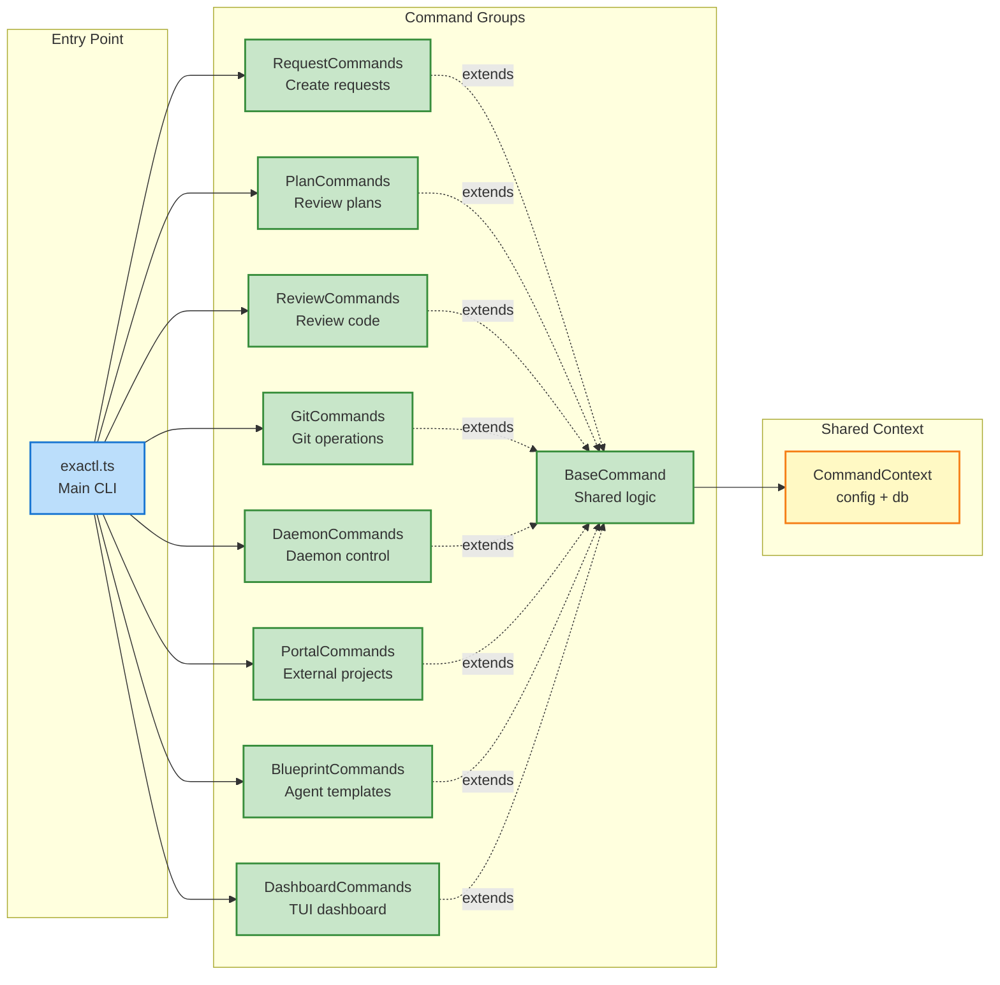
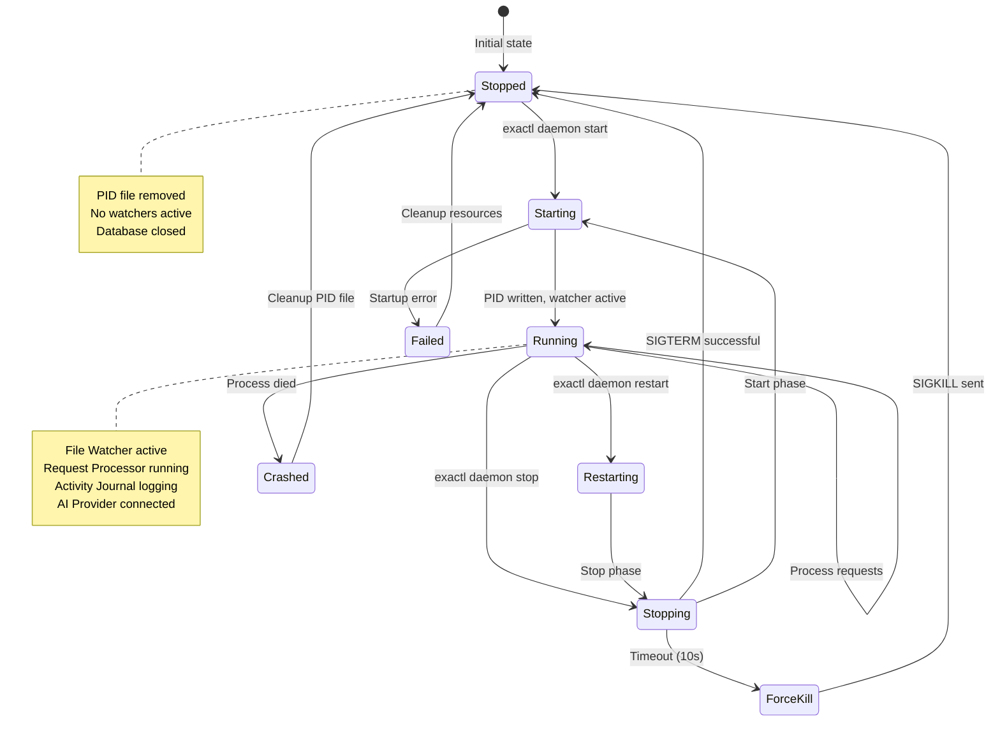

# Reference Data

Implementation reference data — edition tables, component status, scenario packs, developer scripts, and module index.

---

## Edition Model — Component Availability

| Component Category  | Solo 🟢                                                  | Team 🔵                  | Enterprise 🟣                       |
| ------------------- | -------------------------------------------------------- | ------------------------ | ----------------------------------- |
| **Interface**       | CLI + TUI (7 views)                                      | + Web UI                 | + Enhanced TUI (9 views)            |
| **Audit Database**  | SQLite (embedded)                                        | PostgreSQL (append-only) | PostgreSQL + immudb (WORM)          |
| **MCP Support**     | Client only                                              | + Server mode            | + Custom tool development           |
| **LLM Providers**   | Ollama, OpenAI, Anthropic, Google, Vertex AI, OpenRouter | OpenRouter (Team+ tier)  | + Azure OpenAI, AWS Bedrock         |
| **Memory Banks**    | Basic (file-based)                                       | + Full-text search       | + Vector search, knowledge graphs   |
| **Collaboration**   | Single user                                              | Multi-user (unlimited)   | + RBAC, department isolation        |
| **Compliance**      | ❌                                                       | ❌                       | ✅ EU AI Act, HIPAA, SOX, ISO 27001 |
| **Cost Management** | Basic logs                                               | Per-user budgets, alerts | Forecasting, anomaly detection      |

---

## Memory Banks

### Directory Structure



### Update Workflow



### CLI Command Tree

```text
exactl memory
├── list                    # List all memory banks
├── search <query>          # Search across memory
├── project list|show       # Project memory ops
├── execution list|show     # Execution history
├── global show|stats       # Global memory
├── pending list|approve    # Pending updates
├── promote|demote          # Move learnings
└── rebuild-index           # Regenerate indices
```

### Key Components

| Component              | Location                                             | Purpose                           | Status      |
| ---------------------- | ---------------------------------------------------- | --------------------------------- | ----------- |
| MemoryBankService      | `packages/memory/src/bank/memory_bank.ts`            | Core CRUD operations              | ✅ Complete |
| Memory Schemas         | `packages/schemas/src/`                              | Zod validation schemas            | ✅ Complete |
| Memory Extractor       | `packages/memory/src/extraction/memory_extractor.ts` | Learning extraction               | ✅ Complete |
| Memory Embedding       | `packages/memory/src/embedding/memory_embedding.ts`  | Vector embeddings for search      | ✅ Complete |
| Memory CLI             | `apps/exactl/src/commands/`                          | CLI interface                     | ✅ Complete |
| Integration Tests      | `tests/integration/memory_integration_test.ts`       | End-to-end tests                  | ✅ Complete |
| PortalKnowledgeService | `packages/portal/src/`                               | Codebase analysis pipeline        | ✅ Complete |
| PortalKnowledgeSchema  | `packages/schemas/src/portal_knowledge.ts`           | Zod validation for knowledge.json | ✅ Complete |
| KnowledgePersistence   | `packages/portal/src/`                               | knowledge.json read/write         | ✅ Complete |

---

## Blueprint Management — Built-in Templates

| Template ID  | Model            |
| ------------ | ---------------- |
| `default`    | Ollama llama3.2  |
| `coder`      | Claude Sonnet    |
| `reviewer`   | GPT-4            |
| `architect`  | Claude Opus      |
| `researcher` | GPT-4 Turbo      |
| `mock`       | MockLLMProvider  |
| `gemini`     | Gemini 2.0 Flash |

---

## Scenario Framework

### Scenario Packs

| Pack                 | Scenarios | Focus                                                      |
| -------------------- | --------- | ---------------------------------------------------------- |
| `dynamic_execution`  | 5         | Dynamic tool selection, ReAct loops, permission boundaries |
| `mcp_tools_extended` | 5         | New MCP tool handlers in realistic workflows               |
| `integration_e2e`    | 3         | End-to-end flows combining all new features                |

### Execution Modes

| Mode                | Description                      | Use Case                     |
| ------------------- | -------------------------------- | ---------------------------- |
| `auto`              | Runs all steps non-interactively | CI and regression testing    |
| `step`              | Pauses after every step          | Debugging and development    |
| `manual-checkpoint` | Pauses only at marked steps      | Human-in-the-loop validation |

---

## Developer Tooling

### .copilot/ Knowledge Base

- `.copilot/manifest.json`: index of agent docs with metadata and chunk references
- `.copilot/chunks/*`: chunked doc text used for retrieval

**Build/validation scripts:**

- `scripts/build_agents_index.ts`: rebuilds `.copilot/manifest.json` and chunks
- `scripts/verify_manifest_fresh.ts`: checks manifest/chunks are up to date
- `scripts/validate_agents_docs.ts`: validates agent-doc frontmatter/schema

### CI, Scaffolding, and Database Tooling

- `scripts/ci.ts`: orchestrates repository checks and tests in CI-like environments
- `scripts/scaffold.sh`: scaffolds a new Exaix workspace folder structure and templates
- `scripts/setup_db.ts`: initializes `journal.db` schema
- `scripts/migrate_db.ts` + `migrations/*.sql`: applies incremental database migrations

---

## Module Grounding Index

Core infrastructure modules for architecture validation:

- `apps/daemon/main.ts` (Daemon entry point)
- `apps/daemon/src/*.ts` (Watcher, graceful shutdown, daemon runtime)
- `apps/exactl/src/commands/*.ts` (CLI command entry points)
- `apps/tui/src/*.ts` (TUI views and dashboard)
- `apps/mcp-server/` (MCP server app entry point)
- `apps/common/*.ts` (Shared adapters and registry bootstrap)
- `packages/core/src/types/*.ts` (Global enums, constants, and shared interfaces)
- `packages/core/src/config/*.ts` (Configuration schemas and paths)
- `packages/core/src/context/*.ts` (Context loading and prompt budget)
- `packages/core/src/logger/*.ts` (Event logger)
- `packages/core/src/observability/*.ts` (Event bus)
- `packages/core/src/parsing/*.ts` (Markdown and frontmatter parsers)
- `packages/core/src/planning/*.ts` (Plan writer and shared plan utilities)
- `packages/core/src/skills/*.ts` (Skills service, criteria generator)
- `packages/core/src/artifact/*.ts` (Mission reporter, review registry)
- `packages/core/src/func/*.ts` (Prompt context utilities)
- `packages/core/src/evaluation/*.ts` (Evaluation criteria)
- `packages/core/src/notification/*.ts` (Notification service)
- `packages/core/src/health/*.ts` (Health check service)
- `packages/core/src/request/*.ts` (Retry policy)
- `packages/core/src/blueprint/*.ts` (Blueprint loader)
- `packages/schemas/src/*.ts` (Data validation schemas)
- `packages/ai/src/*.ts` (AI Provider selector and types)
- `packages/ai-anthropic/src/*.ts` (Anthropic/Claude provider)
- `packages/ai-openai/src/*.ts` (OpenAI provider)
- `packages/ai-google/src/*.ts` (Google Gemini provider)
- `packages/ai-vertex/src/*.ts` (Google Vertex AI provider, service-account auth)
- `packages/ai-openrouter/src/*.ts` (OpenRouter unified-gateway provider)
- `packages/ai-ollama/src/*.ts` (Ollama provider)
- `packages/mcp/src/*.ts` (MCP client, manifest, handlers)
- `packages/mcp/src/handlers/*.ts` (MCP Tool implementations)
- `packages/mcp/server/*.ts` (MCP server transport)
- `packages/flow/src/*.ts` (Flow engine internals)
- `packages/execution/src/*.ts` (Agent runner, plan executor, reflexive agent)
- `packages/execution/src/strategies/*.ts` (ReAct loop and other strategies)
- `packages/memory/src/*.ts` (Memory bank, extractor, embedding, session)
- `packages/storage-sqlite/src/*.ts` (Database service)
- `packages/portal/src/*.ts` (Portal knowledge, path resolver, workspace context)
- `packages/request/src/*.ts` (Request processor, router, analysis, common)
- `packages/quality-gate/src/*.ts` (Request quality gate and clarification engine)
- `packages/tool-runtime/src/*.ts` (Tool registry, output validator, tool reflector)
- `packages/git/src/*.ts` (Git service)
- `packages/cli/src/*.ts` (Shared CLI utilities)

---

## Live Execution Streaming

### Component Responsibilities

| Component             | Purpose                                      | Key File                                                   |
| --------------------- | -------------------------------------------- | ---------------------------------------------------------- |
| **EventBusService**   | In-memory pub/sub routed by `traceId`        | `packages/core/src/observability/event_bus_service.ts`     |
| **EventLogger**       | Publishes `IStreamingEvent` to event bus     | `packages/core/src/logger/event_logger.ts`                 |
| **ReActLoopStrategy** | Emits heartbeat via `setInterval` during LLM | `packages/execution/src/strategies/react_loop_strategy.ts` |
| **SseHandler**        | Bridges HTTP SSE to `EventBusService`        | `packages/mcp/server/sse_handler.ts`                       |
| **WatchCommand**      | CLI `exactl watch <trace_id>` with colors    | `apps/exactl/src/commands/watch.ts`                        |

### Key Design Decisions

- **traceId routing**: Subscribers receive only events matching their requested `traceId`; wildcard (`*`) subscribes to all.
- **Backpressure**: Events dropped for a subscriber if its queue exceeds `EVENT_BUS_MAX_SUBSCRIBER_QUEUE` (1 000).
- **Heartbeat interval**: `EXECUTION_HEARTBEAT_INTERVAL_MS` (5 000 ms) fires only while `provider.generate()` is in flight.
- **Security**: SSE endpoint validates `traceId` against UUID schema; bound to `127.0.0.1` only; client disconnect triggers unsubscription via `AbortController`.
- **Fallback**: `watch` command queries historical DB events when SSE server is unavailable.

---

## Component Responsibilities

| Component                     | Responsibility                                                | Key Files                                                                     | Edition  |
| ----------------------------- | ------------------------------------------------------------- | ----------------------------------------------------------------------------- | -------- |
| **CLI Layer**                 | Human interface for system control                            | `apps/exactl/src/commands/*.ts`                                               | 🟢 All   |
| **Daemon**                    | Background orchestration engine                               | `apps/daemon/main.ts`                                                         | 🟢 All   |
| **Request Watcher**           | Detect new requests in Workspace/Requests                     | `apps/daemon/src/watcher.ts`                                                  | 🟢 All   |
| **Plan Watcher**              | Detect approved plans                                         | `apps/daemon/src/watcher.ts`                                                  | 🟢 All   |
| **Request Processor**         | Parse requests, generate plans                                | `packages/request/src/processor.ts:RequestProcessor`                          | 🟢 All   |
| **Request Router**            | Route requests to Agent/Flow runners                          | `packages/request/src/router.ts:RequestRouter`                                | 🟢 All   |
| **Request Analyzer**          | Intent, requirements & complexity extraction                  | `packages/request/src/analysis/`                                              | 🟢 All   |
| **Request Quality Gate**      | Pre-execution quality scoring and Q&A refinement              | `packages/quality-gate/src/request_quality_gate.ts`                           | 🟢 All   |
| **Clarification Engine**      | Multi-turn Q&A loop for request refinement                    | `packages/quality-gate/src/clarification_engine.ts`                           | 🟢 All   |
| **Plan Executor**             | Execute approved plans                                        | `packages/execution/src/plan_executor.ts`                                     | 🟢 All   |
| **Agent Runner**              | Execute agent logic with LLM                                  | `packages/execution/src/agent_runner.ts:AgentRunner`                          | 🟢 All   |
| **Flow Runner**               | Execute multi-agent flows                                     | `packages/flow/src/flow_runner.ts:FlowRunner`                                 | 🟢 All   |
| **Flow Checkpoint Service**   | Persist and resume completed flow steps                       | `packages/flow/src/checkpoint_service.ts:FlowCheckpointService`               | 🟢 All   |
| **Flow Namespace Service**    | Shared blackboard persistence and key-based flow coordination | `packages/flow/src/namespace_service.ts:FlowNamespaceService`                 | 🟢 All   |
| **Flow Reporter**             | Markdown execution report generation per flow run             | `packages/flow/src/reporter.ts:FlowReporter`                                  | 🟢 All   |
| **Flow Step On-Error**        | Per-step RETRY/FALLBACK/COMPENSATE/ABORT policy               | `packages/schemas/src/flow.ts:ZFlowStepOnError`                               | 🟢 All   |
| **Compensating Transactions** | LIFO rollback tool-calls on step failure                      | `packages/flow/src/flow_runner.ts:FlowRunner.executeCompensatingTransactions` | 🟢 All   |
| **Event Logger**              | Write to Activity Journal                                     | `packages/core/src/logger/event_logger.ts:EventLogger`                        | 🟢 All   |
| **Config Service**            | Load and validate exa.config.toml                             | `packages/core/src/config/service.ts:ConfigService`                           | 🟢 All   |
| **Workspace Execution**       | Agent environment and path resolution                         | `packages/portal/src/context/workspace_execution_context.ts`                  | 🟢 All   |
| **Database Service**          | Edition-tiered journal operations                             | `packages/storage-sqlite/src/database_service.ts`                             | 🟢 All   |
| **Git Service**               | Git operations with trace metadata                            | `packages/git/src/git_service.ts`                                             | 🟢 All   |
| **Provider Factory**          | Create LLM provider instances                                 | `packages/ai/src/provider_factory.ts`                                         | 🟢 All   |
| **Context Loader**            | Load context for agent execution                              | `packages/core/src/context/context_loader.ts`                                 | 🟢 All   |
| **Prompt Budget Allocator**   | Derive prompt budgets from `budget_enforcement` config        | `packages/core/src/context/prompt_budget_allocator.ts`                        | 🟢 All   |
| **Portal Commands**           | Manage external project access                                | `apps/exactl/src/commands/portal_commands.ts`                                 | 🟢 All   |
| **Blueprint Commands**        | Manage agent templates                                        | `apps/exactl/src/commands/blueprint_commands.ts`                              | 🟢 All   |
| **Dashboard Commands**        | Launch terminal dashboard                                     | `apps/exactl/src/commands/dashboard_commands.ts`                              | 🟢 All   |
| **TUI Dashboard**             | Multi-view terminal UI (7-9 views)                            | `apps/tui/src/*.ts`                                                           | 🟢 All   |
| **Web UI**                    | Browser-based approval interface                              | `apps/web/*`                                                                  | 🔵 Team+ |
| **Parsers**                   | Parse markdown + frontmatter                                  | `packages/core/src/parsing/*.ts`                                              | 🟢 All   |
| **Plan Parser**               | Shared structured plan parsing utility                        | `packages/core/src/planning/`                                                 | 🟢 All   |
| **Schemas**                   | Zod validation layer                                          | `packages/schemas/src/*.ts`                                                   | 🟢 All   |
| **MCP Client**                | Connect to external MCP servers                               | `packages/mcp/src/client.ts`                                                  | 🟢 All   |
| **MCP Server**                | JSON-RPC server for tool execution                            | `packages/mcp/server/server.ts`                                               | 🔵 Team+ |
| **Blueprint Loader**          | Unified blueprint parsing                                     | `packages/core/src/blueprint/blueprint_loader.ts`                             | 🟢 All   |
| **Output Validator**          | Schema validation with JSON repair                            | `packages/tool-runtime/src/output_validator.ts`                               | 🟢 All   |
| **Retry Policy**              | Exponential backoff with jitter                               | `packages/core/src/request/retry_policy.ts`                                   | 🟢 All   |
| **Plan Adapter**              | JSON validation and markdown conversion                       | `packages/request/src/`                                                       | 🟢 All   |
| **Plan Writer**               | Format results into structured plans                          | `packages/core/src/planning/plan_writer.ts`                                   | 🟢 All   |
| **Request Common**            | Blueprints and request building utilities                     | `packages/request/src/common.ts`                                              | 🟢 All   |
| **Review Registry**           | Agent-created review management                               | `packages/core/src/artifact/review_registry.ts`                               | 🟢 All   |
| **Path Resolver**             | Portal alias and security path resolution                     | `packages/portal/src/path_resolver.ts`                                        | 🟢 All   |
| **Skills Service**            | Procedural memory (skills) management                         | `packages/core/src/skills/skills.ts`                                          | 🟢 All   |
| **Mission Reporter**          | Execution reports and memory updates                          | `packages/core/src/artifact/mission_reporter.ts`                              | 🟢 All   |
| **Prompt Context**            | Structured prompt building utilities                          | `packages/core/src/func/prompt_context.ts`                                    | 🟢 All   |
| **Reflexive Agent**           | Self-critique improvement loop                                | `packages/execution/src/reflexive_agent.ts`                                   | 🟢 All   |
| **Tool Reflector**            | Tool result evaluation and retry                              | `packages/tool-runtime/src/tool_reflector.ts`                                 | 🟢 All   |
| **Session Memory**            | Memory context injection                                      | `packages/memory/src/session/session_memory.ts`                               | 🟢 All   |
| **Confidence Scorer**         | Output confidence assessment                                  | `packages/execution/src/confidence_scorer.ts`                                 | 🟢 All   |
| **Criteria Generator**        | Dynamic evaluation criteria from request analysis             | `packages/core/src/skills/criteria_generator.ts`                              | 🟢 All   |
| **Condition Evaluator**       | Flow condition expression eval                                | `packages/flow/src/condition_evaluator.ts`                                    | 🟢 All   |
| **Gate Evaluator**            | Quality gate checkpoint validation                            | `packages/flow/src/gate_evaluator.ts`                                         | 🟢 All   |
| **Judge Evaluator**           | LLM-as-a-Judge assessment                                     | `packages/flow/src/judge_evaluator.ts`                                        | 🟢 All   |
| **Feedback Loop**             | Iterative refinement control                                  | `packages/flow/src/feedback_loop.ts`                                          | 🟢 All   |
| **Evaluation Criteria**       | Quality standards validation                                  | `packages/core/src/evaluation/evaluation_criteria.ts`                         | 🟢 All   |
| **Notification Service**      | Memory update and system notifications                        | `packages/core/src/notification/notification.ts`                              | 🟢 All   |
| **Health Check Service**      | System health and resource monitoring                         | `packages/core/src/health/health_check_service.ts`                            | 🟢 All   |
| **Graceful Shutdown**         | Process termination and cleanup management                    | `apps/daemon/src/graceful_shutdown.ts`                                        | 🟢 All   |
| **Governance Dashboard**      | Compliance monitoring and risk scoring                        | `apps/web/governance/*`                                                       | 🟣 Ent   |
| **Compliance Reporter**       | Regulatory compliance exports                                 | `apps/`                                                                       | 🟣 Ent   |

---

## Flow Event Reference

The flow engine publishes structured events via `EventLogger.log()` with typed
payloads defined in `packages/flow/src/flow_runner.ts:IFlowEventPayloadMap`.

### Step Durability Events

| Event                        | Example Reason       | When Fired                         |
| ---------------------------- | -------------------- | ---------------------------------- |
| `flow.step.replayed`         | `replay-allowed`     | Prior record reused for a step     |
| `flow.step.skipped_by_reuse` | `reuse-policy-match` | Step skipped by reuse policy       |
| `flow.step.invalidated`      | `stale-input-hash`   | Step record explicitly invalidated |

Event payloads include `flowRunId`, `stepId`, `traceId`, event-specific fields
(see `IFlowEventPayloadMap` in `flow_runner.ts`), and any additional context
passed through `Record<string, JSONValue | undefined>`.

---

## Activity Journal

### Component Table

| Role          | Responsibility                  | Implementation Path                                               |
| ------------- | ------------------------------- | ----------------------------------------------------------------- |
| `EventLogger` | Interface for system logging    | `packages/core/src/logger/event_logger.ts:EventLogger`            |
| `DBService`   | SQLite persistence & migrations | `packages/storage-sqlite/src/database_service.ts:DatabaseService` |
| `LogSchema`   | Activity Record validation      | `packages/core/src/types/database.ts:IActivityRecord`             |

### Event Flow Diagram



---

## Parsing & Schema Layer — Key Modules

| Module                  | Location                                   | Purpose                                                                                                                                                                                              |
| ----------------------- | ------------------------------------------ | ---------------------------------------------------------------------------------------------------------------------------------------------------------------------------------------------------- |
| `FrontmatterParser`     | `packages/core/src/parsing/markdown.ts`    | Extracts and validates YAML frontmatter delimited by `--- ... ---`                                                                                                                                   |
| Plan Schema             | `packages/schemas/src/plan_schema.ts`      | JSON schema for LLM plan output (title/description + numbered steps + optional metadata)                                                                                                             |
| MCP Schemas             | `packages/schemas/src/mcp.ts`              | MCP tool argument schemas and MCP server configuration schema                                                                                                                                        |
| Portal Knowledge Schema | `packages/schemas/src/portal_knowledge.ts` | Validates `IPortalKnowledge` objects; sub-schemas: `FileSignificanceSchema`, `ArchitectureLayerSchema`, `CodeConventionSchema`, `DependencyInfoSchema`, `SymbolEntrySchema`, `MonorepoPackageSchema` |
| Request Analysis Schema | `packages/schemas/src/request_analysis.ts` | Validates `IRequestAnalysis` objects; enforces field structure for goals, requirements, constraints, and ambiguity analysis                                                                          |

---

## CLI Commands Architecture




