# @exaix/ai

AI provider contracts, selection strategies, and provider factory abstractions for Exaix.

## Role

`@exaix/ai` owns the **provider abstraction layer** — the interface that all LLM providers implement, the factory that instantiates them, and the selection strategies that route requests. Concrete provider implementations live in sibling packages (`@exaix/ai-anthropic`, `@exaix/ai-openai`, etc.).

## Provider Architecture

```mermaid
graph TB
    subgraph Factory["Provider Factory"]
        PF[ProviderFactory.create]
        Info[getProviderInfo]
    end

    subgraph Config["Configuration"]
        Cfg[exa.config.toml<br/>ai.provider<br/>ai.model]
    end

    subgraph BasicProviders["Basic Providers (All Editions)"]
        Ollama[OllamaProvider<br/>localhost:11434]
        Claude[ClaudeProvider<br/>api.anthropic.com]
        GPT[OpenAIProvider<br/>api.openai.com]
        Gemini[GeminiProvider<br/>generativelanguage.googleapis.com]
        OpenRouter[OpenRouterProvider<br/>openrouter.ai/api/v1]
        Mock[MockLLMProvider<br/>Testing]
    end

    subgraph TeamProviders["Team Providers"]
        Vertex[GCPVertex<br/>vertex.googleapis.com]
    end

    subgraph EnterpriseProviders["Enterprise Providers"]
        Azure[AzureOpenAI<br/>your-endpoint.azure.com]
        Bedrock[AWSBedrock<br/>bedrock.amazonaws.com]
    end

    subgraph Interface["Provider Interface"]
        Gen[generateText<br/>generateStream]
    end

    Cfg --> PF
    PF --> Info
    PF -->|provider=ollama| Ollama
    PF -->|provider=anthropic| Claude
    PF -->|provider=openai| GPT
    PF -->|provider=google| Gemini
    PF -->|provider=mock| Mock
    PF -->|provider=azure| Azure
    PF -->|provider=bedrock| Bedrock
    PF -->|provider=vertex| Vertex

    Ollama -.implements.-> Gen
    Claude -.implements.-> Gen
    GPT -.implements.-> Gen
    Gemini -.implements.-> Gen
    Mock -.implements.-> Gen
    Azure -.implements.-> Gen
    Bedrock -.implements.-> Gen
    Vertex -.implements.-> Gen

    classDef factory fill:#e1bee7,stroke:#6a1b9a,stroke-width:2px
    classDef config fill:#fff9c4,stroke:#f57f17,stroke-width:2px
    classDef provider fill:#fce4ec,stroke:#880e4f,stroke-width:2px
    classDef team fill:#d1c4e9,stroke:#512da8,stroke-width:2px
    classDef enterprise fill:#e8e0f0,stroke:#7b1fa2,stroke-width:2px
    classDef interface fill:#b2dfdb,stroke:#00695c,stroke-width:2px

    class PF,Info factory
    class Cfg config
    class Ollama,Claude,GPT,Gemini,Mock provider
    class Vertex team
    class Azure,Bedrock enterprise
    class Gen interface
```

## Provider Components

| Component                  | Responsibility                        | Source                                                            |
| -------------------------- | ------------------------------------- | ----------------------------------------------------------------- |
| `ProviderFactory`          | Registry and instance creation        | `src/provider_factory.ts:ProviderFactory`                         |
| `BaseProvider`             | Common logic and error handling       | `src/providers/common/base_provider.ts:BaseProvider`              |
| `IProviderDefaults`        | Per-provider defaults interface       | `@exaix/core/types/provider_defaults.ts:IProviderDefaults`        |
| `ProviderDefaultsRegistry` | Runtime registry of provider defaults | `@exaix/core/types/provider_defaults.ts:ProviderDefaultsRegistry` |
| `MockLLMProvider`          | Deterministic testing                 | `src/providers/mock_provider.ts:MockLLMProvider`                  |
| `EmbeddingProvider`        | Embedding model abstraction           | `src/embeddings/embedding_provider.ts`                            |
| `EmbeddingProviderFactory` | Embedding provider instantiation      | `src/embeddings/embedding_provider_factory.ts`                    |
| `CostTracker`              | Token and cost validation             | `@exaix/core/cost/cost_tracker.ts:CostTracker`                    |

## Edition Availability

Provider edition tiers are defined as capability constants in `@exaix/core` (`packages/core/src/composer/capabilities.ts`):

| Capability ID        | Edition tier | Description                         |
| -------------------- | ------------ | ----------------------------------- |
| `hitl_governance`    | Team         | Advanced per-action HITL governance |
| `guardrail_advanced` | Team         | Advanced guardrail policies         |
| `voting`             | Team         | VOTING_GROUP step type              |

Vertex AI (`@exaix-team/ai-vertex`) is Team+ only. **OpenRouter ships in Solo (all editions)** — a BYO-key, independently-free aggregator — per edition decision **D5b/D-providers** (2026-06-13); it is registered unconditionally in `apps/common/registry_bootstrap.ts`.

## Provider Configuration

Provider selection is configured in `exa.config.toml`. See the Provider Strategy Guide for detailed configuration options, cost-based routing, and health-aware fallback chains.

### Vertex AI & OpenRouter notes

- **Vertex token refresh** is hardened: concurrent refreshes are deduplicated into a single token exchange, the exchange is timeout-bounded, the token response is schema-validated, and an early-refresh skew margin is applied. Service-account credentials are env-only and never logged; the token endpoint is restricted to `*.googleapis.com`.
- **OpenRouter ships in Solo (all editions)** — registered unconditionally in `apps/common/registry_bootstrap.ts` (BYO `OPENROUTER_API_KEY`). Edition decision D5b/D-providers: gating an independently-free, BYO-key aggregator adds no value.
- **OpenRouter is intentionally unmetered** — pricing varies per underlying sub-model, so the inline `IGenerateResult.cost_usd` is informational; authoritative spend is recorded by `CostTracker`, keyed on `ProviderType`. Vertex bills at the Google output rate.
- Neither provider implements streaming yet, so their capability metadata does not advertise `streaming`.

## See Also

- Provider Strategy Guide — Cost, performance, and health-based provider selection
- [@exaix/ai-anthropic](../../packages/ai-anthropic/) — Anthropic/Claude provider implementation
- [@exaix/ai-openai](../../packages/ai-openai/) — OpenAI/GPT provider implementation
- [@exaix/ai-google](../../packages/ai-google/) — Google/Gemini provider implementation
- [@exaix-team/ai-vertex](../../exaix-team/packages/ai-vertex/) — Google Vertex AI provider (service-account auth, regional quotas)
- [@exaix/ai-openrouter](../../packages/ai-openrouter/) — OpenRouter unified-gateway provider
- [@exaix/ai-ollama](../../packages/ai-ollama/) — Ollama provider implementation
