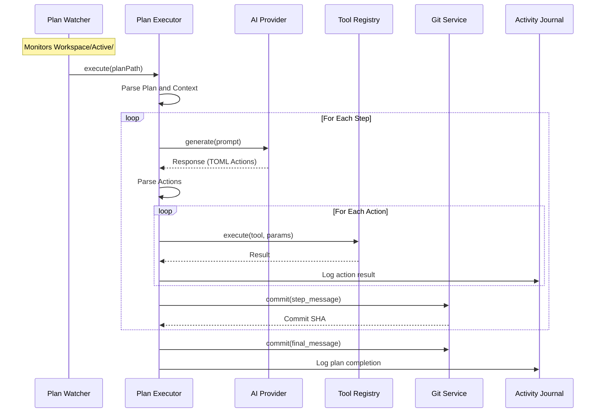

# @exaix/execution

Plan execution, agent runner, and orchestration for Exaix.

## Role

`@exaix/execution` owns the **plan execution pipeline** — the `PlanExecutor` that drives ReAct-style step-by-step execution of approved plans, the `AgentRunner` that manages agent sessions, and the coordination that ties LLM calls, tool execution, and Git commits together.

## Plan Execution Flow

### Step Table

| Step | Component          | Source                                                  |
| ---- | ------------------ | ------------------------------------------------------- |
| 1    | `PlanWatcher`      | `apps/daemon/src/watcher.ts:PlanWatcher`                |
| 2    | `PlanExecutor`     | `src/plan_executor.ts:PlanExecutor.execute()`           |
| 3    | `AIProvider`       | `@exaix/ai/src/provider_factory.ts`                     |
| 4    | `ToolRegistry`     | `@exaix/tool-runtime/src/tool_registry.ts:ToolRegistry` |
| 5    | `GitService`       | `@exaix/git/src/git_service.ts`                         |
| 6    | `EventLogger`      | `@exaix/core/src/logger/event_logger.ts`                |
| 7    | `LLMClient`        | `@exaix/ai/src/llm_client.ts`                           |
| 8    | `ProviderSelector` | `@exaix/ai/src/provider_selector.ts`                    |

### Sequence Diagram

## MCP Tools Exposed via Transport (16 tools)

| Tool                   | Category | Dynamic Mode | Approval Required |
| ---------------------- | -------- | :----------: | :---------------: |
| `read_file`            | read     |      ✅      |         —         |
| `write_file`           | write    |      —       |         —         |
| `patch_file`           | write    |      —       |         —         |
| `delete_file`          | write    |      —       |         —         |
| `move_file`            | write    |      —       |         —         |
| `create_directory`     | write    |      —       |         —         |
| `list_directory`       | read     |      ✅      |         —         |
| `search_files`         | read     |      ✅      |         —         |
| `git_create_branch`    | git      |      —       |         —         |
| `git_commit`           | git      |      —       |         —         |
| `git_status`           | git      |      ✅      |         —         |
| `run_command`          | meta     |      —       |         —         |
| `exaix_list_plans`     | domain   |      ✅      |         —         |
| `exaix_query_journal`  | domain   |      ✅      |         —         |
| `exaix_create_request` | domain   |      —       |         ⚠         |
| `exaix_approve_plan`   | domain   |      —       |         ⚠         |

## Activity Logging Events

| Category     | Events                                                                  |
| ------------ | ----------------------------------------------------------------------- |
| Detection    | `plan.detected`, `plan.ready_for_execution`, `plan.invalid_frontmatter` |
| Parsing      | `plan.parsed`, `plan.parsing_failed`, `plan.non_sequential_steps`       |
| Quality Gate | `request.quality_gate.assessed`, `request.quality_gate.enriched`        |
| Portal       | `portal.analyzed`                                                       |

## Tool Result Validation

Tool result payloads are validated before crossing runtime boundaries. Read-only tools may use `normalize_then_validate`, `retry_once`, or `retry_with_backoff` when the manifest declares remediation is safe. `fail_closed` is the default terminal behavior. Mutating tools remain fail-closed even when validation fails after execution.

## See Also

- [@exaix/mcp](../../packages/mcp/) — MCP tool handlers and manifest
- [@exaix/tool-runtime](../../packages/tool-runtime/) — Internal tool registry
- [@exaix/git](../../packages/git/) — Git service for atomic commits
- [@exaix/flow](../../packages/flow/) — Flow orchestration (wraps plan execution)
