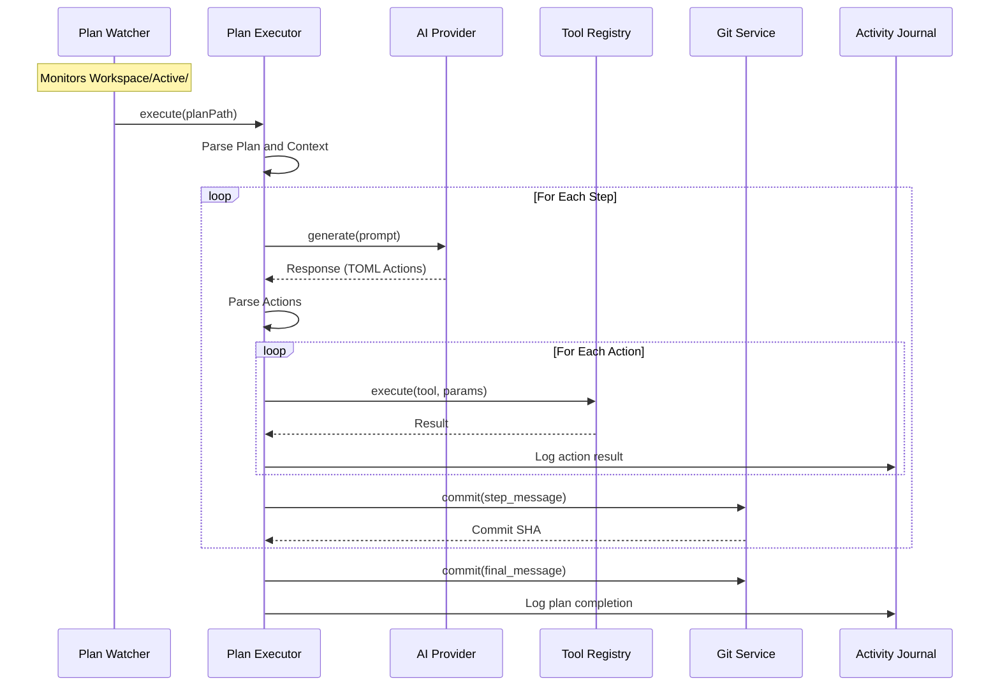

# @exaix/execution

Plan execution, agent runner, and orchestration for Exaix.

## Role

`@exaix/execution` owns the **plan execution pipeline** — the `PlanExecutor` that drives ReAct-style step-by-step execution of approved plans, the `AgentRunner` that manages agent sessions, and the coordination that ties LLM calls, tool execution, and Git commits together.

## Plan Execution Flow

### Step Table

| Step | Component          | Source                                                  |
| ---- | ------------------ | ------------------------------------------------------- |
| 1    | `PlanWatcher`      | `apps/daemon/src/watcher.ts:PlanWatcher`                |
| 2    | `PlanExecutor`     | `src/plan_executor.ts:PlanExecutor.execute()`           |
| 3    | `AIProvider`       | `@exaix/ai/src/provider_factory.ts`                     |
| 4    | `ToolRegistry`     | `@exaix/tool-runtime/src/tool_registry.ts:ToolRegistry` |
| 5    | `GitService`       | `@exaix/git/src/git_service.ts`                         |
| 6    | `EventLogger`      | `@exaix/core/src/logger/event_logger.ts`                |
| 7    | `LLMClient`        | `@exaix/ai/src/llm_client.ts`                           |
| 8    | `ProviderSelector` | `@exaix/ai/src/provider_selector.ts`                    |

### Sequence Diagram



## MCP Tools Exposed via Transport (16 tools)

| Tool                   | Category | Dynamic Mode | Approval Required |
| ---------------------- | -------- | :----------: | :---------------: |
| `read_file`            | read     |      ✅      |         —         |
| `write_file`           | write    |      —       |         —         |
| `patch_file`           | write    |      —       |         —         |
| `delete_file`          | write    |      —       |         —         |
| `move_file`            | write    |      —       |         —         |
| `create_directory`     | write    |      —       |         —         |
| `list_directory`       | read     |      ✅      |         —         |
| `search_files`         | read     |      ✅      |         —         |
| `git_create_branch`    | git      |      —       |         —         |
| `git_commit`           | git      |      —       |         —         |
| `git_status`           | git      |      ✅      |         —         |
| `run_command`          | meta     |      —       |         —         |
| `exaix_list_plans`     | domain   |      ✅      |         —         |
| `exaix_query_journal`  | domain   |      ✅      |         —         |
| `exaix_create_request` | domain   |      —       |         ⚠         |
| `exaix_approve_plan`   | domain   |      —       |         ⚠         |

## Activity Logging Events

| Category     | Events                                                                  |
| ------------ | ----------------------------------------------------------------------- |
| Detection    | `plan.detected`, `plan.ready_for_execution`, `plan.invalid_frontmatter` |
| Parsing      | `plan.parsed`, `plan.parsing_failed`, `plan.non_sequential_steps`       |
| Quality Gate | `request.quality_gate.assessed`, `request.quality_gate.enriched`        |
| Portal       | `portal.analyzed`                                                       |

## Tool Result Validation

Tool result payloads are validated before crossing runtime boundaries. Read-only tools may use `normalize_then_validate`, `retry_once`, or `retry_with_backoff` when the manifest declares remediation is safe. `fail_closed` is the default terminal behavior. Mutating tools remain fail-closed even when validation fails after execution.

## Tool Selection & Resolution

Which tools an execution can see and call is resolved from three sources, in this order:

1. **Registry discovery** — `AgentOrchestrator.buildExecutionPrompt()` reads `this._toolRegistry?.getTools()` (an `IToolRegistry`, `packages/core/src/types/i_tool_registry.ts`) and passes the full `ITool[]` (name, description, JSON-schema parameters) to `PromptBuilder`, which renders a `## Available Tools` section plus the `` ```toml `` action-block calling convention `LegacyAgentStrategy.executeTomlActions` parses responses against. Without a registered `ToolRegistry`, no tool list is ever included and the execution has no way to know which tools exist. `PlanExecutor.createAgentExecutor` is the production wiring: it constructs a real `ToolRegistry` scoped to the plan's `traceId`/`baseDir` and injects it as `AgentOrchestrator`'s `toolRegistry` dependency.

1. **Agent role `permitted_tools`** — each agent role blueprint's YAML frontmatter (`Blueprints/Agents/*.md`) declares a least-privilege allowlist, `permitted_tools: [McpToolName | ToolName]` (see `Blueprints/Agents/README.md`). `AgentOrchestrator.executeStep` copies it onto `options.permitted_tools` (the Phase 56/61 bridge). This is the **ceiling** — no narrower source below can ever exceed it, and an agent role with no `permitted_tools` declared permits nothing once any restriction is in effect.

1. **Skill `tools`, unioned then intersected with the agent-role ceiling** — a skill's `tools` field (`ISkill.tools`, `packages/schemas/src/memory_bank.ts`) declares which tools its own procedure needs. When one or more skills are matched onto a request, `PlanExecutor.deriveMatchedSkillTools()` re-runs `SkillsService.matchSkills()` (mirroring `deriveTopSkillTaskTypes`'s existing pattern) and fetches each match's full `ISkill.tools`. These are passed as `IAgentOrchestratorOptions.matchedSkillTools` (one array per matched skill). `resolveEffectiveSkillTools()` (`src/skill_tools_derivation.ts`) unions them — deduplicated — and intersects the union with the agent role's `permitted_tools` (the prior source). **A skill can only narrow the tool set within what the agent role already permits; it can never grant a tool the agent role doesn't already allow.** `matchedSkillTools` undefined (no caller supplied it, or dynamic matching found nothing) leaves the agent role's `permitted_tools` as-is, unfiltered.

The final `options.permitted_tools` filters `PromptBuilder`'s `## Available Tools` section (`filterToolsByPermitted`) — when set, only the intersected tools are ever listed in the prompt the model receives.

**Fail-closed semantics** (mirrored from the existing `dynamic_step_executor.ts:resolvePermittedTools` precedent for the ReAct loop): `permitted_tools: undefined` means no restriction is declared and every registry-discovered tool passes through; `permitted_tools: []` means the agent role permits nothing, and the result is always empty regardless of what any skill declares.

No shipped skill declares `tools:` yet — the mechanism is fully wired end-to-end but dormant until skill content is curated to use it.

## Context Budget Manager

`packages/execution/src/context/` provides a segment-level compaction layer (Phase 83) that runs inside the ReAct loop before each LLM call.

### Phase 62 vs Phase 83 Responsibility Split

| Concern     | Phase 62 — `PromptBudgetAllocator`    | Phase 83 — `ContextBudgetManager`                       |
| ----------- | ------------------------------------- | ------------------------------------------------------- |
| Scope       | Section-level token allocation        | Segment-level compaction decisions                      |
| Input       | `modelId`, request-analysis hints     | `IPromptBudget` + `IContextSegment[]`                   |
| Output      | `IPromptBudget` with 6 section limits | Filtered `IContextSegment[]` + `IContextBudgetSnapshot` |
| LLM calls   | None                                  | Optional async-tier only                                |
| Audit trail | `CONTEXT_BUDGET_*` events only        | Events + persisted `IContextBudgetSnapshot`             |

### Segment Kinds and Default Priorities

| Kind                    | `CONTEXT_PRIORITY_*`   | Compactable?           |
| ----------------------- | ---------------------- | ---------------------- |
| `"system"`              | 100 — always protected | Never dropped          |
| `"acceptance_criteria"` | 90 — always protected  | Never dropped          |
| `"plan_step"`           | 80                     | Trim only              |
| `"request"`             | 75 — always protected  | Never dropped          |
| `"portal_knowledge"`    | 60                     | Trim / async summarize |
| `"reflection"`          | 40                     | Trim / async summarize |
| `"tool_result"`         | 30                     | Trim / async summarize |
| `"summary"`             | 20                     | Trim                   |

Priority range is 0–100 (higher = more protected). Within a section, segments are greedy-kept
in priority-descending order until the section's token budget is exhausted. Tie-break is
insertion order (FIFO).

### Two-Tier Compaction Model

- **Synchronous tier** (≤ `CONTEXT_BUDGET_OVERHEAD_TARGET_MS = 15` ms): keep / trim / drop
  decisions made without any LLM calls. All prompt assembly uses synchronously compacted content.
- **Asynchronous tier** (best-effort, non-blocking): when `IContextCompactor` is configured,
  dropped segments of compactable kinds are scheduled for LLM summarization via `queueMicrotask`
  for next-iteration benefit. The current prompt is not affected. Supply
  `provider: yourModelProvider` in `IContextBudgetManagerInput` to enable actual LLM
  summarisation; when `provider` is absent the async block still fires (snapshot save and
  `DomainEventType.ExecutionContextCompacted` emission still occur) but `compactor.summarize()` is
  skipped.

### Protected Segments

A segment is always kept when:

- `kind` is `"system"`, `"request"`, or `"acceptance_criteria"`, **or**
- `metadata.nonCompactable === true` (use for tool results that must survive compaction, e.g. security audit outputs), **or**
- `priority >= CONTEXT_PRIORITY_ACCEPTANCE_CRITERIA` (90).

### Snapshot Security

`FileSnapshotStore` validates both `traceId` (against `/^[a-zA-Z0-9_-]{1,128}$/`) and
`stepId` (against `/^[a-zA-Z0-9_-]{1,256}$/`) before constructing the filesystem path.
A `SecurityError` is thrown on failure. `PathResolver` provides workspace root confinement
as a second-layer defence.

### Known Limitations

`AgentRunner.constructPrompt()` passes an uncapped `IPromptBudget` stub (all section budgets
set to `Number.MAX_SAFE_INTEGER`) when calling `ContextBudgetManager.prepare()`. Budget
manager invocations from `AgentRunner` therefore apply segment-priority ordering but impose
no section token limits. Callers that require real section caps should supply a
pre-computed `IPromptBudget` from `PromptBudgetAllocator.allocate()` via a wrapper, or use
the `ReActLoopStrategy` path which reads `AgentOrchestrator.currentPromptBudget` directly.

### Key Files

| File                                        | Purpose                                                            |
| ------------------------------------------- | ------------------------------------------------------------------ |
| `src/context/context_segment.ts`            | `IContextSegment`, `IContextSegmentMetadata`                       |
| `src/context/context_budget_manager.ts`     | `IContextBudgetManager`, `ContextBudgetManager`                    |
| `src/context/context_compactor.ts`          | `IContextCompactor`, `LlmContextCompactor`, `NoopContextCompactor` |
| `src/context/snapshot_store.ts`             | `ISnapshotStore`, `FileSnapshotStore`, `SecurityError`             |
| `src/context/context_budget_event_types.ts` | `IContextBudgetEventPayloadMap`                                    |

## See Also

- [@exaix/mcp](../../packages/mcp/) — MCP tool handlers and manifest
- [@exaix/tool-runtime](../../packages/tool-runtime/) — Internal tool registry
- [@exaix/git](../../packages/git/) — Git service for atomic commits
- [@exaix/flow](../../packages/flow/) — Flow orchestration (wraps plan execution)
