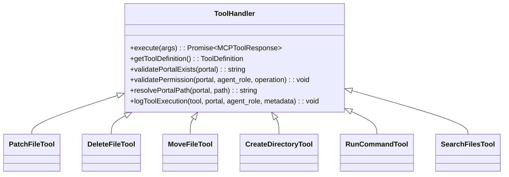

# @exaix/mcp

MCP server runtime, tool handlers, and tool manifest for Exaix.

## Role

`@exaix/mcp` owns the **Model Context Protocol implementation** — the tool handler system, MCP server transport, tool manifest definitions, and ReAct reasoning engine interfaces used by agents to interact with the file system and execute operations within portal boundaries.

## Tool Handler Pattern

## Patch File Strategy

The `patch_file` tool uses exact string replacement for targeted edits:

- `search` appears 0 times → Error (agent must reconsider)
- `search` appears 2+ times → Error with count (agent must be more specific)
- `search` appears exactly 1 time → Apply replacement

## Security Boundaries

All tools enforce portal-scoped operations:

1. **Portal existence check** — Tool validates portal is mounted
2. **Permission validation** — Appropriate `PortalOperation` required
3. **Path traversal prevention** — Path resolver blocks escape attempts
4. **Activity Journal logging** — Every execution logged with trace ID

## ReAct Core Interfaces

| Component    | Responsibility                                               |
| ------------ | ------------------------------------------------------------ |
| MCP Client   | Executes tools by name with validated arguments              |
| LLM Client   | Prompts LLM to reason about next action in ReAct loop        |
| Activity Log | Logs every reasoning step and tool call, correlated by trace |

## Tool Result Compactability (Phase 83)

Tool results returned from MCP handlers are forwarded to the ReAct loop as `"tool_result"` context
segments. By default these segments are **compactable** — when the `ContextBudgetManager` detects
budget pressure, `tool_result` segments are the first to be trimmed or asynchronously summarized
(priority 30, the lowest of all compactable kinds).

To mark a tool result as non-compactable (for example, a security audit output that must be
preserved in full), set `metadata.nonCompactable = true` on the `IContextSegment` when forwarding
the result. The compaction engine treats any segment with `nonCompactable = true` as protected,
equivalent to a system prompt.

For the full compaction policy and segment kind table, see
`packages/execution/README.md#context-budget-manager`.

## Tool Confirmation Interceptor

- `FlowRunner` selects the confirmation path at runtime before constructing `DynamicStepExecutor`
- In daemon contexts, `NotificationQueueConfirmationInterceptor` persists a pending confirmation row and emits a notification
- In interactive CLI contexts, `CliConfirmationInterceptor` prompts inline
- On denial or timeout, a denial observation is appended to the ReAct loop (not thrown), logging `ToolErrorCode.PERMISSION_DENIED`

## Dogfood Context Server (Phase 176 Step 2)

`server/dogfood_context_server.ts` exports one factory, `startDogfoodContextServer` (the
class itself is internal) — a small, per-launch loopback MCP server distinct from
everything else in this package: not the edition-gated Team MCP server, not
`LocalToolDispatcher`. `apps/daemon/src/dogfood_context_service.ts` starts one instance per
dogfood-context launch/turn and tears it down when the launch closes.

- **Transport:** official `@modelcontextprotocol/server` SDK (`createMcpHandler`/
  `McpServer`), bound explicitly to `127.0.0.1` on an OS-assigned port. A random 32-byte
  bearer capability, validated by the outer `Deno.serve` handler before the request ever
  reaches SDK dispatch, gates every call.
- **Scope:** exactly three read-only tools — `query_relationships`, `who_depends_on`,
  `search_memory` — over a portal-knowledge snapshot resolved once at start (never
  triggers analysis/indexing) and scoped memory retrieval. No resources, prompts,
  filesystem writes, or general daemon RPC.
- **Hardening:** method allowlist, Origin/Host DNS-rebinding guards, request-size cap
  (rejected before parsing), response-size cap (results are byte-capped, never split),
  single-in-flight enforcement, per-connection call and cumulative-output-token budgets,
  and an explicit expiry check on every call.
- **Native client wiring** (Claude Code, OpenCode, both launch paths; Codex, governed
  cycle only) lives in `@exaix/session`'s `dogfood_mcp_config.ts` — see that package's
  README and `docs/Exaix_Dogfooding.md` §6.8.

## Key Modules

| Module                          | Location                     | Purpose                                 |
| ------------------------------- | ---------------------------- | --------------------------------------- |
| Tool manifest (`TOOL_MANIFEST`) | `src/manifest.ts`            | Canonical tool definitions              |
| Tool enums                      | `@exaix/core/types/enums.ts` | `McpToolName`, `ToolName`               |
| Tool classifications            | `src/constants.ts`           | `READ_ONLY_TOOLS`, `DYNAMIC_MODE_TOOLS` |
| Error taxonomy                  | `@exaix/core/types/enums.ts` | `ToolErrorCode`                         |
| Handler assembly                | `@exaix-team/mcp-server`     | `buildHandlers`, `buildDynamicHandlers` |
| Concrete handlers               | `src/handlers/*.ts`          | Individual tool implementations         |
| MCP server transport            | `@exaix-team/mcp-server`     | JSON-RPC (stdio + HTTP/SSE)             |
| ToolRegistry (internal)         | `@exaix/tool-runtime`        | Internal tool execution                 |

## See Also

- [@exaix/execution](../../packages/execution/) — Tool execution paths, ownership map, remediation behavior
- [@exaix/tool-runtime](../../packages/tool-runtime/) — Internal tool registry and output validation
- [MCP Server App](../../exaix-team/apps/mcp-server/) — MCP server entry point
