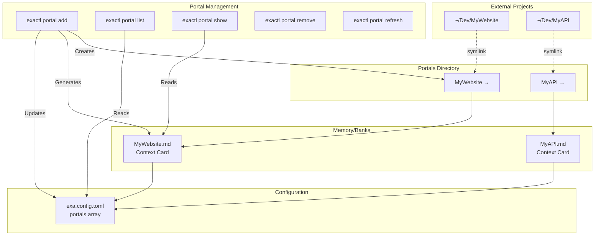

# @exaix/portal

Portal analysis, knowledge gathering, and permissions for Exaix.

## Role

`@exaix/portal` owns **symlink-based portal management** — the system that connects external project directories into Exaix through symlinks, analyzes them for structured knowledge, and enforces permission boundaries. Portals are the mechanism by which Exaix accesses external codebases.

## Knowledge Gathering Pipeline



### Post-mount flow

```
Portal Mount
  → ContextCardGenerator.generate()         (context card)
  → PortalKnowledgeService.analyze()        (quick mode by default)
      → DirectoryAnalyzer   (file census)
      → KeyFileIdentifier   (entry points, configs)
      → ConfigFileParser    (package.json, deno.json, …)
      → PatternDetector     (naming / style patterns)
      → ArchitectureInferrer (layer inference)
      → SymbolExtractor     (deno doc — TS/JS only)
  → KnowledgePersistence.save()             → Memory/Projects/{alias}/knowledge.json
```

## Analysis Modes

| Mode       | Strategies run    | LLM Needed | `quick_scan_limit` applies |
| ---------- | ----------------- | ---------- | -------------------------- |
| `quick`    | 1, 2, 3 (partial) | No         | Yes                        |
| `standard` | 1–5               | Optional   | No                         |
| `deep`     | 1–6               | Yes        | No                         |

### Six Analysis Strategies

| # | Strategy                | Modes                 | Notes                                                 |
| - | ----------------------- | --------------------- | ----------------------------------------------------- |
| 1 | Directory Census        | quick, standard, deep | File count, extension breakdown                       |
| 2 | Key File Identification | quick, standard, deep | Entry points, package.json, deno.json                 |
| 3 | Config File Parsing     | quick, standard, deep | Reads package.json, deno.json, tsconfig.json          |
| 4 | Pattern Detection       | standard, deep        | Naming conventions, test patterns                     |
| 5 | Architecture Inference  | standard, deep        | Layer inference from directory names and import graph |
| 6 | Symbol Extraction       | deep only             | `deno doc --json` (TS/JS only)                        |

## Configuration

```toml
[portal_knowledge]
auto_analyze_on_mount = true
default_mode          = "quick"
quick_scan_limit      = 200
max_files_to_read     = 50
staleness_hours       = 168       # non-git fallback TTL only — see Cache Invalidation below
use_llm_inference     = true
ignore_patterns       = ["node_modules", ".git", "dist", "build", ".next"]
```

### Cache Invalidation

Re-analysis is primarily triggered by comparing the portal's live git `HEAD` SHA against the SHA
stored in `knowledge.json` at last analysis (`KnowledgeInvalidationStrategy`/`GitHeadResolver`).
An unchanged SHA skips re-analysis entirely, regardless of elapsed time. On a SHA mismatch, the
number of files changed since that SHA selects an incremental (quick-mode, merging forward the
expensive strategies from the prior analysis) or full re-analysis. `staleness_hours` is a
time-based fallback used only when the portal isn't a git repo or `HEAD` resolution fails.

Two known limitations: `getOrAnalyze()` returns the cached snapshot immediately and revalidates
in a background task, so the call that triggers revalidation does not itself see the refreshed
result; and SHA comparison is against `HEAD`, so uncommitted working-tree changes are not
detected as staleness.

## CLI Commands

```text
exactl portal add <alias> <path>
exactl portal list
exactl portal show <alias>
exactl portal remove <alias>
exactl portal refresh <alias>
exactl portal analyze <alias> [--mode quick|standard|deep] [--force]
exactl portal knowledge <alias> [--json]
exactl portal verify <alias>
```

## Review Cleanup Semantics

- **Reject:** Deletes the feature branch
- **Approve:** Merges into base branch (for worktree: removes checkout + pointer + feature branch; for branch: keeps feature branch after merge)
- **Merge conflict (worktree):** Aborts merge, removes worktree + pointer, keeps feature branch for human resolution

## See Also

- [@exaix/memory](../../packages/memory/) — Memory storage for portal context cards
- [@exaix/execution](../../packages/execution/) — Portal-aware execution strategies (branch/worktree)
