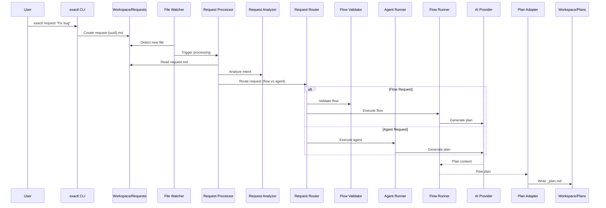

# @exaix/request

Request parsing, analysis, routing, and plan materialization for Exaix.

## Role

`@exaix/request` owns the **request processing pipeline** — from raw user request files in `Workspace/Requests/` through intent analysis, routing decisions, and plan materialization into `Workspace/Plans/`. It encompasses `RequestProcessor`, `RequestAnalyzer`, `RequestRouter`, and `PlanAdapter`.

## Request Processing Flow

### Step Table

| Step | Component          | Source                                                        |
| ---- | ------------------ | ------------------------------------------------------------- |
| 1    | `RequestProcessor` | `src/processor.ts:RequestProcessor.process()`                 |
| 2    | `RequestAnalyzer`  | `packages/request/src/analysis/analyzer.ts`                   |
| 3    | `RequestRouter`    | `src/request_router.ts:RequestRouter.route()`                 |
| 4    | `IAgentRunner`     | `@exaix/execution/src/agent_runner.ts:IAgentRunner.execute()` |
| 5    | `PlanAdapter`      | `src/plan_adapter.ts:PlanAdapter.write()`                     |
| 6    | `FlowValidator`    | `@exaix/flow/src/validator.ts`                                |
| 7    | `RoutingPolicy`    | `@exaix/routing/mod.ts`                                       |

### Sequence Diagram



## Plan Naming: `subject` vs `title`

A plan carries **two distinct, independent name fields**. They are deliberately not merged — each answers a different question, and one must never silently overwrite the other.

| Field     | Meaning                                             | Owner / source                              |
| --------- | --------------------------------------------------- | ------------------------------------------- |
| `title`   | The plan's **own name** (what the plan _is_)        | The agent/LLM (the plan candidate it emits) |
| `subject` | The **originating request's** subject (a back-link) | The request — carried onto the plan, as-is  |

### Rules

1. **Schema** (`@exaix/schemas` `PlanSchema`, `packages/schemas/src/plan_schema.ts`): both `title` and `subject` are **optional — neither is required**. A plan candidate may omit a name entirely. As a convenience, when only the legacy `subject` is supplied, it is surfaced onto `title`; a present `title` is preserved as-is, and a distinct `subject` is never clobbered.
2. **`title` is preserved** exactly as the plan candidate produced it.
3. **`subject` is always the originating request's subject** (`PlanWriter`, `@exaix/core/src/planning/plan_writer.ts:formatPlan`). It is **never** "upgraded" to the agent's plan title — not even when the request's subject was auto-derived from the description. The request subject is authoritative and is never rewritten by the processor (`src/processor.ts:writePlanAndReturnPath`).

When the request has no explicit subject, one is derived from the first line of the description at request-creation time (`src/service.ts`); that derived value then behaves like any other request subject (authoritative, never overwritten).

### Rendering

The plan markdown H1 uses `title`, falling back to `subject`, then to `Untitled Plan` (`@exaix/core/src/planning/plan_adapter.ts:renderPlanHeader`) — so a nameless plan never renders `# undefined`. UI/printouts that want a human-readable label should read `title` (with the same fallback), not mutate `subject`.

> Historical note: an earlier model carried a `subject_is_fallback` flag that "upgraded" a fallback request subject to the agent's plan title. That cross-contamination has been removed — `subject` and `title` are now strictly independent.

## Request Analysis Layer

### Analysis Modes

- **Heuristic**: Fast, local-only extraction using regex and keyword mapping
- **LLM**: Deep semantic analysis using a language model, generates structured JSON
- **Hybrid**: First runs heuristic; escalates to LLM only if actionability score falls below threshold (default: 80)

### Data Flow

1. **Trigger**: `exactl request` (CLI) or `RequestProcessor` (daemon) detect a new/updated request
2. **Preparation**: `RequestProcessor` validates frontmatter, materializes structured context, loads session memory
3. **Execution**: `RequestAnalyzer.analyze()` runs according to configured mode
4. **Persistence**: Results saved to sibling `*_analysis.json` file
5. **Consumption**: `RequestRouter`, `ReflexiveAgent`, and downstream evaluation layers pull analysis context

## Request Routing

Requests are routed as either **Flow** (multi-agent, with quality gates) or **Agent** (single-agent, direct execution). Routing decisions emit `routing.decision` audit events with candidate scoring and strategy info.

### Audit Events

```json
{
  "type": "routing.decision",
  "trace_id": "abc-123",
  "payload": {
    "selectedIdentityId": "senior-coder",
    "strategy": "policy_match",
    "candidateCount": 4,
    "candidates": [
      { "agentRole": "senior-coder", "score": 0.92 }
    ]
  }
}
```

## CLI Inspection

```text
exactl routing explain --request ./Workspace/Requests/my-request.md
exactl routing policy validate ./routing.policy.yaml
```

## See Also

- [@exaix/quality-gate](../../packages/quality-gate/) — Pre-execution quality assessment
- [@exaix/execution](../../packages/execution/) — Plan execution and agent runner
- [@exaix/routing](../../packages/routing/) — Routing policy and capability matching
- [@exaix/flow](../../packages/flow/) — Flow orchestration and validation
