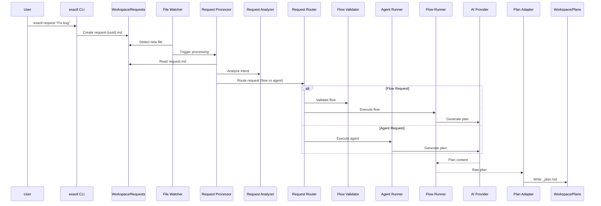

# @exaix/request

Request parsing, analysis, routing, and plan materialization for Exaix.

## Role

`@exaix/request` owns the **request processing pipeline** — from raw user request files in `Workspace/Requests/` through intent analysis, routing decisions, and plan materialization into `Workspace/Plans/`. It encompasses `RequestProcessor`, `RequestAnalyzer`, `RequestRouter`, and `PlanAdapter`.

## Request Processing Flow

### Step Table

| Step | Component          | Source                                                       |
| ---- | ------------------ | ------------------------------------------------------------ |
| 1    | `RequestProcessor` | `src/processor.ts:RequestProcessor.process()`                |
| 2    | `RequestAnalyzer`  | `src/request_analysis/request_analyzer.ts`                   |
| 3    | `RequestRouter`    | `src/request_router.ts:RequestRouter.route()`                |
| 4    | `AgentRunner`      | `@exaix/execution/src/agent_runner.ts:AgentRunner.execute()` |
| 5    | `PlanAdapter`      | `src/plan_adapter.ts:PlanAdapter.write()`                    |
| 6    | `FlowValidator`    | `@exaix/flow/src/validator.ts`                               |
| 7    | `RoutingPolicy`    | `@exaix/routing/mod.ts`                                      |

### Sequence Diagram



## Request Analysis Layer

### Analysis Modes

- **Heuristic**: Fast, local-only extraction using regex and keyword mapping
- **LLM**: Deep semantic analysis using a language model, generates structured JSON
- **Hybrid**: First runs heuristic; escalates to LLM only if actionability score falls below threshold (default: 80)

### Data Flow

1. **Trigger**: `exactl request` (CLI) or `RequestProcessor` (daemon) detect a new/updated request
2. **Preparation**: `RequestProcessor` validates frontmatter, materializes structured context, loads session memory
3. **Execution**: `RequestAnalyzer.analyze()` runs according to configured mode
4. **Persistence**: Results saved to sibling `*_analysis.json` file
5. **Consumption**: `RequestRouter`, `ReflexiveAgent`, and downstream evaluation layers pull analysis context

## Request Routing

Requests are routed as either **Flow** (multi-agent, with quality gates) or **Agent** (single-agent, direct execution). Routing decisions emit `routing.decision` audit events with candidate scoring and strategy info.

### Audit Events

```json
{
  "type": "routing.decision",
  "trace_id": "abc-123",
  "payload": {
    "selectedIdentityId": "senior-coder",
    "strategy": "policy_match",
    "candidateCount": 4,
    "candidates": [
      { "identityId": "senior-coder", "score": 0.92 }
    ]
  }
}
```

## CLI Inspection

```text
exactl routing explain --request ./Workspace/Requests/my-request.md
exactl routing policy validate ./routing.policy.yaml
```

## See Also

- [@exaix/quality-gate](../../packages/quality-gate/) — Pre-execution quality assessment
- [@exaix/execution](../../packages/execution/) — Plan execution and agent runner
- [@exaix/routing](../../packages/routing/) — Routing policy and capability matching
- [@exaix/flow](../../packages/flow/) — Flow orchestration and validation
